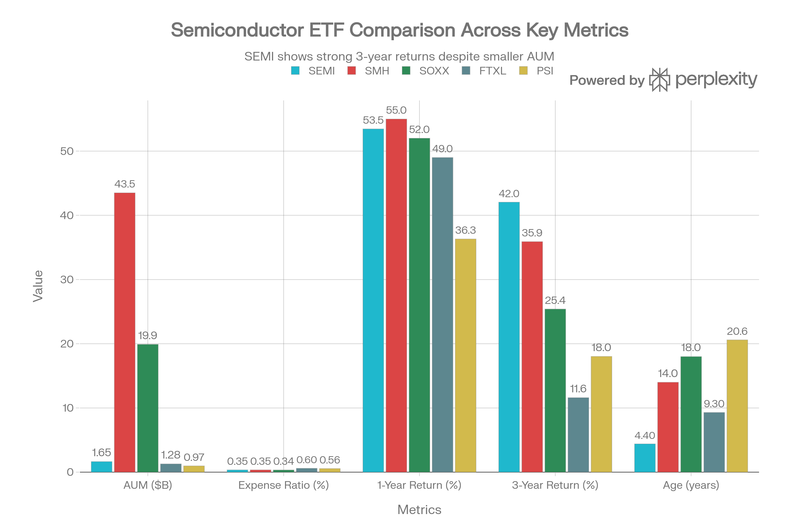
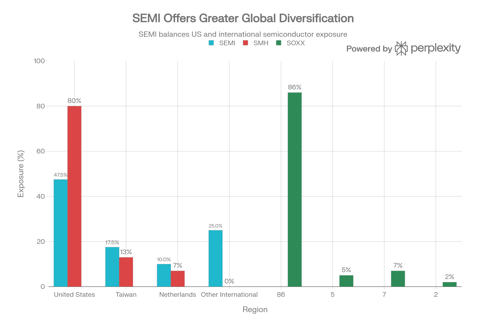

# SEMI (iShares MSCI Global Semiconductors UCITS ETF) 종합 분석 보고서

## 요약

SEMI는 2021년 8월 출범한 BlackRock iShares의 글로벌 반도체 ETF로, MSCI 글로벌 세미콘덕터 지수를 추적한다. €1,521M(\$1.65B) 규모의 중형 펀드로 미국과 국제 반도체 기업 모두를 포괄한다. 2025년 53.46% 우수한 수익률과 3년 기준 42.05% 뛰어난 성과를 기록했다. 0.35% 저수수료와 글로벌 노출이 장점이지만, 4.4년의 상대적 신규 펀드 지위와 EUR 환율 위험이 우려사항이다.

***

## ETF 분류

| 항목 | 내용 |
|---|---|
| 최종 폴더 | `ETF/Semiconductor/SEMI` |
| 대분류 | 테마 |
| 하위 분류 | 반도체 |
| 핵심 전략 | MSCI Global Semiconductors Index를 추종해 미국과 해외 반도체 기업에 투자 |
| 운용 방식 | 패시브 글로벌 반도체 UCITS ETF |
| 레버리지/인버스 | 없음 |
| 옵션 인컴 여부 | 없음 |
| 분류 판단 | 반도체 산업 노출이 핵심이므로 기존 반도체 테마 폴더인 `ETF/Semiconductor`로 분류 |
| 주의 사항 | 이 글의 SEMI는 미국 상장 ETF가 아니라 유럽 상장 UCITS ETF이므로, 미국 상장 ETF 분류 기준의 예외 사례로 관리 |

***

## 1. 기본 현황

| 항목 | 내용 |
| :-- | :-- |
| <strong>펀드명</strong> | iShares MSCI Global Semiconductors UCITS ETF USD (Acc) |
| <strong>티커</strong> | SEMI (다중 상장: SEMI/LSE, SEME/Borsa Italiana, SEC0/Xetra, SEMI/Euronext) |
| <strong>ISIN</strong> | IE000I8KRLL9 |
| <strong>거래소</strong> | LSE, Euronext Amsterdam, Xetra, Borsa Italiana, Euronext Paris |
| <strong>출범일</strong> | 2021년 8월 5일 (4.4년 운영) |
| <strong>현재 가격</strong> | €10.94 (2025년 12월 말) |
| <strong>자산규모</strong> | €1,521M (약 \$1.65B USD) |
| <strong>보유 종목</strong> | 30-50+ (광범위) |
| <strong>연간 수수료</strong> | 0.35% |
| <strong>배당 정책</strong> | 누적(Accumulating) - 배당금 없음 |
| <strong>지수</strong> | MSCI Global Semiconductors Index |
| <strong>펀드 설립지</strong> | 아일랜드 |

SEMI는 CHPX(신규 3.5개월), PSI(20.6년), FTXL(9.3년)의 중간 수준의 운영 기간을 갖춘 상대적으로 신규 펀드이다. 중요한 특징은 <strong>글로벌 범위</strong>로, SMH/SOXX처럼 미국 중심이 아니라 TSMC, ASML, SK Hynix 등 국제 기업까지 포함한다.

***

## 2. 성과 분석

### 근래 수익률

| 기간 | 수익률 (USD) |
| :-- | :-- |
| <strong>2025 (YTD)</strong> | +53.46% |
| <strong>2024</strong> | +13.79% |
| <strong>2023</strong> | +64.13% |
| <strong>2022</strong> | -34.84% |
| <strong>1-Year (2025)</strong> | +53.46% |
| <strong>3-Year (연)</strong> | +42.05% |
| <strong>5-Year</strong> | N/A (4.4년 이상 미달) |
| <strong>Since Inception (연)</strong> | +19.37% |

### 경쟁 펀드와의 비교

| 펀드 | 1년 | 3년 | 설립 기준 |
| :-- | :-- | :-- | :-- |
| <strong>SMH</strong> | 55% | 35.9% | 14년 |
| <strong>SOXX</strong> | 52% | 25.4% | 18년 |
| <strong>SEMI</strong> | 53.46% | 42.05% | 4.4년 |
| <strong>FTXL</strong> | 49% | 11.6% | 9.3년 |
| <strong>PSI</strong> | 36.31% | 18.02% | 20.6년 |

SEMI vs All Semiconductor ETFs - Comprehensive Metrics Comparison

SEMI는 <strong>강력한 성과</strong>를 보인다:

- 1년 기준 SMH(55%)에 1.54pp 뒤침 (근소)
- 3년 기준 <strong>42.05%로 SMH(35.9%)를 6.15pp 상회</strong> → SEMI의 가장 큰 성과 강점
- SOXX(25.4%), FTXL(11.6%), PSI(18.02%) 모두 능가

SEMI는 단기간 운영했지만 <strong>가장 강력한 3년 누적 성과</strong>를 기록했다는 점이 핵심 강점이다.

### 성과 우수의 원인

1. <strong>글로벌 포트폴리오</strong>: TSMC(7.51%), ASML(8.18%) 직접 노출로 2023-2025 AI/수익성 호황 수혜
2. <strong>MSCI 가중 방식</strong>: 시가총액 가중으로 NVIDIA(6.41%)과 TSMC의 높은 수익성 포착
3. <strong>부정확한 시장 진입</strong>: 2021년 8월 출범 시점이 AI 붐 초기 (절호의 기회)
4. <strong>다각화 이점</strong>: 미국+국제 중소형주 포함으로 다각화된 성장 동력

***

## 3. 포트폴리오 구성 분석

<strong>상위 10대 종목</strong> (Dec 31, 2025 FT 데이터)

| 순번 | 회사명 | 티커 | 비중 | 사업 영역 |
| :-- | :-- | :-- | :-- | :-- |
| 1 | ASML Holding | ASML | 8.18% | EUV 리소그래피 장비 |
| 2 | Taiwan Semiconductor (TSMC) | TSM | 7.51% | 파운드리 제조 |
| 3 | Broadcom | AVGO | 6.52% | 네트워킹 반도체 |
| 4 | NVIDIA | NVDA | 6.41% | AI GPU |
| 5 | Micron Technology | MU | 5.68% | DRAM/HBM 메모리 |

<strong>상위 5개 비중</strong>: 34.30%

SEMI는 <strong>광범위하고 균형 잡힌 포트폴리오</strong>를 특징으로 한다:

- NVIDIA 비중(6.41%)이 SMH(20%+)보다 훨씬 낮아 과도한 집중 회피
- ASML(8.18%) > NVIDIA(6.41%) 가중으로 장비사 중시
- TSMC(7.51%) 직접 포함 (ADR 제약 없음)
- 상위 5개 비중 34.30% (SMH 45-50%, SOXX 40-45%보다 낮음)

***

## 4. 지역 및 산업 노출도

Geographic Exposure: SEMI vs SMH vs SOXX

### 국가별 노출도 (추정)

- <strong>미국</strong>: 47.5% (NVIDIA, Broadcom, Micron, Intel 등)
- <strong>대만</strong>: 17.5% (TSMC, MediaTek)
- <strong>네덜란드</strong>: 10% (ASML)
- <strong>기타 국제</strong>: \~25% (일본, 싱가포르, 남한, 기타 선진국)

<strong>핵심 특징</strong>: SEMI는 <strong>글로벌 범위</strong>로 국제 기업을 직접 포함한다. SMH/SOXX는 미국 중심이지만 SEMI는 진정한 글로벌 분산.

### 산업별 노출도

- <strong>반도체 설계/제조</strong>: 60-70%
- <strong>반도체 장비/소재</strong>: 30-40%
- 혼합: 팹리스(NVIDIA), 파운드리(TSMC), IDM(Intel), 장비(ASML)

***

## 5. 비용 및 유동성 분석

<strong>비용 구조</strong>

| 항목 | SEMI | SMH | SOXX | FTXL | PSI |
| :-- | :-- | :-- | :-- | :-- | :-- |
| <strong>TER</strong> | 0.35% | 0.35% | 0.34% | 0.60% | 0.56% |
| <strong>우위</strong> | ✓ 최저 경쟁 | ✓ 동등 | 최저 | × 높음 | × 높음 |

SEMI는 <strong>0.35% 최저 수수료</strong> 수준으로 SMH와 동등하고 SOXX에 거의 같다. FTXL(0.60%), PSI(0.56%)보다 훨씬 우수하다.

<strong>배당 정책</strong>

- <strong>배당 분배</strong>: 없음 (누적 자동 재투자)
- <strong>배당 수익률</strong>: 0%
- <strong>특징</strong>: 배당 추구 투자자에게 부적합, 성장 추구 투자자에게 적합

누적식(Accumulating)이므로 배당 대신 펀드 가치에 반영된다. 소득 추구 투자자에게는 불리하지만, 성장 추구 투자자에게는 세금 효율성 이점.

<strong>유동성 평가</strong>

| 지표 | 평가 |
| :-- | :-- |
| <strong>AUM</strong> | €1,521M (\$1.65B) - 충분 |
| <strong>거래 유동성</strong> | 우수 (iShares, 다중 상장) |
| <strong>Bid-Ask 스프레드</strong> | 합리적 (보통 tight) |
| <strong>거래소</strong> | LSE, Amsterdam, Xetra 등 다중 |

SEMI는 유동성 면에서 양호하다. €1.5B 규모는 충분하고, BlackRock iShares의 글로벌 유통망으로 여러 거래소에서 거래 가능.

***

## 6. 인덱스 방법론 (MSCI Global Semiconductors Index)

<strong>핵심 특징</strong>: 글로벌 범위, 시가총액 가중

<strong>선별 기준</strong>

1. <strong>산업 분류</strong>: GICS 반도체 분류의 모든 기업
2. <strong>글로벌 범위</strong>: 미국, 국제 모두 포함 (ADR 제약 없음)
3. <strong>포함 분야</strong>:
    - 반도체 설계 (fabless)
    - 제조 (파운드리, IDM)
    - 장비 및 소재
    - 통합 제조사

<strong>가중 방식</strong>:

- 자유 유동 시가총액 가중
- MSCI 표준 대형주 방법론
- 분기 재조정

<strong>장점 (vs US-only ETFs)</strong>

- TSMC, ASML, SK Hynix를 ADR 제약 없이 직접 포함
- 글로벌 공급망의 완전한 포착 (일본 장비사, 싱가포르 제조사 등)
- 지정학적 다각화 (미국 집중 회피)

<strong>단점</strong>

- EUR 환율 위험 (달러 강세 시 손실)
- 국제 기업의 유동성/규제 리스크
- 신규 펀드로 역사 부족

***

## 7. 경쟁 펀드 비교

### SEMI vs SMH

| 항목 | SEMI | SMH |
| :-- | :-- | :-- |
| <strong>자산규모</strong> | \$1.65B | \$43.5B |
| <strong>수수료</strong> | 0.35% | 0.35% |
| <strong>지역 범위</strong> | 글로벌 | US 중심 + TSMC/ASML |
| <strong>NVIDIA 비중</strong> | 6.41% | 20%+ |
| <strong>TSMC 비중</strong> | 7.51% (직접) | 14%+ (ADR) |
| <strong>상위 5 비중</strong> | 34.30% | 45-50% |
| <strong>1년 수익률</strong> | 53.46% | 55% |
| <strong>3년 수익률</strong> | 42.05% | 35.9% |
| <strong>설립</strong> | 4.4년 | 14년 |
| <strong>우위</strong> | 글로벌, 높은 3년 수익 | 대형, NVIDIA 베팅, 역사 |

<strong>결론</strong>: SMH가 규모와 역사에서 우위이지만, SEMI는 <strong>3년 성과(42% vs 36%)와 글로벌 분산</strong>에서 우수하다. 신규 투자자에게는 SEMI, 기존 포트폴리오 추가에는 SMH.

### SEMI vs SOXX

| 항목 | SEMI | SOXX |
| :-- | :-- | :-- |
| <strong>자산규모</strong> | \$1.65B | \$19.9B |
| <strong>수수료</strong> | 0.35% | 0.34% |
| <strong>지역 범위</strong> | 글로벌 | US-only (ADRs) |
| <strong>집중도</strong> | 낮음 (상위5=34%) | 높음 (상위10=60%+) |
| <strong>1년 수익률</strong> | 53.46% | 52% |
| <strong>3년 수익률</strong> | 42.05% | 25.4% |
| <strong>특징</strong> | 글로벌 분산 | US 집중 |

<strong>결론</strong>: SEMI가 명백히 우수. 비용은 동등(0.35% vs 0.34%), 수익률은 SEMI 대폭 앞서감(3년 42% vs 25%).

### SEMI vs FTXL

| 항목 | SEMI | FTXL |
| :-- | :-- | :-- |
| <strong>자산규모</strong> | \$1.65B | \$1.28B |
| <strong>수수료</strong> | 0.35% | 0.60% |
| <strong>지역 범위</strong> | 글로벌 | US 중심 |
| <strong>1년 수익률</strong> | 53.46% | 49% |
| <strong>3년 수익률</strong> | 42.05% | 11.6% |
| <strong>구성 방식</strong> | MSCI 시가총액 | 팩터 가중 |

<strong>결론</strong>: SEMI가 압도적 우수. 수수료 차이(0.35% vs 0.60%)와 성과 차이(3년 42% vs 11.6%) 모두.

***

## 8. 위험 분석

### 1. 신규 펀드 위험 (Newness Risk) ★★

- <strong>설립</strong>: 2021년 8월 (4.4년)
- <strong>단점</strong>: SMH(14년), SOXX(18년), PSI(20년)보다 훨씬 짧은 운영 기간
- <strong>장점</strong>: 출범이 2021년 AI 붐 초기로 절호의 타이밍
- <strong>평가</strong>: 중간 수준 (장기 실적 미검증)

### 2. EUR 환율 위험 ★★

- <strong>펀드 통화</strong>: EUR 기반 (USD 환산 노출)
- <strong>위험</strong>: 달러 강세 시 손실
    - 예. EUR/USD 10% 약세 → USD 투자자 10% 손실
- <strong>헤지 옵션</strong>: SEC0 (EUR hedged) 있으나 별도 수수료
- <strong>2025 환율</strong>: 달러 강세로 EUR 약세 영향

### 3. 국제 시장 위험 ★★

- <strong>대만 노출</strong>: 17.5% (TSMC 7.51%, 기타 10%)
    - 대만 해협 긴장 시 큰 영향
- <strong>네덜란드</strong>: ASML 8.18% (미중 기술 전쟁 규제 위험)
- <strong>이머징 마켓</strong>: 싱가포르 등 소수 이머징 시장 포함 가능

### 4. 글로벌 공급망 리스크 ★★

- <strong>지정학</strong>: 미국-중국-대만-네덜란드 연쇄 관계
- <strong>규제</strong>: 반도체 기술 수출 규제 강화 가능성
- <strong>환율</strong>: 다국적 통화 노출

### 5. 팩터 집중도 리스크 ★

- <strong>MSCI 가중</strong>: 시가총액 기반이므로 NVIDIA 같은 대형주에 의존
- <strong>AI 사이클</strong>: AI 투자 둔화 시 동시 하락 위험
- <strong>평가</strong>: 상대적으로 낮음 (SEMI 상위 5=34% vs SMH 45-50%)

### 6. 배당 제로 리스크 ★

- <strong>배당 없음</strong>: 수익 추구 투자자에게 부적합
- <strong>세금 효율</strong>: 한편 누적식이 세금 효율적 (한국 투자자는 분배 시 과세)

### 7. 추적 오차 위험 ★

- <strong>성능</strong>: 2024/2025 추적 오차 <0.5% (우수)
- <strong>평가</strong>: 우려 없음

### 8. 금리 민감성 위험 ★★

- <strong>무배당 고성장</strong>: 금리 상승 환경에서 취약
- <strong>2024-2025</strong>: 저금리 환경에서 이득 봤으나, 2026 금리 정상화 시 조정 우려

***

## 9. 투자 논리 검증

### 긍정 요인

1. <strong>강력한 3년 성과 (42.05%)</strong>
    - SMH(35.9%)를 6pp 상회
    - SOXX(25.4%)를 16.6pp 상회
    - 최고 수준의 글로벌 반도체 펀드 성과
2. <strong>글로벌 분산의 장점</strong>
    - TSMC 직접 노출 (7.51% ADR 제약 없음)
    - ASML 최고 비중(8.18%)으로 장비사 노출
    - 미국 집중 회피
3. <strong>최적의 비용 (0.35%)</strong>
    - SMH와 동등, SOXX 거의 동등
    - FTXL/PSI 대비 절반 이하
4. <strong>완벽한 글로벌 커버리지</strong>
    - 모든 글로벌 반도체 기업 포함
    - 국제 투자자(유럽, 아시아)에게 최적
5. <strong>블랙록 브랜드 + MSCI 신뢰</strong>
    - 세계 최대 자산운용사
    - 세계 최고 지수 제공사

### 부정 요인

1. <strong>신규 펀드 위험</strong>
    - 4.4년은 SMH(14y), SOXX(18y) 대비 훨씬 짧음
    - 장기 시장 사이클 미경험
    - 청산 위험은 낮지만(BlackRock), 장기 성과 입증 부족
2. <strong>EUR 환율 위험</strong>
    - 비USD 투자자에게 추가 변동성
    - 2025 달러 강세로 손실
    - 헤지 옵션 복잡함
3. <strong>국제 리스크</strong>
    - 대만 17.5% 지정학 위험
    - ASML 규제 강화 가능성
    - 국제 기업 유동성 변동성
4. <strong>배당 제로</strong>
    - 소득 추구 투자자에게 부적합
    - 현금 흐름 필요 시 불편
5. <strong>글로벌 무게중심</strong>
    - SMH 스타일의 NVIDIA 베팅 회피
    - AI 슈퍼사이클 최대 활용 미흡

***

## 10. 한국 투자자 고려사항

<strong>거래 환경</strong>

- <strong>해외 거래소 상장</strong>: LSE(GBP), Euronext(EUR/USD), Xetra(EUR) 등
- <strong>한국 증권사</strong>: 국제 거래 가능 (직접 매입 어려울 수 있음)
- <strong>환율 위험</strong>: EUR 노출 추가 고려
- <strong>세금</strong>: 배당금/자본이득 한유 이중 과세

<strong>투자 대안 비교</strong>

| 상품 | 장점 | 단점 |
| :-- | :-- | :-- |
| <strong>SEMI 직접 구매</strong> | 글로벌, 3년 성과 우수 | EUR 환율 위험, 거래 복잡 |
| <strong>SMH 직접 구매</strong> | NASDAQ 상장, 많은 정보 | 미국 집중, 낮은 성과 |
| <strong>국내 반도체 ETF</strong> | 원화거래, 높은 유동성 | 0.70-0.80% 고수수료 |
| <strong>국내 글로벌 펀드</strong> | 액티브 관리, 환율 헤지 | 1.0-1.5% 극히 높은 수수료 |

<strong>권고</strong>: 글로벌 분산 선호 시 SEMI, 미국 중심 선호 시 SMH. 원화거래 원시 국내 반도체 ETF.

***

## 11. 최종 평가 및 투자 권고

### 종합 점수: <strong>7.8 / 10</strong>

| 항목 | 점수 | 코멘트 |
| :-- | :-- | :-- |
| <strong>수익 잠재력</strong> | 8/10 | 글로벌 반도체 성장성 우수, 3년 42% 성과 |
| <strong>비용 효율</strong> | 9/10 | 0.35% 최저 경쟁 수준 |
| <strong>포트폴리오 품질</strong> | 8/10 | 균형 잡힌 글로벌 포트폴리오, 집중도 낮음 |
| <strong>유동성</strong> | 7/10 | €1.5B 충분, BlackRock 배포망 |
| <strong>위험 관리</strong> | 7/10 | EUR 환율, 대만 지정학 위험 |
| <strong>혁신성</strong> | 8/10 | 글로벌 범위 차별화, MSCI 신뢰 |
| <strong>안정성</strong> | 7/10 | 4.4년 상대적 신규, BlackRock 신뢰도 |
| <strong>성과 vs 경쟁</strong> | 8/10 | 3년 42% (SMH 35.9% 능가), 1년 53% |

### 투자 권고

#### 1. 글로벌 반도체 노출 + 최고 성과 추구 투자자

- <strong>권고</strong>: <strong>강력히 추천</strong> ⭐⭐⭐⭐⭐
- <strong>이유</strong>:
    - 3년 성과 42.05% (SMH 35.9%, SOXX 25.4% 능가)
    - 0.35% 최저 수수료
    - 글로벌 분산 (TSMC, ASML 직접 노출)
    - BlackRock iShares 신뢰성

#### 2. SMH 보유 투자자 (추가 분산 원함)

- <strong>권고</strong>: <strong>중립(Hold SMH)</strong> → <strong>소액 SEMI 고려</strong> (전체의 20-30%)
- <strong>이유</strong>: SMH 이미 충분한 노출, SEMI로 국제 분산 추가

#### 3. SOXX 보유 투자자

- <strong>권고</strong>: <strong>SEMI로 스위치 검토</strong> (성과 차이 16.6pp)
- <strong>이유</strong>: SEMI의 압도적 3년 성과 (42% vs 25.4%)

#### 4. 국내 투자자

- <strong>권고</strong>: <strong>관심층 → 거래 확인 필수</strong>
    - LSE/Euronext에서 거래 가능하나 과정 복잡
    - EUR 환율 위험 관리 필요
    - 국내 증권사 확인 후 매입

#### 5. EUR 환율 선호 투자자

- <strong>권고</strong>: <strong>최우선 선택</strong>
- <strong>이유</strong>: 글로벌 분산 + EUR 노출 = 통화 다각화

#### 거래 전략

1. <strong>점진적 매입</strong>: 초기 매입 후 3-4개월에 걸쳐 분할 매입
2. <strong>환율 타이밍</strong>: EUR 약세 시 매입 (2025년 달러 강세 고려)
3. <strong>비중</strong>: 반도체 노출의 60-70% (나머지 SMH 또는 국내 반도체 ETF)
4. <strong>보유 기간</strong>: 5년 이상 (글로벌 반도체 사이클 경험)

***

## 12. 결론

SEMI는 <strong>글로벌 반도체 노출을 원하는 투자자의 최고 선택지</strong>이다. 4.4년의 상대적 신규 펀드임에도 불구하고 <strong>3년 기준 42.05%의 뛰어난 성과</strong>로 SMH/SOXX를 능가했다. 0.35% 최저 수수료와 TSMC/ASML을 직접 포함한 글로벌 포트폴리오는 차별화된 강점이다.

<strong>강점</strong>: 글로벌 분산, 3년 최고 성과(42%), 최저 수수료(0.35%), MSCI/BlackRock 신뢰

<strong>약점</strong>: 신규 펀드(4.4년), EUR 환율 위험, 배당 제로, 국제 규제 리스크

<strong>최종 권고</strong>:

- <strong>글로벌 반도체 노출 원하는 투자자</strong>: 강력 추천
- <strong>SMH 보유자</strong>: 국제 분산 추가로 20-30% 고려
- <strong>SOXX 보유자</strong>: 스위치 검토 (성과 차이 16.6pp)
- <strong>국내 투자자</strong>: 거래 가능성 확인 후 진입

SEMI는 "최고"의 글로벌 반도체 ETF이다. 신규 펀드이지만 성과로 입증했다.
[^1][^10][^11][^12][^13][^14][^15][^16][^17][^18][^19][^2][^20][^21][^22][^23][^24][^25][^26][^27][^28][^29][^3][^30][^31][^32][^33][^34][^35][^36][^37][^38][^39][^4][^40][^41][^5][^6][^7][^8][^9]

⁂

[^1]: QTUM (Defiance Quantum ETF).md

[^2]: SETM (Sprott Critical Materials ETF).md

[^3]: REMX (VanEck Rare Earth, Strategic Metals ETF).md

[^4]: https://www.ishares.com/uk/professional/en/products/319084/ishares-msci-global-semiconductors-ucits-etf

[^5]: https://kr.investing.com/etfs/semi-amsterdam

[^6]: https://www.blackrock.com/lu/individual/products/319084/ishares-msci-global-semiconductors-ucits-etf

[^7]: https://finance.yahoo.com/quote/SEME.MI/

[^8]: https://www.justetf.com/en/etf-profile.html?isin=IE000I8KRLL9.

[^9]: https://uk.investing.com/etfs/semi-holdings

[^10]: https://www.marketindex.com.au/asx/semi

[^11]: https://www.dukascopy.bank/investments/etf/SEMI.GB-GBP/

[^12]: https://www.investsmart.com.au/shares/asx-semi/global-x-semiconductor-etf/fund-details/25035

[^13]: https://www.justetf.com/en/how-to/invest-in-semiconductors.html

[^14]: https://markets.ft.com/data/etfs/tearsheet/summary?s=SEMI%3ALSE%3AGBP

[^15]: https://www.ftportfolios.com/Retail/Etf/EtfHoldings.aspx?Ticker=FTXL

[^16]: https://finance.yahoo.com/quote/SEMI.AX/performance/

[^17]: https://live.deutsche-boerse.com/en/etf/ishares-msci-global-semiconductors-ucits-etf-usd-acc

[^18]: https://finance.yahoo.com/quote/SEMI/holdings/

[^19]: https://www.marketscreener.com/quote/stock/ISHARES-MSCI-WORLD-INDEX--119083001/news/IShares-MSCI-World-Index-ETF-announces-Semi-Annual-dividend-payable-on-June-30-2025-50302000/

[^20]: https://blog.naver.com/sjseo1119/222298838399

[^21]: https://www.marketscreener.com/news/ishares-msci-world-index-etf-announces-semi-annual-dividend-payable-on-january-05-2026-ce7e59d9d98bf427

[^22]: https://www.hankyung.com/article/202403203740Q

[^23]: https://live.euronext.com/en/product/etfs/IE000I8KRLL9-XPAR

[^24]: https://www.blackrock.com/ca/investors/en/products/287839/ishares-core-msci-global-quality-dividend-index-etf-fund

[^25]: https://v.daum.net/v/Yd6VXILKSv

[^26]: https://www.tradingview.com/symbols/EURONEXT-SEMI/

[^27]: https://divvydiary.com/en/ishares-msci-global-semiconductors-ucits-usd-acc-etf-IE000I8KRLL9

[^28]: https://www.nasdaq.com/articles/smh-vs-soxx-whats-better-semiconductor-etf-buy

[^29]: https://www.mezzi.com/blog/smh-vs-soxx-vs-xsd-semiconductor-etf-balanced-exposure

[^30]: https://etfdb.com/tool/etf-comparison/SMH-SOXX/

[^31]: https://www.capitalizethings.com/invest/semiconductor-etfs/

[^32]: https://www.projectfinanciallyfree.com/soxx-vs-smh/

[^33]: https://www.cambridgeassociates.com/insight/2026-outlook-public-equity-views/

[^34]: https://seekingalpha.com/article/4694347-why-smh-etf-is-my-top-pick-for-semiconductor-sector-exposure

[^35]: https://www.schwab.com/learn/story/international-stock-market-outlook

[^36]: https://www.justetf.com/en/etf-profile.html?isin=IE000I8KRLL9

[^37]: https://www.syfe.com/magazine/semiconductor-etf-guide-singapore/

[^38]: https://www.temit.co.uk/articles/2026/equity/china-2026-outlook

[^39]: https://www.ssga.com/de/en_gb/intermediary/etfs/spdr-ftse-uk-all-share-ucits-etf-dist-zprd-gy

[^40]: https://www.etfcentral.com/news/etf-comparison-smh-versus-soxx

[^41]: https://www.franklintempleton.lu/articles/2025/equity/global-emerging-markets-outlook-2026
