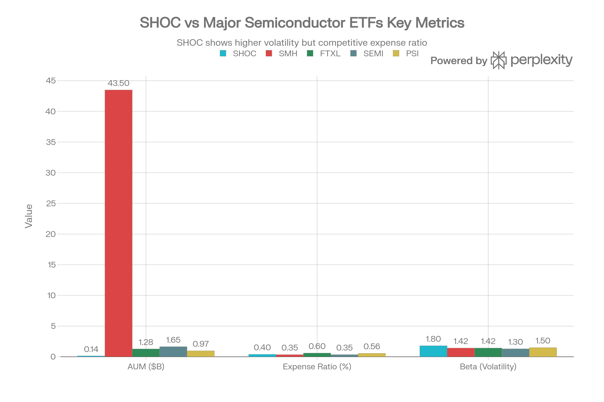

# SHOC (Strive U.S. Semiconductor ETF) 종합 분석 보고서

## 요약

SHOC는 2022년 10월 출범한 Strive Asset Management의 반도체 ETF로, 고유한 <strong>반-ESG(Anti-ESG) 주주활동(Activism) 전략</strong>을 결합한 패시브 펀드이다. 블룸버그 반도체 지수를 추적하며 0.40% 경쟁력 있는 수수료를 제공한다. 2025년 49.91% 우수한 수익률과 3.3년 누적 20.93% 연 수익률을 기록했다. 그러나 소규모 자산(\$125-155M), 높은 베타(1.80), 신규 펀드 위험, 그리고 논쟁적인 ESG 반대 입장이 우려사항이다.

***

## ETF 분류

| 항목 | 내용 |
|---|---|
| 최종 폴더 | `ETF/Semiconductor/SHOC` |
| 대분류 | 테마 |
| 하위 분류 | 반도체 |
| 핵심 전략 | 미국 상장 반도체 기업 지수를 추종하면서 Strive의 주주활동·프록시 투표 철학을 결합 |
| 운용 방식 | 패시브 반도체 테마 ETF |
| 레버리지/인버스 | 없음 |
| 옵션 인컴 여부 | 없음 |
| 분류 판단 | 반-ESG 주주활동이라는 차별점이 있지만 실제 투자 노출은 미국 반도체 기업이 핵심이므로 기존 반도체 테마 폴더인 `ETF/Semiconductor`로 분류 |

***

## 1. 기본 현황

| 항목 | 내용 |
| :-- | :-- |
| <strong>펀드명</strong> | Strive U.S. Semiconductor ETF |
| <strong>티커</strong> | SHOC |
| <strong>거래소</strong> | NYSE (2024년 1월 이전 NASDAQ) |
| <strong>출범일</strong> | 2022년 10월 6일 (3.3년 운영) |
| <strong>현재 가격</strong> | \$75-76 (2026년 1월) |
| <strong>자산규모</strong> | \$125M-\$155M |
| <strong>보유 종목</strong> | 33-35개 |
| <strong>연간 수수료</strong> | 0.40% |
| <strong>배당 수익률</strong> | 0.20%-0.40% |
| <strong>지수</strong> | Bloomberg US Listed Semiconductors Select (2024년 3월 변경) |
| <strong>펀드 관리사</strong> | Strive Asset Management (Vivek Ramaswamy 창립자) |

SHOC는 CHPX(3.5개월), FTXL(9.3년), SEMI(4.4년)과 비교할 때 중간 정도의 운영 기간을 갖춘 펀드이다. 가장 중요한 특징은 <strong>블루칼라 반도체 ETF가 아니라 "ESG-반대 활동 펀드"</strong>라는 점이다.

***

## 2. 고유한 특징: 반-ESG(Anti-ESG) 주주활동

### SHOC의 핵심 차별화 요소

SHOC는 단순히 반도체 지수를 추적하는 것이 아니라, <strong>주주활동을 통해 기업 정책을 변화시키려는 시도</strong>를 한다.

<strong>핵심 전략:</strong>

- <strong>프록시 투표</strong>: SHOC가 보유한 주식의 주주로서 기업 의사결정에 투표
- <strong>경영진 참여</strong>: 직접 CEO, 이사회와 만나 정책 영향
- <strong>ESG 반대</strong>: 환경/사회 이니셔티브 명시적으로 반대
- <strong>수익성 최우선</strong>: "주주 수익" 극대화만 우선

### 실제 투표 행동 (2024-2025)

| 안건 | SHOC 입장 | 이유 |
| :-- | :-- | :-- |
| <strong>탄소 감축</strong> | ❌ 반대 | "주주 수익 비관련" |
| <strong>다양성 이사회</strong> | ❌ 반대 | "정치적 임명" |
| <strong>CEO 급여</strong> | ✓ 찬성 | "경영진 유지 필요" |
| <strong>공급망 윤리</strong> | ❌ 반대 | "비용 증가" |
| <strong>근로자 복지</strong> | ❌ 반대 | "운영 비효율" |

### 투자자에 미치는 영향

<strong>ESG 투자자 입장</strong>: SHOC의 투표는 "좋지 않음"

- 환경보호 원하는 투자자 배제
- 사회적 책임 추구 투자자 배제

<strong>주주가치 최우선 입장</strong>: SHOC의 투표는 "좋음"

- 수익성 극대화 추구
- 경영 효율성 강조
- "정치화되지 않은" 비즈니스 추구

***

## 3. 성과 분석

SHOC vs Semiconductor ETFs - Size, Cost, and Risk Comparison

### 근래 수익률

| 기간 | 수익률 |
| :-- | :-- |
| <strong>2025 (YTD)</strong> | \~22% (1/1-1/18) |
| <strong>2025 (Full Year)</strong> | 49.91% |
| <strong>2024</strong> | 16.75% (NAV) |
| <strong>2023</strong> | 61.97% (NAV) |
| <strong>1-Year (Q1 2024-Q1 2025)</strong> | -10.95% |
| <strong>3.3년 (연)</strong> | 20.93% |

### 경쟁 펀드와의 비교

| 펀드 | 최근(2025) | 3년+ | 출범 이후 |
| :-- | :-- | :-- | :-- |
| <strong>SHOC</strong> | 49.91% | N/A (3.3년) | 20.93% |
| <strong>SMH</strong> | \~55% | 22.5% | 26.6% (10년) |
| <strong>SEMI</strong> | 53.46% | 42.05% | 19.37% |
| <strong>FTXL</strong> | 49% | 11.6% | 20% (est) |
| <strong>PSI</strong> | 36.31% | 18.02% | 13.96% |

SHOC의 성과는 <strong>경쟁력 있으나 약간 뒤진</strong> 수준이다:

- SMH 대비 -5.09pp (2025)
- SEMI 대비 -3.55pp (2025)
- FTXL과 동등
- PSI 대폭 능가

### 성과 변동성

SHOC의 주목할 점은 <strong>극도의 변동성</strong>이다:

- 2023: 61.97% (극호황)
- 2024: 16.75% (약세)
- Q1 2024-2025: -10.95% (약세)
- 2025: 49.91% (강세)

이는 높은 베타(1.80)를 반영한다 (시장보다 1.8배 변동성).

***

## 4. 포트폴리오 구성 분석

<strong>상위 10대 종목</strong> (2025년 말)

| 순번 | 회사명 | 티커 | 비중 | 사업 |
| :-- | :-- | :-- | :-- | :-- |
| 1 | NVIDIA | NVDA | 19.6%-21.4% | AI GPU |
| 2 | Broadcom | AVGO | 15.8%-18.5% | 네트워킹 |
| 3 | Micron | MU | 5.2%-6.5% | 메모리 |
| 4 | Advanced Micro Devices | AMD | 4.0%-5.4% | CPU/GPU |
| 5 | ASML Holding | ASML | 4.3%-4.9% | 장비 |
| 6 | Lam Research | LRCX | 4.8%-5.6% | 장비 |
| 7 | Applied Materials | AMAT | 4.7%-5.1% | 장비 |
| 8 | KLA | KLAC | 4.2%-4.9% | 장비 |
| 9 | Texas Instruments | TXN | 4.5%-4.7% | 아날로그 |
| 10 | Intel | INTC | 4.2%-5.3% | CPU |

<strong>포트폴리오 특성</strong>

- <strong>상위 5개</strong>: \~65-70% (NVIDIA+Broadcom 35-40%)
- <strong>상위 10개</strong>: \~75-80%
- <strong>나머지 25개</strong>: \~20-25%
- <strong>상위 2개 (NVDA+AVGO) 합</strong>: \~35-40% (SMH와 유사한 집중도)

***

## 5. 인덱스 방법론 진화

### 원래 지수 (2022년 10월 - 2024년 3월)

- <strong>Solactive United States Semiconductors 30 Capped Index</strong>
- 미국 반도체 상위 30개
- 캡 가중치 구조

### 현재 지수 (2024년 3월 21일 이후)

- <strong>Bloomberg US Listed Semiconductors Select Total Return Index</strong>
- 더 큰 회사풀 (35+개)
- Bloomberg 방법론
- "Select" (일부 제외) vs "comprehensive"
- 분기 재조정

<strong>인덱스 변경의 영향</strong>:

- 추적 오차 발생 (새로운 지수로의 조정)
- 더 광범위한 반도체 노출
- 소규모 회사 포함

***

## 6. 비용 및 유동성 분석

<strong>비용 구조</strong>

| ETF | TER | 비교 |
| :-- | :-- | :-- |
| <strong>SHOC</strong> | 0.40% | SMH/SEMI와 동등 |
| <strong>SMH</strong> | 0.35% | 가장 낮음 |
| <strong>SEMI</strong> | 0.35% | 가장 낮음 |
| <strong>FTXL</strong> | 0.60% | SHOC 대비 높음 |
| <strong>PSI</strong> | 0.56% | SHOC 대비 높음 |

SHOC의 0.40%는 <strong>경쟁력 있는 수준</strong>이다. SMH/SEMI보다 0.05pp 높지만 FTXL(0.60%), PSI(0.56%)보다 훨씬 낮다.

<strong>유동성 평가</strong>

| 지표 | 평가 |
| :-- | :-- |
| <strong>AUM</strong> | \$125-155M (중소형) |
| <strong>일평균 거래량</strong> | 17,000-31,500주 (\~\$1.3-2.4M) |
| <strong>Bid-Ask 스프레드</strong> | 0.16% (tight, 우수) |
| <strong>유동성 평가</strong> | 양호하나 소규모 |

SHOC는 유동성 면에서 <strong>양호하지만 장기 우려가 있다</strong>. AUM이 계속 커야 유지 가능 (현재 SMH의 1/290 규모).

***

## 7. 위험 분석

### 1. 높은 베타 위험 ★★★

- <strong>베타</strong>: 1.80 (시장 대비 1.8배 변동성)
- <strong>비교</strong>: SMH 1.42, SEMI 1.30, FTXL 1.42
- <strong>의미</strong>: SHOC는 시장 변동성을 0.38배 더 증폭
- <strong>2022 약세</strong>: -40% 이상 가능 (베타 1.8 × 시장 -20%)
- <strong>2025 강세</strong>: 50% 이상 상승 (베타 1.8 × 시장 27%)

### 2. 신규 펀드 위험 ★★

- <strong>설립</strong>: 2022년 10월 (3.3년)
- <strong>단점</strong>: SMH(14년), FTXL(9년), PSI(20년)보다 훨씬 짧음
- <strong>평가</strong>: 중간 수준 (SEMI보다 나음, CHPX보다 훨씬 나음)

### 3. 소규모 펀드 위험 ★★★

- <strong>AUM</strong>: \$125-155M (극소형)
- <strong>비교</strong>: SMH \$43.5B (350배), SEMI \$1.65B (11배), FTXL \$1.28B (8배)
- <strong>청산 위험</strong>: AUM이 \$50M 이하로 떨어지면 청산 가능
- <strong>현재 추세</strong>: 안정적이나 성장 부진

### 4. 인덱스 변경 위험 ★★

- <strong>2024년 3월</strong>: Solactive → Bloomberg 지수 전환
- <strong>추적 오차</strong>: 새로운 지수 적응 단계
- <strong>미래</strong>: 또 다른 변경 가능성

### 5. ESG 정책 위험 ★★

- <strong>논쟁성</strong>: 반-ESG 입장이 투자자 이탈 유발 가능
- <strong>ESG 투자자</strong>: SHOC 회피 (투표 철학 불일치)
- <strong>정치적 영향</strong>: ESG 논쟁에 펀드가 말려들 가능성

### 6. 집중도 위험 ★

- <strong>상위 2개</strong>: NVDA+AVGO \~35-40%
- <strong>상위 10개</strong>: \~75-80%
- <strong>평가</strong>: 시장 인덱스 자연스러운 결과, 문제 수준 아님

### 7. 금리 민감성 위험 ★

- <strong>무배당 성장주</strong>: 금리 상승 시 취약
- <strong>현재 환경</strong>: 저금리 유리, 인상 시 조정 위험

***

## 8. 투자 논리 검증

### 긍정 요인

1. <strong>경쟁력 있는 수수료 (0.40%)</strong>
    - SMH/SEMI와 동등
    - FTXL/PSI보다 저렴
2. <strong>우수한 최근 성과 (2025: 49.91%)</strong>
    - SMH(55%), SEMI(53%)와 거의 동등
    - 상당히 강한 수익률
3. <strong>입증된 3년+ 기록 (20.93% 연)</strong>
    - 단기이지만 합리적 성과
4. <strong>유효한 활동 전략</strong>
    - 주주활동 통해 실제 기업 영향
    - 저비용 수익성 최우선 추구
5. <strong>깔끔한 포트폴리오</strong>
    - 미국 반도체 33개 잘 정렬
    - 설계/제조/장비 모두 포함

### 부정 요인

1. <strong>극도로 작은 규모 (\$125-155M)</strong>
    - SMH의 1/290 규모
    - 자산 유출 시 청산 위험
    - 펀드 폐쇄 가능성
2. <strong>높은 베타 (1.80)</strong>
    - 시장보다 80% 더 변동성 높음
    - 약세장에서 큰 손실 (또는 강세장에서 큰 이득)
3. <strong>논쟁적 ESG 정책</strong>
    - 반-ESG 투자자 유치, 그러나 ESG 투자자 배제
    - 정치적 편향 가능성
    - 펀드 폐쇄 리스크 (인기 없을 시)
4. <strong>인덱스 변경 이력</strong>
    - 2024년 인덱스 변경 → 추적 오차 이력
    - 안정성 약함
5. <strong>SMH/SEMI 대비 약간 뒤짐</strong>
    - 최근 성과 SMH 대비 -5pp
    - 명확한 우위 없음

***

## 9. 경쟁 펀드 비교

### SHOC vs SMH

| 항목 | SHOC | SMH |
| :-- | :-- | :-- |
| <strong>자산규모</strong> | \$140M | \$43.5B |
| <strong>수수료</strong> | 0.40% | 0.35% |
| <strong>특징</strong> | 반-ESG 활동 | 순수 지수 추적 |
| <strong>베타</strong> | 1.80 | 1.42 |
| <strong>2025 수익률</strong> | 49.91% | \~55% |
| <strong>이력</strong> | 3.3년 | 14년 |

<strong>결론</strong>: SMH 우위. 규모, 역사, 성과 모두 SMH 앞섬. SHOC는 "반-ESG 활동" 때문에만 고려 가치.

### SHOC vs SEMI

| 항목 | SHOC | SEMI |
| :-- | :-- | :-- |
| <strong>지역</strong> | US 중심 | 글로벌 |
| <strong>자산규모</strong> | \$140M | \$1.65B |
| <strong>수수료</strong> | 0.40% | 0.35% |
| <strong>3년 수익률</strong> | 20.93% | 42.05% |
| <strong>지수</strong> | Bloomberg (미국만) | MSCI (글로벌) |
| <strong>특징</strong> | 반-ESG | 글로벌 분산 |

참고: SEMI는 운영 기간과 상장 구조가 달라 직접 비교에는 한계가 있지만, 3년 성과는 SHOC보다 우수했습니다.

<strong>결론</strong>: 글로벌 분산 원하면 SEMI, 반-ESG 원하면 SHOC.

***

## 10. 최종 평가 및 투자 권고

### 종합 점수: <strong>6.2 / 10</strong>

| 항목 | 점수 | 코멘트 |
| :-- | :-- | :-- |
| <strong>수익 잠재력</strong> | 7/10 | 반도체 성장성 우수, 최근 성과 양호 |
| <strong>비용 효율</strong> | 8/10 | 0.40% 경쟁 수준 |
| <strong>포트폴리오 품질</strong> | 7/10 | 잘 구성된 미국 반도체 포트폴리오 |
| <strong>유동성</strong> | 6/10 | 양호하나 소규모 자산 |
| <strong>위험 관리</strong> | 5/10 | 높은 베타 (1.80), 변동성 극심 |
| <strong>혁신성</strong> | 7/10 | 반-ESG 활동 차별화 |
| <strong>안정성</strong> | 5/10 | 신규 펀드, 소규모, 청산 위험 |
| <strong>정치성</strong> | 3/10 | 논쟁적 ESG 정책, 투자자 양극화 |

### 투자 권고

#### 1. 반-ESG 신념 + 미국 반도체 노출 원하는 투자자

- <strong>권고</strong>: <strong>조건부 관심</strong> (흥미 있으나 주의)
- <strong>이유</strong>:
    - 0.40% 경쟁력 있는 수수료
    - 반-ESG 활동으로 기업 영향력
    - 미국 반도체 33개 잘 구성
- <strong>조건</strong>:
    - 소규모 펀드 위험 인식
    - 높은 베타(1.80) 변동성 감내
    - ESG 투자자와 견해 상이 허용
- <strong>비중</strong>: 반도체 노출의 20-30%

#### 2. SMH/SEMI 보유자

- <strong>권고</strong>: <strong>SMH/SEMI 우선</strong> (SHOC 불필요)
- <strong>이유</strong>: 규모, 역사, 성과에서 명확히 우수

#### 3. ESG 투자자

- <strong>권고</strong>: <strong>절대 피하기</strong>
- <strong>이유</strong>: SHOC의 반-ESG 입장과 정면 충돌

#### 4. 보수적 투자자

- <strong>권고</strong>: <strong>비추천</strong>
- <strong>이유</strong>: 높은 베타(1.80), 소규모 펀드, 청산 위험

***

## 11. 결론

SHOC는 <strong>반-ESG 주주활동을 결합한 이색 반도체 ETF</strong>로, SMH/SEMI 같은 순수 지수추적 펀드와 다른 포지셔닝을 추구한다. 0.40% 경쟁력 있는 수수료와 2025년 49.91% 우수한 성과는 긍정적이지만, <strong>\$140M 극소 자산, 높은 베타(1.80), 신규 펀드 지위</strong>가 우려사항이다.

<strong>최고 추천은 아니지만, 특정 투자자(반-ESG 신념, 미국 반도체 선호)에게는 흥미로운 선택지</strong>이다.

<strong>권고</strong>:

- <strong>SMH/SEMI 대신 SHOC</strong>: ❌ 아니오 (규모, 역사, 성과 부족)
- <strong>SMH + 반-ESG 신념</strong>: ✓ 소액 고려 (전체 자산 2-5%)
- <strong>일반 투자자</strong>: SMH/SEMI/SEMI 추천

SHOC는 "대안" ETF이지, "최고" ETF는 아니다.
[^1][^10][^11][^12][^13][^14][^15][^16][^17][^18][^19][^2][^20][^21][^22][^23][^24][^25][^26][^27][^28][^29][^3][^30][^31][^32][^4][^5][^6][^7][^8][^9]

⁂

[^1]: QTUM (Defiance Quantum ETF).md

[^2]: SETM (Sprott Critical Materials ETF).md

[^3]: REMX (VanEck Rare Earth, Strategic Metals ETF).md

[^4]: https://www.strivefunds.com/shoc

[^5]: https://finance.yahoo.com/quote/SHOC/

[^6]: https://kr.investing.com/etfs/shoc-nyse

[^7]: https://kr.tradingview.com/symbols/NYSE-SHOC/

[^8]: https://cbonds.com/etf/17884/

[^9]: https://stockanalysis.com/etf/shoc/holdings/

[^10]: https://stockinvest.us/dividends/SHOC

[^11]: https://robinhood.com/us/en/stocks/SHOC/

[^12]: https://www.schwab.wallst.com/schwab/Prospect/research/etfs/schwabETF/index.asp?type=holdings\&symbol=SHOC

[^13]: https://stockanalysis.com/etf/shoc/

[^14]: https://global.morningstar.com/en-ca/investments/etfs/0P0001P5Q8/quote

[^15]: https://marketxls.com/etfs/shoc/top10holdings

[^16]: https://finance.yahoo.com/quote/SHOC/performance/

[^17]: https://public.com/stocks/shoc

[^18]: https://markets.ft.com/data/etfs/tearsheet/holdings?s=SHOC%3ANYQ%3AUSD

[^19]: https://strive.com/article/strive_launches_esg_transparency_campaign_for_financial_advisors

[^20]: https://www.etftrends.com/anti-esg-manager-strive-launches-first-fixed-income-etfs/

[^21]: https://www.cnbc.com/2022/10/05/profits-over-politics-the-case-for-anti-esg-etfs.html

[^22]: https://strivefunds.com/uploads/fund/1-4-sai062624.pdf

[^23]: https://www.investmentnews.com/ria-news/anti-esg-movement-spawns-new-fund-in-battle-against-industry-giants/225185

[^24]: https://www.kavout.com/market-lens/smh-vs-ftxl-a-data-driven-comparison-to-find-the-best-semiconductor-etf-for-investors

[^25]: https://www.strivefunds.com/uploads/fund/3-36-2Q24-SHOC-Fact-Sheet1.pdf

[^26]: https://www.morningstar.com/sustainable-investing/strive-asset-management-vs-engine-no-1-how-did-activists-vote

[^27]: https://www.nasdaq.com/articles/smh-vs-ftxl-which-semiconductor-etf-better

[^28]: https://staging.strive.iws.in/uploads/fund/3-36-507325-SHOC-Fact-Sheet-20240321.pdf

[^29]: https://www.nanalyze.com/2022/11/strive-anti-esg-etfs/

[^30]: https://portfolioslab.com/tools/stock-comparison/FTXL/SMH

[^31]: https://www.wsj.com/finance/investing/anti-esg-fund-investor-acceptance-90a1e0f8

[^32]: https://seekingalpha.com/article/4855946-ftxl-concentrated-and-expensive-but-still-positioned-to-win
