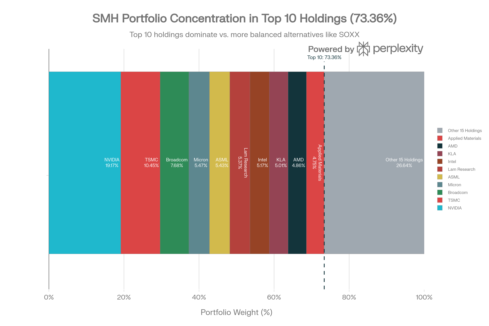
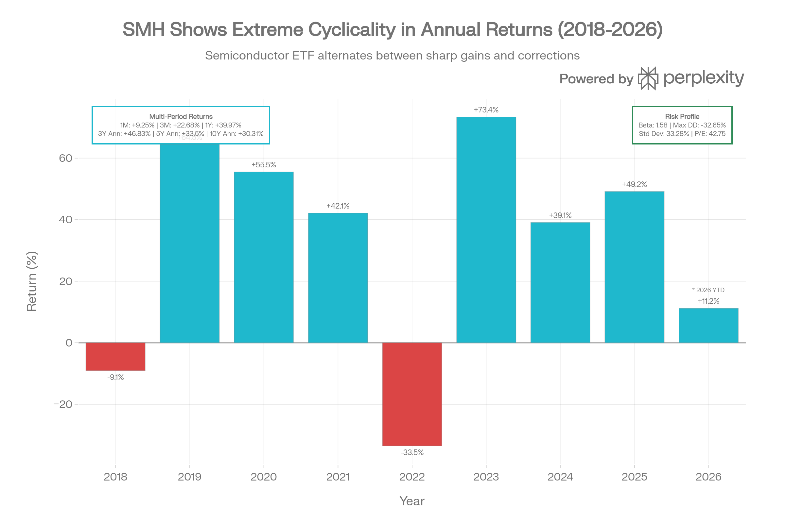
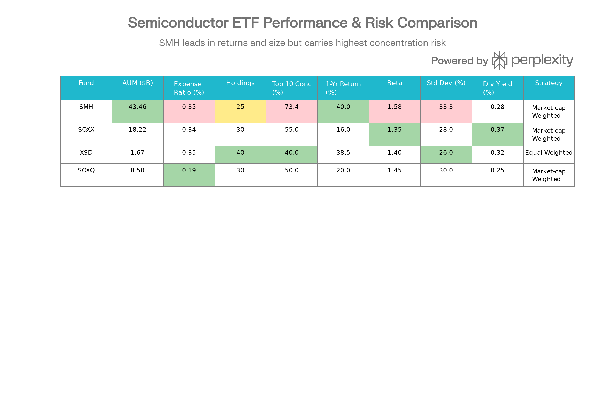

# VanEck Semiconductor ETF (SMH): 종합 분석 보고서

## ETF 분류

| 항목 | 내용 |
|---|---|
| 최종 폴더 | `ETF/Semiconductor/SMH` |
| 대분류 | 테마 |
| 하위 분류 | 반도체 |
| 핵심 전략 | MVIS US Listed Semiconductor 25 Index를 추종해 미국 상장 대형 반도체 기업에 시가총액 가중 방식으로 투자 |
| 운용 방식 | 패시브 반도체 테마 ETF |
| 레버리지/인버스 | 없음 |
| 옵션 인컴 여부 | 없음 |
| 분류 판단 | 일반 기술 섹터 ETF가 아니라 반도체 산업에 특화된 노출이 핵심이므로 기존 반도체 테마 폴더인 `ETF/Semiconductor`로 분류 |

***

### 개요 및 펀드 특성

VanEck Semiconductor ETF (SMH)는 2011년 12월 20일에 출시되어 현재 가장 큰 순수 반도체 섹터 ETF로 자리잡은 펀드입니다. 현재 \$43.46B의 자산을 보유하고 있으며, MVIS US Listed Semiconductor 25 Index를 추종하여 미국 상장 25개의 최대 규모 반도체 회사들에 시가총액 가중방식으로 투자합니다.[^1][^2]

**핵심 특징**: SMH는 "let winners run" 철학으로 유명합니다. 이는 시가총액 가중방식의 결과로, 성과가 좋은 회사(NVIDIA, ASML, Broadcom)들의 가중치가 자동으로 증가한다는 의미입니다. 이 접근법은 최근 10년간 탁월한 수익률(30.31% 연환산)을 생성했지만, 동시에 극도의 집중도와 변동성을 야기합니다.[^3][^4]

### 포트폴리오 구성 및 농축도 분석

SMH Portfolio Concentration: Mega-Cap Dominance with NVIDIA Leading at 19.17%

SMH의 포트폴리오는 **강한 농축도 구조**를 특징으로 합니다. 상위 10개 종목이 전체 자산의 73.36%를 차지하며, NVIDIA 단독으로 19.17%입니다. 이는 제2위 종목(TSMC 10.45%)의 거의 2배입니다.[^5]

**상위 10개 포지션**:

1. NVIDIA (NVDA): 19.17% - GPU/AI 칩 설계 지배자
2. TSMC (TSM): 10.45% - 선진 반도체 제조 리더
3. Broadcom (AVGO): 7.68% - 통신 칩 및 인프라
4. Micron Technology (MU): 5.47% - 메모리 칩 제조
5. ASML (ASML): 5.43% - 반도체 생산 장비 리더
6. Lam Research (LRCX): 5.37% - 반도체 제조 장비
7. Intel (INTC): 5.17% - CPU/반도체 제조
8. KLA (KLAC): 5.01% - 반도체 검사 장비
9. AMD (AMD): 4.86% - CPU/GPU 칩 설계
10. Applied Materials (AMAT): 4.75% - 반도체 제조 장비

**NVIDIA의 지배성**: NVIDIA이 19.17%라는 가중치는 매우 높으며, NVIDIA의 주가 움직임이 SMH 전체의 약 19%를 직접적으로 결정한다는 의미입니다. 2024-2025년 NVIDIA의 강력한 성과(AI 칩 주도)는 SMH의 우수한 수익률의 주 원동력이었습니다.[^5]

**지역 다양성**: 포트폴리오는 미국 중심(80.31%)이지만, 대만(10.47%), 네덜란드(6.43%)에 대한 노출도 있습니다. 이는 글로벌 반도체 가치사슬에 대한 균형잡힌 노출을 제공하면서도, 지정학적 위험을 일부 증가시킵니다(대만의 지정학적 긴장).[^2]

### 성과 분석: 극단적인 사이클성

SMH Historical Performance \& Risk Profile: Cyclical Returns in Semiconductor Sector (2018-2026)

SMH의 성과는 **반도체 산업의 극도로 사이클적인 특성**을 명확히 반영합니다. 최근 8년간의 연간 수익률을 보면:

| 연도 | 수익률 | 맥락 |
| :-- | :-- | :-- |
| 2023 | +73.38% | AI 칩 수요 폭발, NVIDIA 급등[^6] |
| 2022 | -33.53% | 금리 인상, 경제 둔화, 재고 정리[^6] |
| 2021 | +42.13% | 팬데믹 회복, 클라우드 투자[^6] |
| 2020 | +55.53% | COVID 데이터센터 수요[^6] |
| 2019 | +64.45% | 5G 사이클 초기[^6] |
| 2018 | -9.05% | 무역 전쟁, 마진 압박[^6] |

이 패턴은 다음을 시사합니다:

1. **높은 순환성**: 3-5년의 상승 사이클 다음 1-2년의 조정
2. **극단적 진폭**: +73% 이득에서 -33% 손실로의 급격한 전환
3. **이익 주기 민감성**: 마이크로칩 산업은 초기 과잉 투자 → 공급 과잉 → 정상화의 사이클을 따름

**최근 12개월 성과 (\$107B 기여)**: 2025년 +49.17%의 강력한 수익률은 AI 데이터센터 투자의 지속, NVIDIA의 H100/H200 GPU 수요 강세, 그리고 TSMC의 첨단 칩 생산 능력에 대한 신뢰를 반영합니다.[^6][^4]

**다중 기간 수익률**:

- 1개월: +9.25%
- 3개월: +22.68%
- 1년: +39.97%
- 3년 연환산: +46.83%
- 5년 연환산: ~33.5%
- 10년 연환산: 30.31%
- 설립 이후 (2011): ~3,000%+ 누적[^6]

이러한 수익률은 장기 투자자들에게 매력적이지만, 높은 변동성(33.28% 표준편차, 1.58 베타)을 수반합니다.[^7][^4]

### 위험 특성: 높은 변동성과 집중도

| 위험 메트릭 | SMH | S\&P 500 | 평가 |
| :-- | :-- | :-- | :-- |
| **베타 (Beta)** | 1.58 | 1.00 | 58% 더 변동성 높음[^7] |
| **표준편차** | 33.28% | ~15-18% | 거의 2배 변동성[^7] |
| **최대 낙폭 (최근)** | -32.65% | 일반적으로 -20% 이하 | 상당한 하방 위험[^7] |
| **52주 범위** | \$170-396 | 상대적으로 좁음 | 극도의 가격 범위[^8] |
| **P/E 비율** | 42.75 | ~20-25 | 프리미엄 밸류에이션[^7] |
| **52주 낙폭** | -32.65% | 훨씬 낮음 | 2025년 초 반도체 조정 반영[^7] |

베타 1.58은 S\&P 500이 10% 하락할 때 SMH는 약 15.8% 하락할 것으로 예상함을 의미합니다. 2022년의 -33.53% 손실과 최근 최대 낙폭 -32.65%는 이를 입증합니다.[^6][^7]

**역사적 최악**: 2008-2009 금융위기 시기 SMH는 -99.41%의 극도 손실을 입었으며, 회복에 3-4년이 걸렸습니다. 이는 반도체 섹터의 높은 사이클성을 강조합니다.[^6]

### 비용 구조 및 유동성

SMH의 0.35% 순 비용은 경쟁력 있습니다:[^2]

- SOXX (iShares): 0.34% (1 basis point 저렴)[^9]
- SOXQ (Invesco): 0.19% (절반 비용)[^10]
- XSD (SPDR): 0.35% (동일)[^10]

\$10,000 투자 기준 연간 \$35의 수수료는 장기적으로 무시할 수 없지만, 비용 자체보다 **선택한 전략의 유효성**이 더 중요합니다.[^10]

**유동성은 우수합니다**: 일일 평균 거래량 6.47M-9.97M주, \$43.46B 자산 규모로 인해 비드-애스크 스프레드는 매우 협소하며, 기관 투자자들의 대규모 거래가 가능합니다.[^8][^11]

### 배당 정책: 제한적 수익

| 메트릭 | SMH | 평가 |
| :-- | :-- | :-- |
| **배당 수익률** | 0.28-0.31% | 매우 낮음 (S\&P 500: 1.5-2%) |
| **연간 배당** | \$1.10 | 단일 연말 지급 |
| **배당 성장 (1Y)** | +3.12% | 느린 성장[^12] |
| **3년 성장** | +14.07% | 적당한 장기 성장[^13] |
| **지급 비율** | 12.89% | 보수적 (배당금 재투자 여지)[^12] |

배당 수익률 0.28%는 **SMH가 순수 성장 지향적 도구**임을 명확히 합니다. 반도체 기업들은 이익을 R\&D와 설비 투자에 재투자하는 경향이 있기 때문에 배당은 제한적입니다. 이는 배당 소득이 필요한 보수적 투자자들에게 부적절합니다.[^12][^13]

연간 배당 \$1.10은 분기별 또는 월별 지급이 아니라 **연말에 한 번에 지급**되므로, 정기적 현금 흐름을 원하는 투자자들에게도 비효율적입니다.[^12]

### 펀드 자금 흐름 및 투자자 수용

매우 긍정적인 신호가 있습니다. SMH는 **1년간 +\$661M에서 +\$5.22B**의 순 자금 유입을 기록했습니다. 이는 다음을 의미합니다:[^11][^4]

1. **강한 투자자 수요**: 2025년 +49.17% 수익률에도 불구하고, 또는 그 때문에 새로운 자본이 지속적으로 유입
2. **기관 채택 증가**: AUM이 \$43.46B로 성장하며, 포트폴리오 배분 결정에 SMH를 포함하는 기관들 증가
3. **주식 공급 증가**: 10월 98.6M주에서 11월 103.3M주로 급증, 새로운 주식 발행으로 기관 자금 수용[^4]

이는 시장이 반도체/AI 섹터의 장기 전망에 높은 신뢰를 가지고 있음을 시사합니다.[^4]

### 경쟁 비교 및 차별화

Semiconductor ETF Competitive Landscape: SMH vs. SOXX vs. XSD vs. SOXQ

SMH는 반도체 ETF 생태계에서 **"대형주 수혜자" 위치**를 점하고 있습니다. 경쟁 펀드들과의 비교:[^14]

**SOXX (iShares Semiconductor ETF)**

- AUM: \$18.22B (SMH의 42%)
- 비용: 0.34% (1bp 저렴)
- 강점: 분산도 더 높음, 보다 균형잡힌 노출
- 약점: 1년 수익률 +16%로 SMH 대비 훨씬 약함[^9]
- **선택 기준**: 더 보수적이면서 다양한 노출 원할 때

**XSD (SPDR S\&P Semiconductor ETF)**

- AUM: \$1.67B (가장 작음)
- 전략: 등가중 (equal-weight) - 각 종목에 동일 가중치
- 강점: 소형주 노출, 대형주 시가총액 왜곡 회피
- 약점: AUM 작음, 거래량 가능성 제한
- **선택 기준**: 소형주 발굴 후 성장 추구할 때[^10]

**SOXQ (Invesco PHLX Semiconductor ETF)**

- 비용: 0.19% (가장 저렴)
- 강점: \$19의 수수료 vs SMH \$35 (연 \$10K 기준)
- 약점: AUM과 인지도 낮음
- **선택 기준**: 비용 최소화가 최우선일 때[^10]

**SMH의 경쟁 우위**:

1. **규모**: \$43.46B AUM으로 모든 경쟁사를 능가, 최고의 유동성 제공
2. **성과**: 최근 1년 +39.97% vs SOXX +16%, 10년 30.31% 연환산으로 혁신적
3. **유명성**: 가장 광범위하게 추종되는 반도체 ETF, 기관 채택률 최고

**SMH의 약점**:

1. **집중도**: 상위 10개 73.36% vs SOXX의 낮은 농축도
2. **밸류에이션**: P/E 42.75는 성장 기대를 완전히 반영, 실망 시 하락 위험
3. **사이클 위험**: 역사적 -99% 낙폭 경험, 향후 조정 가능성[^6]

### 기술 신호 및 2026 전망

현재(2026년 1월) SMH의 기술 상황은 **복합 신호**를 보이고 있습니다:[^15]

**강세 신호**:

- 모멘텀 지표가 2025년 12월 29일 0 라인 위로 상향 돌파
- 2025년 12월 19일 50일 이동평균 상향 돌파 (상승 추세 전환 신호)
- 3일 연속 상승 후 계속 상승 확률 79% (역사적 348사례 기반)

**약세/경고 신호**:

- RSI가 오버바우트 존(70 이상) 진입 → 가격 조정 가능성
- 스토캐스틱 오실레이터 14일 동안 오버바우트 유지 → 반대 신호 강화
- 2026년 1월 6일 볼린저 밴드 상단선 이탈 → 중앙값으로의 회귀 가능
- 근처 저항선 (\$289.28)에서 가격 압박 가능

**가격 목표 및 전망**:

- AI 모델 기반 3개월 목표: +37.27% 상승 (현재 기준)
- 기술 목표 가격: \$460.01 (+15% from \$400)[^16]
- 90% 확률로 3개월 내 \$394-\$411 범위[^17]
- P/E 42.75는 시장이 강한 수익 성장을 이미 가격화했음을 의미[^7]

**투자자 해석**: SMH는 단기적으로 오버바우트이지만, 기본적인 AI 및 반도체 수요 모멘텀이 강해 조정 후 재상승 가능성이 높습니다.[^15]

### 투자 적합성 및 포트폴리오 위치

**SMH가 적합한 투자자**:

1. **장기 성장 투자자**: 10년+ 투자 기간으로 사이클 완주 가능
2. **기술/AI 신봉자**: AI 칩 혁명의 수혜자로 확신하는 자
3. **공격적 배분**: 포트폴리오의 20-50%를 기술 섹터에 배분할 역량
4. **높은 변동성 수용**: -30% 조정을 참을 수 있는 심리적 준비

**SMH가 부적절한 투자자**:

1. **보수적 투자자**: 0.28% 배당과 극도의 변동성은 심리적 부담
2. **단기 거래자**: 사이클 타이밍 어려움, 2025년 초처럼 급락 위험
3. **기존 기술 가중 포트폴리오**: 이미 NVDA/MSFT 등에 노출된 경우 중복
4. **정년 임박 투자자**: -32% 낙폭 충격 회복 불가능

**권장 포트폴리오 할당**:

- **공격적 포트폴리오** (20대-40대, 10년+ 기간): 15-30% 할당
- **중간 포트폴리오** (40대-55세): 5-15% 할당
- **보수적 포트폴리오** (55세+): 0-5% (또는 제외)

### 산업 기본요소 평가

SMH의 강한 기본요소는 다음을 포함합니다:[^4]

**강점**:

1. **AI 인프라 수요**: NVIDIA GPU의 압도적 우위, TSM의 첨단 공정 능력
2. **데이터센터 투자 지속**: 클라우드 거대 기업들(MSFT, Google, Meta)의 AI 인프라 투자 가속
3. **자동화 추세**: 자율주행, 로봇, 산업 4.0으로 칩 수요 지속적 증가
4. **미국 CHIPS Act**: 국내 반도체 제조 투자 촉진, 공급망 리스크 완화
5. **기술 노드 수렴 성숙화**: 극단적 미세공정에서 안정적 중기 노드 이동, 마진 개선 가능

**약점/위험**:

1. **높은 밸류에이션**: P/E 42.75는 매우 높은 성장 기대를 이미 가격화
2. **사이클 정상화 위험**: 현재의 AI 칩 공급 부족이 과잉 공급으로 전환 가능
3. **지정학적 긴장**: U.S.-China 반도체 전쟁, TSMC 지정학적 위험
4. **경쟁 심화**: Intel의 회복, AMD의 선전, 신규 플레이어(Mobileye, Cerebras) 등장
5. **이익 마진 압박**: 고비용 R\&D 및 설비 투자로 인한 마진 감소 가능

### 최종 평가 및 권장안

SMH는 **기술 섹터의 정점에 자리한 고성장, 고위험 도구**입니다. 다음과 같은 특징을 종합하면:

**강점**:

- 30.31% 10년 연환산 수익률 = 탁월한 장기 성과
- \$43.46B AUM으로 최고 유동성 및 접근성
- 전략적 핵심 포지션 (NVIDIA 19%, TSMC 10%)으로 AI 수혜 최대화
- +49.17% 2025년, +39.97% 1년 수익률로 최근 강세

**약점**:

- P/E 42.75는 성장이 완전히 가격화됨을 의미
- -32.65% 최대 낙폭으로 심각한 조정 위험
- 73.36% 농축도로 소수 기업(특히 NVIDIA)에 의존
- 0.28% 배당으로 성장 중심 도구, 수익 투자자 부적절

**결론**: 향후 3-5년간 AI 칩 수요 지속이 확실하다면, SMH는 탁월한 장기 성장 수단입니다. 그러나 **현재 밸류에이션 수준에서 신규 진입은 신중**이어야 하며, 기존 보유자는 이익 실현 고려, 신규 투자자는 다음 조정까지 대기를 고려해볼 가치가 있습니다.

**최종 권장**:

- **매수**: 이미 반도체 호황을 놓친 투자자, 10년+ 장기 투자자, 공격적 포트폴리오
- **보유**: 기존 보유자, 이익 실현 20-30% 검토
- **대기**: 높은 밸류에이션 회피 투자자, P/E 35 이하 조정 기다리는 자
- **회피**: 보수적 투자자, 배당 필요 투자자, 사이클 타이밍 불가능 자
[^18][^19][^20][^21][^22][^23][^24][^25][^26][^27][^28][^29][^30][^31][^32][^33][^34][^35][^36][^37][^38][^39][^40][^41][^42][^43][^44]

⁂

[^1]: https://www.marketwatch.com/investing/fund/smh

[^2]: https://www.vaneck.com/offshore/en/investments/semiconductor-etf-smh/

[^3]: https://247wallst.com/investing/2026/01/11/etfs-that-can-beat-the-sp-500-in-2026/

[^4]: https://www.ainvest.com/news/long-term-compounding-power-semiconductor-etfs-vaneck-semiconductor-etf-smh-stands-high-conviction-growth-vehicle-2025-2512/

[^5]: https://stockanalysis.com/etf/smh/holdings/

[^6]: https://totalrealreturns.com/n/SMH

[^7]: https://rockflow.ai/stocks/smh/

[^8]: https://robinhood.com/stocks/SMH

[^9]: https://www.bankrate.com/investing/best-semiconductor-etfs/

[^10]: https://wtop.com/news/2025/11/7-best-semiconductor-etfs-to-buy-in-2025-8/

[^11]: https://www.tradingview.com/symbols/NASDAQ-SMH/analysis/

[^12]: https://stockanalysis.com/etf/smh/dividend/

[^13]: https://www.digrin.com/stocks/detail/SMH/

[^14]: https://www.mezzi.com/blog/smh-vs-soxx-vs-xsd-semiconductor-etf-balanced-exposure

[^15]: https://tickeron.com/ticker/SMH/forecasts-predictions/

[^16]: https://tradestie.com/stocks/SMH/price-prediction/

[^17]: https://stockinvest.us/stock/SMH

[^18]: QTUM (Defiance Quantum ETF).md

[^19]: SETM (Sprott Critical Materials ETF).md

[^20]: REMX (VanEck Rare Earth, Strategic Metals ETF).md

[^21]: https://www.vaneck.com/offshore/en/investments/semiconductor-etf/

[^22]: https://finance.yahoo.com/quote/SMH/

[^23]: https://kr.investing.com/etfs/holdrs-merrill-lynch-semiconductor

[^24]: https://www.vaneck.com/us/en/investments/semiconductor-etf-smh/performance/

[^25]: https://markets.ft.com/data/etfs/tearsheet/holdings?s=SMH%3ALSE%3AUSD

[^26]: https://www.barrons.com/market-data/funds/smh

[^27]: https://www.poems.com.sg/etf-screener/NASDAQ-SMH/

[^28]: https://www.schwab.wallst.com/schwab/Prospect/research/etfs/reports/reportRetrieve.asp?reportType=etfrc\&symbol=SMH

[^29]: https://global.morningstar.com/en-ca/investments/etfs/0P0000U0D2/quote

[^30]: https://www.investing.com/etfs/holdrs-merrill-lynch-semiconductor-holdings

[^31]: https://www.dividendmax.com/united-states/nasdaq/investment-trusts/vaneck-vectors-semiconductor-etf/dividends

[^32]: https://marketchameleon.com/Overview/SMH/Dividends/

[^33]: https://www.slickcharts.com/symbol/SMH/dividend

[^34]: https://www.zacks.com/stock/news/2811622/should-you-invest-in-the-vaneck-semiconductor-etf-smh

[^35]: https://aiolux.com/insights/rolling-beta?period=6m\&scroll=result\&symbol=SMH

[^36]: https://www.investing.com/etfs/holdrs-merrill-lynch-semiconductor-dividends

[^37]: https://money.usnews.com/investing/articles/best-semiconductor-etfs-to-buy

[^38]: https://global.morningstar.com/en-ca/investments/etfs/0P0000U0D2/risk

[^39]: https://seekingalpha.com/symbol/SMH/dividends/scorecard

[^40]: https://etfdb.com/etfs/industry/semiconductors/

[^41]: https://www.zacks.com/stock/news/2756094/the-zacks-analyst-blog-highlights-xsd-psi-smh-ftxl-soxq-and-soxx

[^42]: https://www.moomoo.com/au/learn/detail-best-semiconductor-etf-118049-250992005

[^43]: https://seekingalpha.com/article/4827700-soxx-why-i-prefer-this-etf-over-smh-and-xsd

[^44]: https://etfdb.com/etf/SMH/
