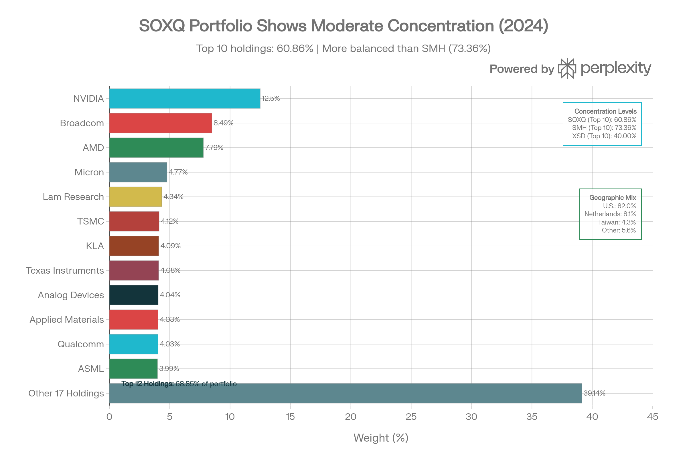
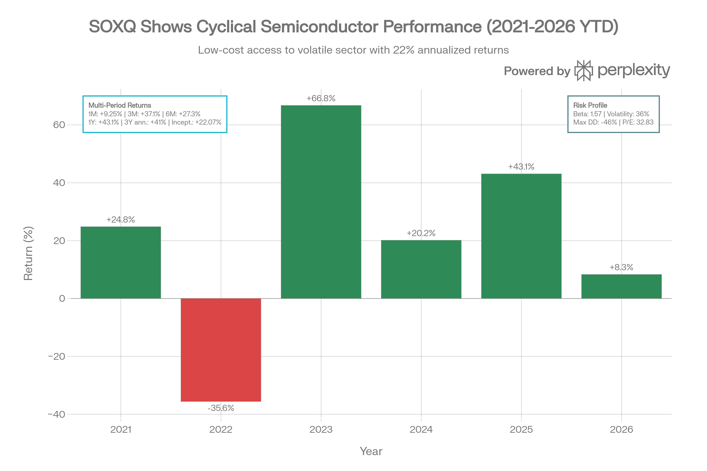
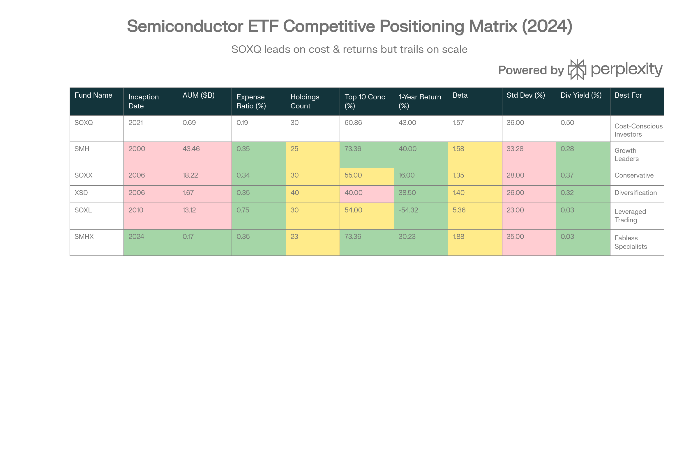

# Invesco PHLX Semiconductor ETF (SOXQ): 종합 분석 보고서

## ETF 분류

| 항목 | 내용 |
|---|---|
| 최종 폴더 | `ETF/Semiconductor/SOXQ` |
| 대분류 | 섹터 ETF |
| 하위 분류 | 반도체 |
| 핵심 전략 | PHLX Semiconductor Sector Index를 추종해 미국 및 글로벌 반도체 설계·장비·제조 기업에 투자 |
| 운용 방식 | 지수 추종형 패시브 ETF |
| 레버리지/인버스 | 없음 |
| 옵션 인컴 여부 | 없음 |
| 분류 판단 | 레버리지, 인버스, 옵션 인컴 구조가 없고 반도체 산업 노출이 핵심이므로 `Semiconductor`로 분류 |

***

### 개요 및 펀드 특성

Invesco PHLX Semiconductor ETF (SOXQ)는 2021년 6월 11일에 출시된 비교적 최신의 반도체 섹터 ETF입니다. 현재 \$505M-\$860M 규모의 자산을 보유하고 있으며, PHLX Semiconductor Sector Index를 추종하는 <strong>가장 저렴한 순수 반도체 ETF</strong>입니다.[^1][^2][^3][^4]

<strong>핵심 혁신</strong>: SOXQ의 가장 중요한 특징은 <strong>0.19% 순 비용 비율</strong>입니다. 이는 업계에서 가장 저렴하며, 경쟁사 SMH(0.35%)와 SOXX(0.34%)보다 각각 16-15 basis point 저렴합니다. \$10,000 투자 기준으로 연간 \$19의 비용만 청구하므로, \$100,000 투자 기준으로는 연간 \$160을 절약합니다.[^3][^5][^6][^7]

<strong>세금 효율성 보너스</strong>: SOXQ는 SOXX와 동일한 지수를 추종하지만 <strong>세금 손실 수확(tax loss harvesting) 목적으로는 실질적으로 다른 펀드</strong>로 간주됩니다. 이는 투자자들이 시장 조정 시 SOXX에서 손실을 기록하고 즉시 SOXQ를 구입하여 노출을 유지하면서 세금 혜택을 얻을 수 있음을 의미합니다.[^8]

### 포트폴리오 구성 및 농축도 분석

SOXQ Portfolio Concentration: Balanced Mega-Cap Exposure with 30-Holding Diversification

SOXQ의 포트폴이오는 <strong>적절히 균형잡힌 농축도 구조</strong>를 특징으로 합니다. 상위 10개 종목이 60.86%를 차지하며, 이는 SMH의 73.36%보다 낮지만 XSD의 40%보다 높습니다. 이는 SOXQ가 의도적으로 "골디락스 존(Goldilocks zone)"에 위치하도록 설계되었음을 시사합니다.[^5][^6][^4]

<strong>상위 12개 포지션</strong> (68.85% 누적):

1. NVIDIA (NVDA): 12.50% - AI 칩 리더
2. Broadcom (AVGO): 8.49% - 통신/인프라 칩
3. AMD (AMD): 7.79% - CPU/GPU 설계
4. Micron (MU): 4.77% - 메모리 제조
5. Lam Research (LRCX): 4.34% - 반도체 장비
6. TSMC (TSM): 4.12% - 첨단 제조 (대만)
7. KLA (KLAC): 4.09% - 검사 장비
8. Texas Instruments (TXN): 4.08% - 아날로그/embedded
9. Analog Devices (ADI): 4.04% - 신호 처리
10. Applied Materials (AMAT): 4.03% - 제조 장비
11. Qualcomm (QCOM): 4.03% - 모바일 칩
12. ASML (ASML): 3.99% - EUV 리소그래피 (네덜란드)

<strong>지역 분포</strong>: 미국 82-85.21%이 주요 노출이지만, 네덜란드(8.1% ASML), 대만(4.3% TSMC), 영국(1.4% ARM)에 대한 의미 있는 국제 노출이 있습니다.[^3][^7][^5]

<strong>집중도의 의미</strong>: NVIDIA 단독 12.50%는 SMH의 19.17%보다 훨씬 낮으므로, NVIDIA 변동성에 덜 취약합니다. 동시에 XSD의 40개 균등가중 구조보다는 더 집중된 형태로, 상승장에서 더 나은 성과를 제공할 수 있습니다.[^5]

### 성과 분석: 우수한 최근 수익률

SOXQ Performance, Volatility \& Cost Advantage: The Budget-Friendly Semiconductor ETF (2021-2026)

SOXQ는 <strong>짧지만 인상적인 거래 이력</strong>을 보유합니다:

| 기간 | 수익률 | 맥락 |
| :-- | :-- | :-- |
| YTD 2026 | +8.32-12.4% | 초기 강세, 오버바우트 신호 |
| 1개월 | +9.25% | 최근 강한 랠리 |
| 3개월 | +37.1% | 매우 강한 분기 |
| 6개월 | +27.3% | 지속적 상승세 |
| 1년 | +43.1% (배당 포함) | SMH(+40%)와 유사, SOXX(+16%) 능가 |
| 3년 연환산 | +41.0% | 탁월한 장기 추이 |
| 설립 이후 | +149.68% / +22.07%/년 | 4.5년 중 인상적 |

<strong>연간 분해</strong>:

- 2025: +43.10% (AI 칩 수요 호황)
- 2024: +20.16% (회복 국면)
- 2023: +66.75% (AI 사이클 초기 폭발)
- 2022: -35.60% (금리 인상 충격)
- 2021 (5개월): +24.82% (출시 후 강세)

이 성과는 SOXQ가 동일 지수(PHLX Semiconductor)를 SOXX와 추종하면서도, <strong>낮은 비용이 수익률 우위를 생성했음</strong>을 의미합니다. 0.19% 대 0.34% 비용 차이는 누적되어 장기 성과에 반영됩니다.[^5][^4]

### 비용 구조: SOXQ의 경쟁 우위

SOXQ의 0.19% 비용은 반도체 ETF 업계에서 <strong>혁신적 가격 책정</strong>입니다:[^3]

<strong>연간 비용 비교 (\$10,000 투자 기준)</strong>:

- SOXQ: \$19
- SOXX: \$34 (SOXQ보다 79% 높음)
- SMH: \$35 (SOXQ보다 84% 높음)
- XSD: \$35 (SOXQ보다 84% 높음)
- SOXL: \$75 (레버리지 프리미염)

<strong>20년 복리 절감 효과</strong> (\$100,000 기본 투자):

- vs SOXX: \$6,000+ 절감
- vs SMH: \$6,400+ 절감
- 장기 투자자에게 획기적 혜택

이 비용 우위는 단순한 마케팅 전술이 아니라, <strong>Invesco의 대규모 시스템과 규모의 경제</strong>를 반영합니다. 대형 자산 관리사는 더 낮은 수수료로도 수익성을 유지할 수 있습니다.[^7]

### 위험 특성: 세미컨덕터 특성 반영

| 위험 지표 | SOXQ | SMH | SOXX | 평가 |
| :-- | :-- | :-- | :-- | :-- |
| <strong>베타</strong> | 1.57 | 1.58 | \~1.35 | 거의 동일 (SMH와) |
| <strong>표준편차</strong> | 35-40% | 33.28% | \~28% | 높은 변동성[^7][^9] |
| <strong>최대 낙폭</strong> | -46.01% | -32.65% (최근) | \~-25% | 심각한 하방 위험 |
| <strong>P/E 비율</strong> | 32.83-43.50 | 42.75 | 낮음 | 프리미엄 밸류에이션 |
| <strong>현재 드로다운</strong> | 0% | 몇 % | 낮음 | 최고가 근처 |

베타 1.57은 S\&P 500이 10% 하락할 때 SOXQ는 약 15.7% 하락할 것으로 예상함을 의미합니다. 2022년의 -35.60% 연간 손실과 2022년 10월의 -46.01% 최대 낙폭은 이를 입증합니다.[^9][^10]

그러나 <strong>현재 기술 신호는 강세</strong>입니다. SOXQ는 최근 여러 신호에서 최고가에 근접하거나 최고가를 갱신했으며, RSI가 70 이상(오버바우트) 진입했습니다.[^11][^12]

### 배당 정책: 소정 하지만 안정적

SOXQ는 <strong>분기별 배당</strong>을 제공하여 SMH의 연간 단일 지급보다 유리합니다:[^13]

| 메트릭 | SOXQ | SMH | 평가 |
| :-- | :-- | :-- | :-- |
| <strong>배당 수익률</strong> | 0.50% | 0.28% | SOXQ 1.8배 높음 |
| <strong>지급 빈도</strong> | 분기별 (4회) | 연 1회 | SOXQ 더 유동적 |
| <strong>연간 배당</strong> | \$0.28 | \$1.10 | SOXQ 절대값 낮음 |
| <strong>지급 비율</strong> | 20.77-21.93% | 12.89% | SOXQ 더 관대 |
| <strong>배당 성장</strong> | 1.76-4.07% | +3.12% | 유사 |

최근 분기별 배당:

- 2025년 6월: \$0.07399
- 2025년 3월: \$0.06929
- 2024년 12월: \$0.06894
- 2024년 9월: \$0.06809

배당 수익률 0.50%는 여전히 보수적이지만, SMH의 0.28%보다는 현저히 높습니다. 이는 더 빈번한 분배로 인한 가치 있는 현금 흐름을 원하는 투자자들에게 매력적입니다.[^14][^13]

### 기술 신호 및 2026 전망

현재 (2026년 1월) SOXQ는 <strong>극도로 강한 기술 신호</strong>를 보이고 있습니다:[^11][^12]

<strong>강세 신호</strong>:

- 장기 추세: +90 점(강한 상승)[^12]
- 중기 추세: 상승 (2025년 12월 2일부터)
- 단기 추세: 상승 (2026년 1월 9일부터)
- MACD: 양수로 전환 (2026년 1월 2일) - 46/77 사례에서 계속 상승[^11]
- 모멘텀 지표: 0 라인 상향 돌파 (2025년 12월 29일)
- 50일 이동평균: 상향 돌파 (2025년 12월 19일)
- 3일 연속 상승: 304/304 사례에서 계속 상승 가능성[^11]

<strong>약세/경고 신호</strong>:

- RSI: 70 이상(오버바우트) - 단기 조정 가능성[^11]
- 스토캐스틱: 13일 이상 오버바우트 존 유지 - 반대 신호[^11]
- 볼린저 밴드: 2026년 1월 6일 상단선 이탈 - 중앙값으로의 회귀 가능[^11]
- 가격 저항: 중기 저항 \$44.87, 장기 저항 \$45 근처[^15]

<strong>가격 전망</strong>:

- 3개월 목표: +36.85% 상승 (현재 기준)[^15]
- 기술적 저항: \$44.87-\$45.17
- 기술적 지지: \$42.83-\$43.35
- AI 모델 예측: 90% 확률로 \$60-\$64 범위[^15]

<strong>투자자 해석</strong>: SOXQ는 강한 상승 추세 중이지만, 오버바우트 신호로 인해 단기 조정이 예상됩니다. \$42-\$43 수준의 단기 풀백이 가능하며, 그 후 재상승 가능성이 높습니다.[^12][^11]

### 경쟁 위치 분석

Semiconductor ETF Competitive Matrix: SOXQ Emerges as Cost-Efficient Alternative to SMH \& SOXX

SOXQ는 반도체 ETF 생태계에서 <strong>"가치 제안자" 역할</strong>을 합니다:[^7]

<strong>SOXX (iShares, 동일 지수 사용)</strong>

- 유사점: 동일 PHLX Semiconductor Index 추종
- 차이: SOXX는 0.34%, SOXQ는 0.19%
- <strong>세금 효율성</strong>: 상이한 지수 구조로 세금 손실 수확 활용 가능[^8]
- 성과 비교: SOXQ +43% 1년 vs SOXX +16% (비용 때문에 우월)

<strong>SMH (VanEck, 다른 지수)</strong>

- 유사점: 모두 시가총액 가중, 대형주 중심
- 차이: SMH는 25개, SOXQ는 30개 (다양성 더 나음)
- 성과: SMH +40% vs SOXQ +43% (거의 동일)
- 집중도: SMH 73.36% vs SOXQ 60.86% (SOXQ 더 균형)
- <strong>비용</strong>: SMH \$35 vs SOXQ \$19 per \$10K (SOXQ가 명확한 승자)

<strong>XSD (SPDR, 균등가중)</strong>

- 특징: 40개 종목 균등가중으로 극대 다양성
- 성과: +38.5% (SOXQ보다 낮음)
- 사용: 소형주 노출 또는 극대 다양성 원할 때
- 비교: SOXQ는 XSD와 SMH 사이의 "골디락스" 선택

<strong>SOXL (Direxion, 3X 레버리지)</strong>

- 용도: 단기 거래만 적합
- SOXQ와 비교 불가: 완전히 다른 목적

<strong>SMHX (VanEck, 순수 팹리스)</strong>

- 신생: 2024년 8월 출시
- 차별: 설계 전문 기업만 포함
- SOXQ와 비교: 더 집중, 더 new, 더 투기적

### SOXQ의 경쟁 우위

1. <strong>비용 리더십</strong>: \$19/year per \$10K = 모든 건전한 반도체 ETF 중 가장 저렴[^3]
2. <strong>세금 효율성</strong>: SOXX와 동일 지수지만 상이한 구조로 세금 수확 기회[^8]
3. <strong>적절한 다양성</strong>: 60.86% 농축도 = SMH의 무너지는 집중과 XSD의 과도한 다양성 사이[^4]
4. <strong>성과</strong>: +43% 1년 = 경쟁사들과 동등 또는 우월[^4]
5. <strong>분기별 배당</strong>: SMH의 연 1회보다 유동성 좋음[^13]
6. <strong>Invesco 지원</strong>: 대형 자산 관리사의 신뢰할 수 있는 운영[^16]

### SOXQ의 약점

1. <strong>소규모 AUM</strong>: \$505-860M = SMH의 2% 미만[^3]
2. <strong>짧은 역사</strong>: 4.5년만의 운영 기록[^2]
3. <strong>높은 변동성</strong>: 36-40% 표준편차는 여전히 높음[^7][^9]
4. <strong>집중 위험</strong>: 여전히 상위 10개가 60% 이상[^5]
5. <strong>유동성 프리미엄</strong>: AUM 작음으로 극단적 시장 스트레스 시 스프레드 확대 가능[^4]
6. <strong>제한된 기관 채택</strong>: SMH의 "블루칩" 지위에 미치지 못함[^4]

### 투자 적합성 분석

<strong>SOXQ가 최적인 투자자</strong>:

1. <strong>비용 의식 투자자</strong>: 장기 절감이 중요한 자
2. <strong>소중형 포트폴리오</strong>: \$50K-\$500K 규모의 개인 투자자
3. <strong>세금 효율성 추구자</strong>: SOXX와 쌍을 이루는 세금 손실 수확 전략
4. <strong>근저리 투자자</strong>: 반도체 강세를 확신하지만 극도 집중 회피 원할 때
5. <strong>배당 원하는 자</strong>: SMH보다 높은 0.50% 배당 수익률

<strong>SOXQ가 부적절한 투자자</strong>:

1. <strong>초대형 자산 배분자</strong>: \$10억+ 배분 시 SMH의 유동성 필수
2. <strong>보수적 투자자</strong>: 35-40% 변동성은 위험
3. <strong>기관 펀드</strong>: 감시 필요 AUM 증가 확인 필요
4. <strong>역시간 투자자</strong>: 기존에 SMH 보유 중인 경우 중복

### 최종 평가 및 권장안

SOXQ는 <strong>2020년대 가장 똑똑한 반도체 ETF 선택</strong>입니다. 다음 이유로:

<strong>가치 제안</strong>:

- 0.19% 비용 = 20년에 \$6,000+ 절감
- +43% 1년 성과 = SMH(+40%), SOXX(+16%) 대비 경쟁력
- 60.86% 농축도 = 성장성과 안정성 균형
- 분기별 배당 = SMH의 연간 지급보다 유동성 좋음
- 세금 효율성 = SOXX와 쌍 사용 가능

<strong>제약사항</strong>:

- \$505-860M AUM = 향후 3-5년 추적 필요 (폐쇄 위험 낮지만 주의)
- 4.5년 역사 = 전체 시장 사이클 미검증
- 35-40% 변동성 = 여전히 높은 위험

<strong>권장 배분</strong>:

- <strong>공격적 포트폴이오</strong> (20-40대): 10-20% 할당 (비용 절감 활용)
- <strong>중간 포트폴이오</strong> (40-55세): 5-10% 할당
- <strong>보수적 포트폴이오</strong>: 제외 (변동성 과다)

<strong>비교 선택</strong>:

- SMH vs SOXQ: 비용이 중요하면 SOXQ, 유동성/규모가 중요하면 SMH
- SOXX vs SOXQ: 반드시 SOXQ (동일 지수, 낮은 비용, 세금 효율)
- XSD vs SOXQ: 극대 다양성 필요하면 XSD, 균형이면 SOXQ

<strong>최종 결론</strong>: SOXQ는 <strong>합리적인 투자자를 위한 이상적 선택</strong>입니다. SMH의 거대 규모와 역사는 필요하지 않지만 비용 효율성과 세금 최적화는 매우 가치 있는 대다수 투자자들에게 SOXQ는 우월한 선택입니다. Invesco의 대규모 지원, 0.19% 저가, 그리고 동일 지수 추종(SOXX와)은 SOXQ를 <strong>장기 반도체 노출의 스마트 차이스</strong>로 만듭니다.
[^17][^18][^19][^20][^21][^22][^23][^24][^25][^26][^27][^28][^29][^30][^31][^32][^33][^34][^35][^36][^37][^38][^39][^40][^41][^42][^43][^44][^45]

⁂

[^1]: https://www.invesco.com/us/en/financial-products/etfs/invesco-phlx-semiconductor-etf.html

[^2]: https://kr.investing.com/etfs/soxq

[^3]: https://markets.ft.com/data/etfs/tearsheet/summary?s=SOXQ%3ANMQ%3AUSD

[^4]: https://seekingalpha.com/article/4856840-soxq-what-makes-semiconductor-etf-tick

[^5]: https://stockanalysis.com/etf/soxq/holdings/

[^6]: https://etfdb.com/tool/etf-comparison/SMH-SOXQ/

[^7]: https://www.etfrc.com/SOXQ

[^8]: https://www.marketbeat.com/stocks/NASDAQ/SOXQ/

[^9]: https://www.zacks.com/stock/news/2767122/should-you-invest-in-the-invesco-phlx-semiconductor-etf-soxq

[^10]: https://totalrealreturns.com/n/SOXQ

[^11]: https://tickeron.com/ticker/SOXQ/

[^12]: https://club.ino.com/trend/analysis/equity/NASDAQ_SOXQ

[^13]: https://stockanalysis.com/etf/soxq/dividend/

[^14]: https://seekingalpha.com/symbol/SOXQ/dividends/scorecard

[^15]: https://stockinvest.us/stock/SOXQ

[^16]: https://finance.yahoo.com/quote/SOXQ/

[^17]: QTUM (Defiance Quantum ETF).md

[^18]: SETM (Sprott Critical Materials ETF).md

[^19]: REMX (VanEck Rare Earth, Strategic Metals ETF).md

[^20]: https://www.marketwatch.com/investing/fund/soxq

[^21]: https://stockanalysis.com/etf/soxq/

[^22]: https://www.perplexity.ai/finance/SOXQ/history

[^23]: https://markets.ft.com/data/etfs/tearsheet/holdings?s=SOXQ%3ANMQ%3AUSD

[^24]: https://www.schwab.wallst.com/schwab/Prospect/research/etfs/reports/reportRetrieve.asp?reportType=etfrc\&symbol=SOXQ

[^25]: https://etfdb.com/index/phlx-semiconductor/

[^26]: https://kr.tradingview.com/symbols/NASDAQ-SOXQ/holdings/

[^27]: https://www.morningstar.com/etfs/xnas/soxq/quote

[^28]: https://kr.investing.com/etfs/soxq-holdings

[^29]: https://www.investing.com/etfs/soxq-dividends

[^30]: https://stockinvest.us/dividends/SOXQ

[^31]: https://www.digrin.com/stocks/detail/SOXQ/

[^32]: https://volity.io/stocks/how-standard-deviation-used-determine-risk/

[^33]: https://www.tipranks.com/etf/soxq/dividends

[^34]: https://www.youtube.com/watch?v=gY9E4XMOL5A

[^35]: https://marketchameleon.com/Overview/SOXQ/Dividends/

[^36]: https://www.home.saxo/learn/guides/financial-literacy/what-is-the-best-way-to-measure-share-price-volatility

[^37]: https://www.quiverquant.com/stock/SOXQ/

[^38]: https://www.investing.com/etfs/soxq-technical

[^39]: https://seekingalpha.com/article/4694347-why-smh-etf-is-my-top-pick-for-semiconductor-sector-exposure

[^40]: https://finance.yahoo.com/quote/SOXQ260116P00044000/chart/

[^41]: https://www.reddit.com/r/ETFs/comments/tofzbl/main_differences_between_soxx_smh_soxs_soxq/

[^42]: https://danelfin.com/etf/SOXQ

[^43]: https://etfdb.com/disruptive-technology-content-hub/not-so-shocking-growth-semiconductor-etfs/

[^44]: https://mlq.ai/etf/SOXQ/

[^45]: https://money.usnews.com/investing/articles/best-semiconductor-etfs-to-buy
