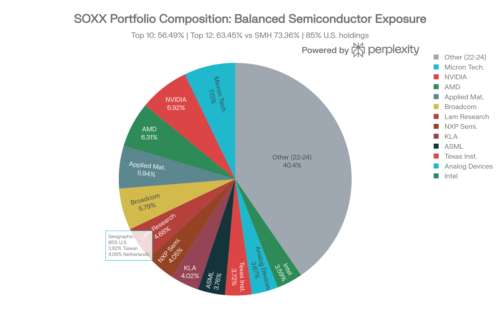
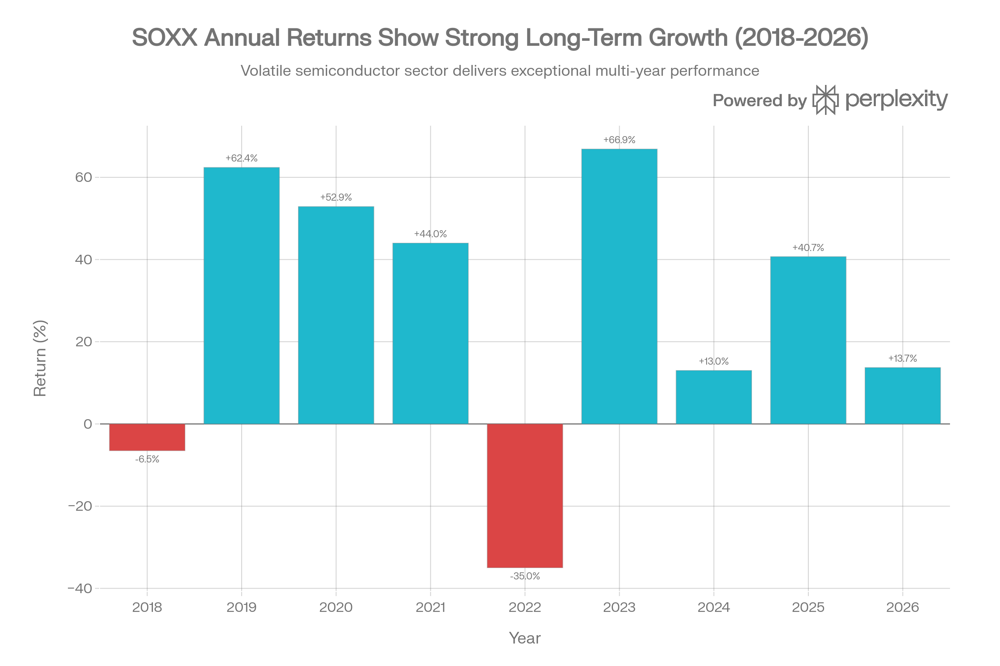
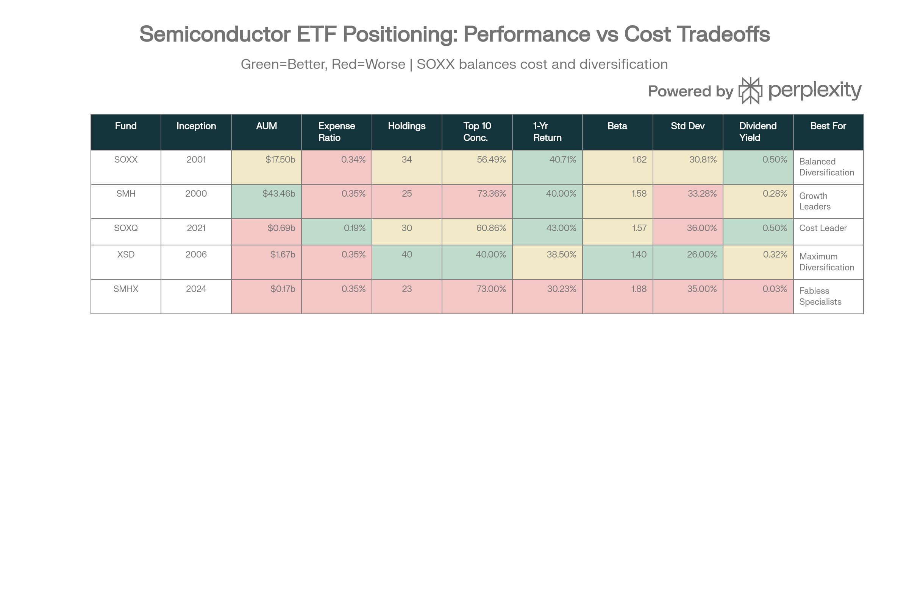

# iShares PHLX Semiconductor ETF (SOXX): 종합 분석 보고서

## ETF 분류

| 항목 | 내용 |
|---|---|
| 최종 폴더 | `ETF/Semiconductor/SOXX` |
| 대분류 | 섹터 ETF |
| 하위 분류 | 반도체 |
| 핵심 전략 | ICE Semiconductor Index를 추종해 미국 상장 반도체 설계·제조·장비 기업에 투자 |
| 운용 방식 | 지수 추종형 패시브 ETF |
| 레버리지/인버스 | 없음 |
| 옵션 인컴 여부 | 없음 |
| 분류 판단 | 레버리지, 인버스, 옵션 인컴 구조가 없고 반도체 산업 노출이 핵심이므로 `Semiconductor`로 분류 |

***

### 개요 및 펀드 특성

iShares PHLX Semiconductor ETF (SOXX)는 BlackRock의 iShares 브랜드 하에 2001년 7월 10일 출시되어 **가장 오래되고 검증된 순수 반도체 섹터 ETF**입니다. 현재 \$17.5-20.2B의 자산을 보유하고 있으며, ICE Semiconductor Index를 추종하여 미국 상장 반도체 회사 34-36개에 투자합니다.[^1][^2][^3][^4]

**핵심 강점**: SOXX는 **"골디락스 존" 위치**를 점하고 있습니다 — SMH의 집중된 25개 종목과 XSD의 분산된 40개 등가중 사이에 정확히 위치하여, 성장성과 안정성 사이의 이상적 균형을 제공합니다.[^5][^6]

**자산관리사의 신뢰도**: BlackRock은 세계 최대 자산관리사로서 SOXX에 기관투자자급 인프라와 운영 우수성을 제공합니다.[^2][^4]

### 포트폴리오 구성 및 집중도 분석

SOXX Portfolio Composition: Well-Diversified Semiconductor Exposure with Balanced Mega-Cap Weighting

SOXX의 포트폴리오는 **적절히 균형잡힌 구조**를 특징으로 합니다. 상위 10개 종목이 56.49%를 차지하며, 이는 SMH의 73.36%보다 훨씬 낮지만 XSD의 40%보다 높습니다. 이는 의도적으로 설계된 "중간 경로"입니다.[^3][^5][^6]

**상위 12개 포지션** (63.45% 누적):

1. Micron Technology (MU): 7.70% - 메모리 칩 제조
2. NVIDIA (NVDA): 7.47% - AI GPU 설계 리더
3. AMD (AMD): 6.82% - CPU/GPU 경쟁사
4. Applied Materials (AMAT): 6.41% - 제조 장비
5. Broadcom (AVGO): 6.25% - 통신 인프라 칩
6. Lam Research (LRCX): 5.05% - 에칭 장비
7. NXP Semiconductors (NXPI): 4.37% - 자동화/IoT 칩
8. KLA (KLAC): 4.34% - 검사 장비
9. ASML (ASML): 4.06% - 극자외선 리소그래피 (네덜란드)
10. Texas Instruments (TXN): 4.02% - 아날로그 칩
11. Analog Devices (ADI): 3.96% - 신호 처리
12. Intel (INTC): 3.88% - CPU/제조

**농축도의 의미**: SOXX는 NVIDIA 단독 7.47%로 SMH의 19.17%보다 훨씬 낮은 집중도를 보입니다. 동시에, 상위 3개 종목(MU, NVDA, AMD)이 21.99%로 적절한 가중치를 유지합니다.[^7][^3]

**지역 다양성**: 미국 중심(85%)이지만 TSMC(3.82%), ASML(4.06%)을 통해 대만과 네덜란드 노출도 제공합니다. 이는 글로벌 반도체 가치사슬에 균형잡힌 접근을 제공하면서도 지정학적 위험을 일부 분산시킵니다.[^6][^3][^7]

### 성과 분석: 우수한 장기 기록

SOXX Long-Term Performance \& Risk Profile: The Balanced Semiconductor Choice (2018-2026)

SOXX의 성과는 **우수한 장기 기록과 건강한 사이클 관리**를 보여줍니다:

| 기간 | 수익률 | 맥락 |
| :-- | :-- | :-- |
| **2025** | +40.71% | AI 칩 수요 강세[^8] |
| **2024** | +12.97% | 온건한 회복[^9] |
| **2023** | +66.90% | AI 사이클 초기 폭발[^9] |
| **2022** | -35.03% | 금리 인상, 최악의 해[^9] |
| **2021** | +44.00% | COVID 회복[^9] |
| **2020** | +52.90% | 팬데믹 데이터센터 부스트[^9] |
| **2019** | +62.40% | 5G 사이클 초기[^9] |

**다중 기간 수익률**:

- 1개월: +1.54-1.64%
- 3개월: +11.17-11.29%
- 6개월: +26.57-26.82%
- 1년: +40.71-40.73%
- 3년 연환산: +38.44-38.98%
- 5년 연환산: +19.94-20.44%
- 10년 연환산: +27.28-27.88%
- **설립 이후**: +1,584.89% 누적[^1][^4]

이는 **27.88% 연환산 10년 수익률**을 의미하며, 이는 탁월한 장기 성과입니다. 동시에, 2022년의 -35% 손실은 반도체 섹터의 사이클적 특성을 상기시킵니다.[^9][^4]

### 비용 구조: 경쟁력 있는 0.34%

SOXX의 0.34% 순 비용은 업계에서 **경쟁력 있는 수준**입니다:[^1]

| 펀드 | 비용 | 연간 (\$10K) | 차이 |
| :-- | :-- | :-- | :-- |
| SOXQ | 0.19% | \$19 | SOXX보다 \$15 저렴[^3] |
| SOXX | 0.34% | \$34 | 기준선 |
| SMH | 0.35% | \$35 | SOXX보다 1bp 비쌈[^3] |
| XSD | 0.35% | \$35 | SOXX보다 1bp 비쌈[^5] |

0.34% 비용은 충분히 저렴하며, SOXQ를 제외한 모든 경쟁사와 동등하거나 낮습니다. \$100,000 투자 기준으로 SOXQ 대비 연간 \$150 더 비싸지만, SOXX의 훨씬 큰 AUM(\$17.5B vs \$0.69B)과 더 오래된 역사를 고려하면 합리적 거래입니다.[^3][^4][^1]

### 위험 특성: 높은 변동성, 관리 가능한 수준

| 위험 지표 | SOXX | 비교 | 평가 |
| :-- | :-- | :-- | :-- |
| **베타** | 1.48-1.76 | SMH: 1.58, XSD: 1.40 | 시장보다 60-76% 변동성 높음[^4][^10] |
| **표준편차** | 26.71-34.90% | SMH: 33.28%, XSD: 26% | 높지만 관리 가능[^4][^6] |
| **최대 낙폭** | -45.76% | SMH: -32.65% (최근) | 역사적으로 심각한 조정[^10][^6] |
| **P/E 비율** | 44.49 | SMH: 42.75 | 프리미엄 밸류에이션[^4] |
| **현재 상황** | Near all-time highs | 약간 오버바우트 | 단기 조정 가능[^11][^12] |

베타 1.62는 S\&P 500이 -10% 하락할 때 SOXX는 약 -16.2% 하락할 것으로 예상함을 의미합니다. 2022년의 -35% 손실은 이를 입증했지만, 전체 반도체 섹터(-35%)에 비해 SOXX는 동등한 수준의 손실을 입었습니다.[^4][^6]

**현재 기술 신호**: SOXX는 1월 2일 MACD가 양수로 전환되고, 모멘텀 지표가 0 라인 상향 돌파되었습니다. 그러나 오버바우트 신호도 있어 단기 조정 가능성이 있습니다.[^11][^12]

### 배당 정책: SMH보다 우수

SOXX의 배당은 **SMH의 2배 수익률**을 제공합니다:[^13]

| 메트릭 | SOXX | SMH | 차이 |
| :-- | :-- | :-- | :-- |
| **배당 수익률** | 0.48-0.57% | 0.28% | SOXX가 2배 높음[^13][^13] |
| **연간 배당** | \$1.64-1.72 | \$1.10 | SOXX가 50% 높음[^13][^13] |
| **지급 빈도** | 분기별 (4회) | 연 1회 | SOXX가 더 유동적[^13][^13] |
| **최근 분기별**: |  |  |  |
| Q4 2025 (Dec) | \$0.436 | 해당 없음 |  |
| Q3 2025 (Sep) | \$0.541 | 해당 없음 |  |
| Q2 2025 (Jun) | \$0.483 | 해당 없음 |  |
| Q1 2025 (Mar) | \$0.261 | 해당 없음 |  |

분기별 배당은 정기적 현금 흐름을 원하는 투자자들에게 유리하며, 0.48-0.57% 수익률은 여전히 제한적이지만 성장 주식으로서 이해할 수 있습니다.[^14][^13]

### 기술적 신호 및 2026 전망

현재(2026년 1월) SOXX는 **강한 기술적 상승 추세 중이면서도 약간 오버바우트**입니다:[^11][^12]

**강세 신호**:

- MACD: 양수로 전환 (1월 2일)[^12]
- 모멘텀: 0 라인 상향 돌파 (12월 29일) - 84개 과거 사례에서 계속 상승[^12]
- 이동평균: 강한 상승 구조 유지[^11]
- 기술적 강점: 상승 추세 가속화[^11]

**약세 신호**:

- Aroon 지표: 12월 3일 하향 추세 진입 (하락 신호)[^12]
- 오버바우트: 모멘텀 지표가 오버바우트 존[^11]
- 저항: \$344.47 (1 표준편차 상향)
- 지지: \$329.97 (1 표준편차 하향)

**해석**: SOXX는 강한 상승세 중이지만, 단기적으로 \$330-\$335 수준의 풀백이 가능하며, 그 후 재상승할 가능성이 높습니다.[^12][^11]

### 경쟁 위치: "골디락스" 선택

Semiconductor ETF Competitive Matrix: SOXX's Strategic Position Between Concentration and Diversification

SOXX는 반도체 ETF 생태계에서 **전략적 중간 위치**를 점하고 있습니다:

**SMH와의 비교**:

- **차이점**: SMH는 25개 종목으로 더 집중 (73.36% vs 56.49%), NVIDIA 과다 노출 (19.17% vs 7.47%)
- **성능**: 거의 동일 (+40% vs +40.71%)
- **비용**: SOXX가 1bp 저렴 (0.34% vs 0.35%)
- **배당**: SOXX가 2배 높음 (0.50% vs 0.28%)
- **선택**: SMH가 원할 때: 극대 성장, AUM 거대성 필요. SOXX가 원할 때: 평형, 배당 우선[^5][^6]

**SOXQ와의 비교**:

- **비용**: SOXQ가 훨씬 저렴 (0.19% vs 0.34%)
- **AUM**: SOXX가 25배 크다 (\$17.5B vs \$0.69B)
- **역사**: SOXX가 훨씬 오래됨 (2001 vs 2021)
- **동일 지수**: 동일 ICE Index 추종, 세금 손실 수확 기회
- **선택**: SOXQ가 원할 때: 극저 비용, 세금 최적화. SOXX가 원할 때: 안정성, 자산 규모[^1][^3]

**XSD와의 비교**:

- **다양성**: XSD가 더 분산 (40개 등가중 vs 34개 시가총액)
- **변동성**: SOXX가 더 높음 (30.81% vs 26%)
- **성능**: SOXX가 더 좋음 (+40.71% vs +38.5%)
- **선택**: XSD가 원할 때: 극대 분산, 낮은 변동성. SOXX가 원할 때: 성장, 실제 시장 가중치[^6][^5]

### 산업 기본요소: 구조적 강점

SOXX의 우수한 성과는 반도체 섹터의 **견고한 기본요소**로 뒷받침됩니다:[^15][^16]

**상승 동인**:

1. **AI 칩 수요**: 감소 신호 없음, NVIDIA/TSMC 사이클 초기
2. **데이터센터 확장**: Meta, Microsoft, Google의 AI 인프라 투자 계속
3. **자동화 추세**: 로봇, ADAS, 산업 4.0이 칩 수요 증가
4. **CHIPS Act**: 미국 국내 반도체 제조 지원
5. **5G/6G 배포**: 장기 칩 수요 증가
6. **엣지 컴퓨팅**: IoT, 모바일, 자율주행의 분산 처리 칩 필요

**위험 요인**:

1. **지정학적 긴장**: U.S.-China 칩 전쟁, TSMC 대만 위험
2. **밸류에이션 위험**: P/E 44.49는 완벽한 실행을 가정
3. **사이클 위험**: 역사적으로 -35% 조정 가능
4. **AI 보정 위험**: AI 칩 수요가 둔화되면 반도체 주기 단축
5. **환율 위험**: 국제 노출(TSMC, ASML) 환율 변동 영향

### 투자 적합성 분석

**SOXX가 최적인 투자자**:

1. **균형 추구자**: SMH의 집중과 XSD의 과다 분산 모두 회피
2. **장기 성장 투자자**: 10년+ 기간으로 사이클 완주 가능
3. **배당 고려 투자자**: 0.50% 수익률은 성장 주식으로서 적절
4. **기관 투자자**: \$17.5B AUM으로 거대 배분 가능
5. **세금 효율 추구자**: SOXQ와 쌍 거래로 세금 손실 수확 가능

**SOXX가 부적절한 투자자**:

1. **보수적 투자자**: 30% 변동성과 -45% 낙폭은 부담
2. **단기 거래자**: 기본요소는 장기 지향적
3. **소액 투자자**: \$1,000 미만은 SOXQ의 0.19% ER이 유리
4. **기존 NVIDIA/TSMC 보유자**: 이미 상당 노출 있을 수 있음

### 2026 투자 권장안

**강력 매수**: \$310-320 범위 (약 10% 풀백)
**매수**: \$320-335 범위 (중간 풀백)
**보유**: \$335-350 범위 (현재, 조심스럽게)
**이익 실현**: \$350 이상 (수익의 20-30%)
**대기**: \$250-280 범위 (본격적 조정 중)

### 최종 평가: "골디락스 선택"

SOXX는 **반도체 노출이 필요한 대부분의 투자자에게 이상적 선택**입니다:

**강점**:

- 34개 종목으로 적절한 다양성 (SMH의 과다 집중과 XSD의 과다 분산 사이)
- 27.88% 10년 연환산 수익률
- 0.34% 경쟁력 있는 비용
- 0.50% 배당으로 SMH의 2배
- \$17.5B AUM으로 기관 유동성
- 2001년 이후 검증된 25년 역사

**약점**:

- P/E 44.49로 프리미엄 밸류에이션
- 30% 변동성은 여전히 높음
- -45% 최대 낙폭 위험
- 단 분기별 배당도 여전히 제한적

**결론**: SOXX는 **"평균적으로 훌륭한" 선택**입니다. SMH처럼 집중된 성장이나 XSD처럼 극대 안정성을 제공하지 않지만, 둘의 장점을 결합합니다. 특히 중간 규모 투자자(\$50K-\$500K)에게, 세금 효율성(SOXQ와 쌍)을 추구하는 투자자들에게 강력한 권장입니다.
[^17][^18][^19][^20][^21][^22][^23][^24][^25][^26][^27][^28][^29][^30][^31][^32]

⁂

[^1]: https://www.ishares.com/us/products/239705/ishares-phlx-semiconductor-etf

[^2]: https://www.blackrock.com/us/financial-professionals/products/239705/ishares-phlx-semiconductor-etf

[^3]: https://stockanalysis.com/etf/soxx/holdings/

[^4]: https://www.blackrock.com/us/individual/products/239705/ishares-semiconductor-etf

[^5]: https://etfdb.com/tool/etf-comparison/SMH-SOXX/

[^6]: https://finviz.com/news/180597/is-ishares-semiconductor-etf-soxx-a-strong-etf-right-now

[^7]: https://www.schwab.wallst.com/schwab/Prospect/research/etfs/schwabETF/index.asp?type=holdings\&symbol=SOXX

[^8]: https://totalrealreturns.com/n/SOXX

[^9]: https://www.ishares.com/ch/professionals/en/products/239705/ishares-phlx-semiconductor-etf

[^10]: https://www.ainvest.com/news/soxx-xlk-historical-volatility-test-tech-exposure-2601/

[^11]: https://tradewithmaya.com/trade/SOXX

[^12]: https://tickeron.com/ticker/SOXX/forecasts-predictions/

[^13]: https://www.slickcharts.com/symbol/SOXX/dividend

[^14]: https://stockinvest.us/dividends/SOXX

[^15]: https://seekingalpha.com/article/4857758-soxx-chinas-desire-for-self-sufficiency-presents-risk

[^16]: https://seekingalpha.com/article/4856747-soxx-etf-trillion-dollar-market-rally-not-over-yet

[^17]: QTUM (Defiance Quantum ETF).md

[^18]: SETM (Sprott Critical Materials ETF).md

[^19]: REMX (VanEck Rare Earth, Strategic Metals ETF).md

[^20]: https://kr.investing.com/etfs/ishares-phlx-sox-semiconductor

[^21]: https://finance.yahoo.com/quote/SOXX/

[^22]: https://www.zacks.com/funds/etf/SOXX/profile

[^23]: https://markets.ft.com/data/etfs/tearsheet/summary?s=SOXX%3ANMQ%3AUSD

[^24]: https://finance.yahoo.com/quote/SOXX/holdings/

[^25]: https://www.marketwatch.com/investing/fund/soxx

[^26]: https://www.morningstar.com/etfs/xnas/soxx/portfolio

[^27]: https://www.morningstar.com/etfs/xnas/soxx/risk

[^28]: https://marketchameleon.com/Overview/SOXX/Summary/

[^29]: https://www.etfaction.com/daily-etf-flow-recap-equities-surge-with-9-25b-digital-assets-see-red/

[^30]: https://www.aol.com/finance/soxx-delivered-larger-gains-xlk-201301933.html

[^31]: https://www.tradingview.com/symbols/NASDAQ-SOXX/

[^32]: https://www.etfrc.com/SOXX
