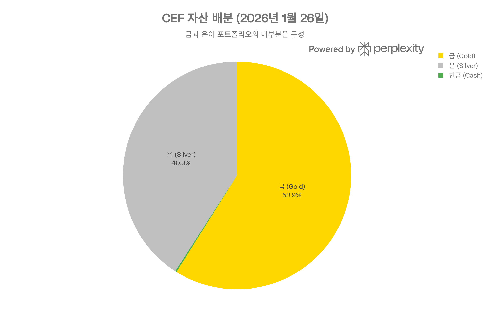
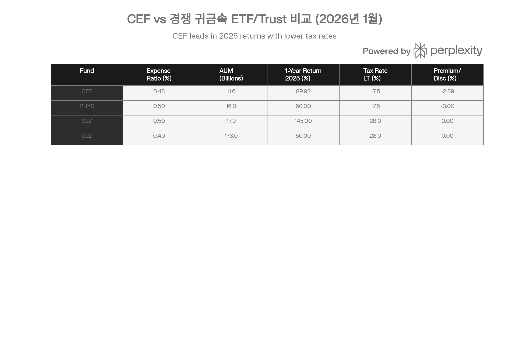
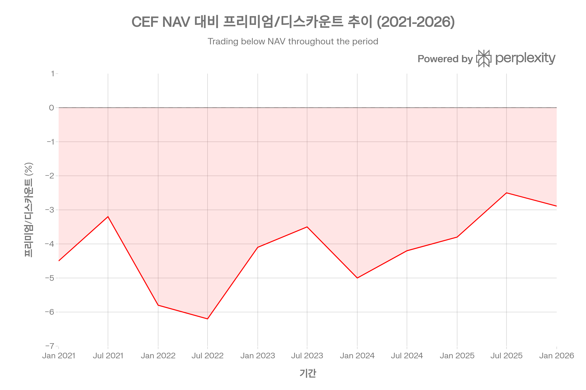

## 분류 근거

CEF는 금과 은을 동시에 물리적으로 보유하는 이중 귀금속 신탁으로, 은 단일 상품은 아니다. 다만 포트폴리오 내 은 비중이 약 40.9%로 상당하고 이번에 함께 정리하는 은 관련 ETF 묶음의 맥락에 부합해 `Silver` 폴더에 포함했다 — 다만 본문에 금 비중이 약 59%로 더 크다는 점을 명시해 오해를 방지한다.

## 요약

Sprott Physical Gold and Silver Trust (CEF)는 물리적 금괴와 은괴를 직접 보유하는 폐쇄형 투자신탁(closed-end trust)으로, 투자자에게 단일 상품으로 금과 은에 동시 익스포저를 제공합니다. 2026년 1월 26일 기준, CEF는 NAV \$60.60, 시장가 \$58.85로 -2.89% 디스카운트에 거래되고 있으며, 총 NAV는 \$116억에 달합니다.[^1][^2][^3]

2025년 CEF는 89.92%의 연간 수익률을 기록하여 주요 귀금속 투자 상품 중 최고 성과를 달성했습니다. 이는 은 가격의 역사적 급등(+146\~161%)과 금 가격 상승(+50% 이상)이 결합된 결과이며, 포트폴리오 내 은 비중이 과거 33%에서 40.9%로 증가한 것이 수익률을 증폭시켰습니다.[^4][^5][^6][^7][^8][^1]

CEF의 핵심 가치 제안은 세 가지입니다: (1) **이중 귀금속 익스포저** - 금+은 혼합 포트폴리오로 다각화와 단순성 제공, (2) **세금 효율성** - 미국 투자자가 QEF(Qualified Electing Fund) 선택 시 장기 자본이득 세율(15-20%) 적용으로 GLD/SLV 대비 8-13%p 세금 절감, (3) **물리적 보관 투명성** - Royal Canadian Mint 금고에 100% 물리적 보유, 연간 KPMG 외부 감사로 검증.[^9][^10][^11][^1]

그러나 투자자는 PFIC 구조로 인한 세금 신고 복잡성(Form 8621 연간 제출), 폐쇄형 펀드 특유의 디스카운트/프리미엄 변동성, GLD/SLV 대비 낮은 유동성, 그리고 높은 물리적 인출 장벽(최소 100,000 units, 약 \$590만 상당)을 고려해야 합니다.[^12][^13][^14][^15]

## 상품 구조 및 기본 정보

### 펀드 개요

**설립 배경:**
CEF의 전신인 Central Fund of Canada는 1961년 설립되어 50년 이상 물리적 금과 은을 보유해 온 세계에서 가장 오래된 귀금속 투자 펀드 중 하나입니다. 2018년 1월 16일 Sprott Asset Management가 이를 인수하여 Sprott Physical Gold and Silver Trust로 재출범했습니다. Sprott은 캐나다 토론토 기반의 귀금속 및 에너지 자원 전문 자산운용사로, 물리적 귀금속 투자 분야에서 세계 최고 수준의 전문성을 보유하고 있습니다.[^1][^4][^2]

**기본 정보 (2026년 1월 26일 기준):**[^16][^2][^5][^1]

| 항목 | 세부 사항 |
| :-- | :-- |
| **티커** | CEF (NYSE Arca), CEF.U (TSX USD), CEF (TSX CAD) |
| **펀드 유형** | Closed-End Trust (폐쇄형 투자신탁) |
| **설립일** | 1961년 (원 Central Fund), 2018년 1월 16일 (Sprott 인수) |
| **발행사** | Sprott Physical Gold and Silver Trust |
| **운용사** | Sprott Asset Management LP |
| **수탁기관** | RBC Investor Services |
| **관리인** | TSX Trust Company |
| **감사인** | KPMG LLP |
| **보관 기관** | Royal Canadian Mint (캐나다 왕립 조폐국) |
| **ISIN** | CA85207K1093 (USD), CA85207K2075 (CAD) |
| **총 NAV** | \$11.60B (116억 달러) |
| **발행 주식 수** | 190,937,369 units |
| **Management Expense Ratio** | 0.48% (연간) |

### 투자 목표 및 전략

**목표:**
CEF는 장기적으로 담보 설정되지 않은(unencumbered), 완전 할당된(fully allocated) 물리적 금괴와 은괴를 보유하여, 투자자에게 물리적 귀금속 직접 투자의 불편함 없이 안전하고 편리하며 상장된 투자 대안을 제공합니다.[^1][^2][^3]

**전략:**

- **물리적 보유만**: 금/은 증서, ETN, 선물, 옵션, 채권 등 파생상품은 일체 보유하지 않음[^11]
- **London Good Delivery 표준**: 금 400 oz bars (999.99 순도), 은 1,000 oz bars 보유[^2][^6]
- **비활동적 운용**: 금/은 비율 조정 외 거래 없음 (turnover 0.00%)[^17]
- **레버리지 없음**: 차입, 공매도, 담보 제공 일체 금지[^11]

### 현재 포트폴리오 구성 (2026년 1월 26일)

CEF의 현재 자산 배분. 2025년 은 가격 급등으로 인해 은 비중이 과거 33%에서 40.9%로 증가했습니다.

| 자산 유형 | 보유량 | 시장가치 | 비중 |
| :-- | :-- | :-- | :-- |
| **금 (Gold Bars 400 Oz)** | 1,235,974 oz | \$6.83B | **58.9%** |
| **은 (Silver Bars 1000 Oz)** | 51,767,761 oz | \$4.75B | **40.9%** |
| **현금 및 등가물** | - | \$23M | 0.2% |
| **총 자산** | - | \$11.60B | 100% |

시장가치는 앞서 언급한 총 NAV \$11.60B와 위 비중(58.9%/40.9%/0.2%)을 기준으로 환산한 값이다. 원출처의 자산별 달러 금액(금 \$5.34B, 은 \$3.71B)은 총합이 \$9.08B로 총 NAV \$11.60B와 맞지 않아, 비중을 기준으로 재계산했다.

**단위당 보유량 (100 units 기준):**[^9]

- **금**: 0.65 oz per 100 units (약 \$2,808 상당)
- **은**: 27.12 oz per 100 units (약 \$1,946 상당)

**금-은 비율 변화 추이:**[^18][^5][^19]

- **과거 (2023-2024)**: 약 67% 금 / 33% 은 (2:1 비율)
- **2024년 9월**: 67.06% 금 / 32.86% 은
- **2026년 1월**: 58.9% 금 / 40.9% 은 (약 3:2 비율)

**비율 변화 원인:**
CEF는 금-은 비율을 **고정하지 않고** 가격 변동에 따라 자연스럽게 변동하도록 합니다. 2025년 은 가격이 금보다 3배 이상 빠르게 상승(은 +146\~161% vs 금 +50% 이상)하면서 포트폴리오 내 은의 시장가치 비중이 증가했습니다. 이는 의도적 리밸런싱이 아닌 가격 효과입니다. CEF는 매년 1-2회 소규모 리밸런싱을 통해 대략적 균형을 유지하며, 이때 소액 배당(통상 연 1센트/주)을 지급합니다.[^4][^14][^20][^7][^8][^18]

## 성과 분석

### 2025년: 역사적 랠리

2025년은 CEF 역사상 가장 성공적인 해였습니다. 금과 은 가격의 동시 급등으로 CEF는 거의 90% 수익률을 달성했습니다.[^1][^4]

**총 수익률 (% US\$, 2025년 12월 31일 기준):**[^2][^1]

| 기간 | CEF (NAV) | CEF (시장가) |
| :-- | :-- | :-- |
| 1개월 (2025년 12월)* | +10.78% | - |
| YTD/1년 (2025) | **+89.92%** | - |
| 3년 (연율화) | +36.66% | - |
| 5년 (연율화) | +18.93% | - |
| 설립 이후 (연율화) | +16.60% | - |

**2026년 1월 모멘텀 지속:**

- **YTD (1월 26일 기준)**: NAV +27.65%, 시장가 +12.56%[^1]
- **월간 성과**: 1월 한 달간 NAV는 \$47.46에서 \$60.60으로 +27.7% 급등[^1]

### 역사적 성과 비교 (연간)

[^1][^2]

| 연도 | CEF (NAV) | CEF (시장가) | 주요 동인 |
| :-- | :-- | :-- | :-- |
| **2025** | **+89.92%** | - | 은 +146\~161%, 금 +50% 급등 |
| 2024 | +28.27% (9월 YTD) | +27.89% | 금 강세 시작 |
| 2023 | +7.74% | +6.80% | 금리 인상 마무리 |
| 2022 | +0.28% | +1.07% | 강한 달러, 금리 인상 |
| 2021 | -7.03% | -8.32% | 인플레이션 우려 초기 |
| 2020 | **+31.33%** | +31.99% | COVID-19 불확실성, 양적완화 |
| 2019 | +16.54% | +16.91% | 무역 전쟁, 금리 인하 |

**핵심 인사이트:**
CEF는 **추세 시장**에서 우수한 성과를 보입니다. 2020년과 2025년처럼 금/은이 강하게 상승할 때 연 30-90% 수익을 달성하지만, 2021-2022년처럼 금리 인상 및 강한 달러 환경에서는 횡보하거나 소폭 하락합니다. 이는 CEF가 레버리지 없이 순수하게 금/은 가격 변동을 추종하기 때문입니다.

### 경쟁 상품 대비 성과

**10년 연율화 수익률 비교:**[^21]

- **CEF**: +11.62%
- **PHYS (Sprott Physical Gold Trust)**: +10.64%
- **SLV (추정)**: \~10-11%
- **GLD (추정)**: \~9-10%

**2025년 단일연도 성과:**

- **CEF**: +89.92%[^1]
- **SLV**: \~+145% (은 전용)[^22]
- **PHYS**: \~+50-60% (금 전용, 추정)[^4]
- **GLD**: \~+50% (금 전용, 추정)[^4]

**해석:**
2025년 CEF는 SLV(은 전용)에는 미치지 못했지만, PHYS/GLD(금 전용)를 크게 앞섰습니다. 이는 CEF의 **금-은 혼합 구조**가 은 강세 시 금 전용 펀드보다 유리하지만, 은 전용 펀드보다는 불리함을 보여줍니다. 그러나 장기적으로(10년) CEF는 PHYS보다 1%p 높은 연율화 수익률을 기록하여, 금-은 혼합이 변동성 완화와 수익률 향상을 동시에 제공함을 입증했습니다.[^21]

CEF와 주요 귀금속 투자 상품 비교. CEF는 2025년 최고 수익률과 세금 효율성을 제공하지만, GLD가 가장 큰 AUM과 유동성을 보유합니다.

## 프리미엄/디스카운트 역학: 폐쇄형 펀드의 핵심 특성

### 현재 가격 및 NAV

**2026년 1월 26일 기준:**[^1]

- **NAV (순자산가치)**: \$60.60 (+\$0.29, +0.49%)
- **시장가**: \$58.85
- **프리미엄/디스카운트**: **-2.89%** (디스카운트)
- **52주 범위**: \$31.88 \~ \$61.33 (시장가 기준)

### 디스카운트/프리미엄 개념

폐쇄형 펀드(CEF)는 ETF와 달리 **고정된 주식 수**를 발행하며, 주식 생성/소각 메커니즘(Authorized Participant system)이 없습니다. 따라서 CEF의 시장가는 순전히 공급-수요에 의해 결정되며, 펀드의 실제 순자산가치(NAV)와 괴리가 발생할 수 있습니다.[^23][^24][^25]

**디스카운트 (Discount)**: 시장가 < NAV (현재 CEF 상태)
**프리미엄 (Premium)**: 시장가 > NAV

**계산:**
프리미엄/디스카운트(%) = [(시장가 - NAV) / NAV] × 100
CEF 예시: [(\$58.85 - \$60.60) / \$60.60] × 100 = **-2.89%**

### 디스카운트의 의미와 투자 기회

**장점:**[^26][^27]

1. **가치 매수 기회**: 투자자는 \$60.60 가치의 금/은을 \$58.85에 매수 (\$1.75 할인)
2. **디스카운트 축소 시 추가 수익**: 디스카운트가 0%로 수렴하면 NAV 수익률 외 +2.97% 추가 이익 발생
3. **높은 안전 마진**: NAV가 10% 하락해도 디스카운트 축소로 시장가는 5% 하락에 그칠 수 있음

**리스크:**[^27][^26]

1. **디스카운트 확대 가능성**: 시장 심리 악화 시 -5\~-10%로 확대 가능
2. **유동성 프리미엄**: 디스카운트는 낮은 유동성을 반영할 수 있음
3. **영구 디스카운트 가능성**: 구조적 요인으로 디스카운트가 지속될 수 있음

### 역사적 프리미엄/디스카운트 추이

**5년 범위:**[^28]

- **최대 디스카운트**: -6.42%
- **최소 디스카운트/최대 프리미엄**: +1.39%
- **평균**: 약 -3% \~ -5%

CEF의 NAV 대비 프리미엄/디스카운트 추이. 현재 -2.89%는 5년 평균보다 약간 좁은 수준으로, 2025년 금/은 급등으로 디스카운트가 축소되었습니다.

**2026년 1월 평가:**
현재 -2.89% 디스카운트는 역사적 평균(-3\~-5%) 대비 **약간 좁은(narrower) 수준**입니다. 2025년 금/은 급등으로 투자자 수요가 증가하면서 디스카운트가 축소되었습니다. 그러나 프리미엄(+)으로 전환될 가능성은 낮으며, 향후 시장 조정 시 -4\~-5%로 다시 확대될 수 있습니다.[^1][^28]

### 디스카운트 발생 원인

1. **폐쇄형 펀드 구조**: 고정 주식 수로 인한 공급-수요 불균형[^23][^24]
2. **세금 복잡성**: PFIC 구조로 Form 8621 신고 부담이 일부 투자자 진입 억제[^14][^15]
3. **유동성 차이**: PHYS, SLV, GLD 대비 낮은 거래량[^17][^29]
4. **투자자 선호도**: ETF 선호 경향 (NAV 추종, 간단한 세금)[^23]
5. **연말 세금 손실 매도**: 12월 tax-loss harvesting으로 일시적 압력[^27]

### 디스카운트 차익거래 전략

**전통적 ETF 차익거래 불가:**
CEF는 ETF와 달리 Authorized Participant(AP)가 없으므로, 시장가와 NAV 차이를 즉시 해소하는 차익거래 메커니즘이 없습니다. ETF는 AP가 디스카운트 발생 시 ETF 주식을 매수하여 기초 자산(금/은)으로 환매(redeem)함으로써 차익을 실현하고 디스카운트를 제거하지만, CEF는 이러한 메커니즘이 없어 디스카운트가 장기간 지속될 수 있습니다.[^23][^26][^30][^31][^32]

**실현 가능한 전략:**[^26][^27]

1. **장기 보유 + NAV 수렴 대기**: 디스카운트 -5% 이하에서 매수, 정상(-3%) 복귀 시 매도
2. **물리적 인출**: 100,000 units 이상 보유 시 실물 금/은으로 전환하여 디스카운트 제거 (비용 발생)[^12][^13]
3. **주주 행동주의**: 디스카운트 큰 CEF의 경우 activist investor가 open-ending, liquidation, tender offer 등을 요구 (CEF에는 해당 사례 없음)[^33]

## 물리적 보관 및 투명성: CEF의 핵심 강점

### Royal Canadian Mint 보관 체계

**보관 기관:**
CEF의 모든 금괴와 은괴는 캐나다 왕립 조폐국(Royal Canadian Mint, RCM)의 금고에 보관됩니다. RCM은 캐나다 정부 소유의 Crown Corporation으로, 1908년 설립되어 100년 이상 귀금속 보관 및 정제 경험을 보유한 세계 최고 수준의 시설입니다.[^1][^2][^34][^35][^11]

**보관 장소:**[^11]

- **주 보관소**: RCM 본사 (320 Sussex Drive, Ottawa, Canada)
- **보조 시설**: RCM이 임차한 캐나다 또는 해외 승인된 금고
- **접근 통제**: Trust 대표 또는 RCM 직원 동행 없이 금고 출입 절대 불가

**보관 표준:**[^2][^9][^1][^11]

1. **100% 물리적 보유**: 증서, ETN, 선물, 파생상품 일체 없음
2. **완전 할당(Fully Allocated)**: 각 CEF unit는 특정 금괴/은괴 바코드에 매핑
3. **담보 없음(Unencumbered)**: 대출, 리스, 담보 제공 절대 금지
4. **London Good Delivery 표준**: 금 400 oz bars (999.99 순도), 은 1,000 oz bars
5. **바코드 추적**: 모든 금괴는 고유 바 번호로 추적 가능

### 감사 및 검증 체계

**연간 외부 감사:**[^11]

- **감사인**: KPMG LLP (Big 4 회계법인)
- **절차**: Trust 대표와 KPMG 감사인이 함께 RCM 금고 방문, **모든 금괴 바코드 물리적 확인**
- **빈도**: 연 1회 필수

**정기 현장 검사:**[^11]

- **수행자**: Sprott Asset Management 대표
- **절차**: Spot inspection 방식으로 무작위 금괴 샘플링 확인
- **빈도**: 수시 (분기별 또는 필요 시)

**투명성 우위:**
CEF는 GLD/SLV보다 높은 감사 투명성을 제공합니다. GLD/SLV는 내부 확인에 의존하며 외부 감사인의 물리적 바코드 확인이 제한적이지만, CEF는 KPMG가 연간 모든 금괴를 직접 확인합니다. Bogleheads 포럼에서 투자자 chaser는 "CEF는 정기적으로 감사인이 금과 은을 검증하지만, ETF인 GLD와 SLV는 그렇지 않으며 자산이 실제로 존재하는지 그들의 말만 믿어야 한다"고 지적했습니다.[^14][^11]

### 보안 사건 및 개선 조치

**2015-2016년 RCM 절도 사건:**[^34]

- **사건 개요**: RCM 직원 Leston Lawrence가 2014-2015년 금 puck 18개와 금화를 절취 (총 \$179,015 상당)
- **수법**: 금 210g 조각을 바셀린을 이용해 체강(anal cavity)에 숨겨 금속탐지기 회피
- **발견**: RCM이 아닌 Royal Bank 직원이 대량 입금을 의심하여 RCMP(경찰)에 신고
- **충격적 사실**:
    - RCM은 도난 사실조차 인지하지 못함 (금이 "open buckets"에 방치)
    - 피고인이 다른 직원보다 월등히 자주 금속탐지기를 울렸으나 수동 검색(hand-held wand)만 실시
    - 금괴에 마킹이 없어 RCM 출처 결정적 입증 불가
- **변호인 비판**: "왕립 조폐국인데도 상상할 수 있는 최고 보안 조치를 갖추어야 하는데, 금이 열린 양동이에 그냥 놓여 있었다"[^34]

**후속 보안 강화:**[^34]

- 전 지역 고화질 CCTV 설치
- 금속 추적·조정·균형 시스템 개선
- 트렌드 분석 기술 도입 (비정상 행동 탐지)
- 수동 검색 절차 강화

**2023년 감사원 평가:**[^35]
캐나다 감사원(Auditor General)은 2023년 RCM 특별 검사에서 "기업 경영 관행 및 운영 관리에 **중대한 결함 없음(no significant deficiencies)**"이라고 결론지었습니다. 다만 기업 리스크 관리, 정보 보안, 인적 자원 관리에서 개선이 필요하다고 지적했으며, 자산 보호에 대해 "합리적 보증(reasonable assurance)"을 제공한다고 평가했습니다.[^35]

**평가:**
2016년 사건은 충격적이었지만, 이후 RCM은 보안을 대폭 강화했으며 외부 감사에서 합격 판정을 받았습니다. 그러나 "절대적 안전"은 보장되지 않으며, 정부 몰수, 내부자 범죄, 시설 재해 등 잔존 리스크는 존재합니다. 그럼에도 CEF의 투명한 감사 체계는 GLD/SLV 대비 투자자 신뢰를 높이는 중요한 차별화 요소입니다.

## 세금 구조: 복잡하지만 효율적

### PFIC (Passive Foreign Investment Company) 분류

CEF는 **캐나다 법인**이므로 미국 투자자에게 **PFIC(Passive Foreign Investment Company)**로 분류됩니다. 이는 미국 정부가 역외 투자 수익에 대한 조세 회피를 방지하기 위한 규정입니다.[^14][^15][^36]

### PFIC 세금 처리 옵션

미국 투자자는 다음 세 가지 옵션 중 하나를 선택해야 합니다:

#### 옵션 1: QEF Election (Qualified Electing Fund) - **강력 권장**

[^10][^15][^36]

**절차:**

- **Form 8621** (Information Return by a Shareholder of a Passive Foreign Investment Company or Qualified Electing Fund) 매년 제출
- 첫 해에 QEF 선택 신고 (Section 1295 election)
- 이후 매년 Form 8621에 CEF의 PFIC Annual Information Statement 수치 보고

**세율:**

- **단기 보유 (<1년)**: 일반 소득세율 (10-37%)
- **장기 보유 (≥1년)**: **자본이득 세율 (15-20%)** ✅

**2024년 실제 사례:**[^15]

- CEF 단위당 장기 자본이득: **\$0.19 per unit**
- Form 8621 Part III, line 7a에 보고
- Schedule D (Capital Gains and Losses)에 합산

**장점:**

- GLD/SLV(collectibles 28%) 대비 **8-13%p 세금 절감**
- 장기 투자 시 복리 효과로 세후 수익 크게 증가

**단점:**

- 매년 Form 8621 신고 부담
- 세무 소프트웨어(TurboTax 등) 일부 미지원 → 전문 세무사 필요 가능성
- QEF 선택 누락 시 불리한 과세 적용

#### 옵션 2: Mark-to-Market Election

[^36][^15]

- 연말 미실현 손익을 당해 과세 (매도하지 않아도 과세)
- 이익은 일반 소득세율(10-37%) 적용
- 손실은 일반 소득과 상계 가능
- **QEF보다 불리** (장기 자본이득 세율 혜택 없음)

#### 옵션 3: 기본 PFIC 규칙 (선택 없을 시) - **최악**

[^36]

- 모든 이익이 최고 일반 소득세율(37%)로 과세
- "excess distribution" 개념으로 복잡한 이자 계산
- 절대 피해야 할 옵션

### 세율 비교: CEF vs GLD/SLV

| 자산 유형 | 보유 기간 | 세율 | 비고 |
| :-- | :-- | :-- | :-- |
| **CEF (QEF 선택)** | <1년 | 10-37% | 일반 소득 |
| **CEF (QEF 선택)** | ≥1년 | **15-20%** ✅ | 자본이득 |
| **GLD/SLV** | <1년 | 10-37% | 일반 소득 |
| **GLD/SLV** | ≥1년 | **28%** ❌ | Collectibles |
| **PHYS** | ≥1년 | **15-20%** ✅ | US trust (QEF 불필요) |

**핵심 이점:**[^14][^10][^36]
CEF는 QEF 선택 시 장기 보유(1년 이상)에서 GLD/SLV 대비 **8-13%p 세금 절감** 효과가 있습니다. 예를 들어, \$100,000 투자로 \$50,000 이익 발생 시:

- **GLD/SLV**: \$50,000 × 28% = **\$14,000 세금**
- **CEF (QEF)**: \$50,000 × 20% = **\$10,000 세금**
- **절감액**: **\$4,000** (28.6% 더 많은 세후 수익)

Bogleheads 포럼 투자자 chaser: "CEF와 유사한 펀드는 PFIC로 분류되며, 매년 IRS 서류(Form 8621)를 작성하면 QEF로 처리하여 자본이득 세율(최대 15%)로 과세받을 수 있습니다. 이는 collectibles 세율(최대 28%) 대신 적용됩니다."[^14]

### 배당 및 분배금

[^1][^16][^37][^14]

**역사적 분배:**

- CEF는 **거의 분배하지 않음** (통상 연 1센트/주 또는 \$0)
- 금/은 리밸런싱 시에만 소액 분배 (50/50 비율 유지 목적)
- 2024-2026년 배당 수익률: **0.00%**

**이유:**
물리적 금/은 보유 펀드는 이자나 배당 소득을 창출하지 않습니다. 자본이득만 발생하며, 이는 매도 또는 물리적 인출 시점에만 실현됩니다. 따라서 CEF는 배당 소득을 원하는 투자자에게 부적합하며, 자본 증식을 추구하는 투자자에게 적합합니다.[^37][^14]

### 세금 신고 복잡성 평가

**복잡성 수준:** **중간-높음**

**장점:**

- 세금 효율성 매우 높음 (QEF 선택 시)
- 장기 투자 시 복리 효과로 세후 수익 크게 증가

**단점:**

- Form 8621 매년 제출 필요 (추가 시간/비용)
- 전문 세무사 필요 가능성 높음 (\$200-500 추가 비용)
- QEF 선택 누락 시 불리한 과세
- 세무 소프트웨어 일부 미지원

**권장사항:**
세금 복잡성을 감수할 수 있는 투자자(전문 세무사 이용 또는 직접 신고 가능)에게는 장기 세후 수익이 복잡성을 상쇄하고도 남습니다. 반면 세금 간편성을 최우선으로 하는 투자자는 PHYS (미국 trust, QEF 불필요) 또는 IAU/GLD (1099만 발행)를 고려해야 합니다.

## 물리적 인출(Physical Redemption): 대규모 투자자의 옵션

### 인출 요건 및 절차

CEF는 대규모 투자자에게 **실물 금/은으로 전환할 수 있는 권리**를 제공합니다.[^12][^13][^38][^20]

**최소 인출 요건:**[^13][^38]

- **100,000 units** 보유 필수
- 2026년 1월 가격 기준: 100,000 units × \$58.85 = **\$5,885,000** (약 588만 달러)

**인출 시 수령 금속량 (100,000 units 기준):**

- **금**: 약 650 oz (100,000 × 0.0065 oz/unit)
- **은**: 약 27,120 oz (100,000 × 0.2712 oz/unit)
- 비율은 펀드 내 금/은 가치 비율에 따라 결정[^20]

**인출 절차:**[^38][^12][^13]

1. **증권 인출**: DRS(Direct Registration System)에서 실물 증서로 전환 → 브로커에 요청
2. **Bullion Redemption Notice 작성**:
    - 지정 양식 사용 (Sprott 웹사이트에서 다운로드)
    - 서명 보증 필수: 캐나다 chartered bank 또는 Medallion Signature Guarantee Program 회원
    - 인도 주소, 운송 업체 정보 기재
3. **제출 기한**:
    - 매월 **15일 오후 4시 (동부 표준시)** 전까지 TSX Trust Company에 제출
    - 기한 이후 접수 시 다음 달 처리
4. **처리 및 인도**:
    - Trust는 인출 요청 접수 후 금속 준비
    - Royal Canadian Mint에서 armored transportation carrier로 지정 주소 배송
    - 금속 준비 통지 후 **5영업일 내 픽업 필수** (미수령 시 인출 취소 가능)
5. **비용**:
    - Bullion Custodian(RCM) 인출 수수료
    - 보관료, 운송료, 보험료 포함
    - 연간 누적 인출 횟수에 따라 수수료 변동

### 인출 제약 사항

[^12][^38][^20]

1. **UCITS 펀드 금지**: UCITS 또는 투자 정책상 실물 보유 금지된 기관 투자자는 인출 불가
2. **세금 이벤트**: 인출 시 CEF units 매도로 간주 → 자본이득세 발생
3. **변경 불가**: 인도 주소 변경 시 인출 취소 및 다음 달 재신청 필요
4. **최소 금액**: 100,000 units 미만 보유자는 인출 불가

### 비교: CEF vs PHYS vs PSLV

| 펀드 | 최소 인출 요건 | 금액 (2026년 1월 기준) | 실현 가능성 |
| :-- | :-- | :-- | :-- |
| **CEF** | 100,000 units | 약 \$588만 | 매우 높은 장벽 |
| **PHYS** | 400 oz 금 (1 LGD bar) | 약 \$168만 | 높은 장벽 |
| **PSLV** | 10,000 oz 은 (10 bars) | 약 \$72만 | 중간 장벽 |

**평가:**
CEF의 인출 장벽은 세 펀드 중 가장 높습니다. 일반 개인 투자자에게는 사실상 불가능하며, 초고액 자산가나 기관 투자자만 활용 가능합니다. 반면 PHYS/PSLV는 상대적으로 낮은 장벽으로 중산층 투자자도 접근 가능합니다.

### 인출의 전략적 활용

**시나리오 1: 디스카운트 차익거래**
디스카운트가 -5% 이상으로 확대될 경우, 100,000 units 이상 보유 투자자는 실물 인출하여 spot market에서 매도함으로써 차익 실현 가능합니다. 그러나 인출 수수료와 운송비용이 디스카운트보다 크면 수익성 없습니다.

**시나리오 2: 장기 보관**
정부 몰수, 금융 시스템 붕괴 등 극단적 시나리오에 대비하여 실물 금/은을 직접 보관하려는 투자자가 활용할 수 있습니다.

**시나리오 3: 상속 계획**
상속인에게 실물 금/은을 직접 전달하려는 경우 인출 후 이전 가능합니다.

## 경쟁 상품 비교 및 포지셔닝

### CEF vs 주요 귀금속 투자 상품

**전체 비교 요약:**

| 지표 | CEF | PHYS | SLV | GLD | IAU |
| :-- | :-- | :-- | :-- | :-- | :-- |
| **자산 구성** | 금 58.9% + 은 40.9% | 금 100% | 은 100% | 금 100% | 금 100% |
| **AUM** | \$11.6B | \$16.0B | \$17.9B | \$173B | \$49.3B |
| **비용 비율** | 0.48% | 0.50% | 0.50% | 0.40% | **0.25%** |
| **1년 수익률 (2025)** | **89.92%** | \~60% | 145% | \~50% | \~50% |
| **세율 (장기)** | 15-20% (QEF) ✅ | 15-20% ✅ | 28% ❌ | 28% ❌ | 28% ❌ |
| **프리미엄/디스카운트** | -2.89% | \~-3% | NAV 추종 | NAV 추종 | NAV 추종 |
| **유동성 (ADV)** | 낮음 | 중간 | 높음 | **최고** | 높음 |
| **물리적 인출** | 가능 (100K units) | 가능 (400 oz) | 불가 | 불가 | 불가 |
| **세금 신고** | Form 8621 | Form 1099 | Form 1099 | Form 1099 | Form 1099 |
| **감사 투명성** | 높음 (KPMG 연간) | 높음 | 중간 | 중간 | 중간 |

### CEF vs PHYS: 형제 상품의 차이

**유사점:**[^17][^21][^29]

- 동일 운용사 (Sprott Asset Management)
- 동일 보관 기관 (Royal Canadian Mint)
- 동일 감사 체계 (KPMG 연간 감사)
- 유사한 비용 비율 (0.48% vs 0.50%)
- 유사한 디스카운트 수준 (-2.89% vs \~-3%)

**핵심 차이:**[^21][^17]

1. **포트폴리오**: CEF는 금+은 혼합, PHYS는 금 전용
2. **성과**: 2025년 CEF +89.92% vs PHYS \~+60% (은 급등 혜택)
3. **변동성**: CEF 9.86% vs PHYS 7.03% (120일 기준)[^21]
4. **인출 장벽**: CEF \$588만 vs PHYS \$168만

**5iResearch 분석 (2025년 9월):**[^29]
"둘 다 본질적으로 동일합니다. PHYS가 더 유동적이지만, CEF가 NAV 대비 2% 디스카운트로 긍정적입니다. 이러한 요인들이 서로 상쇄되므로 우리는 본질적으로 무차별적입니다. PHYS가 장기 수익률이 약간 더 나으므로 약간 편향됩니다."

**선택 기준:**

- **CEF 선택**: 금+은 동시 보유 원함, 은 강세 기대, 더 높은 변동성 수용 가능
- **PHYS 선택**: 금만 원함, 낮은 변동성 선호, 물리적 인출 접근성 중요

### CEF vs SLV: 세금 효율성의 대결

**SLV 장점:**[^22][^39]

- 은 100% 익스포저 (명확성)
- 최대 AUM (\$17.9B) → 최고 유동성
- NAV 정확히 추종 (AP 메커니즘)
- 세금 신고 간단 (Form 1099)

**CEF 장점:**[^1][^14][^10]

- 금 분산 효과 (58.9% 금으로 변동성 완화)
- **세금 효율성**: QEF 선택 시 15-20% vs SLV 28% (**8-13%p 절감**)
- 디스카운트 매수 기회 (-2.89%)
- 물리적 인출 가능
- 감사 투명성 높음 (KPMG 연간 감사 vs SLV 내부 확인)

**장기 세후 수익 시뮬레이션 (10년):**

- 가정: 연 10% 수익률, 20% 세율(CEF-QEF) vs 28% 세율(SLV)
- CEF 세후: 연평균 8.0% (세후 복리)
- SLV 세후: 연평균 7.2% (세후 복리)
- 10년 후 차이: CEF \$100,000 → \$215,892 vs SLV \$100,000 → \$201,599
- **추가 수익: \$14,293 (7.1% 더 많음)**

**선택 기준:**

- **SLV 선택**: 은 전용 원함, 최고 유동성 필요, 세금 간편성 우선
- **CEF 선택**: 장기 보유, 세금 최적화 가능, 금 분산 원함

### CEF vs GLD/IAU: 금 전용 대안

**GLD 강점:**[^40][^41][^42]

- 최대 AUM (\$173B) → **최고 유동성** (ADV 9-10M shares)
- "GLD" 티커 인지도
- 기관 투자자 선호 (헤지펀드, 대형 자금)

**IAU 강점:**[^41][^40]

- **최저 비용** (0.25% vs CEF 0.48%)
- 중간 유동성 (ADV 6-8M shares)
- 낮은 단위가 (\$50 vs CEF \$58.85)

**CEF 강점:**[^1][^9][^10]

- **은 익스포저** (40.9% → 산업 수요 성장 혜택)
- **세금 효율성**: 15-20% vs GLD/IAU 28%
- 디스카운트 매수 기회
- 감사 투명성

**선택 기준:**

- **GLD 선택**: 최고 유동성 필요, 대규모 거래, 기관 투자
- **IAU 선택**: 최저 비용 우선, 장기 수동 투자
- **CEF 선택**: 금+은 혼합, 세금 최적화, 투명성 중시

## 투자 전략 및 적합성 분석

### CEF의 핵심 가치 제안

[^1][^43][^44][^9]

1. **이중 귀금속 익스포저**: 단일 상품으로 금+은 동시 보유 → 관리 편의성, 거래 비용 절감
2. **세금 효율성**: QEF 선택 시 GLD/SLV 대비 8-13%p 세금 절감 → 장기 복리 효과 극대화
3. **디스카운트 매수 기회**: NAV 대비 -2.89% 할인가 매수 → 추가 수익 가능성
4. **물리적 보관 투명성**: KPMG 연간 감사, RCM 보관 → 신뢰성 높음
5. **물리적 인출 가능**: 대규모 투자자 실물 전환 가능 → 극단적 시나리오 대비
6. **비용 경쟁력**: 0.48%는 금+은 혼합 고려 시 합리적 (단일 금속 ETF 2개 매수 대비)

### 적합한 투자자 프로필

CEF는 다음 조건을 **대부분** 충족하는 투자자에게 적합합니다:

1. **장기 투자 가능**: 최소 3-5년 이상 보유 계획 (세금 효율성 극대화)
2. **세금 복잡성 수용**: Form 8621 연간 제출 가능 또는 전문 세무사 이용
3. **금+은 동시 보유 선호**: 별도 ETF 2개 관리 부담 회피
4. **귀금속 장기 강세 확신**: 2026-2030년 금/은 구조적 상승 기대
5. **디스카운트 활용 의지**: NAV 수렴 시 추가 수익 이해
6. **유동성 낮음 수용**: 단기 거래 불필요, 매수 후 장기 보유

**이상적 투자자 예시:**

- 50대 은퇴 준비자, 인플레이션 헤지 목적으로 자산의 10% 배분
- 전문 세무사 이용, Form 8621 신고 부담 없음
- 5-10년 보유 계획, 은퇴 시점에 필요하면 매도
- 금과 은 모두 장기 강세 전망, 단일 상품으로 관리 선호

### 부적합한 투자자

다음 투자자는 CEF를 **피해야** 합니다:

1. **단기 트레이더**: 유동성 낮고 디스카운트 변동성 높음 → GLD/SLV 선택
2. **세금 간편성 최우선**: Form 8621 부담 회피 → IAU, PHYS, GLD 선택
3. **최저 비용 추구**: IAU (0.25%)가 0.23%p 저렴
4. **금 전용 익스포저**: 은 노출 원치 않음 → PHYS, GLD, IAU 선택
5. **은 전용 익스포저**: 금 노출 원치 않음 → PSLV, SLV 선택
6. **최고 유동성 필요**: 대규모 빈번한 거래 → GLD 선택

### 포트폴리오 활용 전략

#### 전략 1: 핵심 귀금속 보유 (Core Precious Metals Holding)

**목표:** 인플레이션 헤지, 통화 다각화, 안전자산 배분

**구성:**

- **비중**: 포트폴리오의 **5-15%**
- **리밸런싱**: 연 1-2회 (금/은 비율은 CEF 내부에서 자동 조정)
- **보유 기간**: 5-10년 이상

**장점:**

- 별도 금 ETF + 은 ETF 관리 불필요
- 금-은 비율 자동 조정 (시장 가격 반영)
- 장기 세금 효율성 극대화 (QEF)

**리스크:**

- 금 또는 은 단독 약세 시 혼합 성과 저하
- 디스카운트 확대 시 일시적 손실

#### 전략 2: 금-은 비율 플레이 (Gold-Silver Ratio Trade)

**전제:** 은이 금 대비 저평가되었다고 판단할 때

**현재 시장 상황 (2026년 1월):**

- **시장 금-은 비율**: 약 86:1 (역사적 평균 60-70:1 대비 높음)
- **CEF 내부 비율**: 58.9% 금 / 40.9% 은 (가치 기준)
- **Eric Sprott 전망**: "금-은 비율은 15:1로 회귀해야 한다. 금이 \$4,500이면 은은 \$300이어야 한다"[^45]

**전략:**

- **진입**: 금-은 비율 80:1 이상일 때 CEF 매수 (현재 86:1 → **적합**)
- **보유**: 금-은 비율 50:1 이하로 하락할 때까지
- **청산**: 금-은 비율 40:1 이하 또는 CEF 내 은 비중이 50% 초과 시

**잠재 수익:**
금-은 비율이 86:1에서 50:1로 축소되면 (금 가격 불변 가정), 은 가격은 72% 상승합니다. CEF 내 은 비중 40.9%를 고려하면 CEF NAV는 약 29% 상승 가능 (금 가격 불변 시).

**리스크:**

- 금-은 비율이 100:1 이상으로 확대 가능 (단기 손실)
- CEF는 비율 고정 불가 (가격 변동에 따라 자연 변화)

#### 전략 3: 디스카운트 차익거래 (Discount Arbitrage)

**전제:** 디스카운트는 시간이 지나면 평균으로 회귀한다

**전략:**

- **진입**: 디스카운트 **-5% 이하**일 때 매수 (현재 -2.89% → **부적합**)
- **청산**: 디스카운트 **-1% 이상** 또는 **프리미엄** 전환 시
- **보유 기간**: 6개월 \~ 2년

**역사적 범위:**[^28]

- 최대 디스카운트: -6.42%
- 최소 디스카운트/최대 프리미엄: +1.39%
- 평균: -3% \~ -5%

**잠재 수익:**
디스카운트 -6%에서 매수, -1%로 축소 시: NAV 수익률 외 +5.3% 추가 이익

**리스크:**

- 디스카운트가 -10% 이상으로 확대 가능 (희귀하지만 가능)
- CEF에는 tender offer, open-ending 메커니즘 없음 (디스카운트 강제 해소 불가)

**현재 평가:**
2026년 1월 디스카운트 -2.89%는 평균 근처로, 차익거래 매력도는 **중간**입니다. 디스카운트가 -4\~-5%로 확대되거나, 연말 tax-loss selling 시즌(12월)에 일시적으로 -6% 이상 확대될 때 매수 기회가 더 좋습니다.

#### 전략 4: 세금 최적화 장기 투자 (Tax-Optimized Buy-and-Hold)

**목표:** 세후 수익률 극대화

**전략:**

- **QEF 선택**: 첫 해 Form 8621 제출, 이후 매년 신고
- **보유 기간**: **최소 1년 이상** (장기 자본이득 세율 확보)
- **이상적**: 5-10년 보유 (복리 효과 극대화)
- **청산**: 은퇴 또는 재무 목표 달성 시점

**세후 수익 시뮬레이션 (실제 2020-2025년 기반):**

| 기간 | 투자액 | 수익률 (연평균) | 세율 | 세후 최종 가치 |
| :-- | :-- | :-- | :-- | :-- |
| **CEF (QEF)** 5년 | \$100,000 | 18.93% | 20% | **\$177,569** |
| **SLV** 5년 | \$100,000 | 18.93% | 28% | **\$170,650** |
| **차이** | - | - | - | **+\$6,919 (4.1%)** |

**핵심:** 동일 수익률이라도 세율 차이로 5년 후 \$6,919 추가 수익 발생. 10-20년 장기 보유 시 복리 효과로 격차는 더욱 확대됩니다.

## 리스크 분석 및 완화 방안

### 1. 세금 복잡성 리스크 (중간 심각도)

**리스크:**

- Form 8621 매년 제출 필요 (시간/비용 부담)
- QEF 선택 누락 시 최악의 과세 (37% + 이자)
- 세무사 비용 추가 (\$200-500/년)

**완화 방안:**

- 첫 해 전문 세무사와 상담하여 QEF 선택 확실히 설정
- 매년 Sprott이 제공하는 PFIC Annual Information Statement 활용 (계산 완료)
- 세무사 비용을 세금 절감액(\$4,000-10,000+)과 비교 → 여전히 이득

### 2. 디스카운트 확대 리스크 (낮음-중간)

**리스크:**

- 시장 심리 악화 시 -5\~-10%로 확대 가능
- 연말 tax-loss selling 시즌 일시적 압력
- NAV는 상승해도 시장가는 정체 가능

**완화 방안:**

- 장기 보유 (5년+) → 디스카운트 단기 변동 무시
- 디스카운트 -5% 이하에서 추가 매수 (평균 단가 낮춤)
- NAV 성과에 집중 (시장가는 장기적으로 NAV 추종)

### 3. 유동성 리스크 (중간)

**리스크:**

- GLD/SLV 대비 낮은 거래량
- 대량 매도 시 시장가 하락 압력
- Bid-ask 스프레드 상대적으로 넓음 (추정 0.1-0.3%)

**완화 방안:**

- 단기 거래 지양, 장기 보유 원칙
- 대량 매도 시 여러 날에 걸쳐 분산 매도
- limit order 사용 (시장가 악화 방지)

### 4. 보관 리스크 (매우 낮음)

**리스크:**

- RCM 내부자 범죄 (2016년 사례)
- 시설 재해 (화재, 지진)
- 캐나다 정부 몰수 (극단적 시나리오)

**완화 방안:**

- CEF는 여전히 GLD/SLV보다 투명함 (KPMG 연간 감사)
- 귀금속 포트폴리오 분산 (CEF 60% + 실물 보유 40%)
- 보험: RCM은 금괴에 보험 적용 (구체적 금액 미공개)

### 5. 금-은 비율 리스크 (중간)

**리스크:**

- 금 또는 은 단독 급락 시 혼합 포트폴리오 부진
- 예: 은 -30%, 금 +10% → CEF는 약 -2% (은 비중 40.9% 반영)

**완화 방안:**

- 금-은 혼합이 오히려 변동성 완화 (단일 금속 대비)
- 장기적으로 금-은 상관관계 높음 (0.7-0.8)
- 은 약세 기대 시 PHYS/GLD로 전환 고려

### 6. 폐쇄형 펀드 구조 리스크 (낮음)

**리스크:**

- 주식 환매(tender offer) 메커니즘 없음
- 디스카운트가 영구화될 가능성 (이론적)
- 펀드 청산(liquidation) 시 타이밍 통제 불가

**완화 방안:**

- CEF는 60년 이상 역사, Sprott 인수 후 안정적 운영
- 디스카운트 영구화는 현실적으로 희귀 (차익거래 압력 존재)
- 물리적 인출 옵션 존재 (100K units 이상 보유 시)

## 2026년 시장 전망 및 투자 의견

### 귀금속 시장 펀더멘털

**금 시장 강세 요인 (2026년):**[^4][^46][^47]

1. 중앙은행 순매수 지속 (2025년 900톤+, 추세 지속)
2. 연준 금리 인하 기대 (2회, 3.25-3.50%로 하락)
3. 달러 약세 전환 가능성
4. 지정학적 긴장 (미중 무역, 중동)
5. 인플레이션 헤지 수요

**은 시장 강세 요인 (2026년):**[^48][^49][^50][^51][^52]

1. **5년 연속 공급 적자** (2026년 예상 200M oz, 최대 규모)
2. 산업 수요 기록 수준 (태양광 120-125M oz, EV 70-75M oz)
3. 중국 수출 제한 (2026년 1월부터 시행)
4. COMEX 백워데이션 (즉각적 부족 신호)
5. 금-은 비율 86:1 → 역사적 저평가

**Eric Sprott 전망 (2025년 12월):**[^45]

- "은은 금 대비 지나치게 저평가. 금-은 비율은 15:1로 회귀해야."
- "금이 \$4,500이면 은은 \$300이어야 한다."
- "Morgan Stanley가 자산 배분에 귀금속 20% 권장 시작 → 공급 부족으로 가격 폭발"
- 개인 배분: "60% 은, 40% 금" (은 강세 확신)

### CEF 2026년 전망

**강세 시나리오 (30% 확률):**

- 금 \$4,000-4,500/oz, 은 \$120-150/oz
- CEF NAV: \$75-85 (+24-40% from \$60.60)
- 디스카운트 축소(-1%) → 시장가: \$74-84 (+26-43% from \$58.85)

**기본 시나리오 (50% 확률):**

- 금 \$3,500-3,800/oz, 은 \$80-100/oz 횡보
- CEF NAV: \$65-70 (+7-15%)
- 디스카운트 유지(-3%) → 시장가: \$63-68 (+7-15%)

**약세 시나리오 (20% 확률):**

- 금 \$3,000/oz, 은 \$60/oz 하락
- CEF NAV: \$50-55 (-9\~-18%)
- 디스카운트 확대(-5%) → 시장가: \$47-52 (-14\~-20%)

### 투자 등급 및 권장사항

**투자 등급: Buy (매수)**

**목표가:**

- **12개월 목표 NAV**: \$68 (+12.2%)
- **12개월 목표 시장가**: \$66 (+12.1%, 디스카운트 -3% 가정)
- **상승 여력**: +12-15% (기본 시나리오)
- **리스크/보상 비율**: 약 1:2.5 (양호)

**매수 추천 조건:**

✅ **강력 추천 (Strong Buy)** - 다음 조건 **모두** 충족 시:

1. 장기 투자 가능 (5년 이상)
2. Form 8621 세금 신고 수용 가능
3. 금+은 동시 보유 선호
4. 은 강세 전망 동의 (공급 적자, 산업 수요)
5. 디스카운트 -4% 이하에서 매수 기회 대기

✅ **매수 (Buy)** - 다음 조건 **대부분** 충족 시:

1. 장기 투자 가능 (3-5년)
2. 세금 복잡성 수용 가능
3. 귀금속 포트폴리오 5-15% 배분 계획
4. 현재 -2.89% 디스카운트 수용 가능

⚠️ **보류 (Hold)** - 현재 보유자:

1. 2025년 +89.92% 수익 → 일부 차익 실현 고려 (30-50%)
2. 금/은 단기 조정 가능성 대비 (RSI 과매수)
3. 디스카운트 -5% 이하 확대 시 재매수 준비
4. QEF 선택 확인 (Form 8621 제출 여부)

❌ **비추천 (Pass)** - 다음 경우:

1. 단기 트레이더 (1년 미만 보유)
2. 세금 간편성 최우선 → PHYS, IAU 선택
3. 최저 비용 추구 → IAU (0.25%) 선택
4. 금 또는 은 단일 익스포저 원함 → PHYS/GLD 또는 PSLV/SLV
5. 최고 유동성 필요 → GLD 선택

### 포트폴리오 배분 권장안

**보수적 투자자 (리스크 회피):**

- 포트폴리오의 **5-8%** CEF 배분
- 나머지: 채권 60%, 주식 30%, 현금 5-8%
- 목적: 인플레이션 헤지, 통화 다각화

**균형 투자자 (중간 리스크):**

- 포트폴리오의 **10-12%** CEF 배분
- 나머지: 주식 50%, 채권 30%, 기타 자산 8-10%
- 목적: 안전자산 + 성장 잠재력

**적극적 투자자 (높은 리스크):**

- 포트폴리오의 **15-20%** CEF 배분
- 나머지: 주식 60%, 대체 투자 15-20%, 현금 5%
- 목적: 금/은 강세 최대 활용

**초고액 자산가 (\$500만+ 순자산):**

- CEF 100,000 units 이상 보유 → 물리적 인출 옵션 확보
- 극단적 시나리오 대비 (정부 몰수, 금융 시스템 붕괴)
- 상속 계획에 실물 금/은 포함

## 결론

### 핵심 요약

Sprott Physical Gold and Silver Trust (CEF)는 물리적 금괴와 은괴를 직접 보유하는 폐쇄형 투자신탁으로, 단일 상품으로 금과 은에 동시 익스포저를 제공합니다. 2025년 89.92% 수익률로 주요 귀금속 투자 상품 중 최고 성과를 달성했으며, 2026년 1월에도 +27.65% 강세를 지속하고 있습니다.[^1][^4]

CEF의 **3대 핵심 가치**는 (1) 이중 귀금속 익스포저로 인한 관리 편의성과 분산 효과, (2) QEF 선택 시 GLD/SLV 대비 8-13%p 세금 절감으로 인한 장기 세후 수익 극대화, (3) Royal Canadian Mint 보관 및 KPMG 연간 감사를 통한 투명성과 신뢰성입니다.[^9][^10][^11][^1]

그러나 PFIC 구조로 인한 Form 8621 연간 신고 부담, 폐쇄형 펀드 특유의 디스카운트/프리미엄 변동성, GLD/SLV 대비 낮은 유동성은 투자자가 반드시 고려해야 할 요소입니다.[^13][^14][^15]

### 최적 투자자상

CEF는 **장기 투자 가능하고, 세금 복잡성을 수용할 수 있으며, 금과 은에 동시에 분산 투자하려는 투자자**에게 최적의 선택입니다. 특히 QEF 선택을 통해 장기 자본이득 세율(15-20%)을 적용받을 수 있는 미국 투자자에게는 GLD/SLV보다 세후 수익이 훨씬 높습니다.

반면 단기 트레이더, 세금 간편성을 최우선으로 하는 투자자, 또는 금/은 단일 익스포저를 원하는 투자자에게는 PHYS, GLD, IAU, SLV 등의 대안이 더 적합할 수 있습니다.

### 2026년 전망 및 최종 권고

2026년 금과 은 시장은 구조적 강세 요인(중앙은행 매수, 공급 적자, 산업 수요 증가, 중국 수출 제한, 백워데이션)이 지배적이며, CEF는 이러한 추세의 수혜자입니다. 특히 은 시장의 5년 연속 적자와 금-은 비율 86:1의 역사적 저평가는 CEF에 유리한 환경을 조성합니다.[^4][^45][^48][^49][^50][^51][^52]

현재 NAV \$60.60, 시장가 \$58.85, 디스카운트 -2.89%는 역사적 평균 근처로, **합리적 진입 시점**입니다. 12개월 목표가 \$66-68(+12-15%)는 보수적이며, 강세 시나리오 실현 시 \$75-85(+27-43%)까지 상승 가능합니다.[^1][^28]

**최종 투자 의견: Buy (매수)**
CEF는 장기 투자자에게 세금 효율적이고 투명하며 관리가 편리한 귀금속 투자 수단입니다. 2026-2030년 귀금속 강세 사이클에서 핵심 포트폴리오 구성 요소로 활용할 것을 권장합니다. 포트폴리오의 5-15% 배분이 적정하며, 디스카운트가 -4\~-5% 이하로 확대될 경우 추가 매수 기회로 활용하십시오.

**면책 조항:** 본 보고서는 정보 제공 목적이며, 투자 권유가 아닙니다. 모든 투자 결정은 투자자 본인의 판단과 책임 하에 이루어져야 하며, 필요 시 전문 재무 상담사 및 세무사와 상담하십시오. 귀금속 투자는 가격 변동성이 높으며 원금 손실 가능성이 있습니다. PFIC 세금 규정은 복잡하므로 전문가의 조언을 구하십시오.

---

**출처**

[^1]: https://sprott.com/investment-strategies/exchange-listed-products/physical-bullion-funds/gold-and-silver/
[^2]: https://www.sprottusa.com/api-update/investment-strategies/physical-bullion-trusts/gold-and-silver/
[^3]: https://pearler.com/invest/us/asset/CEF
[^4]: https://sprott.com/insights/gold-silver-outlook-2026/
[^5]: https://sprott.com/media/dczpcpkj/cef.pdf
[^6]: https://www.morningstar.com/funds/arcx/cef/quote
[^7]: https://goldsilver.com/industry-news/article/silver-price-forecast-2025-42-oz-milestone-45-ytd-gains/
[^8]: https://www.reuters.com/business/energy/silver-shines-2025-global-market-spotlight-softs-oil-lag-2025-12-31/
[^9]: https://sprott.com/investment-strategies/exchange-listed-products/physical-bullion-funds/reasons-to-own-sprott-physical-gold-and-silver-trust-cef/
[^10]: https://sprott.com/investment-strategies/exchange-listed-products/physical-bullion-funds/tax-guide/
[^11]: https://sprott.com/media/iw5phl01/cef-annual-information-form.pdf
[^12]: https://sprott.com/media/bvrh5yh3/cef-change-of-bullion-redemption-notice.pdf
[^13]: https://sprott.com/investment-strategies/exchange-listed-products/physical-bullion-funds/how-to-redeem/
[^14]: https://www.bogleheads.org/forum/viewtopic.php?t=66716
[^15]: https://sprott.com/media/ns5p33v0/2024-cef-pfic.pdf
[^16]: https://www.cefconnect.com/fund/CEF
[^17]: https://tickeron.com/compare/CEF-vs-PHYS/
[^18]: https://seekingalpha.com/article/4777466-cef-its-silvers-turn
[^19]: https://seekingalpha.com/article/4575533-sprott-physical-gold-silver-trust-consolidation-in-progress
[^20]: https://sprott.com/media/1nfpxlpx/cef-prospectus.pdf
[^21]: https://portfolioslab.com/tools/stock-comparison/CEF.TO/PHYS
[^22]: https://www.nasdaq.com/articles/slv-sivr-or-agq-which-spot-silver-etf-most-attractive
[^23]: https://finance.yahoo.com/news/why-closed-end-funds-trade-131835702.html
[^24]: https://www.reddit.com/r/dividends/comments/ua8a9d/can_anyone_explain_closedend_fund_premiumdiscount/
[^25]: https://www.blackrock.com/us/individual/literature/investor-education/understanding-closed-end-fund-premiums-and-discounts.pdf
[^26]: https://www.suredividend.com/closed-end-funds-list/
[^27]: https://money.usnews.com/investing/articles/funds-trading-at-discounts-to-nav
[^28]: https://ycharts.com/companies/CEF/discount_or_premium_to_nav
[^29]: https://www.5iresearch.ca/questions/188703
[^30]: https://www.vettafi.com/insights/indexing-article-a-closer-look-at-authorized-participants-in-the-etf-ecosystem
[^31]: https://www.blackrock.com/au/insights/ishares/authorised-participants-and-market-makers
[^32]: https://www.vaneck.com/pl/en/authorized-participants/
[^33]: https://bsic.it/a-primer-on-closed-end-fund-arbitrage/
[^34]: https://canadiancoinnews.com/mint-theft-shines-light-security/
[^35]: https://www.oag-bvg.gc.ca/internet/English/parl_oag_202310_12_e_44294.html
[^36]: https://greentradertax.com/tax-treatment-for-precious-metals/
[^37]: https://marketchameleon.com/DividendReports/ClosedEndFunds
[^38]: https://www.nyse.com/publicdocs/nyse/markets/nyse-arca/rule-interpretations/2018/RB-18-007.pdf
[^39]: https://etfdb.com/tool/etf-comparison/AGQ-SLV/
[^40]: https://mineralfunds.com/gld-vs-iau-which-gold-etf-belongs-in-your-portfolio/
[^41]: https://etfdb.com/tool/etf-comparison/GLD-IAU/
[^42]: https://tickeron.com/compare/CEF-vs-GLD/
[^43]: https://sprott.com/investment-strategies/exchange-listed-products/physical-bullion-funds/cef-dont-overpay-for-gold-and-silver/
[^44]: https://www.ainvest.com/news/cef-strategic-play-dual-exposure-gold-silver-risk-world-2508/
[^45]: https://www.sprottmoney.com/blog/eric-sprott-portfolio-2025-gold-silver-investing
[^46]: https://www.investing.com/analysis/silver-price-forecast-2026-opportunities-challenges-and-technical-analysis-200672802
[^47]: https://www.physicalgold.com/insights/silver-price-predictions-for-2026/
[^48]: https://www.equiti.com/sc-en/news/global-macro-analysis/strong-industrial-demand-supports-silver-in-2026/
[^49]: https://www.cbsnews.com/news/can-silver-outpace-gold-in-2026-heres-what-to-think-about/
[^50]: https://www.tradingkey.com/analysis/commodities/metal/261487879-2026-silver-physical-squeeze-strategic-asset-tradingkey
[^51]: https://www.fxstreet.com/analysis/unusual-comex-trend-could-signal-accelerating-silver-squeeze-202601132233
[^52]: https://www.linkedin.com/pulse/silver-shortage-primer-2026-ranga-eunny-tilgc
