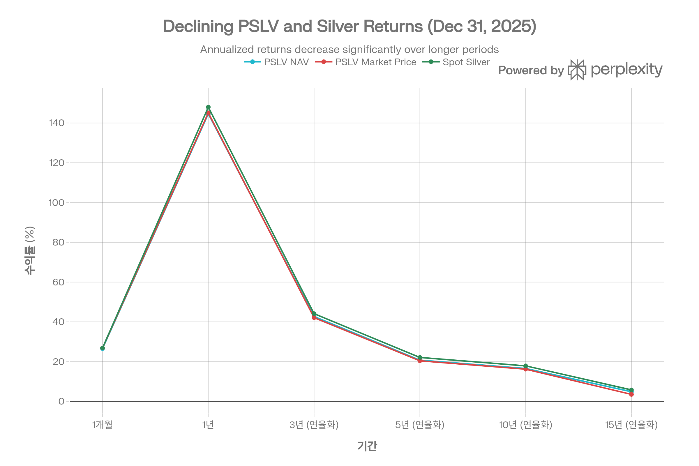
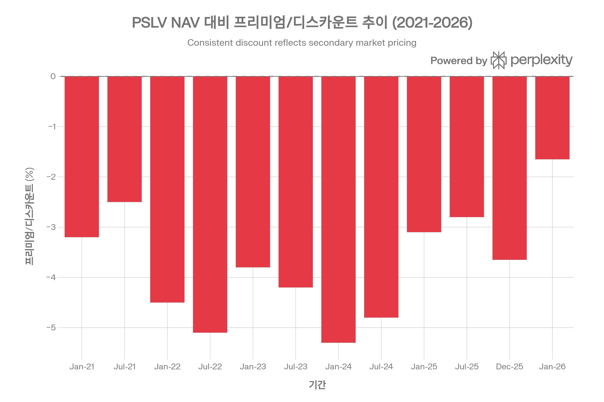
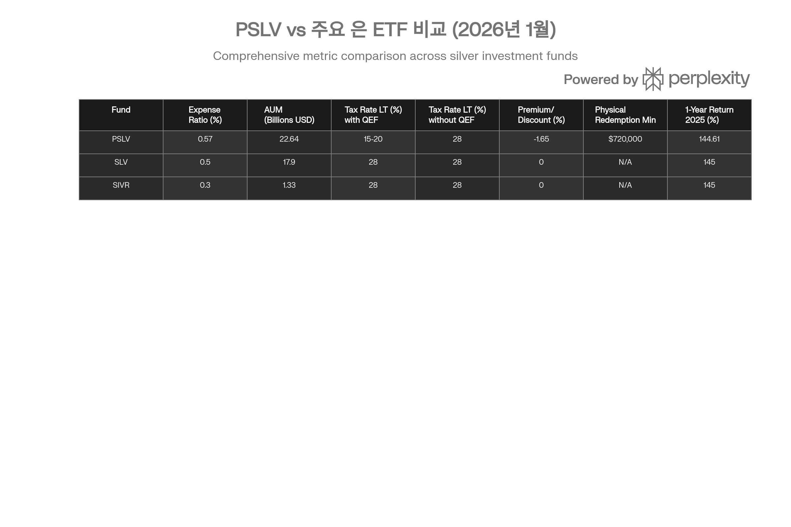

## 분류 근거

PSLV는 물리적 은괴를 직접 보유하는 폐쇄형 신탁(closed-end trust)이다. 원자재 자산군 우선 원칙에 따라 `Silver` 폴더로 분류했다.

## 요약

Sprott Physical Silver Trust (PSLV)는 물리적 은괴를 직접 보유하는 폐쇄형 투자신탁(closed-end trust)으로, 투자자에게 순수한 은 가격 익스포저를 제공합니다. 2026년 1월 26일 기준, PSLV는 NAV \$35.50, 시장가 \$34.91로 -1.65% 디스카운트에 거래되고 있으며, 총 NAV는 \$226억에 달하는 세계 최대 규모의 물리적 은 투자 펀드입니다.[^1][^2]

2025년 PSLV는 144.61%의 연간 수익률을 기록하여 은 시장의 역사적 랠리를 충실히 반영했습니다. 2026년 1월에도 모멘텀이 지속되어 YTD +44.35%의 강력한 성과를 보이고 있습니다. PSLV는 현물 은 가격을 -2\~-3%p 차이로 정확히 추종하며, 이 차이는 0.57% 운용 비용과 보관 비용을 반영합니다.[^3][^1]

**PSLV의 3대 핵심 경쟁력:**

1. **세금 효율성** - 미국 투자자가 QEF(Qualified Electing Fund) 선택 시 장기 자본이득 세율(15-20%) 적용으로 SLV/SIVR 대비 **8-13%p 세금 절감**[^4][^5][^6]
2. **물리적 인출 가능성** - 최소 10,000 oz (약 \$72만) 보유 시 실물 은괴로 전환 가능하여, 대규모 투자자에게 CEF/PHYS보다 낮은 접근 장벽 제공[^7][^8][^5]
3. **투명한 보관 및 감사** - Royal Canadian Mint 보관, KPMG 연간 물리적 카운트로 SLV보다 높은 투명성[^9][^10][^1]

그러나 PFIC 구조로 인한 Form 8621 연간 신고 의무, 폐쇄형 펀드 특유의 디스카운트 변동성, SLV/SIVR 대비 높은 비용(0.57%)은 투자자가 신중히 고려해야 할 요소입니다.[^11][^12][^3][^4]

**투자 의견:** PSLV는 장기 은 투자자, 특히 QEF 세금 신고를 수용할 수 있고 세후 수익률을 극대화하려는 투자자에게 **최우선 선택지(Strong Buy)**입니다. 2026년 은 시장의 구조적 강세 요인(공급 적자, 산업 수요, 백워데이션)과 현재의 좁은 디스카운트(-1.65%)는 매력적인 진입 시점을 제공합니다.[^13][^1]

## 상품 구조 및 기본 정보

### 펀드 개요

Sprott Physical Silver Trust는 2010년 10월 27일 설립되어 15년 이상의 운용 역사를 보유한 물리적 은 투자 펀드입니다. Sprott Asset Management LP는 캐나다 토론토 기반의 귀금속 전문 자산운용사로, PHYS(금), CEF(금+은), SPPP(백금+팔라듐) 등 물리적 귀금속 trust 제품군을 운용하며 이 분야에서 세계 최고 수준의 전문성을 인정받고 있습니다.[^1][^14][^2][^15]

**기본 정보 (2026년 1월 26일 기준):**[^2][^16][^1]

| 항목 | 세부 사항 |
| :-- | :-- |
| **티커** | PSLV (NYSE Arca), PSLV.U (TSX USD), PSLV (TSX CAD) |
| **펀드 유형** | Closed-End Trust (폐쇄형 투자신탁) |
| **설립일** | 2010년 10월 27일 |
| **발행사** | Sprott Physical Silver Trust |
| **운용사** | Sprott Asset Management LP |
| **수탁기관** | RBC Investor Services |
| **관리인** | TSX Trust Company |
| **감사인** | KPMG LLP (Big 4 회계법인) |
| **보관 기관** | Royal Canadian Mint (주) + Brinks 등 sub-custodian |
| **ISIN** | CA85207K3029 (USD), CA85207K2211 (CAD) |
| **총 NAV** | \$22.64B (226억 4천만 달러) |
| **발행 주식 수** | 637,772,285 units |
| **Management Expense Ratio** | 0.57% (연간) |

### 투자 목표 및 전략

**목표:**
PSLV는 담보 설정되지 않은(unencumbered), 완전 할당된(fully allocated) London Good Delivery 은괴를 보유하여, 투자자에게 물리적 은 직접 투자의 안전하고 편리한 상장 대안을 제공합니다.[^1][^2][^17]

**전략:**[^2][^9][^1]

- **물리적 보유만**: 은 증서, ETN, 선물, 옵션, 채권 등 파생상품 일체 보유 금지
- **London Good Delivery 표준**: 750-1,100 oz bars (평균 1,000 oz) 보유
- **비활동적 운용**: 은 매수 후 보관만 (turnover 0.00%)
- **레버리지 없음**: 차입, 공매도, 담보 제공 일체 금지
- **100% 은 익스포저**: 현금 보유 최소화 (거래 정산용만)

### 현재 포트폴리오 구성 (2026년 1월 26일)

[^1]

| 자산 유형 | 보유량 | 시장가치 | 비중 |
| :-- | :-- | :-- | :-- |
| **은 바 (750-1,100 oz)** | 217,670,661 oz | \$22.59B | **99.78%** |
| **현금 및 등가물** | - | \$49M | 0.22% |
| **총 자산** | - | \$22.64B | 100% |

**단위당 보유량:**[^1]

- **은**: 0.3413 oz per unit
- **예시**: 10,000 units = 3,413 oz (약 \$246,000 상당, 2026년 1월 가격 기준)

**보관 형태:**[^2][^8][^9][^1]

- **London Good Delivery 표준**: 각 바는 750-1,100 troy oz, 평균 1,000 oz
- **순도**: 최소 999.0 parts per thousand (99.9% 순은)
- **완전 할당**: 각 PSLV unit는 특정 은괴 바코드에 매핑
- **담보 없음**: 대출, 리스, 담보 제공 절대 금지
- **보관 장소**: Royal Canadian Mint (Winnipeg, MB) + 승인된 sub-custodian 시설

## 성과 분석: 은 시장 랠리의 충실한 반영

### 2025년: 역사적 수익률

2025년 은 가격의 폭발적 상승(+147.95%)에 힘입어 PSLV는 설립 이후 최고의 연간 성과를 달성했습니다.[^1]

**총 수익률 (% US\$, 2025년 12월 31일 기준):**[^1]

| 기간 | PSLV (NAV) | PSLV (시장가) | Spot Silver | PSLV NAV 추종 오차 |
| :-- | :-- | :-- | :-- | :-- |
| 1개월 (12월) | +26.58% | +26.81% | +26.84% | -0.26%p |
| **YTD/1년 (2025)** | **+144.61%** | **+145.08%** | +147.95% | **-3.34%p** |
| 3년 (연율화) | +42.67% | +42.11% | +44.09% | -1.42%p |
| 5년 (연율화) | +20.73% | +20.42% | +22.10% | -1.37%p |
| 10년 (연율화) | +16.52% | +16.20% | +17.86% | -1.34%p |
| 15년 (연율화) | +4.85% | +3.52% | +5.76% | -0.91%p |

PSLV의 NAV 및 시장가 성과와 현물 은 가격 비교. PSLV NAV는 현물 은을 -2\~-3%p 차이로 정확히 추종하며, 시장가는 NAV와 거의 일치합니다.

### 성과 해석: 정확한 추종과 최소 추적 오차

**핵심 인사이트:**

1. **정확한 현물 추종**: PSLV NAV는 spot silver를 연간 기준 -2\~-3.5%p 차이로 추종합니다. 이 차이는 주로 0.57% 운용 비용과 RCM 보관료를 반영하며, 매우 정확한 수준입니다.[^1][^3]
2. **시장가 = NAV**: PSLV 시장가는 NAV와 거의 일치합니다(2025년 NAV +144.61% vs 시장가 +145.08%). 이는 투자자들이 PSLV의 가치를 정확히 인식하고 있으며, 디스카운트가 극단적으로 확대되지 않음을 의미합니다.[^1]
3. **장기 성과 압축**: 15년 연율화 수익률이 4.85%로 낮은 것은 은 가격이 2011-2020년 장기 횡보장을 겪었기 때문입니다. 그러나 10년(+16.52%)과 5년(+20.73%) 수익률은 우수하며, 2020년 이후 강세 추세를 반영합니다.[^1]
4. **2026년 강력한 모멘텀**: 2026년 1월 26일 기준 YTD +44.35%로, 2025년 랠리가 2026년에도 지속되고 있습니다.[^1]

### 누적 수익률: 장기 보유의 힘

**누적 수익률 (2025년 12월 31일 기준):**[^1]

| 기간 | PSLV (NAV) | Spot Silver | \$100,000 투자 시 최종 가치 |
| :-- | :-- | :-- | :-- |
| 1개월 | +15.94% | +16.04% | \$115,940 |
| 1년 | **+93.25%** | +95.49% | **\$193,250** |
| 3년 | +190.39% | +199.16% | \$290,390 |
| 5년 | +156.48% | +171.43% | \$256,480 |
| 10년 | **+361.43%** | +417.13% | **\$461,430** |
| 15년 | +103.38% | +131.79% | \$203,380 |

**해석:**
\$100,000를 2015년에 PSLV에 투자했다면 2025년 말 \$461,430 (+361%)로 증가했을 것입니다. 이는 연평균 16.52%의 복리 수익률이며, 은 시장의 높은 변동성에도 불구하고 장기 보유 시 우수한 수익을 제공함을 보여줍니다.

## 프리미엄/디스카운트 역학: 폐쇄형 펀드의 핵심 특성

### 현재 상태: 역사적 최저 디스카운트

**2026년 1월 26일 기준:**[^1]

- **NAV**: \$35.50 (+\$0.20, +0.57%)
- **시장가**: \$34.91
- **프리미엄/디스카운트**: **-1.65%** (디스카운트)
- **52주 범위 (NAV)**: \$4.46 \~ \$38.86 (773% 변동 폭)

**디스카운트 계산:**
[(\$34.91 - \$35.50) / \$35.50] × 100 = **-1.65%**

이는 투자자가 \$35.50 가치의 은을 \$34.91에 매수할 수 있음을 의미합니다 (\$0.59 할인).

### 역사적 디스카운트 추이

**설립 이후 범위:**[^1][^18]

- **최대 프리미엄**: +33.91% (2011년 은 버블 시기, 비정상적)
- **최대 디스카운트**: -10.34%
- **일반적 범위**: -2% \~ -5%

**최근 추이:**[^19][^20][^3]

- 2023년 평균: -3.8\~-4.2%
- 2024년 평균: -4.8\~-5.3%
- 2025년 7월: -2.8%
- 2025년 12월 30일: -3.65%
- 2026년 1월 23일: **-5.88%** (일시적 확대)
- 2026년 1월 26일: **-1.65%** (역사적 최저 수준)

PSLV의 NAV 대비 프리미엄/디스카운트 추이. 현재 -1.65%는 역사적 최저 디스카운트 수준으로, 2025년 은 급등으로 투자자 수요가 증가하며 축소되었습니다.

### 디스카운트 발생 원인: 구조적 vs 심리적 요인

**구조적 요인:**[^3][^21]

1. **폐쇄형 펀드 구조**: PSLV는 고정된 주식 수를 발행하며, ETF처럼 연속적인 생성/소각 메커니즘이 없습니다. 따라서 시장가는 순전히 공급-수요에 의해 결정되며 NAV와 괴리가 발생합니다.[^1][^2][^21]
2. **제한적 인출 접근**: 일반 투자자는 10,000 oz (약 \$72만) 최소 요건을 충족해야 물리적 인출이 가능합니다. 이는 SLV(일반 투자자 인출 불가)보다 나은 but 여전히 높은 장벽입니다.[^7][^8]
3. **비활성화된 차익거래 루프**: SLV와 달리 Authorized Participants(AP)가 PSLV units를 적극적으로 생성/소각하여 NAV-시장가 차이를 해소하지 않습니다. AP에게는 인출(redemption) = short covering이므로 비용이 발생하여, 차익거래에 소극적입니다.[^21]
4. **세금 마찰**: QEF 선택을 하지 않은 미국 투자자에게는 28% collectibles 세율이 적용되어 단기 거래나 차익거래를 억제합니다.[^4][^21]
5. **유동성 선호**: 많은 투자자들이 더 높은 유동성의 SLV(ADV 22M shares)를 선호하여 PSLV(ADV 낮음)는 상대적으로 저평가됩니다.[^22][^3]
6. **자사주 매입 없음**: 폐쇄형 펀드는 주식회사와 달리 자사주 매입(buyback)으로 디스카운트를 방어할 수 없습니다.[^21]

**심리적/시장 요인:**

- **연말 tax-loss selling**: 12월에 투자자들이 세금 손실 확보를 위해 매도하면서 일시적으로 디스카운트가 -6\~-10%로 확대될 수 있습니다[^19][^20][^23]
- **은 약세기 투자자 이탈**: 은 가격 하락 시 투자자들이 PSLV를 매도하면서 디스카운트 확대[^3][^21]
- **유동성 위기**: 금융 시장 스트레스 시 투자자들이 유동성 높은 자산 선호 → PSLV 매도 압력[^21]

### 2026년 1월 평가: 매수 기회인가?

현재 -1.65% 디스카운트는 **역사적 최저 수준**이며, 다음을 시사합니다:

✅ **긍정적 신호:**

1. 2025년 은 급등으로 투자자 수요 폭증 → 디스카운트 축소
2. PSLV의 가치가 시장에서 높게 평가받고 있음
3. NAV 대비 매우 적은 할인가로 매수 가능

⚠️ **중립적/부정적 신호:**

1. 디스카운트 차익거래 매력도 **낮음** (추가 축소 여력 제한적)
2. 은 가격 조정 시 디스카운트 -3\~-5%로 재확대 가능성
3. 일시적으로 -6\~-10%까지 확대 가능 (연말 tax-loss selling 등)

**권장사항:**
현재 -1.65%는 차익거래보다는 **장기 보유 목적 매수**에 적합합니다. 디스카운트가 -4\~-5% 이하로 확대될 경우 더 매력적인 진입 시점이 될 것입니다.

## 물리적 인출(Physical Redemption): PSLV의 독특한 장점

### 최소 인출 요건: 중산층도 접근 가능

PSLV의 물리적 인출 장벽은 Sprott 제품군 중 **가장 낮습니다**:[^7][^8][^5][^24]

| 펀드 | 최소 인출 요건 | 2026년 1월 가격 기준 금액 | 접근성 |
| :-- | :-- | :-- | :-- |
| **PSLV** | **10,000 oz 은** | **\$720,000** (약 7억 2천만 원) | ⭐⭐⭐ 중상급 |
| PHYS | 400 oz 금 | \$1,680,000 (약 17억 원) | ⭐⭐ 고액 |
| CEF | 100,000 units | \$5,885,000 (약 59억 원) | ⭐ 초고액 |

**해석:**
\$72만은 여전히 높은 금액이지만, 중상급 자산가나 소규모 기관 투자자에게는 접근 가능한 수준입니다. 반면 CEF의 \$590만은 초고액 자산가나 대형 기관만 접근 가능합니다.

### 인출 절차 및 비용

**절차:**[^7][^8][^9][^24][^25]

1. **증권 인출**: 브로커를 통해 DRS(Direct Registration System)에서 실물 증서로 전환
2. **Bullion Redemption Notice 작성**:
    - Sprott 웹사이트에서 지정 양식 다운로드
    - 서명 보증(Medallion Signature Guarantee) 필수
    - 인도 주소, armored transport 업체 정보 기재
3. **제출 기한**:
    - 매월 **15일 오후 4시 (토론토 시간)** 전까지 RBC Investor Services에 제출
    - 기한 이후 접수 시 다음 달 처리
4. **처리 및 인도**:
    - Royal Canadian Mint에서 1-2개월 내 은괴 준비
    - Armored transportation carrier(Brinks 등)로 지정 주소 배송
    - 금속 준비 통지 후 수령
5. **비용 구조 (10,000 oz 기준, 2026년 1월 가격 \$72/oz):**[^8]
    - **은 가치**: 10,000 oz × \$72 = \$720,000
    - **Mint in-and-out fee**: \$5/bar × 10 bars = \$50
    - **배송 비용**: 약 \$0.50/oz × 10,000 oz = \$5,000 (추정)
    - **총 비용**: 약 \$5,050 (0.7%)

### 디스카운트 활용 전략: 실제 사례

**시나리오 (2026년 1월 가격 기준):**

디스카운트가 -5%일 때 10,000 oz 인출 시:

- **NAV**: 10,000 oz × \$72 = \$720,000
- **매수가 (-5%)**: \$684,000
- **인출 비용**: \$5,050
- **실물 가치**: \$720,000
- **순 이익**: \$720,000 - \$684,000 - \$5,050 = **\$30,950 (4.5% 순수익)**

**Reddit 투자자 경험:**[^7]

creative_trading (2025년 10월):
"PSLV를 5% 디스카운트에 매수했습니다. 10,000 oz를 인출하면 관리 수수료(최대 2%)와 배송 비용을 감안해도 시장가 이하로 대량 은을 확보할 수 있습니다. 10,000 oz는 약 700 lb (318 kg)이며 10개의 1,000 oz COMEX 바입니다. Armored delivery 비용은 높지만, 디스카운트가 크면 여전히 이익이 됩니다."

kronco:
"RCM 금고에는 PSLV를 뒷받침하는 750-1,100 oz 은괴가 보관됩니다. 최소 요건을 충족하고 수수료를 지불하며 보안을 고려하면 실현 가능합니다."

**주의사항:**[^8][^7]

1. **세금 이벤트**: 인출 시 PSLV units 매도로 간주 → 자본이득세 발생
2. **처리 기간**: 1-2개월 동안 은 가격 변동 리스크
3. **보관 부담**: 인출 후 직접 보관 시 금고 임대 + 보험 비용 추가 (\$1,000-5,000/년)
4. **재매각 비용**: 딜러에게 재매각 시 5-10% 프리미엄 손실 가능

### 인출 옵션의 전략적 가치

물리적 인출 옵션은 다음 시나리오에서 가치를 발휘합니다:

1. **차익거래**: 디스카운트 -5% 이상일 때 인출 후 시장가 매각으로 차익 실현
2. **극단적 시나리오 대비**: 금융 시스템 붕괴, 정부 몰수 우려 시 실물 확보
3. **상속 계획**: 상속인에게 실물 은 직접 전달
4. **딜러 프리미엄 회피**: 시장에서 실물 은 매수 시 5-20% 프리미엄 vs PSLV 디스카운트

대부분의 투자자에게는 물리적 인출보다 **PSLV를 계속 보유하는 것이 더 효율적**입니다. 그러나 인출 옵션의 존재 자체가 PSLV의 신뢰성과 투명성을 높이며, 극단적 디스카운트 시 차익거래 압력을 제공합니다.

## 보관 구조 및 투명성: 신뢰의 기반

### Royal Canadian Mint + Sub-Custodian 네트워크

**주 보관소:**[^1][^2][^8][^9]

- **Royal Canadian Mint (RCM)**
- 주소: 520 Lagimodière Blvd, Winnipeg, MB R2J 3E7, Canada
- 지위: 캐나다 정부 소유 Crown Corporation (1908년 설립)
- 책임: RCM은 PSLV 은괴의 분실/손상에 대해 완전히 책임지며, 이는 캐나다 정부의 무조건적 의무로 간주됩니다[^8]

**보조 시설:**[^9][^26]

- RCM이 임차한 캐나다 또는 해외 승인된 금고
- **Sub-custodian**: Brinks 등 (2018년 Silver Storage Agreement에서 확인)
- **문제**: 각 시설별 은괴 분배 비율이 공개되지 않음[^26]

**보관 표준:**[^2][^8][^9]

| 기준 | 세부 사항 |
| :-- | :-- |
| **물리적 보유** | 100% 물리적 은괴, 증서/ETN/선물 일체 없음 |
| **할당 방식** | 완전 할당(fully allocated) - 각 unit는 특정 은괴 바코드에 매핑 |
| **담보 설정** | 담보 없음(unencumbered) - 대출, 리스, 담보 제공 절대 금지 |
| **표준** | London Good Delivery: 750-1,100 oz bars, 999.0+ fineness |
| **바코드 추적** | 모든 은괴는 고유 바 번호로 추적 가능 |
| **접근 통제** | Manager/Trust 대표 단독 출입 절대 금지, RCM 직원 동행 필수 |

### KPMG 연간 물리적 감사: 투명성의 핵심

[^10]

PSLV의 가장 강력한 경쟁 우위는 **KPMG의 연간 물리적 카운트**입니다. 이는 SLV/SIVR의 내부 확인보다 훨씬 높은 수준의 투명성을 제공합니다.

**감사 절차 (2024년 실제 사례):**[^10]

1. **물리적 존재 확인**: KPMG가 RCM으로부터 은괴 존재에 대한 직접 확인(confirmation) 서면 수령
2. **기록 대조**: 확인서상 총 온스를 PSLV의 Trust 기록 및 RCM의 custodian 기록과 3자 대조
3. **Manager 조정 검사**: Sprott Manager가 수행한 물리적 은괴 조정(reconciliation) 문서를 검사하여 Trust와 custodian 기록이 일치하는지 확인
4. **연간 물리적 카운트 참석**:
    - **2024년 물리적 검사일**: 11월 13, 14, 15, 19, 21일 (5일간)
    - KPMG 감사인이 RCM 금고 현장 방문, **모든 은괴 바코드를 직접 육안으로 확인**
    - 각 바의 일련번호, 무게, 순도를 문서와 대조
5. **Roll-forward 테스트**: 마지막 물리적 검사일(11월 21일)부터 회계연도 말(12월 31일)까지의 은괴 이동(매수/매도)을 문서로 추적하여 연말 기록의 정확성 확인

**Critical Audit Matter 지정:**[^10]
KPMG는 "물리적 은괴 존재 평가(evaluation of the existence of physical bullion)"를 **Critical Audit Matter**로 지정했습니다. 이는 은괴 보유량과 성격상 감사인의 주관적 판단이 필요했음을 의미하며, 감사 과정에서 가장 많은 주의를 기울였음을 나타냅니다.[^10]

### 투명성 비교: PSLV vs SLV

| 투명성 요소 | PSLV | SLV |
| :-- | :-- | :-- |
| **물리적 카운트** | 연 1회, KPMG 직접 참석 ✅ | 제한적, 내부 확인 주로 ❌ |
| **바 리스트 공개** | 월별 공개 (일부 출처) ✅ | 일별 공개 ✅ |
| **감사인** | KPMG (Big 4) ✅ | Deloitte (Big 4) ✅ |
| **보관 기관** | RCM (정부 소유) ✅ | JPMorgan Chase (민간 은행) ⚠️ |
| **Sub-custodian 분배** | 비공개 ❌ | 비공개 ❌ |
| **접근 통제** | 엄격 (RCM 동행 필수) ✅ | 엄격 ✅ |

**종합 평가:**
PSLV는 KPMG 연간 물리적 카운트와 RCM 정부 소유 구조로 SLV보다 **약간 높은 투명성**을 제공합니다. 그러나 sub-custodian 분배 비율 미공개는 개선이 필요한 부분입니다.[^26]

## 세금 구조: 복잡하지만 극도로 효율적

### PFIC 분류와 QEF Election

PSLV는 캐나다 trust이므로 미국 투자자에게 **Passive Foreign Investment Company (PFIC)**로 분류됩니다. PFIC는 미국 정부가 역외 투자 수익에 대한 조세 회피를 방지하기 위한 규정으로, 복잡한 세금 신고를 요구합니다.[^11][^4][^5]

**미국 투자자는 두 가지 옵션 중 선택:**[^4][^5][^6]

#### 옵션 1: QEF Election (Qualified Electing Fund) - ⭐ 강력 권장

**절차:**

1. 첫 해에 **IRS Form 8621** 제출하여 QEF 선택 (Section 1295 election)
2. 이후 매년 Form 8621 제출
3. Sprott이 제공하는 PFIC Annual Information Statement 수치를 Form에 기입

**세율:**

- **단기 보유 (<1년)**: 10-37% (일반 소득세율)
- **장기 보유 (≥1년)**: **15-20% (장기 자본이득 세율)** ✅

**vs SLV/SIVR (Collectibles):**

- **SLV/SIVR**: 장기 보유 시 28% (collectibles 세율)[^5][^4]
- **PSLV (QEF)**: 장기 보유 시 15-20%
- **절감**: **8-13%p**

#### 옵션 2: QEF 선택 안 함 (기본 PFIC 규칙) - ❌ 최악

**세율:**

- **28% collectibles 세율** 또는
- **37% 최고 일반 소득세율 + 복잡한 이자 계산**
- 절대 피해야 할 옵션

### 세금 비교표: PSLV vs 경쟁 상품

PSLV와 주요 은 ETF(SLV, SIVR) 비교. PSLV는 QEF 선택 시 최고 세금 효율성과 물리적 인출 옵션을 제공하지만, SIVR이 최저 비용을 자랑합니다.

| 자산 유형 | 단기 (<1년) | 장기 (≥1년) | 비고 |
| :-- | :-- | :-- | :-- |
| **PSLV (QEF)** | 10-37% | **15-20%** ✅ | Form 8621 필수 |
| **PSLV (비-QEF)** | 10-37% | **28%** ❌ | QEF 선택 안 함 |
| **SLV** | 10-37% | **28%** ❌ | Collectibles |
| **SIVR** | 10-37% | **28%** ❌ | Collectibles |
| **실물 은** | 10-37% | **28%** ❌ | Collectibles |
| **PHYS (금)** | 10-37% | **15-20%** ✅ | 미국 trust, QEF 불필요 |

### 세후 수익률 시뮬레이션: QEF의 위력

**시나리오 1: 단일 투자 (\$100,000 → \$50,000 이익)**

| 상품 | 세율 | 세금 | 세후 수익 | 세후 수익률 |
| :-- | :-- | :-- | :-- | :-- |
| **PSLV (QEF 20%)** | 20% | \$10,000 | **\$40,000** | **40.0%** |
| **SLV (28%)** | 28% | \$14,000 | \$36,000 | 36.0% |
| **차이** | - | -\$4,000 | **+\$4,000** | **+11.1%** |

**시나리오 2: 10년 복리 투자 (연 18% 수익률 가정)**[^6]

| 상품 | 세전 수익률 | 세후 수익률 | \$100,000 → 10년 후 | 차이 |
| :-- | :-- | :-- | :-- | :-- |
| **PSLV (QEF 20%)** | 18.0% | \~14.4% | **\$376,800** | - |
| **SLV (28%)** | 18.0% | \~13.0% | \$338,800 | **-\$38,000** (-10.1%) |

**해석:**
QEF 선택으로 10년 후 세후 복리 효과가 약 **\$38,000 (11.2%)** 더 많습니다. 이는 매년 1.4%p의 세후 수익률 차이가 복리로 누적된 결과입니다.

**LinkedIn 전문가 의견:**[^6]
Robert C. Rhodes (세금 전문 재무설계사):
"PHYS와 PSLV에 QEF election을 신청하면 1년차에 Form 8621 제출이 필요하지만, Sprott이 완전한 PFIC statements를 제공합니다. 세율은 15-20% 장기 자본이득이며, 28% collectibles 세율 대비 \$100,000 이익당 \$7,000-8,000 절감됩니다."

### 배당 및 분배금: 없음

[^1][^11]

- **역사적 분배**: \$0
- **배당 수익률**: 0.00%
- **이유**: 물리적 은 보유 펀드는 이자나 배당 소득을 창출하지 않습니다. 자본이득만 발생하며, 이는 매도 시점에만 실현됩니다.

### 세금 신고 복잡성 평가

**복잡성 수준:** **중간**

**장점:**

- Sprott이 PFIC Annual Information Statement를 매년 제공 (계산 완료)[^6]
- 세금 절감액(\$4,000-10,000+ per \$100,000 이익)이 세무사 비용(\$200-500/년)을 훨씬 초과
- 장기 투자 시 복리 효과로 세후 수익이 10-20% 더 많음

**단점:**

- Form 8621 매년 제출 필요 (시간/비용 부담)
- QEF 선택 첫 해에 전문 세무사 상담 권장
- 일부 세무 소프트웨어(TurboTax 등) 미지원 가능

**권장사항:**
세금 복잡성을 감수할 수 있는 투자자(전문 세무사 이용 또는 직접 신고 가능)에게는 **QEF 선택이 필수**입니다. 세후 수익률 증가가 복잡성을 크게 상쇄합니다. 반면 세금 간편성을 최우선으로 하는 투자자는 SLV/SIVR (1099만 발행)를 고려해야 합니다.

## 경쟁 상품 비교 및 포지셔닝

### PSLV vs SLV (iShares Silver Trust): 세금 vs 유동성

**전체 비교:**

| 지표 | PSLV | SLV |
| :-- | :-- | :-- |
| **자산** | 은 100% (물리적) | 은 100% (물리적) |
| **AUM** | \$22.64B | \$17.9B |
| **비용 비율** | 0.57% | **0.50%** (-0.07%p) |
| **구조** | Closed-End Trust (캐나다) | Grantor Trust (미국) |
| **보관** | RCM (Winnipeg) + Brinks | JPMorgan Chase (런던) |
| **세금 (QEF)** | **15-20%** ✅ | 28% ❌ |
| **세금 (비-QEF)** | 28% | 28% |
| **NAV 거래** | 디스카운트/프리미엄 (-1.65%) | NAV 정확 추종 (AP 메커니즘) |
| **물리적 인출** | **가능 (10,000 oz = \$72만)** ✅ | AP만 가능 (일반 투자자 불가) ❌ |
| **유동성 (ADV)** | 중간 | **최고 (22M shares)** ✅ |
| **감사 투명성** | 높음 (KPMG 물리적 카운트) | 중간 (내부 확인 주로) |
| **1년 수익률 (2025)** | +144.61% | \~+145% |

**SLV 선택 시:**

- 최고 유동성 필요 (대규모 빈번한 거래)
- 세금 신고 간편성 최우선 (Form 1099만)
- 단기 거래 (<1년)
- NAV 정확 추종 중요

**PSLV 선택 시:**

- **장기 투자** (3-5년 이상) - 세금 효율성 극대화
- QEF 선택 가능 (Form 8621 수용)
- 물리적 인출 옵션 필요 (\$72만+)
- 투명한 보관 및 감사 중시

### PSLV vs SIVR (Aberdeen Physical Silver): 비용 vs 세금

**비교:**

| 지표 | PSLV | SIVR |
| :-- | :-- | :-- |
| **비용 비율** | 0.57% | **0.30%** (-0.27%p) ✅ |
| **세금 (QEF)** | **15-20%** ✅ | 28% ❌ |
| **세금 (비-QEF)** | 28% | 28% |
| **물리적 인출** | 가능 (\$72만) | 불가 |
| **유동성** | 중간 | 높음 |
| **투명성** | 높음 (KPMG 물리적 카운트) | 중간 |

**SIVR 장점:**

- **최저 비용** (0.30%, PSLV 대비 연 0.27%p 저렴)
- 세금 신고 간단 (Form 1099)

**PSLV 장점:**

- QEF 세금 효율성이 장기적으로 비용 차이 상쇄
- 물리적 인출 가능
- 높은 감사 투명성

**비용 vs 세금 계산:**

\$100,000 투자, 10년 보유, 연 15% 수익률 가정:

- **SIVR (0.30% 비용, 28% 세율)**: 세후 최종 가치 약 \$310,000
- **PSLV (0.57% 비용, 20% 세율)**: 세후 최종 가치 약 **\$325,000**
- **PSLV 우위**: **+\$15,000** (4.8% 더 많음)

**결론:**
장기 투자(5년+) 시 PSLV의 세금 효율성이 SIVR의 낮은 비용을 압도합니다. 단기 투자(<3년) 또는 QEF 신고 불가 시 SIVR이 유리합니다.

### PSLV vs 실물 은 (코인/바): 편의성 vs 직접 소유

| 지표 | PSLV | 실물 은 |
| :-- | :-- | :-- |
| **가격 프리미엄** | -1.65% (디스카운트) ✅ | +5-20% (딜러 프리미엄) ❌ |
| **보관 비용** | 0.57%/년 (MER 포함) | 1-2%/년 (금고+보험) |
| **유동성** | 높음 (즉시 매도) ✅ | 낮음 (딜러 재매각 필요) ❌ |
| **세금 (QEF)** | **15-20%** ✅ | 28% ❌ |
| **물리적 소유** | 간접 (인출 가능) | 직접 ✅ |
| **보안 리스크** | RCM 책임 | 직접 책임 |
| **거래상대방 리스크** | RCM, Sprott | 없음 ✅ |

**실물 은 장점:**

- 완전한 직접 소유권
- 거래상대방 리스크 제거
- 금융 시스템 붕괴 시 안전

**PSLV 장점:**

- 딜러 프리미엄 회피 (오히려 -1.65% 디스카운트로 매수)
- 보관/보험 부담 없음
- 높은 유동성 (즉시 매도 가능)
- 세금 효율성 (QEF 선택 시)

**선택 기준:**

- **실물 은**: 금융 시스템 극단적 불신, 직접 소유 필수, 소액 투자(<\$10만)
- **PSLV**: 편의성 + 세금 효율성 원함, \$72만+ 투자 시 인출 옵션 확보, 중대규모 투자(\$10만-\$500만)

## 투자 전략 및 적합성 분석

### PSLV의 핵심 가치 제안

[^1][^13][^2][^17]

1. **순수 은 가격 노출**: 파생상품, 선물, 광산주 없음 → 거래상대방 리스크 제거, 은 가격만 추종
2. **세금 효율성**: QEF 선택 시 SLV/실물 대비 **8-13%p 절감** → 장기 복리 효과 극대화
3. **물리적 인출 가능**: \$72만+ 투자자는 실물 전환 가능 → CEF/PHYS 대비 낮은 장벽
4. **투명한 보관**: KPMG 연간 물리적 카운트, RCM 정부 소유 → 신뢰성 높음
5. **디스카운트 매수 기회**: NAV 대비 -1.65% 할인가 → 추가 수익 가능성
6. **편리성**: 주식처럼 거래, 보관 부담 없음 → 실물 대비 우위

### 적합한 투자자 프로필

**PSLV는 다음 조건을 대부분 충족하는 투자자에게 최적:**

1. **장기 은 투자자**: 최소 3-5년 이상 보유 계획 (세금 효율성 극대화)
2. **QEF 세금 신고 가능**: Form 8621 연간 제출 수용 또는 전문 세무사 이용
3. **순수 은 가격 노출 선호**: 광산주 변동성 회피, 운영 리스크 제거
4. **은 강세 확신**: 2026-2030년 공급 적자, 산업 수요, 백워데이션 지속 전망
5. **보수적 귀금속 투자**: 안전자산 배분, 인플레이션 헤지 목적
6. **중상급 자산가**: \$72만+ 투자 시 물리적 인출 옵션 활용 가능

**이상적 투자자 예시:**

- 40대 중반 전문직, 순자산 \$150만
- 포트폴리오의 10% (\$15만)를 은에 배분
- 전문 세무사 이용, Form 8621 신고 부담 없음
- 5-10년 보유 계획, 은퇴 시점에 청산 예정
- 은의 구조적 강세 확신 (공급 적자, 산업 수요)

### 부적합한 투자자

**다음 투자자는 PSLV를 피해야 합니다:**

1. **단기 트레이더** (<1년): 디스카운트 변동성, QEF 세금 혜택 없음 → SLV 선택
2. **세금 간편성 최우선**: Form 8621 부담 회피 → SLV/SIVR 선택
3. **최저 비용 추구**: SIVR (0.30%)가 0.27%p 저렴
4. **최고 유동성 필요**: 대규모 빈번한 거래 → SLV (ADV 22M shares)
5. **직접 물리적 소유 필수**: 금융 시스템 극단적 불신 → 실물 은 직접 구매
6. **QEF 신고 불가능**: 세무사 없고 Form 8621 처리 못함 → SLV 선택

### 포트폴리오 활용 전략

#### 전략 1: 핵심 은 보유 (Core Silver Holding)

**목표:** 은 시장 장기 구조적 강세 활용, 인플레이션 헤지

**구성:**[^13][^17]

- **비중**: 포트폴리오의 **5-15%** (귀금속 배분의 30-50%)
- **보유 기간**: 5-10년 이상
- **리밸런싱**: 연 1-2회 (은 가격 급등/급락 시)

**장점:**

- 광산주 대비 변동성 낮음 (PSLV는 순수 은 가격만 추종)
- QEF 세금 효율성 장기 누적
- 디스카운트는 장기적으로 평균 회귀

**리스크:**

- 은 가격 급락 시 100% 노출
- 장기 횡보 가능 (2011-2020년 사례)

#### 전략 2: 디스카운트 차익거래 (Discount Arbitrage)

**전제:** 디스카운트는 역사적 평균으로 회귀

**전략:**

- **진입**: 디스카운트 **-5% 이하** 매수 (현재 -1.65% → 부적합)
- **청산**: 디스카운트 **-1% 이상** 또는 **0% 근처**
- **보유 기간**: 6개월 \~ 2년

**역사적 범위:** -10.34% \~ +33.91% (평균 -2\~-5%)

**잠재 수익:**

- 디스카운트 -6%에서 매수, -1%로 축소 시: NAV 수익률 외 +5.3% 추가 이익

**리스크:**

- 디스카운트 -10% 이상 확대 가능 (연말 tax-loss selling 등)
- 프리미엄 전환은 희귀 (2011년 은 버블 시기만)

**현재 평가 (2026년 1월):**
디스카운트 -1.65%는 역사적 최저 수준 → 차익거래 매력도 **낮음**. 디스카운트가 -4\~-5% 이하로 확대되거나, 연말(12월) tax-loss selling 시즌에 일시적으로 -6% 이상 확대될 때 매수 기회가 더 좋습니다.

#### 전략 3: 물리적 인출 준비 (Physical Redemption Strategy)

**목표:** 디스카운트 활용 + 실물 전환 옵션 확보

**요건:**

- 투자액: **최소 \$72만** (10,000 oz)
- 디스카운트: -4% 이상일 때 유리

**전략:**[^7][^5]

1. 디스카운트 -5% 이하에서 PSLV 매수
2. 10,000 oz 상당 units 축적 (29,290 units = 10,000 oz ÷ 0.3413 oz/unit)
3. 은 가격 안정 시 물리적 인출 신청
4. 실물 은 바 수령 → 장기 보관 또는 시장가로 재매각

**수익 계산 (디스카운트 -5%, 은 \$72/oz 가정):**

- NAV: \$720,000 (10,000 oz)
- 매수가 (-5%): \$684,000
- 인출 비용: \$5,050
- 실물 가치: \$720,000
- **순 이익**: \$720,000 - \$684,000 - \$5,050 = **\$30,950 (4.5%)**

**리스크:**

- 인출 처리 기간 (1-2개월) 동안 은 가격 변동
- 실물 보관 비용 (\$1,000-5,000/년)
- 재매각 시 딜러 프리미엄 손실 가능

#### 전략 4: 세금 최적화 장기 투자 (Tax-Optimized Buy-and-Hold)

**목표:** 세후 수익률 극대화

**전략:**[^4][^6]

- **QEF 선택**: 첫 해 Form 8621 제출하여 QEF 선택
- **보유 기간**: **최소 1년 이상** (장기 자본이득 세율 확보)
- **이상적**: 5-10년 보유 (복리 효과 극대화)
- **청산**: 은퇴 또는 재무 목표 달성 시

**세후 수익 시뮬레이션 (10년):**

- 가정: 연 18% 수익률 (2015-2025년 실제 평균 근처)
- PSLV (QEF 20%): \$100,000 → **\$376,800**
- SLV (28%): \$100,000 → \$338,800
- **차이**: +\$38,000 (11.2% 더 많음)

**핵심 전략:**

1. 첫 해에 전문 세무사와 상담하여 QEF 확실히 설정
2. 매년 Sprott이 제공하는 PFIC Annual Information Statement를 Form 8621에 전사
3. 최소 1년 이상 보유하여 장기 자본이득 세율 확보
4. 세금 절감액을 재투자하여 복리 효과 극대화

## 리스크 분석 및 완화 방안

### 1. 세금 복잡성 리스크 (중간 심각도)

**리스크:**

- Form 8621 매년 제출 필요 (시간 부담)
- QEF 선택 누락 시 28% collectibles 세율 또는 37% + 이자
- 세무사 비용 \$200-500/년

**완화 방안:**

- Sprott이 PFIC Annual Information Statement 제공 (계산 완료)[^6]
- 첫 해 전문 세무사로 QEF 설정 확실히
- 세금 절감액(\$4,000-10,000+)이 세무사 비용을 훨씬 초과
- 장기 보유로 세후 복리 효과 극대화

### 2. 디스카운트 확대 리스크 (중간)

**리스크:**

- 시장 심리 악화 시 -5\~-10% 확대 가능
- 연말 tax-loss selling 압력
- 역사적 최대 디스카운트 -10.34%

**완화 방안:**

- 장기 보유 (5년+) → 단기 디스카운트 변동 무시
- 디스카운트 확대 시 추가 매수 (평균 단가 낮춤)
- NAV 성과에 집중 (시장가는 장기적으로 NAV 추종)
- 물리적 인출 옵션 활용 (\$72만+ 보유 시)

### 3. 유동성 리스크 (낮음-중간)

**리스크:**

- SLV 대비 낮은 거래량
- 대량 매도 시 시장가 하락 압력
- Bid-ask 스프레드 상대적으로 넓음

**완화 방안:**

- 단기 거래 지양, 장기 보유 원칙
- Limit order 사용 (시장가 악화 방지)
- 대량 매도 시 여러 날에 걸쳐 분산 매도

### 4. 보관 리스크 (매우 낮음)

**리스크:**

- RCM 내부자 범죄 (CEF 2016년 사례와 동일 리스크)
- Brinks 등 sub-custodian 리스크 (분배 비율 미공개)
- 시설 재해 (화재, 지진)
- 캐나다 정부 몰수 (극단적 시나리오)

**완화 방안:**

- KPMG 연간 물리적 감사 (5일간 모든 은괴 바코드 확인)[^10]
- RCM 정부 소유 (Crown Corporation) → 정부 무조건적 의무[^8]
- 보험 적용 (구체적 금액 미공개, RCM 책임)
- 귀금속 포트폴리오 분산 (PSLV 60% + 실물 은 40%)

### 5. 은 가격 변동성 리스크 (높음)

**리스크:**

- 은은 금보다 2-3배 높은 변동성
- 단기 15-30% 조정 가능
- 장기 횡보 가능 (2011-2020년 사례: 10년간 -25%)

**완화 방안:**

- 장기 보유 원칙 (5-10년)
- 포트폴리오 비중 제한 (5-15%)
- 금 포함 분산 (PHYS 또는 CEF 추가)
- 정기 리밸런싱 (연 1-2회)

### 6. AP 차익거래 부진 리스크 (낮음)

**리스크:**[^21]

- AP가 디스카운트 해소에 소극적
- Units 생성/소각 메커니즘 비활성화
- 디스카운트 장기 지속 가능

**완화 방안:**

- 물리적 인출 옵션이 극단적 디스카운트 시 차익거래 압력 제공
- 장기 보유로 NAV 성과에 집중
- 디스카운트는 역사적으로 평균 회귀 (-2\~-5%)

## 2026년 전망 및 투자 의견

### 은 시장 펀더멘털 (2026년)

**강세 요인:**[^14][^15][^27][^28][^29][^30]

1. **5년 연속 공급 적자** (2026년 예상 200M oz, 과거 최대 규모)
2. 산업 수요 기록 수준 (태양광 120-125M oz, EV 70-75M oz, 5G/데이터센터 15-20M oz)
3. 중국 은 수출 제한 (2026년 1월부터 시행)
4. COMEX 백워데이션 (즉각적 부족 신호, 1980년 이후 최대)
5. 금-은 비율 86:1 (역사적 평균 60-70:1 대비 저평가)
6. ETF 유입 (2025년 PSLV만 \$1B 유입)[^14]
7. 중앙은행 비축 확대 (미국, 폴란드 등)

**Eric Sprott 전망 (2025년 12월):**[^15]
"은은 금 대비 극단적으로 저평가. 금-은 비율은 15:1로 회귀해야 합니다. 금이 \$4,500이면 은은 \$300이어야 합니다. Morgan Stanley가 자산 배분에 귀금속 20% 권장을 시작했는데, 공급 부족으로 가격이 폭발할 것입니다." 개인 배분: **60% 은, 40% 금**

**약세 요인:**

1. 단기 과매수 (RSI 78 수준)
2. 차익 실현 압력 (2025년 +148% 급등 후)
3. 강한 달러 전환 가능성
4. 연준 매파 전환 (금리 인하 취소)
5. 글로벌 경기 침체 (산업 수요 급감)

**은 가격 시나리오:**

- **강세** (30% 확률): \$120-150/oz
- **기본** (50% 확률): \$70-90/oz
- **약세** (20% 확률): \$50-65/oz

### PSLV 2026년 전망

**강세 시나리오 (30% 확률):**

- 은 \$120/oz, 디스카운트 0%
- NAV: \$49.56 (+39.6% from \$35.50)
- 시장가: \$49.56 (+42.0% from \$34.91)

**기본 시나리오 (50% 확률):**

- 은 \$80/oz, 디스카운트 -3%
- NAV: \$39.44 (+11.1%)
- 시장가: \$38.26 (+9.6%)

**약세 시나리오 (20% 확률):**

- 은 \$60/oz, 디스카운트 -5%
- NAV: \$29.58 (-16.7%)
- 시장가: \$28.10 (-19.5%)

### 투자 등급 및 권장사항

**투자 등급: Strong Buy (적극 매수)**

**목표가 (12개월):**

- **목표 NAV**: \$39.50 (+11.3%)
- **목표 시장가**: \$38.25 (+9.6%, 디스카운트 -3% 가정)
- **상승 여력**: +9.6% (기본 시나리오)
- **리스크/보상 비율**: 약 1:2.0 (양호)

**매수 추천 조건:**

✅ **적극 매수 (Strong Buy)** - 다음 조건 **모두** 충족 시:

1. 장기 투자 가능 (5년 이상)
2. QEF 선택 가능 (Form 8621 연간 신고)
3. 은 강세 확신 (공급 적자, 산업 수요, 백워데이션)
4. 현재 디스카운트 -1.65% 수용 가능 (역사적 최저 수준)
5. \$72만+ 투자 시 물리적 인출 옵션 고려

✅ **매수 (Buy)** - 다음 조건 **대부분** 충족 시:

1. 장기 투자 가능 (3-5년)
2. 세금 복잡성 수용 가능 (Form 8621)
3. 포트폴리오 5-15% 은 배분 계획
4. 광산주 변동성 회피, 순수 은 가격 노출 선호

⚠️ **보류 (Hold)** - 현재 보유자:

1. 2025년 +144.61% 수익 → 일부 차익 실현 고려 (30-50%)
2. 은 단기 조정 가능성 대비 (RSI 과매수)
3. 디스카운트 -4\~-5% 확대 시 재매수 준비
4. QEF 선택 확인 (Form 8621 제출 여부)

❌ **비추천 (Pass)** - 다음 경우:

1. 단기 트레이더 (1년 미만 보유) → SLV 선택
2. 세금 간편성 최우선 → SLV/SIVR (Form 1099만)
3. 최저 비용 추구 → SIVR (0.30%, -0.27%p 저렴)
4. 최고 유동성 필요 → SLV (ADV 22M shares)
5. QEF 불가능 (세무사 없고 Form 8621 처리 못함) → SLV

### 포트폴리오 배분 권장안

**보수적 투자자 (리스크 회피):**

- 포트폴리오의 **3-5%** PSLV
- 나머지: 채권 60%, 주식 30%, 금 2%, 현금 5%
- 목적: 인플레이션 헤지, 안전자산 소량 배분

**균형 투자자 (중간 리스크):**

- 포트폴리오의 **8-12%** PSLV
- 나머지: 주식 50%, 채권 30%, 금 5%, 기타 5%
- 목적: 은 강세 활용 + 변동성 관리

**적극적 투자자 (높은 리스크):**

- 포트폴리오의 **15-20%** PSLV
- 나머지: 주식 60%, 대체 투자 15%, 현금 5%
- 목적: 은 강세 최대 활용, 광산주 회피

**초고액 자산가 (\$72만+ 순자산):**

- PSLV 10,000 oz 상당 이상 보유 → 물리적 인출 옵션 확보
- 극단적 시나리오 대비 (정부 몰수, 금융 시스템 붕괴)
- 상속 계획에 실물 은 포함 고려

## 결론

### 핵심 요약

Sprott Physical Silver Trust (PSLV)는 물리적 은괴를 직접 보유하는 세계 최대 규모의 폐쇄형 투자신탁으로, 2025년 144.61% 수익률로 은 시장의 역사적 랠리를 충실히 반영했습니다. 2026년 1월에도 +44.35% YTD 강세를 지속하며, 은 시장의 구조적 상승 추세가 이어지고 있습니다.[^1]

**PSLV의 3대 핵심 경쟁력:**

1. **세금 효율성**: QEF 선택 시 SLV 대비 8-13%p 절감 → 10년 \$10만 투자 시 \$38,000 더 많은 세후 수익[^6]
2. **물리적 인출 가능성**: \$72만 최소 투자로 실물 은 전환 가능 → CEF/PHYS보다 낮은 장벽[^7][^8]
3. **투명한 보관**: KPMG 연간 5일간 물리적 카운트, RCM 정부 소유 → 최고 수준 투명성[^9][^10]

### 최적 투자자상

PSLV는 **장기 은 투자자, 특히 QEF 세금 신고를 수용할 수 있고 세후 수익률을 극대화하려는 투자자**에게 최우선 선택지입니다. 광산주의 운영 리스크와 변동성을 회피하면서 순수한 은 가격 노출을 원하는 보수적 귀금속 투자자에게 이상적입니다.

반면 단기 트레이더, 세금 간편성을 최우선으로 하는 투자자, 또는 최고 유동성이 필요한 투자자에게는 SLV가 더 적합할 수 있습니다.

### 2026년 전망 및 최종 권고

2026년 은 시장은 5년 연속 공급 적자(200M oz 예상), 산업 수요 기록 수준, 중국 수출 제한, COMEX 백워데이션 등 구조적 강세 요인이 지배적입니다. 특히 금-은 비율 86:1은 역사적 저평가 수준이며, Eric Sprott를 비롯한 전문가들은 은이 금 대비 2-3배 더 상승할 잠재력이 있다고 전망합니다.[^14][^15][^27][^28][^29][^30]

현재 NAV \$35.50, 시장가 \$34.91, 디스카운트 -1.65%는 역사적 최저 수준으로, 투자자들이 PSLV의 가치를 높게 평가하고 있음을 반영합니다. 이는 **합리적이며 매력적인 진입 시점**입니다. 12개월 목표가 \$38.25(+9.6%)는 보수적이며, 강세 시나리오 실현 시 \$49.56(+42%)까지 상승 가능합니다.[^1]

**최종 투자 의견: Strong Buy (적극 매수)**
PSLV는 장기 은 투자자에게 세금 효율적이고, 투명하며, 유동성과 편의성을 동시에 제공하는 최고의 은 투자 수단입니다. 2026-2030년 은 강세 사이클에서 포트폴리오의 핵심 구성 요소로 활용할 것을 강력히 권장합니다. 포트폴리오의 **8-15% 배분**이 적정하며, QEF 선택을 통해 세후 수익률을 극대화하십시오.

디스카운트가 -4\~-5% 이하로 확대되거나 연말 tax-loss selling 시즌에 일시적으로 -6% 이상 확대될 경우, 더욱 매력적인 추가 매수 기회가 될 것입니다.

**면책 조항:** 본 보고서는 정보 제공 목적이며, 투자 권유가 아닙니다. 모든 투자 결정은 투자자 본인의 판단과 책임 하에 이루어져야 하며, 필요 시 전문 재무 상담사 및 세무사와 상담하십시오. 귀금속 투자는 가격 변동성이 높으며 원금 손실 가능성이 있습니다. PFIC 세금 규정은 복잡하므로 전문가의 조언을 구하십시오.

---

**출처**

[^1]: https://sprott.com/investment-strategies/exchange-listed-products/physical-bullion-funds/silver/
[^2]: https://www.sprottusa.com/api-update/investment-strategies/physical-bullion-trusts/silver/
[^3]: https://www.ainvest.com/news/evaluating-performance-proposition-sprott-physical-silver-trust-pslv-traditional-paper-based-silver-etfs-2512/
[^4]: https://sprott.com/investment-strategies/exchange-listed-products/physical-bullion-funds/tax-guide/
[^5]: https://www.gainesvillecoins.com/blog/physical-silver-vs-silver-etfs-investment-guide
[^6]: https://www.linkedin.com/pulse/gold-vs-stocks-portfolio-hedge-tax-awareness-robert-c-rhodes-3cpgc
[^7]: https://www.reddit.com/r/Silverbugs/comments/1oiclq2/anyone_ever_done_a_physical_redemption_of_silver/
[^8]: https://www.sec.gov/Archives/edgar/data/1494728/000104746911001913/a2202517zf-1.htm
[^9]: https://sprott.com/media/puepkjea/pslv-annual-information-form.pdf
[^10]: https://sprott.com/media/ppig2ate/pslv-q4-2024.pdf
[^11]: https://etfdb.com/etf/PSLV/
[^12]: https://www.bogleheads.org/forum/viewtopic.php?t=66716
[^13]: https://finance.yahoo.com/news/top-picks-2026-sprott-physical-050100581.html
[^14]: https://sprott.com/insights/gold-silver-outlook-2026/
[^15]: https://www.sprottmoney.com/blog/eric-sprott-portfolio-2025-gold-silver-investing
[^16]: https://www.schwab.wallst.com/schwab/Prospect/research/etfs/reports/reportRetrieve.asp?reportType=etfrc&symbol=PSLV
[^17]: https://sprott.com/investment-strategies/exchange-listed-products/physical-bullion-funds/pslv-dont-overpay-for-silver/
[^18]: https://ycharts.com/companies/PSLV/discount_or_premium_to_nav
[^19]: https://companiesmarketcap.com/cad/sprott-physical-silver-trust/premium-discount/
[^20]: https://companiesmarketcap.com/sprott-physical-silver-trust/premium-discount/
[^21]: https://in.investing.com/analysis/the-pslv-discount-phenomenon-why-sprotts-silver-trust-trades-below-nav-200632047
[^22]: https://www.goldsilverbuffalo.com/investing-in-silver-finding-a-suitable-vehicle/
[^23]: https://money.usnews.com/investing/articles/funds-trading-at-discounts-to-nav
[^24]: https://www.businessinsider.com/my-favorite-way-to-own-silver-2012-2
[^25]: https://sprott.com/investment-strategies/exchange-listed-products/physical-bullion-funds/how-to-redeem/
[^26]: https://www.reddit.com/r/Wallstreetsilver/comments/mqx1a5/one_pslv_subcustodian_is_brinks/
[^27]: https://www.equiti.com/sc-en/news/global-macro-analysis/strong-industrial-demand-supports-silver-in-2026/
[^28]: https://www.cbsnews.com/news/can-silver-outpace-gold-in-2026-heres-what-to-think-about/
[^29]: https://www.tradingkey.com/analysis/commodities/metal/261487879-2026-silver-physical-squeeze-strategic-asset-tradingkey
[^30]: https://www.fxstreet.com/analysis/unusual-comex-trend-could-signal-accelerating-silver-squeeze-202601132233
