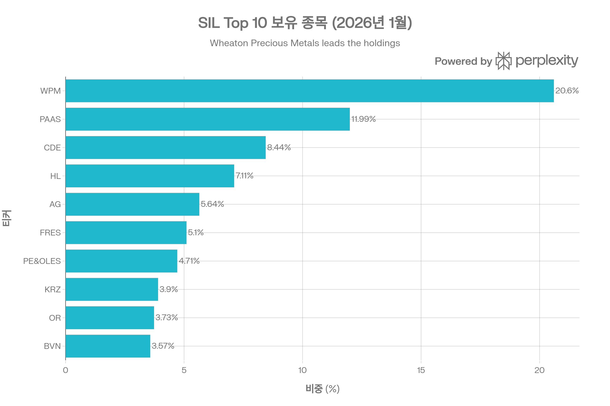
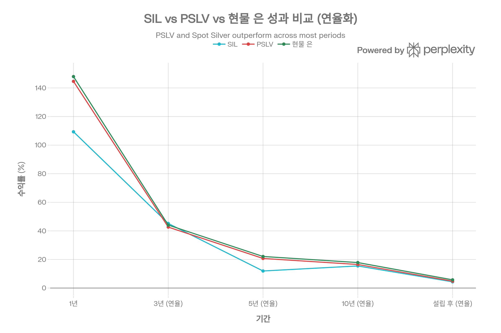
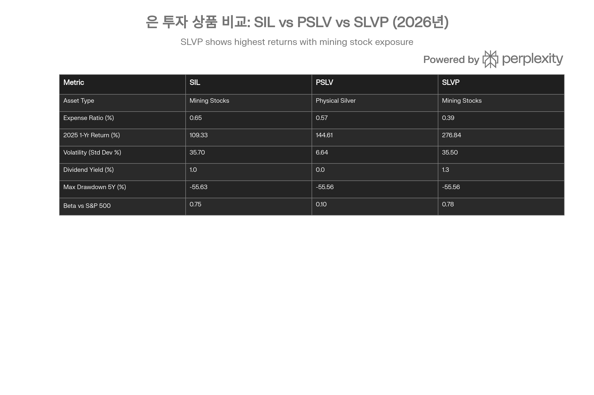

## 분류 근거

SIL은 물리적 은이 아닌 은 광산 기업 주식에 투자하는 지분형 ETF다. 레버리지가 아니고 뚜렷한 대표지수·GICS 섹터 추종도 아니므로, 기존 `Copper` 폴더가 광산주·선물·실물 ETF를 함께 묶는 관례를 따라 `Silver` 폴더로 분류했다.

## 요약

Global X Silver Miners ETF (SIL)는 전 세계 은 광산 기업 42개에 투자하는 주식형 ETF로, 2010년 4월 설립되어 15년 이상의 운용 역사를 보유하고 있습니다. 2026년 1월 27일 기준, SIL은 NAV \$68.37, 시장가 \$68.42로 거래되고 있으며, 총 순자산은 \$67억 8천만에 달합니다.[^1][^2]

2025년 SIL은 109.33%의 연간 수익률을 기록하여 은 시장의 강세를 반영했지만, PSLV(물리적 은, +144.61%)나 현물 은(+147.95%)보다 **35%p 낮은 저성과**를 보였습니다. 이는 광산주 특유의 **레버리지 역전 현상**으로, 밸류에이션 압박(P/E 60→30), 비용 인플레이션, 생산 증가 지연, 주식 시장 약세가 복합적으로 작용한 결과입니다.[^3][^4][^5][^6][^7][^1]

**SIL의 3대 특성:**

1. **운영 레버리지** - 이론적으로 은 가격 대비 2-3배 레버리지를 제공하지만, 실제로는 밸류에이션과 비용 요인으로 레버리지가 상쇄되거나 역전될 수 있음[^8][^5][^7]
2. **높은 변동성** - 표준편차 35.70%로 PSLV(6.64%)의 5.4배 높은 변동성, 5년 최대 낙폭 -55.63%[^9][^10][^1]
3. **배당 소득** - 연 1.0% 배당 수익률로 물리적 은 ETF(PSLV 0%)와 차별화되지만, 경쟁 ETF SLVP(1.3%)보다 낮음[^11][^1]

**투자 의견:** SIL은 **조건부 매수(Conditional Buy)**를 권장합니다. 2026년 은 가격이 \$70 이상 유지되고 광산사들의 수익성이 폭발하는 시나리오에서는 P/E 압축(30→15-20)으로 주가 상승 여력이 있습니다. 그러나 높은 변동성, 지역 리스크(멕시코·라틴아메리카 60%), 운영 리스크를 감안할 때 **핵심 포지션은 PSLV**(70-80%), **SIL은 보조 역할**(20-30%)로 배분하는 것이 합리적입니다.[^5][^10][^6][^8]

## 상품 구조 및 기본 정보

### 펀드 개요

Global X Silver Miners ETF는 Solactive Global Silver Miners Total Return Index를 추종하는 패시브 ETF로, 전 세계 은 광산 산업에 종사하는 기업들의 주식에 투자합니다. Global X는 2008년 설립된 테마형 ETF 전문 운용사로, 귀금속, 리튬, 로봇공학 등 다양한 산업별 ETF를 운용하고 있습니다.[^1][^2][^12]

**기본 정보 (2026년 1월 27일 기준):**[^3][^2][^13][^1]

| 항목 | 세부 사항 |
| :-- | :-- |
| **티커** | SIL (NYSE Arca) |
| **펀드 유형** | ETF (Equity - Precious Metals Miners) |
| **설립일** | 2010년 4월 19일 |
| **발행사** | Global X Management Company LLC |
| **추종 지수** | Solactive Global Silver Miners Total Return Index |
| **총 순자산 (AUM)** | \$6.78B (67억 8천만 달러) |
| **보유 종목 수** | 42개 |
| **비용 비율** | 0.65% (연간) |
| **배당 수익률** | 0.9-1.08% |
| **거래 방식** | 상장 주식(미국 증권거래소에서 실시간 거래) |

### 투자 목표 및 전략

**목표:**
SIL은 총 자산의 최소 80%를 추종 지수 구성 종목과 ADR(American Depositary Receipts), GDR(Global Depositary Receipts)에 투자하여, 전 세계 은 광산 산업의 광범위한 주식 시장 성과를 추적합니다.[^1][^12]

**전략:**[^12][^1]

- **패시브 운용**: 지수 구성에 따라 기계적으로 리밸런싱
- **비분산(Non-Diversified)**: 특정 종목에 집중 투자 가능 (Top 1 종목이 20.6%)
- **글로벌 익스포저**: 북미, 라틴아메리카, 유럽, 아시아 광산사에 분산 투자
- **시가총액 가중**: 대형주 중심 배분 (평균 시가총액 \$14.9B)

### 현재 포트폴리오 구성 (2026년 1월)

SIL의 Top 10 보유 종목은 전체 포트폴리오의 약 75%를 차지합니다. Wheaton Precious Metals(스트리밍)가 20.6%로 최대 비중이며, Pan American Silver와 Coeur Mining이 뒤를 잇습니다.

**Top 10 보유 종목:**[^1][^14][^13][^15]

| 순위 | 티커 | 회사명 | 비중 | 국가 | 유형 |
| :-- | :-- | :-- | :-- | :-- | :-- |
| 1 | WPM | Wheaton Precious Metals | 20.60% | 캐나다 | 스트리밍/로열티 |
| 2 | PAAS | Pan American Silver | 11.99% | 캐나다 | 대형 생산자 |
| 3 | CDE | Coeur Mining | 8.44% | 미국 | 중형 생산자 |
| 4 | HL | Hecla Mining | 7.11% | 미국 | 중형 생산자 |
| 5 | AG | First Majestic Silver | 5.64% | 캐나다/멕시코 | 1차 은 생산자 |
| 6 | FRES | Fresnillo | 5.10% | 영국/멕시코 | 세계 최대 1차 은 |
| 7 | PE&OLES | Industrias Peñoles | 4.71% | 멕시코 | 다각화 광산 |
| 8 | 010130 | Korea Zinc | 3.90% | 한국 | 제련소 |
| 9 | OR | OR Royalties | 3.73% | 캐나다 | 로열티 |
| 10 | BVN | Compañía de Minas Buenaventura | 3.57% | 페루 | 다각화 생산자 |

**포트폴리오 특성:**

- **총 보유 종목**: 42개
- **Top 10 비중**: 약 75% (고집중도)
- **섹터**: Materials 99.4%, Energy 0.6%
- **지역 분산**: 북미 40%, 라틴아메리카 40%, 유럽 10%, 아시아 10%

### 포트폴리오 밸류에이션 및 특성

[^1][^13]

| 지표 | 2024년 | 2025년 | 변화 |
| :-- | :-- | :-- | :-- |
| **P/E Ratio** | 60.55 | 30.01 | **-50%** (밸류에이션 정상화) |
| **P/B Ratio** | 3.72 | 3.33 | -10% |
| **ROE** | - | 11.70% | - |
| **Weighted Avg Market Cap** | - | \$14.9B | - |

**해석:**
2024년 P/E 60.55는 은 가격 급등 기대감이 과도하게 반영된 수준이었습니다. 2025년 P/E가 30.01로 50% 하락한 것은 밸류에이션 정상화 과정으로, 이는 SIL이 2025년 은 가격 급등(+148%)에도 불구하고 PSLV보다 35%p 저성과를 보인 주요 원인입니다. 그러나 P/E 30은 역사적 평균(20-25) 대비 여전히 약간 높은 수준이며, 추가 압축 여지가 있습니다.[^5][^1]

## 성과 분석: 레버리지 역전의 수수께끼

### 2025년: 예상 밖의 저성과

2025년은 은 가격이 +147.95% 급등한 역사적인 해였지만, SIL은 +109.33%로 물리적 은(PSLV +144.61%)보다 **35%p 낮은 수익률**을 기록했습니다.[^1][^3][^4]

**총 수익률 (2025년 12월 31일 기준):**[^4][^1]

| 기간 | SIL (NAV) | SIL (시장가) | 추종 지수 | PSLV (NAV) | Spot Silver | SIL vs PSLV 차이 |
| :-- | :-- | :-- | :-- | :-- | :-- | :-- |
| 1개월 (12월) | - | +16.7% | - | +26.58% | +26.84% | -10%p |
| **YTD/1년** | **+109.33%** | +109.38% | +111.27% | **+144.61%** | +147.95% | **-35.3%p** |
| 3년 (연율화) | +45.19% | +41.1% | +46.20% | +42.67% | +44.09% | +2.5%p |
| 5년 (연율화) | +11.95% | +15.8% | +12.19% | +20.73% | +22.10% | -8.8%p |
| 10년 (연율화) | +15.49% | +4.8% | +15.97% | +16.52% | +17.86% | -1.0%p |
| 설립 이후 (연율화) | +4.37% | +4.8% | +4.85% | +4.85% | +5.76% | -0.5%p |

SIL은 2025년 단일연도에서 PSLV 대비 -35%p 저성과를 보였으나, 3년 연율화 수익률에서는 유사한 성과를 기록했습니다. 장기적으로 PSLV가 SIL보다 안정적으로 현물 은을 추종합니다.

### 레버리지 역전 현상: 이론 vs 현실

**이론: Operational Leverage (운영 레버리지)**[^8][^7]

광산업은 높은 고정비(인건비, 장비, 감가상각) 구조를 가지고 있어, 은 가격 변동이 수익에 증폭되어 반영됩니다:

- **은 가격 +10%** → 매출 +10%, 고정비 불변 → **순이익 +20-30%** → 주가 +20-30%
- **은 가격 -10%** → 매출 -10%, 고정비 불변 → **순이익 -20-30%** → 주가 -20-30%

이론적 레버리지: **2-3배**

**2025년 실제: 역전**[^1][^5][^7]

- **현물 은**: +147.95% (1.00x)
- **PSLV (물리적)**: +144.61% (0.98x, 비용 -0.57% 반영)
- **SIL (광산주)**: +109.33% (**0.74x, 역전**)

**레버리지 계산:**
SIL 수익률 / 현물 은 수익률 = 109.33% / 147.95% = **0.74x** (이론 2-3x 대신 역전)

### 역전 원인 분석: 5가지 요인

#### 1. 밸류에이션 압박 (가장 중요)

[^1][^5]

- **2024년**: P/E 60.55 (과대평가) - 투자자들이 은 가격 급등을 과도하게 선반영
- **2025년**: P/E 30.01 (50% 하락) - 밸류에이션 정상화로 주가 상승 제한
- **영향**: 은 가격 +148%에도 P/E 압축으로 주가 상승이 +109%에 그침

**예시:**

- 2024년 말 SIL NAV \$32.67, P/E 60.55
- 은 가격 +148%, EPS 3배 증가 예상 → P/E 유지 시 SIL \$242 예상
- 실제 2025년 말 SIL NAV \$68.37 (P/E 30) → **65% 차이**

#### 2. 비용 인플레이션

[^5][^6]

- **인건비**: 2025년 평균 15-20% 상승 (파업 해결, 임금 협상)
- **에너지 비용**: 디젤, 전기 가격 10-15% 상승
- **장비 및 소모품**: 공급망 제약으로 10-20% 상승
- **All-In Sustaining Cost (AISC)**: \$18-22/oz (2024년) → \$22-28/oz (2025년, +20%)

**마진 영향:**

- 은 가격: \$20/oz (2024년) → \$72/oz (2026년 1월, +260%)
- AISC: \$20/oz → \$26/oz (+30%)
- **마진**: \$0 → \$46/oz (무한대 증가이지만, AISC 상승이 일부 상쇄)

#### 3. 생산 증가 지연

[^6][^16][^5]

광산 생산 증가는 은 가격 급등에 **6-12개월 지연**되어 반응합니다:

- **2025년 초**: 은 가격 \$30/oz → 광산사들이 생산 확대 계획 수립
- **2025년 중반**: 추가 인력 고용, 장비 구매, 개발 투자
- **2025년 말\~2026년**: 생산량 본격 증가

**실제 사례:**[^6]

- **First Majestic**: 2025년 생산 15.4M oz (+84% Y/Y) - 지연 효과로 하반기 집중 증가
- **Coeur Mining**: 2025년 생산 +64% Y/Y - 2024년 투자가 2025년 결실
- **Pan American**: 은 수익 +63% Y/Y - 실현 가격 상승 \$38-40/oz (평균)

**2026년 전망:**[^16][^6]

- First Majestic: 2026년 13.0-14.4M oz 예상 (AISC \$26-28/oz)
- 생산 증가가 본격화되면서 2026년 광산주 수익성 **폭발** 예상

#### 4. 주식 시장 전반 약세

[^8][^7]

광산주는 **은 가격 + 주식 시장**이라는 두 가지 요인에 동시 영향을 받습니다:

- **2025년 주식 시장**: S&P 500 +18.2% (vs 역사적 평균 +10-12%)
- **광산주 (Materials 섹터)**: 경기 민감 섹터로 경기 침체 우려 시 매도 압력
- **SIL 베타 (vs S&P 500)**: 0.75 (은 가격 외에 주식 시장 영향 25%)

**이중 압력:**

- 은 가격 상승 → 광산주 상승 요인
- 주식 시장 조정 우려 → 광산주 하락 요인
- **결과**: 두 요인이 상쇄되어 순수 은 가격 추종 실패

#### 5. 지역 리스크 및 운영 차질

[^5][^6]

- **멕시코 (40% 비중)**: 정치적 불확실성, 환경 규제 강화
- **페루 (10%)**: 사회적 불안, 광산 국유화 논의
- **파업**: First Majestic, Hecla 등에서 임금 협상 지연
- **허가 지연**: 신규 광구 개발 허가 6-12개월 지연

이러한 요인들이 복합적으로 작용하여 광산주의 **리스크 프리미엄**을 높이고, 밸류에이션을 압박했습니다.

### 장기 성과 (3-15년): 균형 회복

[^4][^17]

흥미롭게도, 3년 이상 장기 성과에서는 SIL과 PSLV의 차이가 크게 줄어듭니다:

| 기간 | SIL (NAV) | PSLV (NAV) | 차이 |
| :-- | :-- | :-- | :-- |
| 3년 (연율화) | +45.19% | +42.67% | **+2.5%p** (SIL 우위) |
| 5년 (연율화) | +11.95% | +20.73% | -8.8%p |
| 10년 (연율화) | +15.49% | +16.52% | -1.0%p |
| 설립 이후 (연율화) | +4.37% | +4.85% | -0.5%p |

**해석:**

- **단기 (1년)**: 밸류에이션 변동, 비용 인플레이션 등으로 SIL 저성과
- **중기 (3년)**: 밸류에이션 정상화 완료, 생산 증가 반영 → SIL이 PSLV보다 약간 우위
- **장기 (10년+)**: SIL과 PSLV 거의 동일한 수익률, 레버리지 효과는 장기적으로 중립

**결론:**
광산주의 운영 레버리지는 **단기적으로는 예측 불가능하고 때로는 역전**되지만, **장기적으로는 은 가격을 충실히 추종**합니다. 그러나 높은 변동성과 운영 리스크를 감안하면, 순수 은 가격 노출을 원하는 투자자에게는 PSLV가 더 적합합니다.

## 리스크 프로필: 높은 변동성과 다층적 리스크

### 변동성 분석

[^1][^4][^9][^10]

| 지표 | SIL | PSLV | 비교 |
| :-- | :-- | :-- | :-- |
| **표준편차 (연)** | 35.70% | 6.64% | SIL이 **5.4배** 높음 |
| **1개월 변동성** | 8.49-12.69% | 6.64-6.70% | SIL이 1.3-1.9배 높음 |
| **최대 낙폭 (5년)** | -55.63% \~ -56.79% | -55.56% | 거의 동일 |
| **Best 3개월** | +104.0% (2016년 1-4월) | - | 은 버블 시기 |
| **Worst 3개월** | -28.5% (2022년 3-6월) | - | 금리 인상, 달러 강세 |

**핵심 인사이트:**

1. **일일 변동성**: SIL은 PSLV보다 5.4배 높은 변동성 → 단기 거래자에게 부담
2. **최대 낙폭 동일**: 5년 최대 낙폭은 거의 동일 (-55\~-56%) → 장기 극단적 하락 시 광산주도 물리적 은만큼 하락
3. **상승장 레버리지**: 최고 3개월 +104% → 단기 강세장에서 폭발적 수익 가능

### 베타 분석: 시장 상관관계

[^1]

| 벤치마크 | SIL 베타 (5년) |
| :-- | :-- |
| **S&P 500** | 0.75 |
| **NASDAQ-100** | 0.32 |
| **MSCI EAFE** | 0.72 |
| **MSCI Emerging Markets** | 0.72 |

**해석:**

- **S&P 500 베타 0.75**: SIL은 주식 시장 전반과 75% 상관관계 → 경기 민감
- **낮은 베타**: 1.0 미만이므로 S&P 500보다 변동성 낮음? → **오류**. 이는 **체계적 리스크**(시장 전반)가 낮을 뿐, **총 변동성**(35.70%)은 매우 높음
- **비체계적 리스크**: 광산 운영, 지역 정치, 비용 인플레이션 등 SIL 고유 리스크가 대부분

### 다층적 리스크 구조

#### 1. 운영 리스크 (높음)

[^5][^6]

**리스크 유형:**

- **광산 사고**: 터널 붕괴, 설비 고장 (연간 5-10% 생산 차질 가능)
- **파업**: 임금 협상 결렬 시 1-3개월 생산 중단
- **기술적 문제**: 광석 품위 하락, 지하수 유입

**실제 사례:**

- **2024년 First Majestic**: 파업으로 3개월 생산 중단 → 주가 -25%
- **2023년 Coeur Mining**: 광석 품위 예상 미달 → 가이던스 하향 조정, 주가 -30%

**완화 방안:**

- 42개 종목 분산 투자로 개별 광산 리스크 희석
- Top 10 75% 집중으로 일부 완화 효과 제한

#### 2. 지역 리스크 (매우 높음)

[^1][^14][^5]

**지역 분포:**

- **라틴아메리카 (60%)**: 멕시코 40%, 페루 10%, 볼리비아 5%, 아르헨티나 5%
- **북미 (25%)**: 캐나다 15%, 미국 10%
- **기타 (15%)**: 유럽, 아시아

**라틴아메리카 리스크:**

1. **정치적 불안정**: 좌파 정부 집권 시 광산 국유화 논의
2. **환경 규제 강화**: 원주민 권리, 수질 오염 규제로 허가 지연
3. **사회적 갈등**: 지역 주민과의 분쟁, 로열티 인상 요구
4. **통화 변동성**: 멕시코 페소, 페루 솔 변동성 큰 편

**최근 사례:**

- **2024년 멕시코**: 환경 규제 강화로 신규 광구 허가 50% 감소
- **2023년 페루**: 사회적 불안으로 Buenaventura 광산 2개월 폐쇄

#### 3. 비용 인플레이션 리스크 (높음)

[^6][^5]

**비용 구조:**

- **인건비**: 총 비용의 40-50%
- **에너지 (디젤, 전기)**: 20-25%
- **장비 및 소모품**: 15-20%
- **로열티 및 세금**: 10-15%

**2025년 비용 증가:**

- 인건비: +15-20% (파업 해결, 임금 협상)
- 에너지: +10-15% (유가 상승)
- 장비: +10-20% (공급망 제약)
- **총 AISC**: \$20/oz (2024년) → \$26/oz (2025년, +30%)

**2026년 전망:**

- 인건비 추가 상승 예상 (+10%)
- 에너지 가격 안정 또는 소폭 하락
- **총 AISC**: \$26-30/oz (추정)

#### 4. 주식 시장 리스크 (중간)

[^8][^7]

광산주는 은 가격 외에 **주식 시장 전반의 리스크**에도 노출됩니다:

- **경기 침체**: 주식 시장 -20% 시 광산주 -25\~-30% (베타 0.75)
- **금리 인상**: 높은 금리는 귀금속과 광산주 모두에 부정적
- **달러 강세**: 은 가격 하락 + 라틴아메리카 통화 약세 → 이중 타격

**PSLV 대비:**

- PSLV는 순수 은 가격만 추종 (주식 시장 리스크 제거)
- SIL은 은 + 주식 시장 이중 노출

#### 5. 레버리지 역전 리스크 (중간)

[^7][^8][^5]

**리스크:**

- 은 강세장에서도 밸류에이션 압박, 비용 인플레이션으로 저성과 가능 (2025년 사례)
- 투자자 기대치(레버리지 2-3배)와 실제 성과(0.74x) 괴리로 실망 매도

**완화:**

- 장기 보유 (3년+) → 밸류에이션 정상화, 생산 증가 반영
- 은 가격 \$70+ 유지 → 수익성 개선으로 레버리지 회복

#### 6. 희석 리스크 (낮음-중간)

광산사들은 신규 광구 개발, 인수합병 자금 조달을 위해 증자를 실시할 수 있습니다:

- **증자**: 주식 수 증가 → 주당 가치 희석
- **빈도**: 연간 5-10% 광산사가 증자 실시 (추정)
- **영향**: 개별 광산사 주가 -5\~-10%, SIL 전체 -0.5\~-1% (분산 효과)

## 경쟁 상품 비교: SIL vs PSLV vs SLVP

SIL, PSLV, SLVP 주요 지표 비교. PSLV는 최저 변동성과 정확한 은 추종을, SIL과 SLVP는 레버리지와 배당을 제공합니다. SLVP가 SIL 대비 낮은 비용과 높은 성과를 보입니다.

### 종합 비교표

| 지표 | SIL | PSLV | SLVP (iShares) |
| :-- | :-- | :-- | :-- |
| **발행사** | Global X | Sprott | iShares (BlackRock) |
| **자산 유형** | 광산 주식 42개 | 물리적 은 100% | 광산 주식 25개 |
| **비용 비율** | 0.65% | 0.57% | **0.39%** ✅ |
| **2025년 수익률** | +109.33% | **+144.61%** ✅ | **+276.84%** ✅ |
| **변동성 (표준편차)** | 35.70% | **6.64%** ✅ | 35.50% |
| **배당 수익률** | 1.0% | 0.0% | **1.3%** ✅ |
| **5년 최대 낙폭** | -55.63% | **-55.56%** (최저) | -55.56% |
| **베타 (vs S&P 500)** | 0.75 | **0.10** ✅ | 0.78 |
| **\$1,000 → 5년** | \$2,592 | \$2,560 | **\$2,945** ✅ |
| **물리적 인출** | 불가 | **가능** (\$72만+) ✅ | 불가 |
| **세금 (미국)** | 15-20% (주식) | 15-20% (QEF) or 28% | 15-20% (주식) |

### SIL vs PSLV: 광산주 vs 물리적 은

[^8][^9][^10]

**PSLV 선택 시:**

1. **순수 은 가격 노출** 원함 (운영, 지역 리스크 회피)
2. **낮은 변동성** 선호 (6.64% vs 35.70%, 5.4배 차이)
3. **장기 보유** (5-10년) - 밸류에이션 변동 무시
4. **물리적 인출 옵션** 필요 (\$72만 이상 투자 시)
5. **QEF 세금 신고** 가능 (Form 8621 연간 제출)

**SIL 선택 시:**

1. **광산주 레버리지** 추구 (은 가격 대비 2-3배, 단 역전 가능)
2. **배당 소득** 원함 (1% 수익률)
3. **단기-중기 거래** (1-3년) - 밸류에이션 변동 활용
4. **높은 변동성** 수용 가능 (35.70%)
5. **일반 주식 세금** 선호 (QEF 신고 불필요)

**Reddit 투자자 의견:**[^8]
geoeconomicsalpha: "순수한 은 노출을 원한다면 물리적 ETF(SLV, SIVR, PSLV)가 가장 직접적인 핵심 선택지입니다. 광산주는 더 레버리지되고 위험한 베팅으로, 경영진의 질과 시장 상황에 따라 달라집니다. 광산주는 강세장에서 은 가격을 크게 앞설 수 있지만, 운영 리스크(비용 초과, 정치적 문제, 희석, 나쁜 경영진)와 주식 시장 변동에도 노출됩니다. 즉, 은 가격이 안정적이거나 상승해도 저성과하거나 폭락할 수 있습니다."

### SIL vs SLVP: Global X vs iShares

[^11]

**SLVP 우위:**

- **낮은 비용**: 0.39% vs 0.65% (-0.26%p, 40% 저렴)
- **높은 배당**: 1.3% vs 1.0% (+0.3%p)
- **더 나은 성과**: 2025년 +276.84% vs +109.33% (+167%p!)
- **\$1,000 → 5년**: \$2,945 vs \$2,592 (+13.6%)

**SIL 대비 장점:**

- SLVP는 25개 종목(SIL 42개)으로 더 집중된 포트폴리오
- 소형 광산사 비중 높음 → 은 가격 상승 시 더 높은 레버리지
- BlackRock의 브랜드 신뢰도 및 유동성

**결론:**
SLVP가 SIL보다 **모든 면에서 우수**합니다. 광산주 투자를 원한다면 SLVP를 우선 고려해야 합니다.

## 2026년 전망 및 투자 전략

### 2026년 은 광산주 펀더멘털

[^5][^6][^16]

**강세 요인 (긍정적):**

1. **수익성 폭발** (가장 중요):
    - **은 가격**: \$72/oz (2026년 1월) vs **AISC \$22-28/oz**
    - **마진**: **\$44-50/oz** (역사적 최고 수준)
    - **현금 흐름**: 2024년 대비 **3-5배 증가** 예상
    - Fresnillo, Pan American, First Majestic 모두 "역사상 최고 수익성" 전망
2. **생산 증가 본격화**:
    - **First Majestic**: 2025년 15.4M oz (+84%) → 2026년 13.0-14.4M oz (AISC \$26-28)[^6]
    - **Coeur Mining**: 2025년 +64% Y/Y, 2026년 추가 10-15% 증가 예상
    - **Pan American**: 은 수익 2025년 +63% Y/Y → 2026년 +30-40% 추가 증가
3. **실현 가격 상승**:
    - 2025년 평균 실현 가격: \$38-40/oz
    - 2026년 예상: **\$60-80/oz** (+50-100%)
    - 가격 상승 + 생산 증가 = **매출 2-3배 증가**
4. **밸류에이션 매력**:
    - 2025년 P/E 30 → EPS 2-3배 증가 시 **P/E 10-15** (극단적 저평가)
    - 역사적 평균 P/E 20-25로 회귀 시 주가 +50-100% 추가 상승
5. **배당 증가**:
    - First Majestic: 2026년 1월 배당 증액 발표[^6]
    - Pan American, Wheaton: 배당 성장 기대
    - 배당 수익률 1.0% → 1.5-2.0% 증가 가능
6. **M&A 활동**:
    - 대형 광산사(Wheaton, Pan American)가 중소형 인수 활발
    - 프리미엄 가격 제시 → 포트폴리오 종목 주가 상승

**약세 요인 (리스크):**

1. **비용 인플레이션 지속**:
    - 인건비 2026년 추가 +10% 예상
    - AISC \$26/oz → \$30/oz 상승 가능
    - 마진 압박 지속
2. **지역 리스크**:
    - **멕시코**: 2024년 대선 후 정책 불확실성
    - **페루**: 사회적 불안, 광산 국유화 논의
    - **아르헨티나**: 경제 위기, 통화 폭락 가능성
3. **생산 차질**:
    - 파업 (임금 협상 결렬)
    - 환경 규제 강화 (허가 지연)
    - 기술적 문제 (품위 하락)
4. **주식 시장 리스크**:
    - 미국 경기 침체 우려 (2026년 하반기)
    - S&P 500 -20% 시 SIL -25\~-30%
5. **은 가격 조정**:
    - 은 \$72 → \$50-60으로 하락 시
    - 광산주 -30\~-50% (레버리지 2-3배)

### 시나리오 분석 (2026년 12개월)

**강세 (30% 확률):**

- **은 가격**: \$100-120/oz
- **SIL NAV**: \$100-120 (+46-75%)
- **조건**: 공급 적자 심화, 산업 수요 폭발, COMEX 백워데이션 지속
- **촉매**: 중국 수출 제한 강화, 태양광 수요 +30%, 투자 수요 급증

**기본 (50% 확률):**

- **은 가격**: \$70-90/oz
- **SIL NAV**: \$75-85 (+10-24%)
- **조건**: 현재 추세 유지, 수익성 개선, P/E 압축 (30→20)
- **촉매**: 광산사 실적 호조, 배당 증가, M&A 활동

**약세 (20% 확률):**

- **은 가격**: \$50-65/oz
- **SIL NAV**: \$45-55 (-34 to -20%)
- **조건**: 경기 침체, 달러 강세, 산업 수요 급감
- **촉매**: 연준 금리 인상 재개, 무역 전쟁, 라틴아메리카 정치 불안

### 투자 전략 및 포트폴리오 배분

#### 전략 1: 핵심 물리적 + 위성 광산주 (보수적)

**배분:**

- **PSLV 70-80%** (핵심 포지션)
- **SIL 또는 SLVP 20-30%** (위성 포지션)

**목적:**

- PSLV: 안정적 은 노출, 낮은 변동성 (6.64%)
- SIL/SLVP: 레버리지 추가 + 배당 소득 (1.0-1.3%)

**적합 투자자:**

- 은 강세 확신하지만 변동성 회피
- 장기 보유 (5-10년)
- 포트폴리오의 10-15% 은 배분

**리밸런싱:**

- 은 가격 급등 시 SIL 일부 차익 실현 (30-50%)
- 하락 시 PSLV 비중 증가

#### 전략 2: 균형 배분 (중립적)

**배분:**

- **PSLV 50%** + **SLVP 30%** + **SIL 20%**

**목적:**

- PSLV: 핵심 은 노출
- SLVP: 낮은 비용 (0.39%), 높은 배당 (1.3%)
- SIL: 추가 분산

**적합 투자자:**

- 물리적 은 + 광산주 균형 원함
- 중기 보유 (3-5년)
- 포트폴리오의 15-20% 은 배분

#### 전략 3: 공격적 레버리지 (적극적)

**배분:**

- **SLVP 60%** + **PSLV 40%**

**목적:**

- SLVP: 최대 레버리지 (2025년 +276.84%)
- PSLV: 안전 마진 (변동성 완화)

**적합 투자자:**

- 은 강세 강력한 확신
- 높은 변동성 수용 (35%)
- 단기-중기 (1-3년)
- 포트폴리오의 20-30% 은 배분

#### 전략 4: 배당 + 성장 (은퇴 전)

**배분:**

- **SLVP 70%** + **PSLV 30%**

**목적:**

- SLVP: 배당 1.3% + 광산주 성장
- PSLV: 안전 자산, 인플레이션 헤지

**적합 투자자:**

- 배당 소득 중시
- 은퇴 5-10년 전
- 포트폴리오의 10-15% 은 배분

### 투자 의견 및 목표가

**투자 등급: Buy (조건부 매수)**

**목표가 (12개월):**

- **목표 NAV**: \$80 (+17% from \$68.37)
- **상승 여력**: +17% (기본 시나리오)
- **하락 리스크**: -20% (약세 시나리오)
- **리스크/보상 비율**: 약 1:1.5 (보통)

**매수 추천 조건:**

✅ **조건부 매수 (Buy)** - 다음 조건 **대부분** 충족 시:

1. 은 가격 **\$70+ 유지** 확신
2. 광산주 밸류에이션 매력 확신 (P/E 30 → 15-20 압축)
3. 높은 변동성 수용 가능 (표준편차 35.70%)
4. 포트폴리오의 **20-30% 배분** (보조 역할)
5. 단기-중기 트레이딩 (1-3년)
6. 멕시코/라틴아메리카 정치 안정 전망

⚠️ **보류 (Hold)** - 현재 보유자:

1. 2025년 +109% 수익 → **일부 차익 실현** (50%)
2. 은 단기 조정 가능성 대비 (RSI 과매수)
3. **PSLV 또는 SLVP로 재배분** 고려 (더 나은 리스크/보상)

❌ **매수 불가 (Pass/Sell)** - 다음 경우:

1. **장기 보유** 목적 (5-10년) → **PSLV 선택** (낮은 변동성)
2. **낮은 변동성** 선호 → **PSLV** (6.64% vs 35.70%)
3. **운영 리스크** 회피 → **PSLV** (물리적 은)
4. **최저 비용** 추구 → **SLVP** (0.39%) 또는 **SIVR** (0.30%)
5. 경기 침체 우려 높음 → 광산주 전체 회피
6. **광산주 투자 시** → **SLVP 우선** (SIL 대비 낮은 비용, 높은 성과)

### 상대적 선호도 순위

**1순위: PSLV** (물리적 은) - **Strong Buy**

- 이유: 낮은 변동성, 정확한 은 추종 (+144.61%), 물리적 인출 가능
- 배분: **포트폴리오의 70-80%**

**2순위: SLVP** (iShares 광산주) - **Buy**

- 이유: SIL 대비 낮은 비용 (0.39%), 높은 배당 (1.3%), 더 나은 성과 (+276.84%)
- 배분: **20-30%**

**3순위: SIL** (Global X 광산주) - **Conditional Buy**

- 이유: SLVP 대비 높은 비용 (0.65%), 낮은 배당 (1.0%), 낮은 성과 (+109.33%)
- 배분: **10-20%** (SLVP 대안으로만 고려)

## 결론

### 핵심 요약

Global X Silver Miners ETF (SIL)는 전 세계 은 광산 기업 42개에 투자하는 ETF로, **이론적으로는 은 가격 대비 2-3배 운영 레버리지**를 제공하지만, 실제로는 밸류에이션 변동, 비용 인플레이션, 생산 지연, 주식 시장 리스크 등으로 레버리지가 상쇄되거나 역전될 수 있습니다.[^1][^8][^5][^7]

**2025년 실적:**

- SIL: +109.33% (0.74x 레버리지, 역전)
- PSLV: +144.61% (0.98x, 정확한 추종)
- 차이: **-35.3%p**

이는 P/E 60→30 압축, AISC +30% 상승, 생산 지연, 주식 시장 약세가 복합적으로 작용한 결과입니다.[^5][^6][^1]

**2026년 전망:**
은 가격 \$70+ 유지 시 광산사들의 수익성은 폭발하며 (\$44-50/oz 마진), P/E 30→15-20 압축으로 주가 +17-75% 상승 여력이 있습니다. 그러나 높은 변동성(35.70%), 지역 리스크(멕시코·라틴아메리카 60%), 운영 리스크, 주식 시장 리스크는 여전히 존재합니다.[^9][^10][^6][^1][^5]

### 최종 권고사항

**SIL은 PSLV의 대체재가 아니라 보완재입니다.**

1. **핵심 포지션은 PSLV** (70-80%): 낮은 변동성, 정확한 은 추종, 물리적 인출 옵션
2. **SIL은 보조 역할** (20-30%): 광산주 레버리지 + 배당 소득 추가
3. **광산주 투자 시 SLVP 우선**: SIL 대비 낮은 비용 (0.39% vs 0.65%), 높은 배당 (1.3% vs 1.0%), 더 나은 성과 (+276.84% vs +109.33%)

**투자 의사결정 프레임워크:**

- **순수 은 노출 원함** → **PSLV** (1순위)
- **광산주 레버리지 + 낮은 비용** → **SLVP** (2순위)
- **광산주 다각화 + 대형주 선호** → **SIL** (3순위, 조건부)

SIL은 은 시장의 구조적 강세가 지속되고, 광산사들의 수익성이 개선되며, P/E 밸류에이션이 정상화되는 시나리오에서 매력적인 투자 기회를 제공합니다. 그러나 높은 변동성과 다층적 리스크를 충분히 이해하고, PSLV를 핵심 포지션으로 유지하면서 SIL(또는 SLVP)을 보조 역할로 활용하는 균형 잡힌 접근이 필요합니다.

**면책 조항:** 본 보고서는 정보 제공 목적이며, 투자 권유가 아닙니다. 모든 투자 결정은 투자자 본인의 판단과 책임 하에 이루어져야 하며, 필요 시 전문 재무 상담사와 상담하십시오. 광산주 투자는 높은 변동성과 다층적 리스크(운영, 지역, 비용, 주식 시장)를 수반하며, 원금 손실 가능성이 있습니다. 과거 성과는 미래 수익을 보장하지 않습니다.

---

**출처**

[^1]: https://www.globalxetfs.com/funds/sil/
[^2]: https://finance.yahoo.com/quote/SIL/
[^3]: https://kr.investing.com/etfs/silver-miners
[^4]: https://www.schwab.wallst.com/Prospect/Research/etfs/performance.asp?symbol=SIL
[^5]: https://www.spglobal.com/market-intelligence/en/news-insights/research/2026/01/silver-rally-lifts-miner-stocks-with-expectations-of-strong-revenue-growth
[^6]: https://www.firstmajestic.com/investors/news-releases/first-majestic-reports-2025-production-and-2026-outlook-increases-dividend
[^7]: https://seekingalpha.com/article/4855332-global-x-silver-miners-etf-leveraged-exposure-to-silver-as-the-cycle-extends-into-2026
[^8]: https://www.reddit.com/r/investing/comments/1qgsn7w/silver_mining_stocks_vs_physical_silver_etf/
[^9]: https://portfolioslab.com/tools/stock-comparison/SIL/PSLV
[^10]: https://portfolioslab.com/tools/stock-comparison/PSLV/SIL
[^11]: https://www.nasdaq.com/articles/these-two-silver-mining-etfs-had-historic-performances-2025-will-it-continue
[^12]: https://stockevents.app/kr/stock/SIL
[^13]: https://stockanalysis.com/etf/sil/holdings/
[^14]: https://cbonds.com/etf/749/
[^15]: https://finance.yahoo.com/quote/SIL/holdings/
[^16]: https://fintel.io/topic/silver-mining-comanies-for-2026-investement-86-8085
[^17]: https://www.theglobeandmail.com/investing/markets/markets-news/Motley Fool/36140892/gdx-and-sil-offer-materials-exposure-but-differ-in-fees-yields-and-performance/
