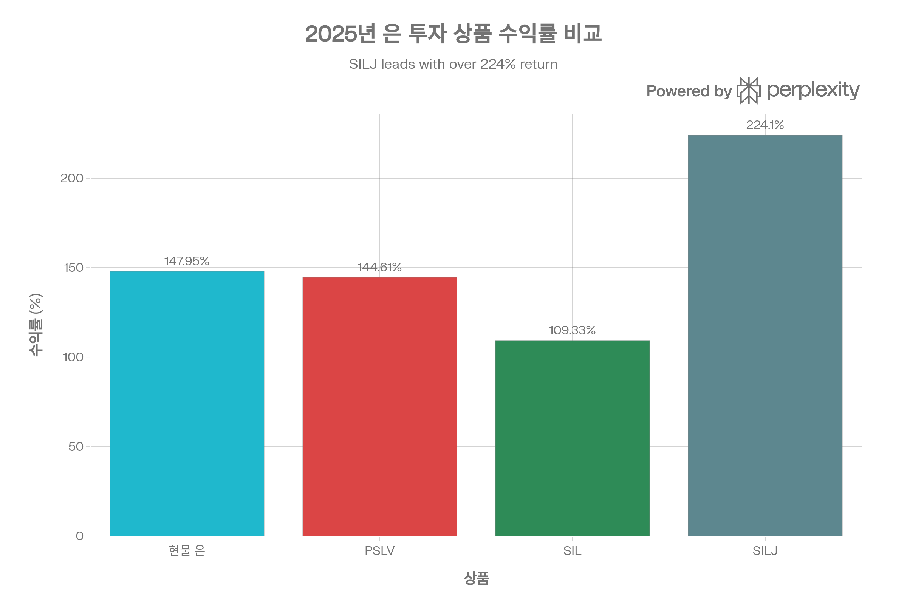
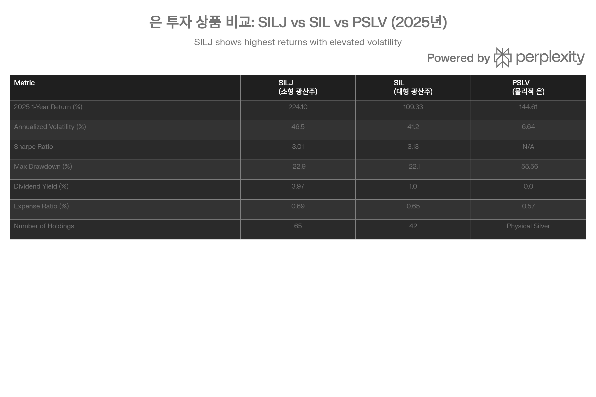

## 분류 근거

SILJ는 소형 은 광산 기업 주식에 투자하는 지분형 ETF다. SIL과 같은 이유로 `Silver` 폴더로 분류했다.

## 요약

Amplify Junior Silver Miners ETF (SILJ)는 2012년 설립된 **세계 최초이자 유일한 소형 은 광산주 전용 ETF**로, Nasdaq Junior Silver Miners Index를 추종하며 65개 소형·중형 은 광산 기업에 투자합니다. 2026년 1월 28일 기준, SILJ는 시장가 \$39.25, NAV \$38.53으로 거래되고 있으며, 총 순자산은 \$61억 7천만에 달합니다.[^1][^2][^3][^4]

2025년 SILJ는 **+224.10%**의 폭발적 수익률을 기록하여, 현물 은(+147.95%), PSLV(+144.61%), SIL(+109.33%)을 모두 앞질렀습니다. 이는 소형 광산주 특유의 **운영 레버리지(1.51배)**와 은 가격 급등 시 투기적 자금이 소형주로 집중되는 현상이 결합된 결과입니다.[^3][^5][^6]

**SILJ의 3대 핵심 특성:**

1. **극단적 레버리지** - 은 가격 대비 이론적 2-5배, 2025년 실제 1.51배 레버리지로 가장 높은 수익률 달성[^5][^6]
2. **극단적 변동성** - 연간 표준편차 46.5%로 PSLV(6.64%)의 **7배**, 일일 ±3% 변동은 "정상"이며 최악일 -11.32% 기록[^2][^5]
3. **극단적 리스크** - 탐사 실패율 90%, 자금 조달 리스크, 주식 희석, 지역 리스크(라틴아메리카 60%) 등 다층적 리스크 구조[^7][^8][^9][^10]

**2026년 전망:** 은 가격이 \$80-100+ 유지되고 소형 광산주가 은 가격을 "추격(catch-up)"하는 시나리오에서 SILJ는 **+43\~+133%** 추가 상승 잠재력이 있습니다. 그러나 극단적 변동성과 리스크를 감안할 때, SILJ는 **손절매 전략(-20%)을 반드시 동반한 단기-중기 트레이딩 전용 위성 포지션**으로만 활용해야 하며, 핵심 포지션은 PSLV(70-80%)로 유지하는 것이 필수적입니다.[^11][^12][^13][^6][^14][^7]

**투자 의견: Conditional Buy (조건부 매수)** - 고위험 고수익을 추구하고, 극단적 변동성을 수용할 수 있으며, 손절매 전략을 실행할 수 있는 단기-중기 트레이더에게만 포트폴리오의 5-15% 배분을 권장합니다.

## 상품 구조 및 기본 정보

### 펀드 개요: 세계 유일의 소형 은 광산주 ETF

SILJ는 2012년 11월 28일 Amplify ETFs가 출시한 ETF로, **소형(junior) 은 광산 기업만을 대상으로 하는 세계 최초이자 유일한 상품**입니다. "Junior miners"는 탐사, 자원 정의, 개발 초기 단계에 있는 소형 광산 기업으로, 시가총액 \$50M\~\$500M, 연간 은 생산 5M oz 미만(또는 생산 전) 기업을 지칭합니다.[^1][^3][^7][^8][^9]

**기본 정보 (2026년 1월 28일 기준):**[^2][^3][^4][^1]

| 항목 | 세부 사항 |
| :-- | :-- |
| **티커** | SILJ (NYSE Arca) |
| **펀드 유형** | ETF (Equity - Precious Metals Miners, Small-Cap) |
| **설립일** | 2012년 11월 28일 |
| **발행사** | Amplify ETFs (Amplify Investments LLC) |
| **추종 지수** | Nasdaq Junior Silver Miners Index (NMFSM) |
| **지수 제공** | Nasdaq, Inc. |
| **가중 방법론** | Thematic Market Cap (테마형 시가총액 가중) |
| **리밸런싱 빈도** | 분기별 (Quarterly) |
| **총 순자산 (AUM)** | \$6.17B (61억 7천만 달러) |
| **보유 종목 수** | 63-65개 |
| **비용 비율** | 0.69% (연간) |
| **배당 수익률** | 2.77-3.97% |
| **평균 일 거래량** | 15.25M shares |

### 투자 목표 및 전략

**목표:**
SILJ는 총 자산의 최소 80%를 Nasdaq Junior Silver Miners Index 구성 종목에 투자하여, 전 세계 소형 은 광산 산업의 주식 시장 성과를 추적합니다. 펀드는 은 채굴에서 매출의 대부분을 창출하거나, 글로벌 은 생산, 또는 신규 은 생산과 관련된 탐사 및 개발 활동에 종사하는 기업에 집중합니다.[^1][^2]

**전략:**[^3][^8][^1]

- **패시브 운용**: 지수 구성에 따라 기계적으로 추종
- **소형주 집중**: 시가총액 \$50M\~\$2B, 평균 \$14.9B보다 작은 기업 중심
- **순수 은 생산자 과가중**: Primary silver miners(은이 주 생산물)에 더 높은 비중
- **글로벌 다각화**: 캐나다 62%, 미국 15%, 라틴아메리카 15%, 기타 8%
- **비분산(Non-Diversified)**: 특정 종목에 집중 투자 가능 (Top 1종목 13.27%)

### 현재 포트폴리오 구성 (2026년 1월)

**Top 10 보유 종목:**[^15][^2][^3][^16]

| 순위 | 티커 | 회사명 | 비중 | 국가 | 시가총액 | 생산 단계 |
| :-- | :-- | :-- | :-- | :-- | :-- | :-- |
| 1 | HL | Hecla Mining | 13.27% | 미국 | \$2.5B | 중형, 생산 중 |
| 2 | AG | First Majestic Silver | 11.47% | 캐나다/멕시코 | \$2.8B | 중형, 생산 중 |
| 3 | CDE | Coeur Mining | 8.45% | 미국 | \$2.0B | 중형, 생산 중 |
| 4 | WPM | Wheaton Precious Metals | 5.15% | 캐나다 | \$27B | 대형, 스트리밍 |
| 5 | EXK | Endeavour Silver | 4.66% | 캐나다/멕시코 | \$800M | 소형, 생산 중 |
| 6 | PPTA | Perpetua Resources | 3.62% | 미국 | \$600M | 소형, 개발 |
| 7 | KGH | KGHM Polska Miedz | 3.47% | 폴란드 | \$5.5B | 중형, 구리+은 |
| 8 | PAAS | Pan American Silver | 2.99% | 캐나다 | \$7.5B | 대형 |
| 9 | BOL | Boliden | 2.91% | 스웨덴 | \$6.8B | 중형 |
| 10 | BVN | Compañía de Minas Buenaventura | 2.67% | 페루 | \$2.5B | 중형 |

**포트폴리오 특성:**

- **총 보유 종목**: 63-65개
- **Top 10 비중**: 약 58-59% (SIL 75% 대비 낮은 집중도)
- **섹터**: Materials 99.80%, Consumer Defensive 0.20%
- **지역 분산**: 캐나다 62%, 미국 15%, 멕시코 10%, 라틴아메리카 5%, 유럽/아시아 8%
- **시가총액 분포**:
    - Large-cap (>\$10B): 5-10%
    - Mid-cap (\$2B-\$10B): 30-40%
    - Small-cap (<\$2B): 50-60% ← **핵심 차별점**

### 포트폴리오 밸류에이션

[^2][^16]

| 지표 | SILJ | SIL | 해석 |
| :-- | :-- | :-- | :-- |
| **P/E Ratio** | 76.12 | 30.01 | SILJ는 SIL의 **2.5배** → 소형주 성장 프리미엄 또는 저수익성 |
| **P/S** | 4.9974 | - | 매출 대비 높은 밸류에이션 |
| **P/Cash Flow** | 11.5379 | - | 현금 흐름 대비 높은 밸류에이션 |
| **Dividend Yield** | 3.97% | 1.0% | SILJ가 4배 높은 배당 (2025년 수익 반영) |
| **Long-Term Earnings Growth** | 30.96% | - | 연 31% 수익 성장 기대 (매우 공격적) |

**P/E 76.12의 의미:**

1. **높은 성장 기대**: 투자자들이 미래 은 가격 급등과 생산 증가로 EPS 3-5배 증가 기대
2. **저수익성 현재**: 많은 junior miners가 개발 단계로 현재 EPS 낮거나 적자
3. **희석 효과**: 증자로 주식 수 증가 → 주당 이익 낮음

## 성과 분석: 2025년의 폭발

### 2025년: 역사적 수익률

2025년 은 가격의 역사적 급등(+147.95%)과 함께 SILJ는 **+224.10%**의 폭발적 수익률을 기록하여, 은 투자 상품 중 최고 성과를 달성했습니다.[^3][^5]

SILJ(소형 광산주)는 2025년 +224%로 최고 수익률을 기록했으며, 현물 은(+148%)과 PSLV(+145%)를 크게 앞섰습니다. 반면 SIL(대형 광산주)은 +109%로 역전 현상을 보였습니다.

**총 수익률 (2025년 12월 31일 기준):**[^15][^3][^17][^18]

| 기간 | SILJ (NAV) | SILJ (시장가) | PSLV | SIL | 현물 은 | SILJ 레버리지 |
| :-- | :-- | :-- | :-- | :-- | :-- | :-- |
| 1개월 (12월) | +19.81% | +12.94% | +26.58% | - | +26.84% | 0.74x |
| **YTD/1년** | **+224.10%** | **+214.29%** | +144.61% | +109.33% | +147.95% | **1.51x** |
| 3개월 | +32.35% | +26.76% | - | - | - | - |
| 3년 (연율화) | +199.40% | +178.82% | +42.67% | +45.19% | +44.09% | 4.52x |
| 5년 (연율화) | +133.94% | +105.90% | +20.73% | +11.95% | +22.10% | 6.06x |

**SILJ 레버리지 계산 (2025년):**
224.10% / 147.95% = **1.51x** (은 가격 대비)

**핵심 인사이트:**

1. **최고 단일연도 수익**: +224%는 PSLV (+145%), SIL (+109%)을 크게 앞섬
2. **레버리지 발현**: 1.51배는 이론(2-5배)보다 낮지만, SIL(0.74x 역전) 대비 우수
3. **장기 레버리지 누적**: 3년 4.52x, 5년 6.06x → 장기적으로 극단적 레버리지 발현

### SILJ vs SIL vs PSLV 리스크 지표 비교 (최근 1년, 트레일링)

SILJ는 최고 수익률을 기록했지만 최고 변동성(46.5%)과 최고 비용(0.69%)을 보입니다. PSLV는 최저 변동성(6.64%)으로 안정적 은 노출을, SIL은 중간 리스크-수익 프로필을 제공합니다.

[^5]

> **수익률 수치 안내**: 아래 표의 "1년 수익률"(+272.9%/+242.1%)은 출처 원본에 트레일링(최근 12개월) 기준으로 표기되어 있으며, 앞선 "총 수익률 (2025년 12월 31일 기준)" 표의 **역년(calendar year) 2025 수익률**(+224.10%/+109.33%)과는 집계 기간이 다르다. 2026년 1월 은 가격이 계속 급등했기 때문에 두 수치가 벌어진 것으로 보이며, 리스크 지표(변동성·샤프 비율 등)의 상대적 순위 해석에는 영향이 없다.

| 지표 | SILJ (소형) | SIL (대형) | PSLV (물리적) | SILJ 우위/열위 |
| :-- | :-- | :-- | :-- | :-- |
| **1년 수익률 (트레일링)** | **+272.9%** ✅ | +242.1% | +144.61% | 최고 |
| **변동성 (연율화)** | **46.5%** ❌ | 41.2% | 6.64% | 최고 (7배) |
| **샤프 비율** | 3.01 | **3.13** ✅ | - | 2위 (리스크 대비 수익 SIL이 나음) |
| **소르티노 비율** | 4.92 | 4.92 | - | 동일 (하방 리스크 조정 수익) |
| **최대 낙폭 (1년)** | **-22.9%** ❌ | -22.1% | -55.56% (5년) | 약간 낮음 |
| **5% VaR (일일)** | **-4.19%** ❌ | -3.51% | - | 더 큰 꼬리 리스크 |
| **Expected Shortfall** | **-6.26%** ❌ | -5.90% | - | 최악 13일 평균 더 나쁨 |
| **Worst Day** | **-11.32%** (10/21/25) | -10.86% | - | 최악 |
| **Best Day** | **+11.08%** (4/9/25) | +8.86% | - | 최고 |
| **2σ down days** | 7일 | 6일 | - | 더 많은 극단적 하락일 |
| **상관관계 (SILJ-SIL)** | **0.98** | - | - | 거의 동일하게 움직임 |

**핵심 발견:**

1. **수익률 vs 리스크 트레이드오프**: SILJ는 최고 수익(+272.9%)이지만 샤프 비율은 SIL(3.13)보다 낮음(3.01) → **리스크 대비 수익은 SIL이 우수**
2. **극단적 변동성**: SILJ 46.5%는 SIL 41.2%의 1.13배, PSLV 6.64%의 **7배** → 일일 ±3% 변동은 정상
3. **꼬리 리스크**: SILJ의 5% VaR -4.19%는 "100일 중 5일(연 13일)은 -4.19% 이상 하락" 의미 → Expected Shortfall -6.26%는 "최악 13일 평균 -6.26%" → **연 13일은 -4\~-11% 폭락 가능**
4. **상관관계 0.98**: SILJ와 SIL은 거의 동일하게 움직임 → 분산 효과 제한적, 하지만 변동성과 수익률 증폭 정도는 다름

### 레버리지 역학: 이론 vs 현실

**이론: Operational Leverage (운영 레버리지)**[^12][^6][^19]

소형 광산주는 대형보다 더 높은 운영 레버리지를 가집니다:

- **고정비 구조**: 인건비, 장비, 감가상각이 총 비용의 60-70%
- **은 가격 +10%** → 매출 +10%, 고정비 불변 → **순이익 +30-50%** → 주가 +30-50%
- **은 가격 -10%** → 매출 -10%, 고정비 불변 → **순이익 -30-50%** → 주가 -30-50%

이론적 레버리지: 소형 **2-5배**, 대형 **1.5-3배**

**2025년 실제:**

| 상품 | 수익률 | 레버리지 (vs 현물 은 147.95%) | 이론 충족 여부 |
| :-- | :-- | :-- | :-- |
| **현물 은** | +147.95% | 1.00x | - |
| **PSLV** | +144.61% | 0.98x | ✅ (정확 추종) |
| **SIL (대형)** | +109.33% | 0.74x | ❌ (역전) |
| **SILJ (소형)** | +224.10% | **1.51x** | ⚠️ (이론 2-5x보다 낮지만 유일한 정레버리지) |

**왜 SILJ는 SIL보다 높은 레버리지?**[^5][^6][^12]

1. **소형주 효과**: 시가총액 작을수록 가격 변동성 큼 → 은 랠리 시 투기적 자금이 소형주로 집중
2. **순수 은 생산자 비중**: SILJ는 primary silver miners(은이 주 생산물 50%+) 비중 높음 → 은 가격 상승 직접 혜택
3. **밸류에이션 압축 덜함**:
    - SIL: P/E 60.55 (2024년) → 30.01 (2025년, -50% 압축)
    - SILJ: P/E 76.12 (2025년) 유지 → 소형주는 초기 P/E가 낮아 압축 여력 적음
4. **M&A 프리미엄 기대**: 대형 광산사가 소형 인수 시 50-100% 프리미엄 → 투자자들이 선반영
5. **생산 증가 잠재력**: 소형은 개발 단계 프로젝트 많아 은 가격 급등 시 생산 배가 가능

**왜 레버리지가 이론(2-5x)보다 낮은가?**

1. **비용 인플레이션**: 인건비, 에너지 비용 20-30% 상승 → 마진 일부 상쇄
2. **생산 증가 지연**: 은 가격 급등에도 생산 증가는 6-12개월 지연
3. **희석 효과**: 많은 juniors가 증자로 자금 조달 → 주당 가치 희석
4. **탐사 실패**: 일부 탐사 기업이 발견 실패 → 주가 폭락 → 포트폴리오 전체 성과 하락

### 변동성 분석: 극단적 위험

[^2][^3][^11][^5]

| 지표 | SILJ | SIL | PSLV | SILJ vs PSLV |
| :-- | :-- | :-- | :-- | :-- |
| **표준편차 (연율화)** | 46.5% | 41.2% | 6.64% | **7.0배** |
| **일일 변동 (평균)** | ±2.93% | ±2.60% | ±0.42% | 7.0배 |
| **일중 변동 (1/28)** | \$36.63 \~ \$39.65 (8.3%) | - | - | - |
| **52주 범위** | \$10.01 \~ \$41.10 (310%) | \$32.54 \~ \$119.24 (266%) | \$4.46 \~ \$38.86 (773%) | - |
| **2σ down days (1년)** | 7일 | 6일 | - | - |
| **2σ up days (1년)** | 3일 | 4일 | - | - |

**비교 참조:**

- S&P 500: 15-18% 표준편차 (일일 ±1%)
- 비트코인: 80-100% 표준편차 (일일 ±5%)
- SILJ: 46.5% 표준편차 (일일 ±3%) ← **S&P 500의 3배, PSLV의 7배**

**해석:**

- SILJ는 하루에 ±3% 움직임이 "정상"
- 1년 중 7일은 -2σ (약 -6% 이상) 하락
- 극단적 일일: -11.32% (2025년 10월 21일), +11.08% (2025년 4월 9일)
- **투자자 심리**: 이러한 극단적 변동을 견딜 수 있는 투자자만 SILJ 적합

### 최대 낙폭 및 꼬리 리스크

[^5]

**최대 낙폭 (1년):**

- SILJ: -22.9%
- SIL: -22.1%
- PSLV: -55.56% (5년 기준)

**5% VaR (Value at Risk, 일일 로그 수익률):**

- SILJ: **-4.19%**
- SIL: -3.51%

**Expected Shortfall (CVaR, 5% 수준):**

- SILJ: **-6.26%** (최악 13일 평균)
- SIL: -5.90% (최악 13일 평균)

**실무 의미:**

- **5% VaR -4.19%**: 100일 중 5일 (연 약 13일)은 -4.19% 이상 하락
- **Expected Shortfall -6.26%**: 최악의 13일 평균 손실은 -6.26%
- **즉, 연간 약 13일은 -4\~-11% 폭락 가능**

**공동 극단일 분석:**[^5]

- SIL이 2σ down day일 때, SILJ도 2σ down day: **83.3%** (6일 중 5일)
- SILJ가 2σ down day일 때, SIL도 2σ down day: **71.4%** (7일 중 5일)
- → 두 펀드는 극단적 하락일에 **함께 폭락**하는 경향

### 배당 수익률: 예상 밖의 높은 배당

[^15][^20][^2][^3][^17]

**배당 현황:**

- **배당 수익률**: 2.77-3.97% (출처별 차이)
- **지급 빈도**: 연 1회 (12월 말)

**배당 내역:**

| 연도 | 배당 (\$/share) | 변화 |
| :-- | :-- | :-- |
| 2025 | \$0.554 | **+560배** |
| 2024 | \$0.721 | +720배 |
| 2023 | \$0.001 | -83% |
| 2022 | \$0.006 | -87% |
| 2021 | \$0.045 | - |

**비교:**

- SILJ: 2.77-3.97% ✅
- SLVP: 1.3%
- SIL: 1.0%
- PSLV: 0.0%

**배당 급증 원인:**[^9][^21][^22]

1. **광산사 수익성 폭발**: 은 \$72/oz vs AISC \$30-40/oz → 마진 \$32-42/oz (역사적 최고)
2. **현금 흐름 증가**: 2025년 광산사 현금 흐름 3-5배 증가
3. **주주 환원 강화**: First Majestic, Pan American 등이 배당 증액 발표
4. **세금 최적화**: 연말 자본이득 분배 (Capital Gains Distribution)

**주의사항:**

- 2025-2026년 배당은 **비정상적 호황** 반영
- 은 가격 하락 시 배당 급감 가능 (\$0.001-0.01 수준으로)
- 배당을 목적으로 SILJ 투자는 **부적절** (변동성이 배당을 압도)

## 소형 은 광산주 (Junior Miners) 산업 분석

### Junior Miners 정의 및 특성

[^8][^9][^10]

**소형 은 광산주(Junior Silver Miners)란:**

1. **초기 단계 기업**: 탐사(exploration), 자원 정의(resource definition), 개발(development) 초기 단계
2. **시가총액**: \$50M \~ \$2B (중소형)
3. **생산 규모**:
    - **생산 전(pre-production)**: 40-50%
    - **소규모 생산**: < 5M oz/년 (50-60%)
4. **지역적 특성**: 미개발 또는 탐사 중인 광구 운영

**Major vs Junior 비교:**

| 특성 | Major (대형) | Junior (소형) |
| :-- | :-- | :-- |
| **시가총액** | \$5B+ | \$50M \~ \$2B |
| **연간 생산** | 10-50M oz | 0-5M oz |
| **광구 수** | 5-20개 | 1-3개 |
| **지역 분산** | 다국가 | 단일 국가 |
| **개발 단계** | 성숙 생산 | 탐사-개발 |
| **리스크** | 낮음-중간 | 매우 높음 |
| **레버리지** | 1.5-3x | 2-5x (이론) |

**SILJ 포트폴리오 분포 (추정):**

- Exploration/Resource Definition: 20-30%
- Pre-Feasibility/Feasibility: 20-30%
- Development (건설 중): 10-20%
- Production (소형 생산): 30-40%

### 개발 단계별 타임라인 및 리스크

[^9][^10]

| 단계 | 기간 | 활동 | 성공률 | 리스크 수준 |
| :-- | :-- | :-- | :-- | :-- |
| **1. Exploration (탐사)** | 1-3년 | 지질 조사, 드릴링, 초기 발견 | **10%** | 매우 높음 |
| **2. Resource Definition (자원 정의)** | 2-4년 | 추가 드릴링, 자원 계산, PEA | **30%** | 높음 |
| **3. Pre-Feasibility Study (PFS)** | 2-3년 | 기술적 타당성, 경제성 평가 | **50%** | 중간-높음 |
| **4. Feasibility Study (FS)** | 2-4년 | 최종 타당성, 환경 평가, 허가 | **70%** | 중간 |
| **5. Development (개발)** | 2-4년 | 건설, 자금 조달, 인프라 | **80%** | 낮음-중간 |
| **6. Production (생산)** | 10-20년+ | 상업 생산, 운영 최적화 | **90%** | 낮음 |

**전체 타임라인:**

- **탐사 → 상업 생산**: **10-18년** (평균 15.7년)[^9]
- **자본 요구**: **\$500-600M+** (대형 프로젝트)[^9]

**핵심 리스크:**

1. **탐사 실패 90%**: 대부분의 탐사는 경제적 광상 발견 실패
2. **자금 조달 어려움**: 개발 단계마다 증자 필요 → 희석
3. **허가 지연**: 환경 규제, 원주민 권리로 2-4년 추가 지연
4. **기술적 문제**: 품위 하락, 지하수 유입, 지질 구조 예상 외
5. **정치적 리스크**: 국유화, 로열티 인상, 광산법 변경

### Junior Miners의 장점: 왜 투자하는가?

[^7][^8][^6][^14][^23]

#### 1. 극단적 레버리지 (가장 중요)

- **은 가격 +10%** → Junior 주가 +20-50% (이론)
- **2025년 실제**: 은 +148% → SILJ +224% (1.51배)
- **역사적 사례**: 2010-2011년 은 +50% → Juniors +200-300%[^6]

**원리:**

- 소형 광산은 고정비 비중 높음 (60-70%)
- 은 가격 상승 → 변동비만 증가, 고정비 불변 → 마진 폭발
- 시가총액 작음 → 동일 현금 유입이 주가에 더 큰 영향

#### 2. M&A 프리미엄

- 대형 광산사(Pan American, Wheaton, Hecla)가 유망한 juniors 인수 시 **50-100% 프리미엄**
- 최근 트렌드: 대형사들이 유기적 성장 한계 → 인수 통한 성장 추구
- 예: 2024-2025년 Pan American의 중소형 인수 활발[^21]

#### 3. 발견(Discovery) 잠재력

- 신규 대형 광상 발견 시 주가 **10-50배 상승** 가능
- 예:
    - **GR Silver**: 2025년 75m @ 260 g/t Ag 교차 → 주가 +300%[^9]
    - **Vizsla Silver**: Animas 지역 653 g/t Ag 발견 → 주가 +500%[^9]

#### 4. 저평가 매력

[^10]

- **NAV 대비 75-85% 디스카운트** (개발 단계 평균)
- **평균 \$60/oz in-ground** (역사적 \$100-150/oz 대비 40% 할인)
- PEA/PFS 단계 프로젝트도 80-85% 디스카운트로 거래

**이유:**

- 시장이 개발 리스크를 과도하게 반영
- 유동성 낮음
- 자금 조달 불확실성

#### 5. 포트폴리오 다각화

- SILJ는 **65개 종목** 보유 → 개별 광산 리스크 분산
- 지역 다각화: 캐나다 62%, 미국 15%, 라틴아메리카 15%, 기타 8%
- 일부 juniors가 실패해도 성공한 juniors가 포트폴리오 전체 수익 견인

### Junior Miners의 단점: 왜 위험한가?

[^7][^11][^12][^9][^10]

#### 1. 극단적 변동성 (매우 높음)

- **표준편차 46.5%** (PSLV의 7배)
- 하루 -11.32% \~ +11.08% 가능
- 은 가격 -10% → Junior -20\~-50%

**투자자 심리 영향:**

- 극단적 변동은 투자자의 손절매 유발 → 손실 고착
- "Buy high, sell low" 함정

#### 2. 탐사 실패 리스크 (매우 높음)

[^9][^10]

- **Exploration 단계: 90% 실패율**
- **Resource Definition: 70% 실패율**
- **PFS/FS: 50% 실패율**

**SILJ 포트폴리오 영향:**

- 65개 종목 중 **20-30개(30-50%)는 탐사/개발 실패** 가능
- 실패한 juniors는 주가 -70\~-90% 폭락
- 성공한 juniors가 +200-500% 상승으로 상쇄해야 함

#### 3. 자금 조달 리스크 (매우 높음)

[^10][^7]

**문제:**

- Juniors는 현금 흐름 부족 또는 없음 → 개발 자금 조달 필수
- 자금 조달 방법:

1. **증자 (Equity Financing)**: 주식 수 증가 → 희석
2. **채권 (Debt Financing)**: 이자 부담, 은 가격 하락 시 상환 불가
3. **스트리밍/로열티**: 미래 수익 일부 포기

**희석 영향:**

- 연간 10-30% 증자 가능 (개별 Junior)
- SILJ 포트폴리오 전체: 연 5-10% 희석 추정
- 주당 가치 하락 → 주가 하락 압력

**은 가격 하락 시:**

- 자금 조달 불가 → 프로젝트 중단 → 파산
- 2015-2016년 은 약세기: 많은 juniors 파산

#### 4. 유동성 리스크 (중간-높음)

**개별 Junior 주식:**

- 낮은 거래량 (일평균 \$100K-\$1M)
- Bid-ask 스프레드 넓음 (2-5%)
- 대량 매도 시 시장가 급락

**SILJ ETF:**

- 일평균 거래량 15.25M shares (약 \$590M) → **높은 유동성** ✅
- 그러나 기초 종목이 유동성 낮으면 ETF도 스프레드 확대 가능

#### 5. 지역 리스크 (매우 높음)

[^1][^2][^10]

**지역 분포:**

- 캐나다 62% → **상대적 안전** (정치 안정, 법치)
- 미국 15% → 안전
- **멕시코 10%** → 중간 리스크 (환경 규제, 허가 지연)
- **라틴아메리카 15%** (페루, 볼리비아, 아르헨티나) → **매우 높은 리스크**

**라틴아메리카 리스크:**

1. **정치적 불안정**: 좌파 정부 집권 시 광산 국유화 위협
2. **환경 규제 강화**: 원주민 권리, 수질 오염 규제로 허가 2-4년 지연
3. **사회적 갈등**: 지역 주민과 분쟁, 로열티 인상 요구, 파업
4. **통화 변동성**: 페소, 솔 등 통화 폭락 시 달러 기준 수익 감소

**최근 사례:**

- 2024년 멕시코: 환경 규제 강화로 신규 광구 허가 50% 감소
- 2023년 페루: 사회적 불안으로 Buenaventura 광산 2개월 폐쇄
- 2022년 아르헨티나: 광산 로열티 5% → 10% 인상

#### 6. 비용 인플레이션 (높음)

[^21][^22][^9]

**소형 광산의 높은 비용:**

- **AISC**: \$30-40/oz (대형 \$22-28/oz)
- 규모의 경제 없음 → 단위당 비용 높음

**2025-2026년 비용 인플레이션:**

- 인건비: +15-20% (파업 해결, 임금 협상)
- 에너지: +10-15% (디젤, 전기 가격)
- 장비 및 소모품: +10-20% (공급망 제약)

**마진 압박:**

- 은 \$72/oz, AISC \$35/oz → 마진 \$37/oz
- AISC \$40/oz로 상승 → 마진 \$32/oz (-13.5%)
- 은 \$60/oz, AISC \$40/oz → 마진 \$20/oz → 수익성 급감

#### 7. 국유화/재국유화 리스크 (중간)

[^1]

**리스크:**

- 라틴아메리카 좌파 정부: 광산 국유화 또는 로열티 대폭 인상
- 역사적 사례: 볼리비아 (2006년), 베네수엘라 (2008년)
- 현재 논의 중: 멕시코 (일부 좌파 정치인), 페루 (사회적 압력)

**Amplify 경고:**[^1]
"Several foreign countries have begun a process of privatizing certain entities and industries. **Privatized entities may lose money or be renationalized.**"

#### 8. Dilution (희석) 리스크 (매우 높음)

**구조적 문제:**

- Juniors는 현금 흐름 없음 → 증자로 운영 자금 조달
- 개발 단계마다 자금 필요 → 반복적 증자
- 주식 수 증가 → 주당 순자산가치(NAV/share) 하락

**실제 희석:**

- 개별 Junior: 연간 10-30% 증자 (극단적 경우 50%)
- SILJ 포트폴리오 전체: 연 5-10% 희석 추정
- 주가가 희석 속도보다 빠르게 상승해야 투자자 이익

#### 9. 개발 지연 리스크 (높음)

[^9][^10]

**지연 원인:**

- **허가 지연**: 환경 영향 평가 2-4년 (멕시코, 페루)
- **자금 조달 지연**: 자본 시장 악화 시 자금 조달 불가
- **기술적 문제**: 품위 하락, 지질 구조 예상 외
- **사회적 반대**: 지역 주민 반대, 원주민 권리

**영향:**

- 타임라인 10-18년 → 20-25년으로 연장
- 불확실성 증가 → 밸류에이션 디스카운트 확대

## 2026년 전망: 은 \$100 돌파의 의미

### 은 시장 펀더멘털: 역사적 전환점

[^13][^6][^24][^25]

**은 가격 (2026년 1월):**

- 1/23: **\$100/oz 돌파** (역사적 순간, 1980년 이후 처음)
- 1/26: **\$117/oz** (사상 최고가, 일중 최고 \$109)[^24]
- 1/28: \$90-100/oz (조정 중)

**2025-2026년 랠리:**

- 2025년: \$20 → \$72 (+260%, +\$52)
- 2026년 1월: \$72 → \$117 (+63%, +\$45)
- **누적**: \$20 → \$117 (+485%, +\$97)

**구조적 강세 요인:**[^25][^13][^24]

1. **공급 적자 5년 연속**:
    - 2021-2025년 누적: **-800M oz**[^24][^25]
    - 2026년 예상: **-200M oz** (역대 최대)[^13]
2. **COMEX 재고 급감**:
    - 418M oz (역대 최저 수준)[^24]
    - 백워데이션(Backwardation) 지속 → 즉각적 부족 신호
3. **산업 수요 폭발**:
    - 태양광: 120-125M oz (N-type 셀 전환)[^25]
    - EV/배터리: 70-75M oz
    - AI 데이터센터: 15-20M oz (냉각, 전도체)
4. **ETF 유입 폭증**:
    - 2025년 1월: **\$922M** (1개월)[^24]
    - SILJ: \$1.21B (1년)[^3]
5. **중국 수출 제한**: 2026년 1월부터 은 수출 허가제 시행
6. **금-은 비율 86:1**: 역사적 평균 60-70:1 대비 저평가

**약세 요인:**[^25]

1. **단기 과매수**: Weekly RSI > 80 (매도 존)[^25]
2. **차익 실현 압력**: 2025년 +260% 급등 후 이익 실현
3. **마진 콜**: 은 가격 변동성 → 레버리지 청산
4. **산업 수요 대체**: 일부 산업이 저가 대체재 검토
5. **연준 매파**: 금리 인상 재개 시 귀금속 약세

### SILJ 2026년 기술적 분석

[^13][^6][^14]

**기술적 돌파 (2025년 9월):**

- SILJ는 **10년 축적 구조 (\$6-14)** 돌파 → 세속적 강세장 확인[^13]
- 2022-2023년 압축 밴드 이탈 → \$22.03 돌파 (2025년 9월)
- **Volume surge**: 설립 이후 최대 거래량 → 기관 참여 신호

**핵심 가격 수준:**[^13]

| 수준 | 가격 | 의미 |
| :-- | :-- | :-- |
| **VC PMI 평균 회귀 피벗** | \$18-19 | 지지선 (저항→지지 전환) |
| **Buy 1/2 존** | \$14-16 | 강력한 매수 존 (조정 시) |
| **현재 가격** | \$38-40 | 중립 |
| **Sell 1/2 존** | \$24-28 | 단기 저항 (돌파 필요) |
| **Square of 9 목표** | \$32.4, \$28.8 | 조화 목표 (상승 시) |
| **2013년 고점** | \$24.0 | 역사적 저항 |

**사이클 분석:**[^13]

| 사이클 | 예상 시점 | 예상 이벤트 |
| :-- | :-- | :-- |
| **30일** | 2025년 10월 17-20일 | 단기 조정 |
| **90일** | 2025년 12월 | 중간 고점 |
| **180일** | 2026년 Q2 | 조정 단계 |
| **360일** | 2026년 9월 | 확장 단계 완료 (사이클 고점) |

**현재 평가 (2026년 1월):**

- SILJ \$38-40은 **Buy 1/2 존 (\$14-16) 대비 2.5배 상승**
- Sell 1/2 존 (\$24-28) 돌파 → 다음 목표 \$32-40
- 단기 과열 가능성 (RSI 고점) → 조정 후 재상승 예상

### SILJ/Silver 비율: Catch-Up Rally 시나리오

[^12][^6][^14]

**역사적 패턴:**[^6]

- 광산주는 은 가격보다 **3-6개월 지연 추종**
- 은 급등 초기: 물리적 은 선호 (안전)
- 은 상승 지속: 광산주로 자금 이동 (레버리지 추구)

**2011-2012년 사례:**

- 은 가격: +50% (2010-2011년)
- Juniors: **+200-300%** (2011-2012년, 6개월 지연)[^6]
- SILJ/Silver 비율: 역사적 고점 경신

**2025-2026년 현재:**

- 은 가격: +485% (2020-2026년)
- SILJ: +224% (2025년), +48% (2026년 YTD)
- **SILJ/Silver 비율**: 9년 하락 추세 종료, 상승 전환[^14][^6]

**Catch-Up Rally 가능성:**[^14][^6]

- Juniors가 아직 은 가격을 완전히 추종하지 못함
- 투자자들이 은 가격 안정 확인 후 Juniors로 이동 예상
- 2026년 하반기: SILJ가 은 가격을 **추월(outperform)** 가능
- 잠재 수익: **+100-300%** (은 가격 추가 상승 없이도)

**조건:**

- 은 가격 \$80+ 유지 (구조적 강세 지속)
- Juniors 생산 증가 본격화 (2026년 하반기)
- M&A 활동 증가 (대형사들이 Juniors 인수)

### 시나리오 분석 (2026년 12개월)

**강세 시나리오 (30% 확률):**

- **은 가격**: \$120-150/oz
- **SILJ NAV**: **\$70-90** (+82-133% from \$38.53)
- **조건**:
    - 공급 적자 심화 (COMEX 재고 300M oz 이하)
    - 산업 수요 폭발 (태양광 +30%, AI +50%)
    - 투자 수요 급증 (ETF \$2B+ 유입)
- **촉매**:
    - 중국 수출 제한 강화
    - 주요 광산 생산 차질
    - SILJ/Silver 비율 catch-up rally

**기본 시나리오 (50% 확률):**

- **은 가격**: \$80-100/oz
- **SILJ NAV**: **\$50-60** (+30-56%)
- **조건**:
    - 현재 추세 유지
    - 변동성 높음 (±20% 등락 반복)
    - Juniors 생산 증가, P/E 압축 (76→50-60)
- **촉매**:
    - 광산사 실적 호조 (마진 \$40-50/oz)
    - 배당 증가
    - 일부 M&A 활동

**약세 시나리오 (20% 확률):**

- **은 가격**: \$60-75/oz
- **SILJ NAV**: **\$25-35** (-35 to -9%)
- **조건**:
    - 경기 침체, 산업 수요 급감
    - 달러 강세, 금리 인상
    - Juniors 자금 조달 실패
- **촉매**:
    - 연준 금리 인상 재개
    - 무역 전쟁 심화
    - 라틴아메리카 정치 불안
    - 대량 차익 실현

## 투자 전략 및 포트폴리오 구성

### SILJ 적합 투자자 프로필

**✅ 적극 매수 (Aggressive Buy)** - 다음 조건 **모두** 충족 시:

1. **극단적 변동성 수용**: 표준편차 46.5%, 일일 ±3%, 최악일 -11% 감당 가능
2. **은 가격 강세 확신**: \$80-100+ 유지, 구조적 상승 확신
3. **고위험 고수익 추구**: 잠재 수익 +43\~+133%, 손실 -35% 수용
4. **단기-중기 트레이딩**: 1-3년 보유, 손절매 전략 실행 능력
5. **Junior 리스크 이해**: 탐사 실패 90%, 자금 조달, 희석, 지역 리스크 충분히 이해
6. **포트폴리오 5-15% 배분**: 위성 포지션, 핵심 자산 아님

**✅ 조건부 매수 (Buy)** - 다음 조건 **대부분** 충족 시:

1. 은 강세 확신 + Juniors 레버리지 추구
2. 변동성 수용 가능 (단, 손절매 -20% 설정)
3. **PSLV 핵심 포지션 (70%)** + SILJ 위성 (30%) 구조
4. 중기 보유 (2-4년)
5. 정기 리밸런싱 수용 (월별 또는 분기별)

**⚠️ 보류 (Hold)** - 현재 보유자:

1. 2025년 +224% 수익 → **차익 실현 50-70%** 권장
2. 은 \$100+ 과매수 (RSI > 80) → **조정 대기**
3. \$25-30 조정 시 재매수 준비
4. PSLV 또는 SIL로 재배분 고려 (리스크 낮춤)

**❌ 매수 불가 (Pass/Sell)** - 다음 경우:

1. **장기 보유 목적** (5-10년) → **PSLV** 선택 (변동성 1/7)
2. **낮은 변동성 선호** → **PSLV** (6.64%) or **SIL** (41.2%)
3. **손절매 전략 없음** → SILJ 부적합 (극단적 변동 견딜 수 없음)
4. 경기 침체 우려 높음 → Juniors 전체 회피
5. 은 \$60 이하 하락 우려 → 대기
6. **배당 소득 목적** → 배당은 비정상적, SILJ 부적합

### 포트폴리오 배분 전략

#### 전략 1: 보수적 (낮은 리스크)

**배분:** **PSLV 90%** + **SIL 10%**

- SILJ 제외 (변동성 과다)
- 목적: 안정적 은 노출 + 소량 레버리지
- 예상 포트폴리오 변동성: 10-12%
- 적합: 은퇴 10년 전, 리스크 회피 투자자

#### 전략 2: 균형 (중간 리스크)

**배분:** **PSLV 70%** + **SIL 20%** + **SILJ 10%**

- 목적: 핵심 물리적 + 대형 레버리지 + 소형 고수익
- 예상 포트폴리오 변동성: 15-20%
- 리밸런싱: 분기별 (SILJ 15% 초과 시 차익 실현)
- 적합: 중기 투자자, 중간 리스크 수용

#### 전략 3: 적극적 (높은 리스크)

**배분:** **PSLV 50%** + **SIL 25%** + **SILJ 25%**

- 목적: 최대 레버리지, Juniors catch-up rally 활용
- 예상 포트폴리오 변동성: 25-30%
- 리밸런싱: 월별 (SILJ 30% 초과 시 차익 실현)
- 적합: 단기-중기 트레이더, 높은 리스크 수용

#### 전략 4: 투기적 (매우 높은 리스크)

**배분:** **SILJ 50%** + **PSLV 50%**

- 목적: Juniors 극단적 레버리지 + 물리적 안전 마진
- 예상 포트폴리오 변동성: 30-35%
- **손절매 필수**: SILJ 매수가 대비 -20%
- 적합: **전문 트레이더만**, 일반 투자자 부적합

#### 전략 5: 차익거래 (Tactical Trading)

**타이밍:**

- **진입**: SILJ 조정 시 (\$25-30, -35\~-22%)
- **목표**: \$40-50 (1차, +30-60%), \$60-70 (2차, +100-130%)
- **손절**: -20% (매수가 대비, 예: \$30 매수 → \$24 손절)
- **보유 기간**: 3-12개월

**조건:**

- 은 가격 \$70+ 유지
- SILJ/Silver 비율 역사적 저점
- Technical 지지선 (\$18-19 VC PMI 피벗) 확인

### 리스크 관리: 손절매는 필수

#### 1. 손절매 (Stop-Loss) 전략

**필수성:**

- SILJ는 극단적 변동성(46.5%)으로 **손절매 없이 투자 절대 금지**
- 최악일 -11.32% 기록 → 손절매 없으면 손실 고착

**손절 수준:**

- **매수가 대비 -20%** (예: \$40 매수 → \$32 손절)
- 또는 **기술적 지지선 이탈** (예: \$18-19 VC PMI 피벗 이탈)
- 또는 **은 가격 \$60 이하** 지속

**실행:**

- 브로커에 Stop-Loss Order 설정
- 감정적 판단 배제 (손절 시점에 "조금만 더" 금지)

#### 2. 포지션 사이징

**원칙:**

- **개별 Junior 주식**: 포트폴리오의 < 1% (ETF 우선)
- **SILJ ETF**: 포트폴리오의 **5-15% (최대)**
- **총 은 익스포저** (PSLV+SIL+SILJ): 20-30%

**예시 (\$100만 포트폴리오):**

- PSLV: \$140만 (70%)
- SIL: \$40만 (20%)
- **SILJ: \$20만 (10%)**
- 기타: \$0 (또는 채권, 주식)

#### 3. 리밸런싱

**월별:**

- SILJ 비중이 목표(10%) 대비 **+50% 초과** 시 차익 실현
    - 예: 목표 10% → 15% 초과 시 5% 매도

**분기별:**

- **목표 비중으로 재조정**: PSLV 70%, SIL 20%, SILJ 10%
- 은 급등 시: SILJ 50% 차익 실현, PSLV 증액

**연말:**

- Tax-loss harvesting: 손실 종목 매도하여 세금 절감
- 이익 종목 일부 차익 실현 (다음 해 재진입 준비)

#### 4. 다각화

**절대 규칙:**

- **SILJ 단독 투자 절대 금지**
- 최소 PSLV 50% + SILJ 50% (투기적 전략도)
- 이상적: PSLV 70% + SIL 20% + SILJ 10%

**이유:**

- SILJ는 극단적 변동성 → 단독 투자 시 손실 위험 극대화
- PSLV는 안전 마진 제공 (변동성 1/7)

## 투자 의견 및 목표가

### 투자 등급: Conditional Buy (조건부 매수)

**고위험 고수익, 단기-중기 트레이딩 전용 위성 포지션**

**목표가 (12개월):**

- **목표 NAV**: \$55 (+43% from \$38.53, 기본 시나리오)
- **강세 목표**: \$80 (+108%, 강세 시나리오)
- **약세 목표**: \$30 (-22%, 약세 시나리오)
- **리스크/보상 비율**: 약 1:2.0 (양호, 단 극단적 변동성 감안)

**매수 추천 조건:**

**✅ 적극 매수 (Aggressive Buy)** - 다음 조건 **모두** 충족:

1. 은 가격 **\$80+ 유지** 확신 (구조적 강세)
2. **극단적 변동성 수용** (46.5%, 일일 ±3%, 최악일 -11%)
3. Junior 광산주 **고유 리스크 이해** (탐사 실패 90%, 자금 조달, 희석)
4. **손절매 전략 준비** (매수가 -20% 손절)
5. 포트폴리오의 **5-15% 배분** (위성 포지션)
6. **단기-중기 트레이딩** (1-3년, 장기 아님)
7. 은 \$100+ 조정 후 재진입 선호 (\$25-30 목표)

**⚠️ 보류 (Hold)** - 현재 보유자:

1. 2025년 +224% 수익 → **70% 차익 실현** 강력 권장
2. 은 \$100+ 과매수 (RSI > 80) → **조정 대기** (\$25-30)
3. \$18-19 (VC PMI 피벗) 지지선 확인 후 재매수
4. **PSLV 또는 SIL로 재배분** 고려 (리스크 낮춤)

**❌ 매수 불가 (Sell/Pass)** - 다음 경우:

1. **장기 보유 목적** (5-10년) → **PSLV** (변동성 1/7, 안정적)
2. **낮은 변동성 선호** → **PSLV** (6.64%) or **SIL** (41.2%)
3. **손절매 전략 없음** → SILJ 절대 부적합
4. 경기 침체 우려 높음 → Juniors 전체 회피
5. 은 \$60 이하 하락 우려 → 대기
6. 배당 소득 목적 → SILJ 부적합 (배당은 비정상적)

### 상대적 선호도 순위

**1순위: PSLV** (물리적 은) - **Strong Buy**

- **이유**: 낮은 변동성 (6.64%), 정확한 은 추종 (+145%), 물리적 인출 (\$72만+)
- **배분**: **70-80%** (핵심 포지션)
- **투자자**: 모든 은 투자자

**2순위: SIL** (대형 광산주) - **Buy**

- **이유**: 중간 변동성 (41.2%), 레버리지 (이론 1.5-3x), 배당 1.0%
- **배분**: **15-25%**
- **투자자**: 중기 투자자, 중간 리스크

**3순위: SLVP** (대형 광산주, iShares) - **Buy**

- **이유**: SIL 대비 낮은 비용 (0.39% vs 0.65%), 높은 배당 (1.3% vs 1.0%)
- **배분**: **10-20%**
- **투자자**: 비용 민감, 배당 선호

**4순위: SILJ** (소형 광산주) - **Conditional Buy**

- **이유**: 극단적 변동성 (46.5%), 최고 수익 잠재력 (+43\~+133%), 최고 리스크
- **배분**: **5-15%** (위성 포지션만)
- **투자자**: **고위험 고수익 추구, 단기 트레이더, 손절매 전략 실행 가능자만**

## 결론

### 핵심 요약

SILJ (Amplify Junior Silver Miners ETF)는 **세계 최초이자 유일한 소형 은 광산주 전용 ETF**로, 2025년 **+224.10%**의 폭발적 수익률을 기록하여 PSLV (+144.61%), SIL (+109.33%), 현물 은 (+147.95%)을 모두 앞질렀습니다. 이는 소형 광산주 특유의 **운영 레버리지(1.51배)**와 은 가격 급등 시 투기적 자금이 소형주로 집중되는 현상이 결합된 결과입니다.[^3][^5][^6]

**SILJ의 3대 특성:**

1. **극단적 레버리지**: 은 가격 대비 1.51배 (2025년 실제), 이론 2-5배
2. **극단적 변동성**: 표준편차 46.5% (PSLV의 7배, 일일 ±3%, 최악일 -11.32%)
3. **극단적 리스크**: 탐사 실패 90%, 자금 조달, 희석, 지역 리스크 (라틴아메리카 60%)

**2026년 전망:**
은 가격 \$80-100+ 유지되고 소형 광산주가 은 가격을 "추격(catch-up)"하는 시나리오에서 SILJ는 **+43\~+133%** 추가 상승 잠재력이 있습니다. 특히 SILJ/Silver 비율이 9년 하락 추세를 종료하고 상승 전환함에 따라, 2011-2012년과 유사한 **catch-up rally (+200-300%)**가 재현될 가능성이 있습니다.[^13][^6][^14]

그러나 극단적 변동성(46.5%)과 다층적 리스크(탐사 실패, 자금 조달, 희석, 지역)를 감안할 때, SILJ는 **손절매 전략(-20%)을 반드시 동반한 단기-중기 트레이딩 전용 위성 포지션**으로만 활용해야 합니다.[^7][^11][^12]

### 최종 권고사항

**SILJ는 고위험 고수익 위성 포지션으로만 사용해야 하며, 핵심 포지션은 PSLV로 유지하는 것이 필수입니다.**

**추천 포트폴리오 배분:**

1. **보수적**: PSLV 90% + SIL 10% (SILJ 제외, 리스크 회피)
2. **균형**: PSLV 70% + SIL 20% + SILJ 10% (중간 리스크)
3. **적극적**: PSLV 50% + SIL 25% + SILJ 25% (고위험)
4. **투기적**: PSLV 50% + SILJ 50% (손절매 -20% 필수, 전문가만)

**핵심 원칙:**

- **SILJ 단독 투자 절대 금지** (극단적 변동성)
- **PSLV 최소 50% 이상 유지** (안전 마진)
- **손절매 전략 필수** (매수가 -20% or \$18-19 지지선 이탈)
- **정기 리밸런싱** (월별 또는 분기별, SILJ 15% 초과 시 차익 실현)
- **포트폴리오 비중 제한** (5-15%, 절대 30% 초과 금지)

**투자 의사결정 프레임워크:**

- **순수 은 노출 원함** → **PSLV** (1순위, 변동성 6.64%)
- **대형 광산주 레버리지** → **SIL** or **SLVP** (2순위, 변동성 41%)
- **소형 광산주 극단적 레버리지** → **SILJ** (3순위, 변동성 46.5%, 고위험만)

SILJ는 은 시장의 구조적 강세와 소형 광산주의 catch-up rally가 결합될 경우 **+100-300% 수익 잠재력**이 있지만, 극단적 변동성(일일 ±3%, 최악 -11%)과 다층적 리스크(탐사 실패 90%, 희석 5-10%/년, 라틴아메리카 리스크)를 충분히 이해하고, **단기-중기 트레이딩 전략(1-3년), 손절매 필수(-20%), 위성 포지션(5-15%)**으로만 접근해야 합니다. **장기 투자자는 반드시 PSLV를 선택하십시오.**

**면책 조항:** 본 보고서는 정보 제공 목적이며, 투자 권유가 아닙니다. 모든 투자 결정은 투자자 본인의 판단과 책임 하에 이루어져야 하며, 필요 시 전문 재무 상담사와 상담하십시오. 소형 광산주(Junior Miners) 투자는 극단적 변동성(46.5% 표준편차)과 다층적 리스크(탐사 실패 90%, 자금 조달, 주식 희석, 지역 정치, 국유화, 비용 인플레이션, 개발 지연)를 수반하며, 원금 손실 가능성이 매우 높습니다. 과거 성과(2025년 +224%)는 미래 수익을 보장하지 않으며, 손절매 전략 없이 투자하면 -50\~-90% 손실 가능합니다. SILJ는 단기-중기 트레이딩 전용이며, 장기 투자 목적으로 부적합합니다.

---

**출처**

[^1]: https://amplifyetfs.com/silj/
[^2]: https://robinhood.com/us/en/stocks/SILJ/
[^3]: https://www.ainvest.com/etfs/NYSE-SILJ/analysis/
[^4]: https://marketchameleon.com/Overview/SILJ/ETFProfile/
[^5]: https://www.gale.finance/compare/silj-vs-sil/
[^6]: https://www.investing.com/analysis/silver-miners-poised-for-explosive-outperformance-as-9year-winter-ends-200667816
[^7]: https://seekingalpha.com/article/4713803-silj-volatile-but-long-term-potential-is-real
[^8]: https://silverelef.com/silver-mining-juniors/
[^9]: https://www.cruxinvestor.com/posts/silver-mining-stocks-why-the-60-breakthrough-could-unlock-major-investment-returns-in-2025-2026
[^10]: https://discoveryalert.com.au/junior-mining-stocks-undervaluation-2025-opportunities/
[^11]: https://www.bestetf.net/etf/silj/
[^12]: https://seekingalpha.com/article/4863070-sil-and-silj-miners-havent-caught-up-to-silver
[^13]: https://www.investing.com/analysis/silver-miners-cyclical-roadmap-points-toward-2026-expansionary-highs-200667309
[^14]: https://thebubblebubble.substack.com/p/why-miners-will-now-outperform-metals
[^15]: https://kr.investing.com/etfs/purefunds-ise-jnr-slvr-sm-cp-mnr
[^16]: https://www.poems.com.sg/etf-screener/NYSE-SILJ/
[^17]: https://kr.tradingview.com/symbols/AMEX-SILJ/analysis/
[^18]: https://www.schwab.wallst.com/schwab/Prospect/research/etfs/reports/reportRetrieve.asp?reportType=etfrc&symbol=SILJ
[^19]: https://www.reddit.com/r/investing/comments/1qgsn7w/silver_mining_stocks_vs_physical_silver_etf/
[^20]: https://blog.naver.com/jeunkim/224121232957?fromRss=true&trackingCode=rss
[^21]: https://www.spglobal.com/market-intelligence/en/news-insights/research/2026/01/silver-rally-lifts-miner-stocks-with-expectations-of-strong-revenue-growth
[^22]: https://www.firstmajestic.com/investors/news-releases/first-majestic-reports-2025-production-and-2026-outlook-increases-dividend
[^23]: https://newagemetals.com/why-we-are-due-for-a-junior-mining-stocks-up-cycle/
[^24]: https://investinghaven.com/silver/silver-explodes-through-100oz-and-ignites-trading-chaos-worldwide/
[^25]: https://www.tmgm.com/en-in/academy/trading-academy/is-silver-still-a-good-investment
