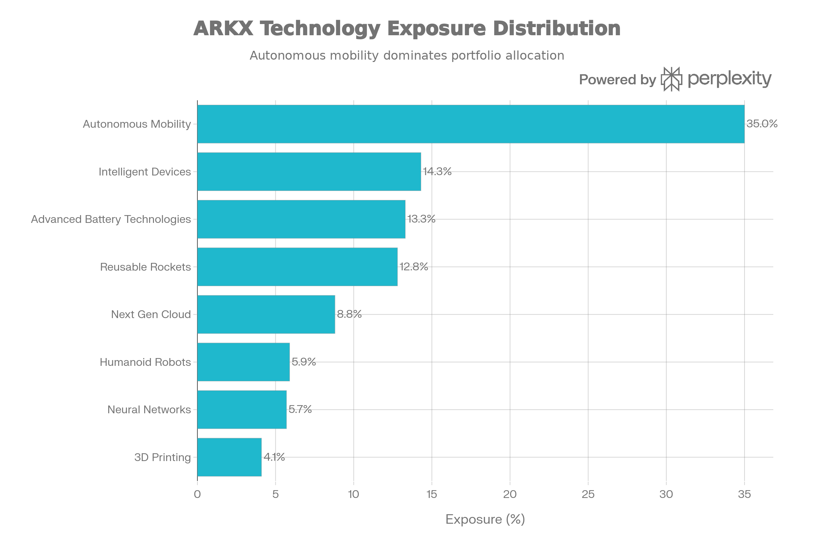
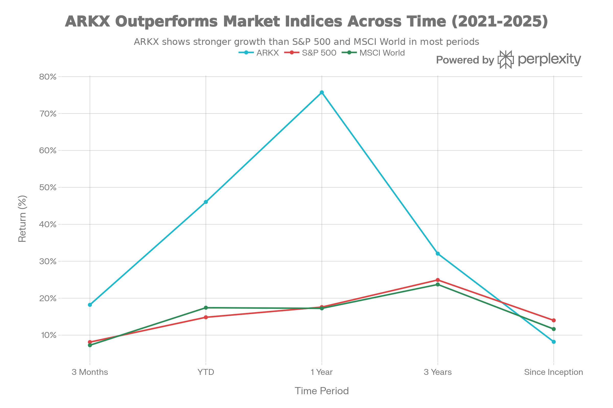
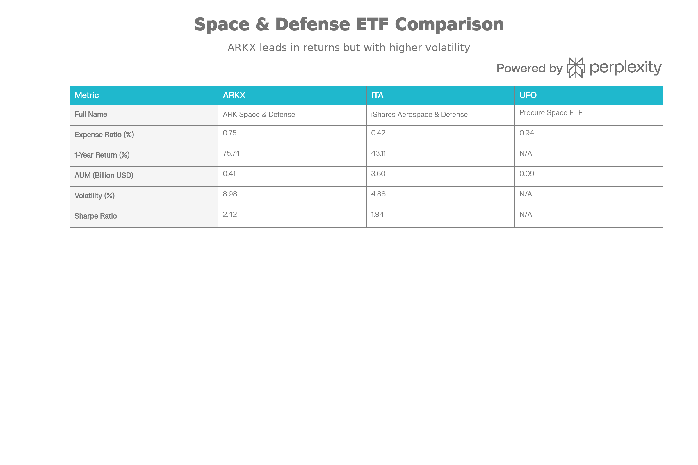

## Executive Summary

ARK Space \& Defense Innovation ETF (ARKX)는 우주 탐사 및 방위 산업 혁신에 특화된 액티브 관리형 ETF로, 2021년 3월 출시 이후 급속한 기술 발전과 지정학적 변화로부터 수익을 창출하기 위한 고성장 테마 펀드입니다. 2025년 현재 ARKX는 자산규모 \$407-687백만, 35-55개 종목 보유, 0.75% 운용보수 구조를 유지하고 있습니다.[^1][^2]

2025년 ARKX의 성과는 월등하여 연초 대비 약 46-48% 상승했으며, 1년 수익률은 75.74%로 S\&P 500의 17.60%를 크게 상회했습니다. 2025년 11월 정식 명칭이 "ARK Space Exploration \& Innovation ETF"에서 "ARK Space \& Defense Innovation ETF"로 변경되었으며, 이는 기금의 방위 산업 포트폴리오 가중치 증가를 반영합니다.[^3][^2][^4][^5][^6]

그러나 ARKX는 높은 수익 잠재력과 함께 상당한 변동성(연 8.98%)을 수반하는 고위험 투자로, 우주 및 방위 기술 혁신에 대한 확고한 신념과 5년 이상의 투자 기간을 가진 장기 투자자들에게만 적합합니다. 단기 시장 변동성에 흔들리지 않을 수 있는 투자자들을 위한 미래지향적 포트폴리오 구성 요소입니다.

***

## 펀드의 기본 특성

### 펀드 개요

ARKX는 ARK Investment Management LLC(창업자 Cathie Wood)가 운용하는 액티브 관리형 ETF로, Cboe BZX Exchange에 상장되어 있습니다. 펀드의 투자 목표는 국내외 우주 탐사 및 방위 혁신 기업에 자산의 80% 이상을 투자함으로써 장기적 자본 증식입니다.[^1][^3][^2]

ARK의 정의에 따르면 "우주 탐사"는 지구 표면 너머에서 발생하는 기술 지원 제품 또는 서비스를 제공하거나 이로부터 이익을 얻는 회사를 포함합니다. 여기에는 궤도 및 준궤도 항공우주, 가능 기술(enabling technologies), 그리고 농업, GPS, 이미징 등 항공우주 활동으로부터 이익을 얻는 회사들이 포함됩니다.[^2]

### 규모 및 비용

| 항목 | 수치 |
| :-- | :-- |
| 자산규모 (2025년 9월) | \$447.65M |
| 보유 종목 수 | 35-55개 |
| 순 운용보수율 | 0.75% |
| 과거수수료 | 0.78% |
| 설립일 | 2021-03-30 |
| 평균 일일 거래량 | 약 345,791주 |

ARKX는 0.75% 수준의 운용보수를 유지하고 있으며, 이는 전통 뮤추얼 펀드 대비 낮지만 광범위한 지수 추종 ETF 대비 높은 수준입니다. ARK는 자발적으로 운용보수 일부를 면제하고 있으며, 이 약정은 최소 2025년 11월 30일까지 지속됩니다.[^2][^7]

***

## 포트폴리오 구성 및 투자 전략

### 상위 보유 종목

ARKX의 포트폴리오는 높은 집중도를 나타내며, 상위 10개 종목이 전체 자산의 약 63.9%를 차지합니다.[^8]

| 순위 | 종목명 | 티커 | 가중치 |
| :-- | :-- | :-- | :-- |
| 1 | Kratos Defense \& Security Solutions | KTOS | 10.3% |
| 2 | Rocket Lab Corp | RKLB | 8.6% |
| 3 | AeroVironment Inc | AVAV | 8.5% |
| 4 | L3Harris Technologies Inc | LHX | 7.2% |
| 5 | Teradyne Inc | TER | 6.4% |
| 6 | Palantir Technologies Inc | PLTR | 5.7% |
| 7 | Archer Aviation Inc | ACHR | 5.4% |
| 8 | Trimble Inc | TRMB | 4.4% |
| 9 | Iridium Communications Inc | IRDM | 4.2% |
| 10 | Amazon.com Inc | AMZN | 3.3% |

주요 특징으로 ARKX는 Boeing이나 Raytheon Technologies 같은 거대 방위산업 기업들을 거의 보유하지 않으며, 대신 저성장 기존 계약자들의 노출을 줄이고 첨단 기술 개발자들 - 극음속 미사일 기술, 재사용 가능 로켓, 위성, 자율 드론 플랫폼 등 - 에 더 많은 자산을 할당합니다.[^9]

### 기술 부문별 분류

ARKX Technology Sector Breakdown: Thematic Exposure Distribution

ARKX의 포트폴리오는 여덟 가지 핵심 기술 테마로 구성되어 있으며, 자율 이동성(35.0%)이 가장 큰 비중을 차지합니다. 이는 자율 주행 자동차, 드론, 전자 항공택시(eVTOL) 등을 포함합니다.[^2]

지능 기기(14.3%)와 고급 배터리 기술(13.3%)이 그 다음을 따르며, 재사용 가능 로켓(12.8%)은 우주 산업의 핵심 혁신 영역입니다. 차세대 클라우드(8.8%), 휴머노이드 로봇(5.9%), 신경망(5.7%), 3D 프린팅(4.1%)이 나머지를 구성합니다.[^2]

### 산업 및 지역 분포

ARKX의 산업 분포는 산업재(62.2%)에 크게 의존하고 있으며, 정보기술(26.0%), 통신 서비스(6.0%), 소비자 재량(4.9%)이 따릅니다. 이러한 구성은 전통 방위 산업 ETF와 차별화되는데, 첨단 칩, AI 역량, 소프트웨어 등이 현대 우주 및 방위 기술에 필수적이기 때문입니다.[^2][^10]

지역적으로 ARKX는 북미(88.9%)에 대부분 투자하며, 서유럽(6.4%), 아시아태평양(3.3%), 아프리카/중동(1.4%)으로 분산되어 있습니다. 시가총액 측면에서는 대형주(64.0%)와 메가캡(22.5%) 기업들에 집중하고 있습니다.[^2]

***

## 성과 분석

### 최근 성과

ARKX Performance Track Record: Comparison with S\&P 500 and MSCI World Index

ARKX의 성과는 시간 경과에 따라 크게 변동했습니다. 2022년 기술주 약세로 인해 34.27% 하락했으나, 2023년 및 2024년에 각각 24.37%, 26.67% 상승하며 회복했습니다.[^4]

2025년은 ARKX에 매우 호의적인 해였습니다:

- <strong>3개월 수익률</strong>: +18.21% (S\&P 500: 8.12%)
- <strong>YTD 수익률</strong>: +46.07% (S\&P 500: 14.83%)
- <strong>1년 수익률</strong>: +75.74% (S\&P 500: 17.60%)
- <strong>3년 수익률</strong>: +32.07% 연환산 (S\&P 500: 24.94%)

이러한 성과로 2025년 ARKX는 국내 ETF 중 두 번째로 좋은 성과를 기록했으며, Morningstar에 따르면 48.28% 상승했습니다. 상대적으로 3년 초과 기간에는 S\&P 500을 상회했으나, 설립 이후(2021년 3월부터)로는 연 8.19%의 수익률로 S\&P 500의 14.00%에 미달했습니다. 이는 2022년의 심각한 낙폭(-43.61%)과 회복 시간이 영향을 미쳤습니다.[^2][^6][^4]

### 위험 조정 성과

ARKX의 Sharpe 비율(12개월)은 2.42로, 비교 대상인 iShares U.S. Aerospace \& Defense ETF(ITA)의 1.94보다 높습니다. 이는 ARKX가 높은 변동성에도 불구하고 한 단위의 위험당 더 나은 수익을 제공했음을 의미합니다.[^11]

***

## 비교 분석: ARKX vs. 주요 경쟁 ETF

ARKX vs. Comparable Aerospace \& Defense ETFs: Performance and Risk Metrics Comparison

ARKX는 동일한 부문의 다른 ETF들과 뚜렷한 특징을 가집니다:

### ARKX vs. ITA (iShares U.S. Aerospace \& Defense ETF)

ITA는 전통 방위산업 ETF로 \$3.6B 규모, 0.42% 운용보수를 유지하고 있습니다. RTX, LMT, BA 같은 메가캡 방위산업 기업들에 높은 가중치를 부여합니다.[^12]

| 지표 | ARKX | ITA | ARKX의 특징 |
| :-- | :-- | :-- | :-- |
| 운용보수 | 0.75% | 0.42% | ITA가 33% 낮음 |
| 1년 수익률 | 75.74% | 43.11% | ARKX 75% 상회 |
| 변동성 | 8.98% | 4.88% | ARKX 84% 높음 |
| Sharpe 비율 | 2.42 | 1.94 | ARKX 25% 우수 |
| 자산규모 | \$0.4B | \$3.6B | ITA 9배 큼 |

ARKX의 상대적으로 높은 수익과 위험 조정 성과는 신흥 우주 및 방위 기술 혁신사들에 대한 액티브 선택으로부터 나옵니다. 반대로 ITA는 설립된 방위산업 기업들에 더 많은 노출을 제공하여 낮은 변동성과 배당 수익(약 1-2%)을 제공합니다.[^11][^12]

### ARKX vs. UFO (Procure Space ETF)

UFO는 2019년 출시된 순수 우주 탐사 ETF로, \$89.8M 규모, 0.94% 운용보수를 유지합니다. UFO는 S-Network Space Index를 추종하는 수동 관리형 펀드입니다.[^13]

ARKX는 UFO보다 훨씬 큰 규모(\$0.4B vs. \$0.09B), 낮은 운용보수, 그리고 능동적 관리를 통한 우주와 방위 두 부문의 통합 노출을 제공합니다.[^9]

### ARKX vs. ARKK (ARK Innovation ETF)

ARKK는 ARK의 광범위한 혁신 펀드로 \$7.55B 규모를 유지하고 있습니다. 동일한 0.75% 운용보수를 가지지만, ARKX는 우주/방위 테마에 더 집중된 "순수 신념" 포트폴리오를 제공합니다.[^14]

***

## 투자 특성 분석

### 핵심 강점

<strong>1. 향후 성장 테마에 대한 집중 노출</strong>

ARKX는 우주 산업의 상업화 및 방위 기술 혁신이라는 장기 거대 추세로부터 직접 노출을 제공합니다. 2020년대 우주 산업은 정부 중심에서 민간 기업 주도로 전환되고 있으며, 이는 SpaceX, Rocket Lab 같은 신흥 기업들의 창출 가능성을 높입니다.[^15]

<strong>2. 듀얼 유즈(Dual-Use) 기술 포지셔닝</strong>

ARKX의 차별점은 민간과 군사 응용 모두에 적용 가능한 기술(저비용 발사 시스템, 소형 위성, 자율 플랫폼, 고급 소재, AI 기반 지휘 네트워크)에 투자한다는 점입니다. 이는 산업 확장성과 수익 다각화 가능성을 높입니다.[^9][^10]

<strong>3. 액티브 관리의 이점</strong>

ARKX의 90% Active Share(S\&P 500 대비)는 포트폴리오가 지수와 매우 다르며, ARK의 독점적 연구와 신념을 반영합니다. 액티브 관리자는 빠르게 변화하는 우주 산업 환경에서 보유 종목을 동적으로 조정할 수 있습니다.[^2]

<strong>4. 포트폴리오 다양화 도구</strong>

ARKX는 전통 지수와의 낮은 상관계수를 가지므로, 기존 주식/채권 포트폴리오에 추가될 경우 전체 포트폴리오의 다양화 효과를 제공합니다. 이는 미래 기술 베팅을 원하는 투자자들에게 효율적입니다.[^10]

### 핵심 위험 요인

<strong>1. 높은 변동성 및 단기 손실 가능성</strong>

ARKX의 연 변동성 8.98%는 ITA의 4.88%보다 84% 높습니다. 포트폴리오의 기술주 중심과 소형 신흥기업 비중이 이러한 변동성을 야기합니다. 2022년 -43.61% 낙폭은 심각한 손실 위험을 입증합니다.[^4][^11]

<strong>2. 높은 집중도 위험</strong>

상위 10개 종목이 전체 자산의 63.9%를 차지하는 높은 집중도는 개별 종목의 악재에 대한 노출을 높입니다. 특히 KTOS, RKLB, AVAV 같은 주요 종목의 10% 이상 가중치는 개별 회사 위험을 포함합니다.[^8]

<strong>3. 산업 및 규제 리스크</strong>

방위 산업과 우주 탐사는 정부 지출, 정책 변화, 국제 규제에 의존합니다. 미국 정부 예산 삭감, 수출 규제 강화, 또는 국방 우선순위 변화는 ARKX 성과에 부정적 영향을 미칠 수 있습니다.[^2]

<strong>4. 기술 구식화 위험</strong>

우주 및 자율 기술은 급속히 진화하는 분야입니다. 기술이 빠르게 공식화되거나 대체 솔루션이 등장할 경우, ARKX 보유 회사들의 경쟁 우위가 침식될 수 있습니다.

<strong>5. 유동성 위험</strong>

총 AUM \$407-687M은 상대적으로 작은 규모입니다. 대규모 자금 유출 시 또는 시장 스트레스 상황에서 거래 유동성이 줄어들 수 있습니다.

<strong>6. SPAC 및 신흥 기업 리스크</strong>

ARKX 포트폴리오에 포함된 Archer Aviation, Joby Aviation 같은 신흥 기업과 SPAC 역사 기업들은 비즈니스 실행 리스크, 자금 조달 리스크, 시장 수용 리스크를 수반합니다.[^2]

***

## 세금 및 분배금 고려사항

### 분배금 정책

ARKX는 분배금을 거의 지급하지 않습니다. 전통 방위 ETF(ITA)의 약 1-2% 배당 수익률과 달리, ARKX는 자본 증식에 중점을 두고 있습니다.[^7][^9]

### 세금 효율성

ARKX는 액티브 관리형 ETF로, 높은 포트폴리오 회전율(turnover)을 가집니다. 이는 단기 자본 이득 분배를 초래할 수 있으며, 과세 계정에서 보유 시 세금 부담을 증가시킵니다.[^16]

ARK 펀드의 과거 기록에 따르면 연 1.75-10% 범위의 자본 이득 분배가 발생할 수 있으며, 대부분이 단기 자본 이득으로 분류됩니다. 고소득 투자자의 경우 연방 및 주세를 합쳐 약 40-50%의 세율이 적용될 수 있으므로, 과세 계정보다는 IRA 또는 401(k) 같은 세금 유연 계정에 ARKX를 보유하는 것이 권장됩니다.[^16]

***

## 적합한 투자자 프로필

### ARKX 투자에 적합한 투자자

1. <strong>높은 위험 감수 능력을 가진 장기 투자자</strong>: 최소 5-10년의 보유 기간을 예상할 수 있는 투자자
2. <strong>우주 및 방위 혁신 기술에 대한 신념</strong>: 이 산업이 향후 10-20년 동안 급속히 성장할 것으로 믿는 투자자
3. <strong>포트폴리오 다양화 추구자</strong>: 기존 주식/채본 포트폴리오에 비상관 자산을 추가하려는 투자자
4. <strong>기술 동향 학습 의지</strong>: 산업 발전, 규제, 기술 혁신을 지속적으로 모니터링할 수 있는 투자자
5. <strong>세금 유연 계정 보유자</strong>: IRA, 401(k), 또는 국제 세금 유연 계정을 활용 가능한 투자자

### ARKX 투자 회피 투자자

- 단기(1-2년) 수익을 목표로 하는 투자자
- 연 8-10% 이상의 변동성에 심리적 스트레스를 받는 투자자
- 안정적 배당 수익을 원하는 투자자
- 과세 계정에서만 자산을 보유할 수 있는 투자자
- 산업 동향 모니터링이 어려운 투자자

***

## 투자 전략 권고

### 포트폴리오 배분 전략

ARKX는 고위험 자산이므로, 포트폴이오 내에서 신중한 비중 관리가 필수입니다:

- <strong>보수적 투자자</strong>: 포트폴리오의 3-5%
- <strong>중도적 투자자</strong>: 포트폴리오의 5-10%
- <strong>적극적 성장 투자자</strong>: 포트폴리오의 10-15%
- <strong>초과 추천 비중</strong>: 20% 이상 (위험 과다)

### 진입 전략

1. <strong>달러 코스트 애버리징 (DCA)</strong>: 일시에 대량 진입보다는 월 1회 일정 금액 투자
2. <strong>분할 진입</strong>: 목표 비중까지 3-6개월에 걸쳐 단계적 진입
3. <strong>평균 매입가 고려</strong>: 2025년 현재 가격(약 \$35)은 52주 고점(\$35.24) 근처이므로, 더 낮은 가격에서의 진입 기회 대기 검토

### 관리 및 리밸런싱 전략

1. <strong>분기별 리밸런싱</strong>: 분기마다 포트폴리오 비중 검토 및 조정
2. <strong>손실 한계 설정</strong>: 초기 투자의 30-40% 이상 손실 시 재평가
3. <strong>수익 실현</strong>: 초기 투자의 100% 이상 수익 발생 시 부분 차익실현 검토
4. <strong>산업 모니터링</strong>: 우주/방위 산업 뉴스, 정부 정책, 경쟁사 동향 월 1회 이상 검토

### 탈출 전략

- ARKX 운용 철학이 근본적으로 변경된 경우
- 포트폴리오 집중도가 지나치게 높아진 경우
- 개인의 재정 상황이 악화되어 위험 감수 능력이 저하된 경우
- 투자 목표 달성(예: 자산 배가) 또는 시간 제약(은퇴 임박) 발생 시

***

## 시장 환경 및 전망

### 긍정적 요인

1. <strong>우주산업의 상업화 가속</strong>: 민간 우주 발사, 위성 통신, 우주 관광 등 새로운 수익 기회
2. <strong>지정학적 긴장 증가</strong>: 국방 기술 투자 증가, 우주 기반 국방 수요 확대
3. <strong>AI 및 로봇 기술 발전</strong>: ARKX의 핵심 기술 테마인 자율성, 지능화 수요 증가
4. <strong>저비용 우주 기술 혁신</strong>: Rocket Lab 같은 재사용 로켓 기술의 비용 효율화

### 위험 요인

1. <strong>미국 정부 예산 정책</strong>: 방위 및 우주 프로그램 예산 감축 가능성
2. <strong>경제 침체</strong>: 기술주 부문에 악영향, ARKX의 높은 베타 증폭
3. <strong>경쟁 심화</strong>: 유명 기업들의 우주 분야 진입(예: Blue Origin, Virgin Galactic 등)
4. <strong>규제 강화</strong>: 위성 통신 규제, 수출 통제 강화

***

## 결론 및 최종 평가

ARKX는 우주 탐사 및 방위 기술 혁신이라는 매력적인 테마에 집중 노출을 제공하는 고성장 액티브 관리 ETF입니다. 2025년 48.28% 수익률과 1년 75.74% 수익률은 우수한 성과를 입증합니다.[^4][^6]

그러나 8.98% 연 변동성, 상위 10개 종목의 63.9% 집중도, 높은 운용보수(0.75%), 잠재적 높은 세금 부담은 ARKX 투자가 신중한 고려를 요구함을 의미합니다.[^8][^2][^11]

<strong>최종 평가</strong>: ARKX는 <strong>조건부 매수(Conditional Buy)</strong> 등급에 해당합니다.

### 추천 조건

- ✅ 5년 이상의 투자 기간 확보
- ✅ 우주/방위 기술 혁신에 대한 강한 신념 보유
- ✅ 포트폴리오 내 10% 이하의 신중한 배분
- ✅ 세금 유연 계정(IRA/401k) 보유
- ✅ 월간 산업 동향 모니터링 의지

### 대안 고려

- <strong>보수적 성향</strong>: ITA(iShares U.S. Aerospace \& Defense) 고려 - 낮은 변동성, 높은 배당
- <strong>순수 우주 테마</strong>: UFO(Procure Space ETF) 고려 - 지수 추종, 낮은 비용
- <strong>광범위 혁신</strong>: ARKK(ARK Innovation) 고려 - 더 분산된 포트폴리오

ARKX는 미래 기술에 베팅하되 단기 변동성을 수용할 수 있는 정교한 투자자들을 위한 펀드입니다. 장기적으로 우주 및 방위 산업이 글로벌 경제의 중요 축이 될 것으로 예상되는 만큼, 적절한 규모와 기간을 통한 ARKX 투자는 포트폴리오 성장에 기여할 수 있습니다.

***

## 참고 자료

ARK Funds official website - ARKX factsheet (September 2025)[^17]
Investing.com - ARKX ETF quote[^1]
ARK Funds - ARKX fund page[^3]
Stock Analysis - ARKX holdings list[^8]
ARK Funds factsheet PDF[^2]
TradingView - ARKX analysis[^7]
Mirae Asset Securities - ARKX analysis (Korean)[^15]
PortfoliosLab - ARKX performance data[^4]
ETF Database - ARKX vs UFO comparison[^13]
Tickeron - ARKK vs ARKX comparison[^14]
Morningstar - Top-performing ETFs 2025[^6]
PortfoliosLab - ARKX vs ITA comparison[^11]
ARK Funds - "Know Your Space and Defense Exposure" article[^9]
Reddit - ARK ETFs tax treatment discussion[^16]
ETF Express - Defense ETF analysis[^12]
ARK Invest Europe - Space \& Defence exposure PDF[^10]
Chart: ARKX vs comparable ETFs comparison

ARKX Performance Track Record: Comparison with S\&P 500 and MSCI World Index
[^18][^19][^20][^21][^22][^23][^24][^25][^26][^27][^28][^29][^30][^31][^32][^33][^34][^35][^36][^37][^38]

⁂

[^1]: https://kr.investing.com/etfs/arkx

[^2]: https://etfs.ark-funds.com/hubfs/1_Download_Files_ETF_Website/Fact_Sheets/ARKX_Factsheet.pdf

[^3]: https://www.ark-funds.com/funds/arkx

[^4]: https://portfolioslab.com/symbol/ARKX

[^5]: https://www.sec.gov/Archives/edgar/data/1579982/000121390025090880/ea0258150-03_497k.htm

[^6]: https://www.morningstar.com/funds/top-performing-stock-etfs-2025

[^7]: https://www.tradingview.com/symbols/CBOE-ARKX/analysis/

[^8]: https://stockanalysis.com/etf/arkx/holdings/

[^9]: https://www.ark-funds.com/articles/etf/know-your-space-and-defense-exposure

[^10]: https://europe.ark-funds.com/wp-content/uploads/2025/10/ARK-Invest-Europe-Know-Your-Space-Defence-Exposure.pdf

[^11]: https://portfolioslab.com/tools/stock-comparison/ARKX/ITA

[^12]: https://etfdb.com/news/2022/03/28/dont-fight-over-defense-etfs-understand-them/

[^13]: https://etfdb.com/tool/etf-comparison/ARKX-UFO/

[^14]: https://tickeron.com/compare/ARKK-vs-ARKX/

[^15]: https://securities.miraeasset.com/public/mw/blog/html/20210304101424.html?ver=20210705051432

[^16]: https://www.reddit.com/r/investing/comments/kiqvny/arkk_and_arkg_in_a_taxable_account_tax_on_capital/

[^17]: QTUM (Defiance Quantum ETF).md

[^18]: SETM (Sprott Critical Materials ETF).md

[^19]: REMX (VanEck Rare Earth, Strategic Metals ETF).md

[^20]: https://kr.benzinga.com/quote/ARKX

[^21]: https://etfdb.com/etf/ARKX/

[^22]: https://www.tradingview.com/symbols/CBOE-ARKX/

[^23]: https://www.justetf.com/en/etf-profile.html?isin=IE000AON7ET1

[^24]: https://unusualwhales.com/stock/ARKX/holdings

[^25]: https://www.investing.com/etfs/arkx

[^26]: https://www.dukascopy.bank/investments/etf/ARKX.US-USD/

[^27]: https://www.sec.gov/Archives/edgar/data/1579982/000110465921003837/tm212832d1_485apos.htm

[^28]: https://kr.investing.com/etfs/arkx-holdings

[^29]: https://uk.investing.com/etfs/arkx-holdings

[^30]: https://brunch.co.kr/@@1i45/4069

[^31]: https://forwe.tistory.com/123

[^32]: https://mylifefreedom.tistory.com/entry/미국-ETF-ARKX란-특징-장점-단점-투자전략

[^33]: https://etfexpress.com/2025/11/03/ark-invest-europe-launches-space-and-defence-etf-arkx/

[^34]: https://stockanalysis.com/etf/arkx/

[^35]: https://bbn.kiwoom.com/bbs/jsp/upload/newres/CorpAnal/202103/1617102177420.pdf

[^36]: https://blog.naver.com/dyllis11/222206821898

[^37]: https://etfs.ark-funds.com/hubfs/1_Download_Files_ETF_Website/Prospectuses/ARKX_Prospectus.pdf

[^38]: https://portfolioslab.com/tools/stock-comparison/ITA/ARKX
