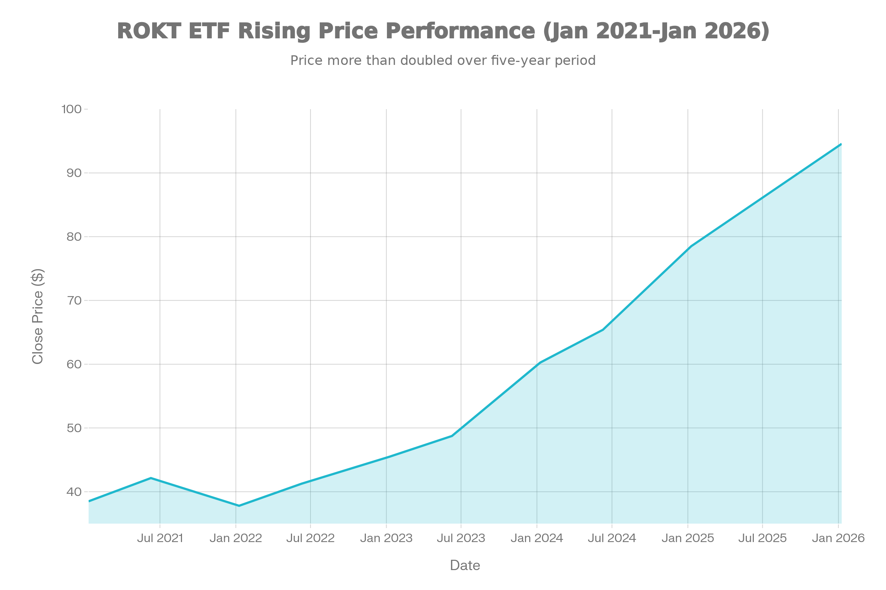
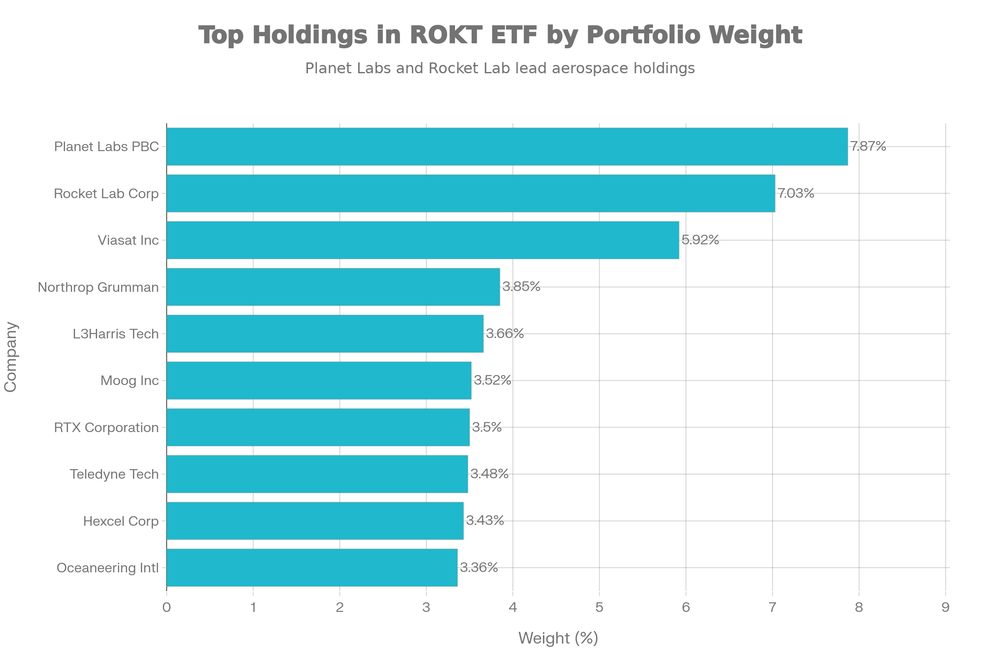
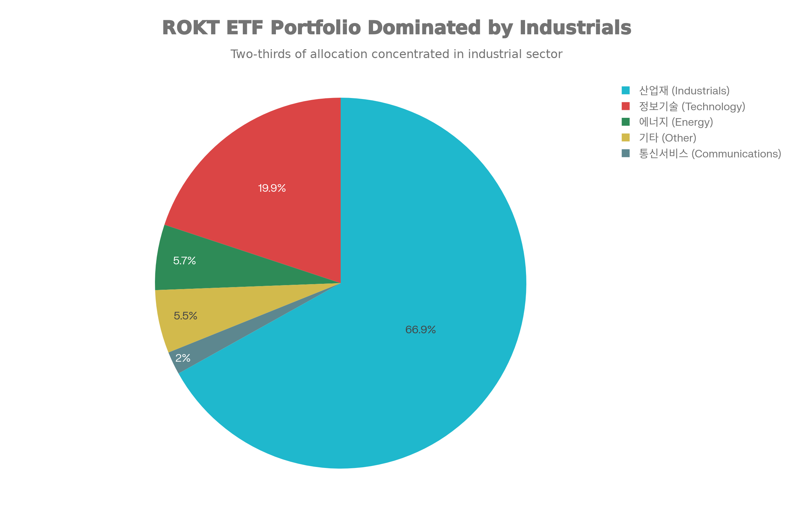
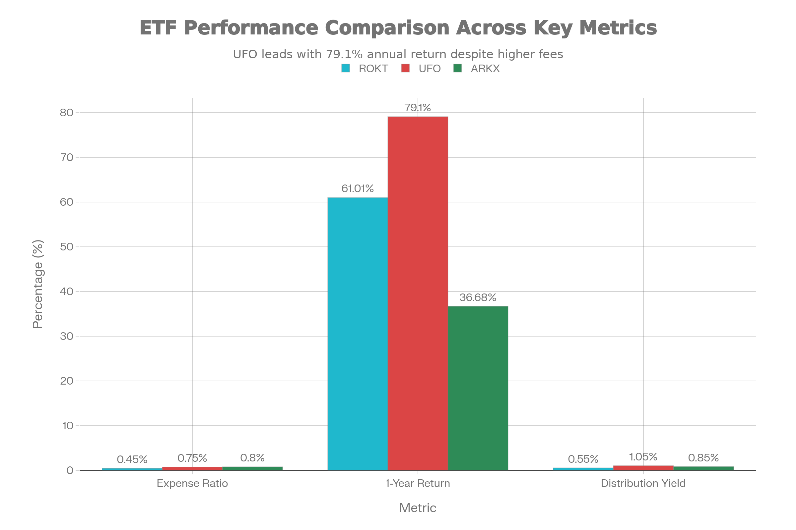

### 기본 정보

ROKT는 State Street Investment Management에서 운용하는 우주 및 심해 탐사 관련 기업들을 추종하는 지수형 상장지수펀드(ETF)입니다. 2018년 10월 22일 설정되어 약 7년간 운용 중이며, NYSE Arca 거래소에서 거래됩니다. 이 ETF는 S\&P Kensho Final Frontiers Index를 추종하며, S\&P Global의 머신러닝 기반 분석 도구인 Kensho 기술을 활용하여 운용됩니다.[^1][^2]

순자산 규모(AUM)는 약 \$26.5-31.15M으로 상대적으로 소규모입니다. 현재 가격(2026년 1월 초)은 \$91-94로 설정 이후 약 140% 이상 상승했습니다.[^3]

***

### 추종 성과 지표

ROKT ETF 5년 가격 추이 (2021-2026)

**1년 수익률**: ROKT는 2025년 동안 배당금을 포함하여 61.01%의 강력한 수익률을 기록했습니다. 이는 우주 산업의 성장과 방위 관련 기업들의 실적 개선을 반영합니다. 설립 이후 평균 연수익률은 16.49%로, 장기적으로 시장 평균을 크게 상회하는 성과를 보여줍니다.[^4]

**NAV 괴리율**: NAV 대비 시장가격 괴리율은 0.1% 프리미엄으로 거의 프리미엄 상태이지만 미미한 수준입니다. 이는 ETF의 가격과 순자산가치 간에 크게 벗어나지 않음을 의미하며, 효율적인 시장 운영을 나타냅니다.[^5]

**근본적인 성과 특성**: 6개월 수익률은 34.46%이며, 5년 차트에서 볼 수 있듯이 2021년 초 \$38.50에서 2026년 초 \$94.57로 상승하는 강한 우상향 추이를 보이고 있습니다. 다만, 2023년부터 2024년 초까지의 횡보 구간을 거쳐 2024년 중반 이후 본격적인 상승이 이루어졌습니다.

***

### 비용 구조

**총 운용보수**: ROKT의 총 운용보수는 0.45%로, 경쟁 ETF와 비교했을 때 매우 경쟁력 있습니다. 같은 우주 테마 ETF인 UFO(Procure Space ETF)의 0.75%, ARKX(ARK Space Exploration \& Innovation ETF)의 0.80%와 비교하면 현저히 낮습니다.[^6]

**배당 관련 비용**: 배당수익률은 0.51-0.55%이며, 분기별로 배당이 지급됩니다. 2025년의 배당 이력을 보면 9월에 \$0.15136, 6월에 \$0.0738, 3월에 \$0.07732, 12월에 \$0.13741로 분기별로 변동성 있게 지급됩니다.[^7]

**포트폴리오 회전율**: 약 22%의 회전율은 패시브 지수 추종 전략을 고려할 때 중간 수준의 거래 활동을 나타냅니다. 이는 지수 리밸런싱 및 포트폴리오 구성 변화에 따른 거래를 의미합니다.

***

### 유동성 평가

**일평균 거래량 및 거래대금**: ROKT의 일평균 거래량은 약 4,000-4,100주로, 평균 거래량 대비 상당히 낮습니다. 24시간 거래대금은 약 \$348,000으로, 이는 매우 소규모 거래량을 시사합니다.[^8]

**호가 스프레드 및 유동성 추이**: 정상적인 시장 조건에서 호가 스프레드는 합리적 수준이지만, 낮은 거래량으로 인해 대량 거래 시 호가 변동 위험이 있을 수 있습니다. 유동성은 역사적으로 안정적이지 않으며, 시장 변동성이 클 때 특히 제한될 수 있습니다.

**유동성 위험 평가**: 소규모 ETF로서 유동성이 제한적이므로, 투자자는 대량 매매 또는 시장 변동성이 높은 시기에 호가 변동의 위험을 감수해야 합니다.

***

### 포트폴리오 구성

ROKT ETF 상위 10대 보유 종목 및 비중

**상위 10대 보유 종목**: ROKT의 포트폴리오는 34개 종목으로 구성되어 있으며, 상위 10개 종목이 약 45.62%를 차지합니다. Planet Labs PBC(7.87%)와 Rocket Lab Corporation(7.03%)이 상위 2개 종목이며, 이들은 위성 및 발사체 기술에 집중합니다.[^9]

상위 10개 종목:

1. Planet Labs PBC - 7.87%
2. Rocket Lab Corp - 7.03%
3. Viasat Inc - 5.92%
4. Northrop Grumman - 3.85%
5. L3Harris Technologies - 3.66%
6. Moog Inc - 3.52%
7. RTX Corporation - 3.50%
8. Teledyne Technologies - 3.48%
9. Hexcel Corporation - 3.43%
10. Oceaneering International - 3.36%

**섹터별 분배**:

ROKT ETF 섹터별 자산 배분

ROKT의 포트폴리오는 산업재 중심입니다. 산업재(Industrials)가 66.9%로 대다수를 차지하며, 항공우주 및 방위산업, 전자기계, 운송 관련 기업들이 포함됩니다. 정보기술(Technology) 비중은 19.9%로, 반도체 및 통신 기술 기업들이 포함됩니다. 에너지 부문은 5.7%, 통신서비스는 2.0%입니다.[^10]

**국가별/지역별 분산**: 97.65%가 미국 기업이며, 2.32%가 중동 지역(Elbit Systems Ltd와 같은 이스라엘 방위 기업) 기업입니다. 따라서 ROKT는 기본적으로 미국 중심의 포트폴리오입니다.

**리밸런싱 주기**: S\&P Kensho Final Frontiers Index는 일반적으로 분기별 또는 정기적으로 리밸런싱되며, 머신러닝 기반의 선택 메커니즘을 통해 구성 종목이 결정됩니다.

***

### 성과 분석

| 기간 | 수익률 |
| :-- | :-- |
| 1개월 | +3.07% |
| 6개월 | +34.46% |
| 1년 | +61.01% |
| 설립 이후 평균 연수익률 | 16.49% |

**기간별 수익률 분석**: ROKT는 단기(1개월: 3.07%)부터 장기(1년: 61.01%)까지 모든 기간에서 긍정적인 수익률을 기록했습니다. 특히 2024년 중반 이후 가속화된 상승으로 인해 1년 수익률이 61%에 달했습니다.[^11]

**벤치마크 대비 성과**: ROKT는 S\&P Kensho Final Frontiers Index를 거의 정확히 추종하고 있으며, NAV 대비 프리미엄이 0.1%로 미미하여 인덱스 추종이 효과적임을 보여줍니다.

**리스크 조정 성과 지표**:

- **샤프 지수**: 구체적인 수치는 제공되지 않았으나, 높은 변동성을 감안할 때 중간 수준으로 추정됩니다.
- **변동성(표준편차)**: 약 26% 수준으로 시장 평균보다 높습니다.
- **최대 낙폭(Maximum Drawdown)**: 2020년 3월 코로나19 충격 시 약 43.2% 낙폭을 기록했습니다.

***

### 배당 정보

**배당 수익률 및 이력**: ROKT의 배당수익률은 0.55%이며, 분기별로 배당을 지급합니다. 2025년 배당 이력은 다음과 같습니다.[^12]

| 배당권리일 | 배당금 | 지급일 |
| :-- | :-- | :-- |
| 2025년 9월 22일 | \$0.15136 | 2025년 9월 24일 |
| 2025년 6월 23일 | \$0.0738 | 2025년 6월 25일 |
| 2025년 3월 24일 | \$0.07732 | 2025년 3월 26일 |
| 2024년 12월 23일 | \$0.13741 | 2024년 12월 26일 |

**배당 지급 주기 및 안정성**: 분기별 지급은 일정하지만, 배당금 규모가 분기별로 상당히 변동합니다. 3월과 9월(약 \$0.07-0.15)이 6월(약 \$0.07)보다 높은 경향이 있습니다. 총 배당금(TTM)은 \$0.44로, 배당 지급 비율(Payout Ratio)은 15.11%입니다.[^13]

***

### 리스크 요소

**베타 계수**: ROKT의 베타는 1.09로, 전체 시장 대비 약 9% 더 변동성이 높습니다. 이는 신흥 우주 산업 특성상 예상되는 수준입니다.[^14]

**다른 자산군과의 상관계수**: 구체적인 상관계수는 제공되지 않았으나, 방위산업 및 항공우주 산업의 특성상 경기 사이클 및 정부 지출에 민감합니다.

**섹터 집중도 리스크**: 산업재가 66.9%를 차지하고 있으며, 상위 10개 종목이 약 45%를 차지합니다. 이는 특정 섹터 및 개별 종목의 위험에 노출되어 있음을 의미합니다.

**유동성 리스크**: 일평균 거래량이 4,000주 수준으로 매우 낮고 AUM이 \$31M에 불과합니다. 대규모 투자 또는 펀드 폐쇄 시 유동성 위험이 발생할 수 있습니다.

**산업 리스크**: 우주 산업은 신흥 산업으로, 기술 개발, 규제 변화, 정부 정책 변화에 크게 영향을 받습니다. 또한, 개별 기업들의 경영 리스크도 상대적으로 높습니다.

**가격 변동성**: 52주 범위가 \$45.26 ~ \$94+로 매우 넓으며, 이는 높은 변동성을 시사합니다. 2024년 초에는 \$60 수준에서 현재 \$94로 상승하여 약 57% 상승했습니다.

***

### 경쟁 ETF와의 비교

우주 관련 ETF 주요 지표 비교 (ROKT vs UFO vs ARKX)

ROKT는 우주 테마 투자를 제공하는 세 가지 주요 ETF 중 하나입니다.

**ROKT vs UFO (Procure Space ETF)**:

- ROKT의 운용보수(0.45%)는 UFO(0.75%)보다 훨씬 낮습니다.
- 1년 수익률: UFO 79.1% > ROKT 61.01% (단기 성과는 UFO가 우수)
- 2년 수익률: ROKT 29.5% > UFO 11.93% (중기 성과는 ROKT가 우수)
- UFO는 소규모 우주 전문 기업 중심, ROKT는 전통 항공방산과 우주 기업의 균형[^15]

**ROKT vs ARKX (ARK Space Exploration \& Innovation ETF)**:

- ARKX의 철학은 "우주 기술이 세상을 바꾼다"로, 광범위한 산업을 포함합니다 (반도체, 자동화, 드론 등)
- ROKT는 우주 및 심해 탐사에 직접적으로 관련된 기업에 초점을 맞춥니다
- ARKX 운용보수: 0.80%, YTD 성과: 36.68%
- 투자 철학: ARKX는 추상적, UFO는 우주 산업, ROKT는 경계선 명확[^16]

**ROKT의 경쟁 우위**:

1. 가장 낮은 운용보수 (0.45%)
2. 중장기 성과 우수 (2년 기준)
3. 명확한 투자 테마 (우주+심해 탐사)
4. 머신러닝 기반 종목 선택 (S\&P Kensho)

***

### 종합 평가 및 투자 고려사항

**강점**:

- 업계 최저 수준의 운용보수(0.45%)
- 강력한 중장기 성과(연 16.49% 평균 수익률)
- 균형잡힌 포트폴리오(전통 방산 + 우주 스타트업)
- 명확한 투자 테마 및 운용 철학(S\&P Kensho AI 기반)
- 우수한 지수 추종성(NAV 괴리율 0.1%)

**약점**:

- 매우 소규모 AUM (\$26-31M) - 펀드 폐쇄 위험 가능성
- 낮은 유동성 (일평균 거래량 4,000주)
- 높은 변동성 (베타 1.09, 표준편차 약 26%)
- 신흥 산업 특성상 높은 기업 수준의 위험
- 집중도 리스크 (상위 10개 종목 45%)

**투자 적합성**:
ROKT는 우주 산업의 장기적 성장에 베팅하면서도 개별 주식 선택의 위험을 피하고자 하는 투자자에게 적합합니다. 특히 다음의 투자자에게 추천됩니다:

1. **우주 산업 신봉자**: 우주 산업의 장기적 성장 잠재력에 강한 확신이 있는 투자자
2. **비용 의식적 투자자**: 낮은 운용보수를 중시하는 투자자
3. **중장기 투자자**: 3년 이상의 긴 투자 기간을 고려하는 투자자 (단기 변동성이 크므로)
4. **신흥 산업 투자자**: 신흥 산업의 높은 리스크를 수용할 수 있는 투자자

**부적합성**:

1. 단기 트레이딩 목표를 가진 투자자
2. 저변동성 포트폴리오를 추구하는 투자자
3. 높은 유동성을 필요로 하는 대규모 자금 투자자
4. 신흥 산업의 높은 위험을 수용할 수 없는 보수적 투자자

**결론**: ROKT는 우주 및 심해 탐사 산업에 대한 합리적이고 저비용의 노출 수단입니다. 명확한 투자 테마, 균형잡힌 포트폴리오, 강력한 중장기 성과는 매력적입니다. 그러나 소규모 규모, 낮은 유동성, 높은 변동성은 투자 시 신중한 검토가 필요합니다. 투자 결정 전에 개인의 재정 목표, 투자 기간, 위험 수용 능력을 신중하게 평가해야 합니다.

***

### 참고 자료

Investing.com, TradingView[^1][^2][^8]
TradingView - ROKT ETF 기본 정보[^2][^8]
TradingView - AUM 정보[^3][^8]
StockAnalysis - 1년 수익률 데이터[^4][^17]
TradingView - NAV 괴리율[^5][^8]
Zacks - 운용보수[^6][^11]
StockAnalysis - 배당 이력[^7][^17]
TradingView - 거래량 정보[^8]
Schwab - 포트폴리오 홀딩[^9][^18]
Financial Times - 섹터 분배[^10][^19]
StockAnalysis - 성과 데이터[^11][^17]
StockAnalysis - 배당 데이터[^12][^17]
Zacks - 배당 정보[^13][^11]
StockAnalysis - 베타 계수[^14][^17]
네이버 블로그 - ETF 비교 분석[^15][^20]
나스닥 투자 블로그 - 우주 ETF 철학 비교[^16][^21]
[^22][^23][^24][^25][^26][^27][^28][^29][^30][^31][^32][^33][^34][^35][^36][^37][^38][^39][^40][^41][^42][^43][^44][^45][^46][^47][^48][^49][^50][^51][^52][^53][^54][^55]

⁂

[^2]: https://kr.investing.com/etfs/spdr-kensho-final-frontiers

[^3]: https://m.invest.zum.com/etf/ROKT/

[^4]: https://kr.investing.com/etfs/spdr-kensho-final-frontiers-technical

[^5]: https://kr.investing.com/etfs/spdr-kensho-final-frontiers-options

[^6]: https://kr.investing.com/etfs/spdr-kensho-final-frontiers-scoreboard

[^7]: https://cbonds.com/etf/2245/

[^8]: https://kr.tradingview.com/symbols/AMEX-ROKT/

[^9]: https://www.samsungfund.com/etf/insight/newsroom/view.do?seqn=70015

[^10]: https://kr.investing.com/etfs/spdr-kensho-final-frontiers-news

[^11]: https://www.zacks.com/funds/etf/ROKT/profile

[^12]: https://kr.investing.com/etfs/spdr-kensho-final-frontiers-dividends

[^13]: https://blog.naver.com/jemmacho/223675913774

[^14]: https://kr.investing.com/etfs/spdr-kensho-final-frontiers-user-rankings

[^16]: https://invest.deepsearch.com/etf/ROKT/documents/

[^17]: https://stockanalysis.com/etf/rokt/

[^18]: https://www.schwab.wallst.com/schwab/Prospect/research/etfs/schwabETF/index.asp?type=holdings\&symbol=ROKT

[^19]: https://markets.ft.com/data/etfs/tearsheet/summary?s=ROKT%3APCQ%3AUSD

[^20]: https://blog.naver.com/jjangtg1/222297012963

[^21]: https://contents.premium.naver.com/usa/nasdaq/contents/260105195701633lm

[^23]: https://sunnyonul.tistory.com/entry/2026년-SpaceX스페이스X-기업공개IPO-우주-산업-역사상-가장-거대한-금융-이벤트

[^24]: https://stock.pstatic.net/stock-research/invest/1/20240605_invest_396635000.pdf

[^25]: https://file.mk.co.kr/imss/write/20190916112142__00.pdf

[^26]: https://file.mk.co.kr/imss/write/20190117135147__00.pdf

[^27]: https://rdata.kbsec.com/pdf_data/20230329212603470K.pdf

[^28]: https://v.daum.net/v/20260108162141181

[^29]: https://www.g-enews.com/article/Global-Biz/2026/01/202601080949115716533107c202_1

[^30]: https://www.joongang.co.kr/article/25395799

[^31]: https://news.kbs.co.kr/news/view.do?ncd=8453290

[^32]: https://news.nate.com/view/20260108n02778

[^33]: https://www.munhwa.com/article/11559519

[^34]: https://www.edaily.co.kr/News/Read?newsId=02046726645315752\&mediaCodeNo=257

[^35]: https://tarantas.news/ko/posts/id8512-junggo-podeu-f-150-haibeurideu-gyeolham-gyeonggo-2022-2023nyeon-juyi-consumer-reports-gweongo

[^36]: https://en.wikipedia.org/wiki/Backslash

[^37]: https://en.wikipedia.org/wiki/R_(programming_language)

[^38]: https://blog.naver.com/owls3753/223013146906

[^39]: https://t.me/s/HanaResearch?before=14241

[^40]: https://namu.wiki/w/State Street Technology Select Sector SPDR ETF?uuid=3f0319b3-e4b2-4532-a808-c73c0900dba2

[^41]: https://bbn.kiwoom.com/bbs/jsp/upload/newres/CorpAnal/202105/1620105912714.pdf

[^42]: https://stockscan.io/ko/stocks/ROKT

[^43]: https://invest.deepsearch.com/etf/ROKT/

[^44]: https://invest.kiwoom.com/inv/resource/202306/UploadFile_20230602145332000604.pdf

[^45]: https://portfolioslab.com/tools/stock-comparison/ARKX/UFO

[^46]: https://www.reddit.com/r/SpaceInvestorsDaily/comments/1iwghvp/ufo_etf_vs_rokt_etf_key_differences_investment/

[^47]: https://www.investing.com/etfs/spdr-kensho-final-frontiers

[^48]: https://www.etfcentral.com/compare-etfs/ARKX-vs-ROKT

[^49]: https://finance.yahoo.com/quote/ROKT/

[^50]: https://www.ratestbed.kr:7443/portal/pblntf/viewAcnutDetail.do;jsessionid=CFA3F1981318CF09A873902A5CD68486?acnutSn=3337\&invtTyCd=01\&odrSn=22\&hbrdAssetsAt=00\&menuNo=200226\&searchAt=Y\&basicDate=\&paramDt=

[^51]: https://ratestbed.kr:7443/portal/pblntf/viewAcnutDetail.do;jsessionid=03BB3AF87F84B37A24872D070BEB706A?acnutSn=8701\&invtTyCd=01\&odrSn=28\&hbrdAssetsAt=00\&menuNo=200226\&searchAt=Y\&basicDate=\&paramDt=

[^52]: https://robinhood.com/stocks/ROKT

[^53]: https://www.ratestbed.kr:7443/portal/pblntf/viewAcnutDetail.do;jsessionid=C8EF4B27FF2BC2F83DE90DC525733274?acnutSn=6351\&invtTyCd=01\&odrSn=26\&hbrdAssetsAt=00\&menuNo=200226\&searchAt=Y\&basicDate=\&paramDt=

[^54]: https://www.spglobal.com/spdji/en/indices/equity/sp-kensho-final-frontiers-index/

[^55]: https://ratestbed.kr:7443/portal/cmm/fms/FileDown.do?atchFileId=FILE_000000000009782\&fileSn=1
