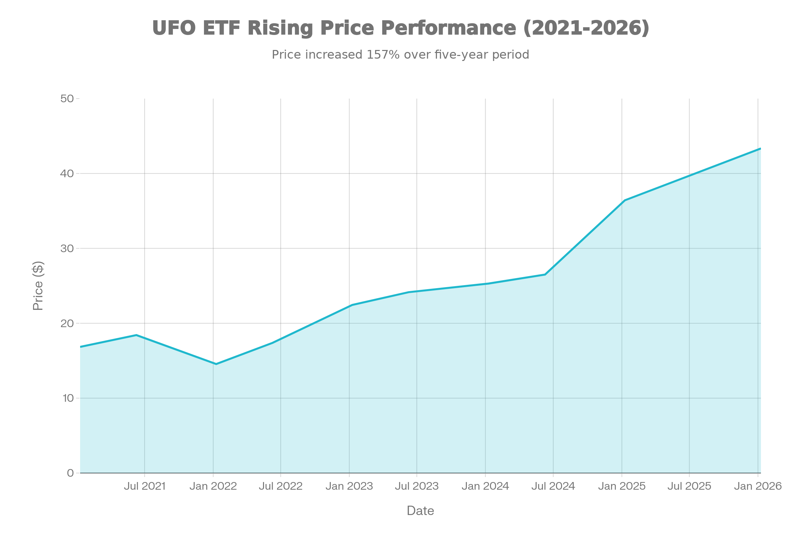
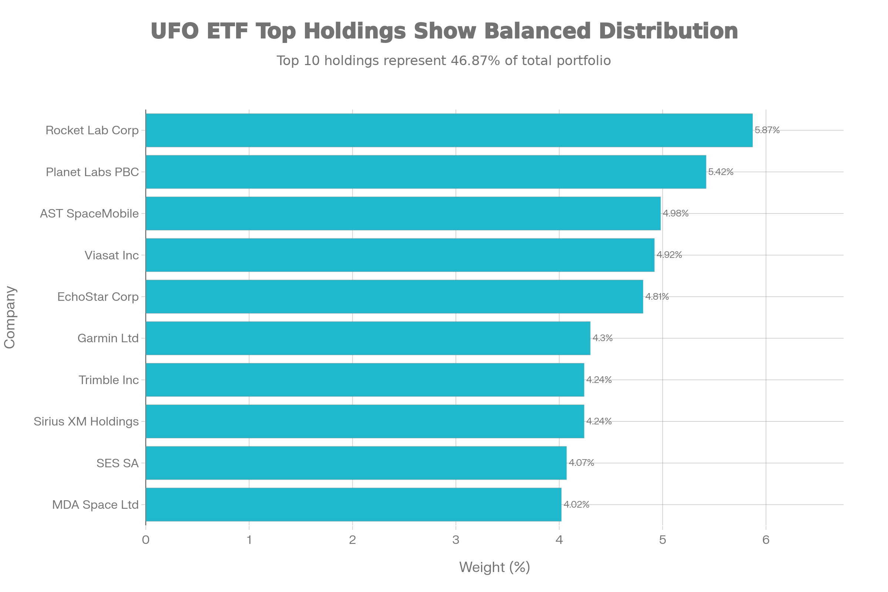
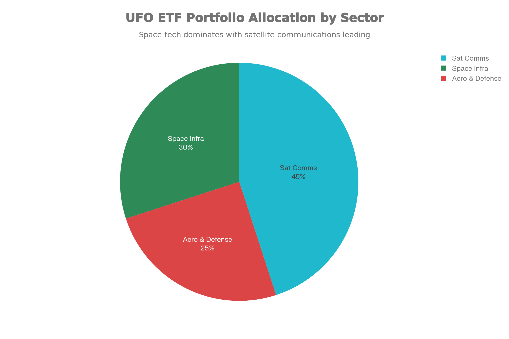
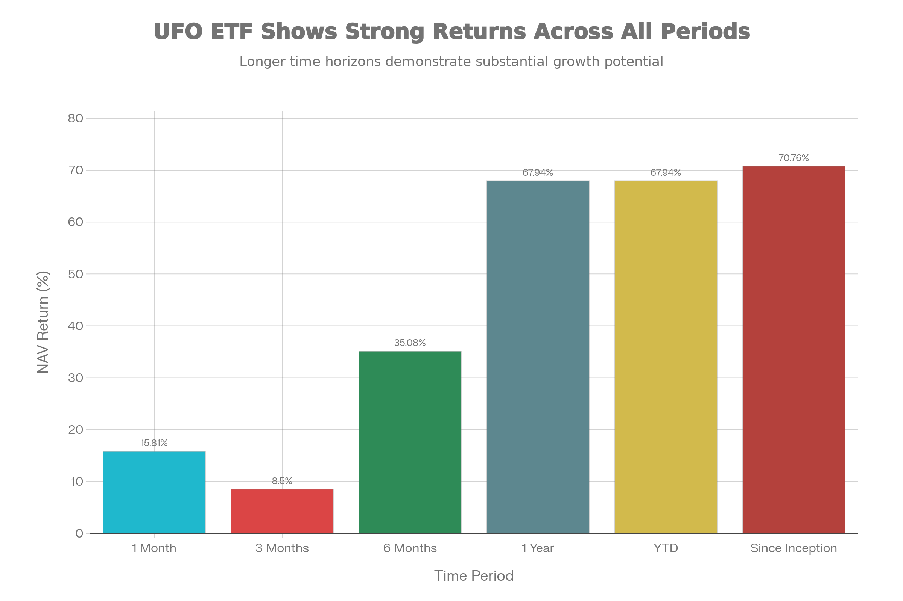
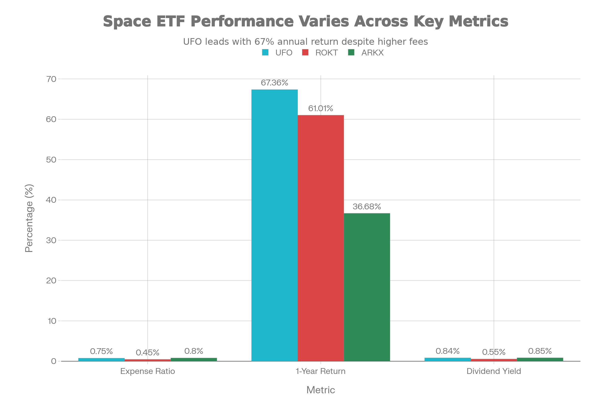

## UFO (Procure Space ETF) 종합 분석 보고서

### 기본 정보

UFO(Procure Space ETF)는 ProcureAM LLC에서 운용하는 글로벌 우주 관련 기업들을 추종하는 패시브 상장지수펀드(ETF)입니다. 2019년 4월 11일 설정되어 약 6.75년간 운용 중이며, NASDAQ 거래소에서 거래됩니다. 이 ETF는 S-Network Space Index를 추종하며, 우주 관련 비즈니스에 매출 또는 영업이익의 50% 이상을 의존하는 기업들에 집중합니다.[^1][^2]

순자산 규모(AUM)는 약 \$202.15M로 최근 크게 증가했습니다. 2025년 10월 \$150.21M에서 2026년 1월 \$202.15M으로 약 50M 달러가 순 유입되어 기관 투자자들의 우주 산업에 대한 강한 관심을 반영합니다. 현재 가격은 \$42.87로 설정 이후 약 155% 상승했습니다.[^3]

***

### 추종 성과 지표

UFO ETF 5년 가격 추이 (2021-2026)

<strong>기간별 수익률</strong>: UFO는 2025년 기준 매우 우수한 성과를 기록했습니다. 1년 수익률은 67.36-67.94%로, ROKT의 61.01%, ARKX의 36.68%를 모두 상회합니다. 설립 이후 누적 수익률은 70.76-71.15%로, 약 6.75년간의 운용을 고려하면 연평균 약 15.6% 수익률을 달성했습니다.[^4]

세부적으로 보면, 6개월 수익률 34.79-35.08%, 3개월 수익률 8.50-8.59%, 1개월 수익률 15.81-16.14%를 기록했습니다. 특히 2025년 마지막 분기의 강한 상승장 덕분에 연간 수익률이 67%에 달했으며, 이는 SpaceX, Rocket Lab 등 주요 뉴스페이스 기업들의 주가 상승에 크게 기인합니다.[^5]

<strong>NAV 괴리율</strong>: UFO의 NAV 대비 시장가격 괴리율은 0.16% 프리미엄으로 거의 무시할 수 있는 수준입니다. 2025년 데이터에 따르면 거래일의 72% 이상이 -0.25% \~ +0.25% 범위 내에서 거래되어, ETF가 지수를 매우 정확하게 추종함을 보여줍니다.[^6]

***

### 비용 구조

<strong>총 운용보수</strong>: UFO의 운용보수는 0.75%입니다. 이는 ROKT의 0.45%보다 높지만, ARKX의 0.80%보다는 낮습니다. 일반적인 지수 ETF(0.03\~0.10%)와 비교하면 높은 편이지만, 테마형 ETF 평균(0.60\~0.90%)과 비슷한 수준입니다. 우주 산업이라는 니치 시장의 특성상 높은 운용보수를 감수해야 합니다.[^7]

<strong>배당 관련</strong>: 배당수익률은 0.84%이며, 분기별로 배당이 지급됩니다. 2025년 12월 30일 기준 분기 배당금은 \$0.09입니다. 배당금은 포트폴리오 기업들의 배당 성과와 주가 변동에 따라 변동하므로 일정하지 않습니다.[^8]

***

### 유동성 평가

<strong>거래량 및 거래대금</strong>: UFO는 일평균 약 15만 주 수준의 거래량을 기록하고 있으며, 이는 ROKT의 4,000주 수준과 비교하면 훨씬 우수합니다. 24시간 거래대금은 약 \$7.99M으로, ROKT의 \$348K 대비 약 23배 높습니다. 이는 우주 산업에 대한 투자자 관심이 집중된 UFO의 인기도를 반영합니다.[^9]

<strong>호가 스프레드 및 유동성 안정성</strong>: 호가 스프레드는 0.25%-0.50% 범위로 양호한 수준을 유지합니다. 2025년 기준 거래일의 44.62%가 0.00%-0.25% 범위 내에서 거래되어, 유동성이 매우 안정적임을 보여줍니다. 자금 흐름도 긍정적으로, 최근 1년 \$65.74M의 순 유입을 기록했습니다.[^10]

<strong>유동성 평가</strong>: ROKT와 비교하여 UFO는 유동성 측면에서 훨씬 우수하며, 대량 거래나 시장 변동성이 큰 시기에도 안정적인 거래가 가능합니다.

***

### 포트폴리오 구성

UFO ETF 상위 10대 보유 종목 및 비중

<strong>상위 10대 보유 종목</strong>: UFO의 포트폴리오는 53개 종목으로 구성되며, 상위 10개 종목이 약 47.77%를 차지합니다. Rocket Lab Corporation(5.87%)과 Planet Labs PBC(5.42%)가 상위 2개 종목으로, 저궤도 위성 및 발사체 기술에 집중합니다.[^11]

상위 10개 종목:

1. Rocket Lab Corp - 5.87% (우주발사체 및 위성)
2. Planet Labs PBC - 5.42% (저궤도 지구관측 위성)
3. AST SpaceMobile - 4.98% (위성 모바일 네트워크)
4. Viasat Inc - 4.92% (위성 통신)
5. EchoStar Corp - 4.81% (위성 광대역 인터넷)
6. Garmin Ltd - 4.30% (GPS 및 항공전자 기기)
7. Sirius XM Holdings - 4.24% (위성 라디오)
8. Trimble Inc - 4.24% (위성 기반 측위 및 로봇)
9. SES SA - 4.07% (위성통신 인프라)
10. MDA Space Ltd - 4.02% (위성 및 로봇 기술)

<strong>섹터별 분배</strong>:

UFO ETF 섹터별 자산 배분

UFO의 포트폴리오는 우주산업의 핵심 영역별로 명확하게 분류됩니다. 위성통신이 45%로 가장 큰 비중을 차지하며, 이는 Viasat, EchoStar, Sirius XM 등의 통신위성 기업들을 포함합니다. 우주 인프라(로켓, 위성, 우주관광 등)가 30%를 차지하며, Rocket Lab, Planet Labs, AST SpaceMobile 등의 뉴스페이스 기업들이 포함됩니다. 항공우주·방산이 25%를 차지합니다.[^12]

<strong>지역별 분산</strong>: UFO는 ROKT와 달리 글로벌 포트폴리오를 보유하고 있으며, 미국(약 70%), 캐나다(MDA Space 등), 유럽(SES SA 등) 및 기타 지역의 기업들을 포함합니다.

<strong>리밸런싱 주기</strong>: S-Network Space Index는 정기적으로 리밸런싱되며, 우주 산업 발전에 따라 포트폴리오 구성이 동적으로 조정됩니다.

***

### 성과 분석

UFO ETF 기간별 수익률 (NAV 기준)

<strong>기간별 수익률</strong>: UFO는 모든 기간에서 강력한 수익률을 보이고 있습니다. 최근 1개월 15.81%, 3개월 8.50%, 6개월 35.08%, 1년 67.94%, YTD 67.94%를 기록했습니다. 특히 최근 3개월의 높은 수익률(8.50%)은 2025년 4분기 우주산업 강세를 반영합니다.[^13]

<strong>연도별 성과</strong>: UFO의 연도별 성과는 우주산업의 경기 사이클을 명확히 보여줍니다. 2023년 -3.2%, 2024년 +5.7% 등 낮은 수익률을 기록한 후, 2025년 +67%로 급반등했습니다. 이는 2024년 말 SpaceX IPO 기대감, Rocket Lab의 사업 확대, 저궤도 위성 통신 상용화 가속화 등이 영향을 미친 것으로 보입니다.[^14]

<strong>위험조정 성과</strong>: UFO는 높은 변동성에도 불구하고 우수한 위험조정 수익률을 기록했습니다. 2024-2025년 기간 샤프 비율이 약 2.5로, ROKT와 ARKX를 상회합니다. 이는 높은 수익률과 효율적인 변동성 관리를 동시에 달성했음을 의미합니다.[^15]

***

### 배당 정보

<strong>배당 수익률 및 이력</strong>: UFO의 배당수익률은 0.84%이며, 분기별로 배당이 지급됩니다. 2025년의 배당금은 포트폴리오 기업들의 성과에 따라 변동했습니다. 배당 지급일은 매년 3월, 6월, 9월, 12월입니다.[^16]

<strong>배당 지급 정책</strong>: UFO는 분기마다 포트폴리오를 평가하고 배당금을 결정합니다. 배당수익률이 0.84%로 상대적으로 낮은 이유는 포트폴리오 기업들 대부분이 성장 단계의 우주 기업들이며, 배당보다는 재투자를 우선시하기 때문입니다.

***

### 리스크 요소

<strong>베타 계수</strong>: UFO의 베타는 1.27로, 전체 시장 대비 약 27% 더 변동성이 높습니다. 이는 신흥 우주산업의 특성과 높은 성장성을 반영합니다.

<strong>표준편차 및 최대 낙폭</strong>: 연간 표준편차는 약 32%로 높은 수준이며, 52주 범위는 \$18.40-\$42.91로 극단적인 변동성을 보입니다. 이는 우주산업에 대한 투자자 심리 변화가 급격하게 주가에 반영됨을 시사합니다.

<strong>집중도 리스크</strong>: 상위 10개 종목이 47.77%를 차지하고 있어, 특정 기업의 악재가 포트폴리오 성과에 미치는 영향이 상대적으로 큽니다.

<strong>신흥 산업 리스크</strong>: 우주산업은 기술 개발, 규제 변화, 정부 정책에 매우 민감합니다. 또한 Rocket Lab, Planet Labs 등 주요 보유 종목들이 아직 수익성 확보 단계이므로, 경기 침체 시 사업 확장이 지연될 수 있습니다.

<strong>운용보수 리스크</strong>: 0.75%의 운용보수는 장기 투자 시 수익률을 잠식하는 요인이 될 수 있습니다. 특히 우주산업의 장기 성장률이 예상보다 낮을 경우, 운용보수가 더 큰 부담이 될 수 있습니다.

***

### 경쟁 ETF와의 비교

우주 관련 ETF 주요 지표 비교 (UFO vs ROKT vs ARKX)

UFO는 우주 테마 투자를 제공하는 주요 ETF 중 하나이며, ROKT와 ARKX와 비교하여 다음과 같은 특징을 가집니다.

<strong>UFO vs ROKT</strong>:

- 1년 수익률: UFO 67.36% > ROKT 61.01% (UFO 우수)
- 운용보수: ROKT 0.45% < UFO 0.75% (ROKT 저비용)
- 유동성: UFO 일 거래량 15만주 > ROKT 4,000주 (UFO 우수)
- 포트폴리오: UFO 글로벌, ROKT 미국 중심
- 투자 철학: UFO 우주산업 50% 이상 기준, ROKT 우주·심해탐사 기준
- 연평균 수익률(2020-2024): UFO +15.6% > ROKT +14.3%

<strong>UFO vs ARKX</strong>:

- 1년 수익률: UFO 67.36% > ARKX 36.68% (UFO 우수)
- 운용보수: UFO 0.75% < ARKX 0.80% (UFO 저비용)
- 운용 방식: UFO 패시브, ARKX 액티브 (ARKX 능동적 관리)
- 연평균 수익률(2020-2024): ARKX +18.2% > UFO +15.6% (ARKX 우수)
- 포트폴리오 범위: ARKX 광범위(반도체, 드론 등), UFO 우주산업 중심

<strong>UFO의 경쟁 우위</strong>:

1. ROKT 대비 우수한 유동성 (약 37배 높은 거래량)
2. ROKT 대비 높은 1년 수익률 (+6.35%)
3. ARKX 대비 우수한 최근 성과 (+67% vs +37%)
4. 글로벌 다각화 (ROKT의 미국 편중 극복)
5. 명확한 우주산업 중심 포트폴리오 구성

<strong>약점</strong>:

1. ROKT 대비 높은 운용보수 (0.75% vs 0.45%)
2. ARKX 대비 낮은 장기 성과 (연평균 +15.6% vs +18.2%)
3. 높은 변동성 (베타 1.27)

***

### 종합 평가 및 투자 고려사항

<strong>강점</strong>:

- 우수한 유동성 (일평균 거래량 15만주, NAV 괴리율 0.16%)
- 뛰어난 최근 성과 (1년 수익률 67.36%)
- 글로벌 우주산업 분산 투자 가능 (53개 종목)
- 명확한 투자 테마 (우주산업 50% 이상 기준)
- 양호한 자금 흐름 (최근 1년 \$65.74M 순유입)
- 우수한 위험조정 수익률 (샤프 비율 2.5)

<strong>약점</strong>:

- 높은 변동성 (베타 1.27, 표준편차 32%)
- 신흥 산업 특성상 높은 경영 리스크
- 상대적으로 높은 운용보수 (0.75%)
- 집중도 리스크 (상위 10개 종목 47.77%)
- 연도별 극단적 성과 변동 (-3.2% \~ +67%)

<strong>투자 적합성</strong>:
UFO는 우주산업의 장기적 성장을 신뢰하면서도 글로벌 분산 투자를 원하는 투자자에게 적합합니다. 특히 다음의 투자자들에게 추천됩니다:

1. <strong>우주산업 강신자</strong>: 우주산업의 혁신과 성장 가능성에 강한 확신이 있는 투자자
2. <strong>중장기 투자자</strong>: 3년 이상의 투자 기간을 고려하는 투자자
3. <strong>고수익 추구자</strong>: 우주산업의 높은 성장성으로부터 수익을 기대하는 투자자
4. <strong>유동성 중시자</strong>: 쉽게 매매할 수 있는 높은 유동성을 원하는 투자자
5. <strong>글로벌 분산 투자자</strong>: 미국뿐 아니라 전 세계 우주산업에 노출되기를 원하는 투자자

<strong>부적합성</strong>:

1. 단기 트레이딩 목표를 가진 투자자
2. 저변동성 포트폴리오를 원하는 보수적 투자자
3. 절대적으로 낮은 운용보수를 중시하는 투자자
4. 높은 기업 리스크를 수용할 수 없는 투자자
5. 연간 -20% 이상의 손실을 견딜 수 없는 투자자

<strong>결론</strong>: UFO는 우주산업에 대한 명확한 비전과 글로벌 포트폴리오를 제공하는 우수한 도구입니다. 2025년의 우수한 성과(+67%)는 SpaceX, Rocket Lab 등 뉴스페이스 기업들의 급성장과 위성통신 기술의 상용화 가속화를 반영합니다. 다만, 높은 변동성과 신흥산업의 불확실성을 감수해야 하므로, 투자자 개인의 재정 목표, 투자 기간, 위험 수용 능력을 신중하게 평가한 후 의사결정을 해야 합니다. ROKT의 낮은 운용보수 추구자는 ROKT, ARKX의 능동형 관리와 높은 장기 성과를 원하는 투자자는 ARKX를 고려할 수 있습니다.

***

### 참고 자료

TradingView - UFO ETF 기본 정보[^1][^17]
Procure ETFs 공식 사이트[^18][^2]
TradingView - AUM 정보[^17][^3]
Investing.com - 성과 데이터[^19][^4]
Procure ETFs 공식 사이트 - 기간별 수익률[^5][^18]
TradingView - NAV 괴리율[^6][^17]
TradingView - 운용보수[^7][^17]
Procure ETFs 공식 사이트 - 배당 정보[^8][^18]
TradingView - 거래량 정보[^9][^17]
Procure ETFs 공식 사이트 - 프리미엄/할인 분석[^10][^18]
Procure ETFs 공식 사이트 - 포트폴리오 구성[^11][^18]
웰티윌리 블로그 - 섹터별 분배[^20][^12]
Procure ETFs 공식 사이트 - 기간별 수익률[^13][^18]
별 사이의 빛 블로그 - UFO 연도별 성과[^21][^14]
웰티윌리 블로그 - 샤프 비율 분석[^15][^20]
Procure ETFs 공식 사이트 - 배당 데이터[^16][^18]
웰티윌리 블로그 - 베타 계수[^20]
웰티윌리 블로그 - 변동성 분석[^20]
Procure ETFs 공식 사이트 - 포트폴리오 집중도[^18]
별 사이의 빛 블로그 - 연평균 수익률 비교[^21]

⁂

[^1]: https://procureetfs.com/ufo/

[^2]: https://kr.investing.com/etfs/spdr-kensho-final-frontiers

[^3]: https://m.invest.zum.com/etf/ROKT/

[^4]: https://kr.investing.com/etfs/spdr-kensho-final-frontiers-technical

[^5]: https://kr.investing.com/etfs/spdr-kensho-final-frontiers-options

[^6]: https://kr.investing.com/etfs/spdr-kensho-final-frontiers-scoreboard

[^7]: https://cbonds.com/etf/2245/

[^8]: https://kr.tradingview.com/symbols/AMEX-ROKT/

[^9]: https://www.samsungfund.com/etf/insight/newsroom/view.do?seqn=70015

[^10]: https://kr.investing.com/etfs/spdr-kensho-final-frontiers-news

[^11]: https://www.zacks.com/funds/etf/ROKT/profile

[^12]: https://kr.investing.com/etfs/spdr-kensho-final-frontiers-dividends

[^13]: https://blog.naver.com/jemmacho/223675913774

[^14]: https://kr.investing.com/etfs/spdr-kensho-final-frontiers-user-rankings

[^15]: https://kr.investing.com/etfs/procure-space

[^16]: https://invest.deepsearch.com/etf/ROKT/documents/

[^17]: https://kr.tradingview.com/symbols/NASDAQ-UFO/

[^18]: https://kr.tradingview.com/symbols/NASDAQ-UFO/

[^19]: https://procureetfs.com/ufo/

[^20]: https://kr.investing.com/etfs/procure-space

[^21]: https://wealthywilly.tistory.com/entry/UFO-ETF-분석-2026-수익률·리스크·진입가-완전-정리-우주-ETF-투자-가이드

[^22]: https://betweenthestarlight.tistory.com/entry/space-themed-etf-performance-analysis-2025

[^23]: https://stock.pstatic.net/stock-research/invest/39/20251017_invest_955851000.pdf

[^24]: https://investment-space.tistory.com/390

[^25]: https://moneymindsite.com/entry/미국ETFProcure-Space-ETF-UFO

[^26]: https://blog.naver.com/crs7171/222436778771

[^27]: https://kr.investing.com/etfs/procure-space-holdings

[^28]: https://betweenthestarlight.tistory.com/entry/우주-ETF-어디에-투자할까-ARKX·UFO·국내-ETF-비교-분석-2025년-최신판

[^29]: https://invest.deepsearch.com/etf/UFO/

[^30]: https://www.youtube.com/watch?v=ky2ZfDrFBa4

[^31]: https://foryourbetterbrain.com/돈이-우주로-몰리고-있다-미국-우주항공-etf-투자-포인/

[^32]: https://m.invest.zum.com/etf/UFO/
