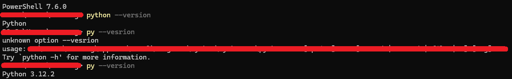
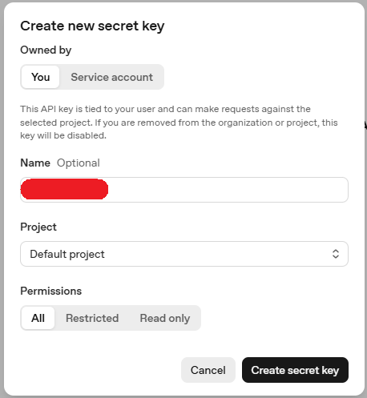
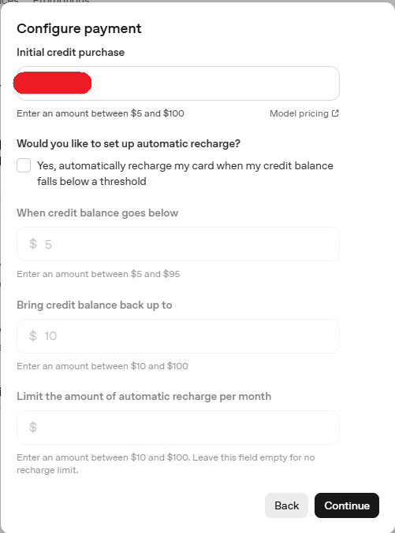

이번 주는 RAG를 만들기 전에, LLM이 어디까지 할 수 있고 어디서 한계가 생기는지 직접 확인하는 단계입니다.

**이번 주 목표**
- OpenAI API를 한 번 직접 호출한다.
- 토큰 개념과 컨텍스트 한계를 눈으로 확인한다.
- "왜 RAG가 필요한가?"를 자기 말로 설명한다.

**핵심 개념**
- **LLM**: 다음 토큰을 예측하며 문장을 생성하는 모델
- **토큰**: 모델이 텍스트를 잘게 나누어 처리하는 단위
- **컨텍스트 윈도우**: 모델이 한 번에 참고할 수 있는 텍스트 양
- **할루시네이션**: 근거 없이 그럴듯한 답을 만드는 현상
- **RAG**: 외부 문서를 검색해 LLM 입력에 붙여 정확도를 높이는 방식

**실습 순서**


- python 3.12.2 사용

### 1. 환경 준비
```bash
py -m venv .venv
.\.venv\Scripts\activate
py -m pip install openai python-dotenv tiktoken
```
> `python`은 파이썬 자체를 직접 실행하는 명령이고, `py`는 Windows에서 적절한 파이썬을 찾아 실행해주는 런처입니다.

먼저 키를 만들자  
  

> “OpenAI API 키 생성 화면”  
> “프로젝트 선택 후 secret key 생성”  
> “실제 키 값은 보안상 제외”

과금을 하자. Automatic Recharge는 해제  


> API 사용 전 결제 크레딧 및 자동 충전 여부를 설정할 수 있다.  
> 보안 및 개인 정보 보호를 위해 실제 결제수단 정보 및 금액은 제외했다.

### 2. `.env` 파일 만들기
```env
OPENAI_API_KEY=<YOUR_OPENAI_API_KEY>
```
> 환경 변수에 저장하는 것을 권장.

### 3. API 호출 실습  
```bash
python "openai_api_test.py"
```

<details>
<summary> <b> 상세 코드 </b> </summary> <br/>

```py
from __future__ import annotations

import os # 환경 변수 읽기
from textwrap import dedent # 여러 줄 문자열 출력 예쁘게

from dotenv import load_dotenv # .env에 적어둔 키 읽기
from openai import OpenAI


DEFAULT_MODEL = os.getenv("OPENAI_CHAT_MODEL", "gpt-4o-mini")
# 사용할 기본 모델 이름
# OPENAI_CHAT_MODEL 환경변수가 있으면 그 값을 쓰고,
# 없으면 "gpt-4o-mini"를 기본값으로 사용

# OpenAI(...)로 클라이언트를 만드는 것 자체는 과금 포인트가 아닙니다.
# 실제 사용량은 client.chat.completions.create(...) 호출 시 발생합니다.

def build_messages(question: str) -> list[dict[str, str]]:
    # question(질문 문자열)을 받아서 OpenAI 채팅 API가 요구하는 messages 형식으로 만들어주는 함수
    return [
        {
            "role": "system",
            "content": (
                "당신은 투자 분석 학습을 돕는 도우미입니다. "
                "확실하지 않은 내용은 추정이라고 분명히 말하세요."
            ),
        },
        # 모델의 역할/태도를 정해줌

        {"role": "user", "content": question},
        # user 메시지:
    ]


def ask_llm(question: str, model: str = DEFAULT_MODEL) -> str:
    # 질문(question)을 받아서 지정한 모델(model)로 LLM에게 물어보고 답변 텍스트를 반환하는 함수
    client = OpenAI(api_key=os.getenv("OPENAI_API_KEY")) # 하나하나마다 클라이언트 만드는 건 비효율적
    # main에서 하나 만들고 넘기는 것이 좋음

    response = client.chat.completions.create(
        model=model,
        messages=build_messages(question),
        temperature=0, # 답변의 랜덤성을 줄이는 설정 - 0에 가까울수록 더 보수적이고 일관된 답이 나옴

    )
    return response.choices[0].message.content or ""
    # 응답(response) 안에서 첫 번째 답변 텍스트를 꺼내서 반환 혹시 None이면 빈 문자열("") 반환


def main() -> None:
    load_dotenv() # .env에 모델이 지정되어 있어도 위에서 default model을 먼저 정하면 .env 내용이 반영이 안 될 수 있음

    api_key = os.getenv("OPENAI_API_KEY")
    if not api_key:
        raise SystemExit(
            "OPENAI_API_KEY가 없습니다. Week1 폴더 또는 상위 폴더의 .env 파일에 설정하세요."
        )

    questions = [
        "삼성전자의 사업 구조를 3문장으로 설명해 주세요.",
        "삼성전자 2024년 실적을 알려주세요. 모르면 모른다고 말해 주세요.",
    ]

    print(f"사용 모델: {DEFAULT_MODEL}")
    print("=" * 60)

    for index, question in enumerate(questions, start=1):
        answer = ask_llm(question)
        print(dedent(f"""
        [질문 {index}]
        {question}

        [응답]
        {answer}
        """).strip())
        # dedent(...)는 들여쓰기를 정리해줌, strip()은 앞뒤 공백/줄바꿈을 제거

        print("=" * 60)

    print("관찰 포인트:")
    print("1. 첫 질문은 일반 지식이라 비교적 안정적으로 답합니다.")
    print("2. 둘째 질문은 최신 수치가 필요하므로 모호하거나 추정성 답변이 나올 수 있습니다.")
    print("3. 이 한계를 보완하기 위해 RAG가 외부 문서를 붙여 줍니다.")


if __name__ == "__main__":
    main()
```

</details> <br/>

```
사용 모델: gpt-4o-mini
============================================================
[질문 1]
삼성전자의 사업 구조를 3문장으로 설명해 주세요.

[응답]
삼성전자는 주로 반도체, 모바일, 소비자 가전, 디스플레이 패널 등 다양한 사업 부문으로 구성되어 있습니다. 반도체 부문은 메모리와 비메모리 제품을 포함하여 회사의 주요 수익원으로 자리잡고 있습니다. 모바일 부문은 스마트폰과 관련 기기를 중심으로 하며, 소비자 가전 부문은 TV, 냉장고, 세탁기 등 다양한 가전 제품을 제공합니다.
============================================================
[질문 2]
삼성전자 2024년 실적을 알려주세요. 모르면 모른다고 말해 주세요.

[응답]
삼성전자의 2024년 실적에 대한 구체적인 정보는 현재로서는 알 수 없습니다. 2023년 10월까지의 데이터에 기반하여 예측할 수는 있지만, 정확한 실적은 여러 변수에 따라 달라질 수 있습니다. 따라서 2024년 실적에 대한 확실한 정보는 제공할 수 없습니다. 추정이나 예측이 필요하다면, 특정한 요소나 시장 동향에 대해 논의할 수 있습니다.
============================================================
관찰 포인트:
1. 첫 질문은 일반 지식이라 비교적 안정적으로 답합니다.
2. 둘째 질문은 최신 수치가 필요하므로 모호하거나 추정성 답변이 나올 수 있습니다.
3. 이 한계를 보완하기 위해 RAG가 외부 문서를 붙여 줍니다.
```

확인할 것:
- 일반 지식 질문에는 어떻게 답하는가
- 최신 수치 질문에는 얼마나 조심스럽게 답하는가
- 최신 정보가 없을 때 왜 외부 문서가 필요해지는가

<details>
<summary> <b> GPT 추가설명 </b> </summary> <br/>

아주 잘 됐어요. **Week 1에서 원하던 관찰이 정확히 나온 편**입니다.

핵심만 보면:

* **질문 1**에서는
  모델이 일반적인 회사 구조 설명은 그럴듯하고 안정적으로 해냈어요.
* **질문 2**에서는
  최신 실적처럼 외부 근거가 필요한 질문에 대해 **확실하지 않다고 물러섰어요.**
* 그래서 자연스럽게
  **“아, 모델이 내 최신 자료를 자동으로 아는 건 아니구나”**가 보입니다.

즉, 이번 실습의 목적이었던
**“LLM의 강점과 한계를 직접 체감하기”**는 성공이에요.

특히 좋은 점은 두 번째 응답이에요.
무리해서 아무 숫자나 지어내지 않고, **모른다고 말하는 방향**으로 나왔잖아요. 이건 지금 넣어둔 system prompt 영향도 어느 정도 받은 거예요.

다만 한 가지는 같이 기억하면 좋아요.
이 결과가 항상 이렇게 “정직하게” 나오는 건 아닙니다. 어떤 질문에서는 **모르면서도 그럴듯하게 답할 수도 있어요.** 그래서 RAG가 필요한 거예요.
즉:

* 프롬프트로 “모르면 모른다고 해”라고 시킬 수는 있지만
* 그것만으로 최신 정보 문제를 해결할 수는 없고
* **실제 문서나 기사 내용을 붙여줘야** 더 믿을 만해집니다

지금 상태에서 당신이 말할 수 있으면 됩니다:

> LLM은 일반 지식은 비교적 잘 설명하지만, 최신 실적이나 내 문서 내용은 기본적으로 알지 못한다.
> 그래서 최신 투자 자료나 PDF를 정확히 반영하려면, 외부 문서를 검색해서 같이 넣어주는 RAG가 필요하다.

이 정도면 Week 1 핵심을 이미 잡은 거예요.

다음으로는 아주 자연스럽게 두 가지 중 하나예요.

1. **토큰 실험** 해보기
   → 한국어/영어 토큰 수 차이 보기
2. 지금 코드에 질문 하나 더 추가해서 실험해보기
   예:
   * “삼성전자란 무엇인가?”
   * “어제 나온 삼성전자 뉴스 요약해줘”
     이렇게 비교하면 차이가 더 잘 보여요.

</details> <br/>

### 4. 토큰 실험
```bash
py tokenizer_experiment.py
```

<details>
<summary> <b> 상세 코드 </b> </summary> <br/>

```py
from __future__ import annotations # 타입 힌트를 조금 더 편하게 쓰기 위한 설정

import tiktoken
# OpenAI 계열 토크나이저를 다루는 라이브러리 - 텍스트를 토큰 단위로 쪼개는 데 사용합니다.

def main() -> None:
    encoding = tiktoken.get_encoding("cl100k_base")
    # 사용할 토크나이저를 가져옵니다.
    # "cl100k_base"는 OpenAI 모델들에서 자주 쓰이는 토큰 규칙 중 하나입니다.
    # 쉽게 말하면: "이 규칙대로 텍스트를 잘게 나누겠다"는 뜻입니다.

    texts = [
        "삼성전자",
        "Samsung Electronics",
        "2024년 영업이익은 35조원입니다.",
        "RAG는 검색된 문서를 LLM 컨텍스트에 넣어 정확도를 높입니다.",
    ]

    for text in texts:
        tokens = encoding.encode(text)
        print("=" * 60)
        print(f"텍스트: {text}")
        
        print(f"토큰 수: {len(tokens)}")
        # 토큰 개수를 출력합니다.
        # len(tokens)는 토큰 리스트의 길이이므로,
        # "이 문장이 몇 개의 토큰으로 쪼개졌는가?"를 의미합니다.

        print(f"토큰 ID: {tokens}")
        # 실제 토큰 ID 목록을 출력합니다.
        # 초보자 입장에서는 숫자 자체를 외울 필요는 없고,
        # "아, 문장이 이런 숫자 묶음으로 바뀌는구나" 정도만 보면 충분합니다.

    print("=" * 60)
    print("관찰 포인트:")
    
    print("1. 같은 의미라도 한국어가 영어보다 토큰 수가 많아질 수 있습니다.")
    # 예를 들어 "삼성전자"와 "Samsung Electronics"처럼
    # 뜻이 비슷해도 토큰 수가 다르게 나올 수 있습니다.
    # 일반적으로 한국어가 더 잘게 쪼개지는 경우가 많습니다.

    print("2. 토큰 수가 많아질수록 비용과 컨텍스트 사용량이 함께 늘어납니다.")
    # OpenAI API는 보통 입력/출력 토큰 수를 기준으로 비용이 발생합니다.
    # 따라서 토큰 수가 많아지면 비용도 늘 수 있습니다.
    # 또 모델이 한 번에 볼 수 있는 입력 길이(컨텍스트)도 더 빨리 소모됩니다.

    print("3. 긴 문서를 그대로 넣기 어려워서 RAG에서는 문서를 잘게 쪼개 검색합니다.")
    # 문서가 길면 토큰이 너무 많아져서
    # 한 번에 다 넣기 어렵거나 비효율적일 수 있습니다.
    # 그래서 RAG에서는 문서를 작은 조각(청크)으로 나눈 뒤,
    # 필요한 부분만 찾아서 모델에 넣는 방식을 사용합니다.

if __name__ == "__main__":
    main()
```

</details> <br/>

```
============================================================
텍스트: 삼성전자
토큰 수: 5
토큰 ID: [80690, 120, 33931, 66965, 26799]
============================================================
텍스트: Samsung Electronics
토큰 수: 2
토큰 ID: [51990, 38784]
============================================================
텍스트: 2024년 영업이익은 35조원입니다.
토큰 수: 18
토큰 ID: [2366, 19, 75265, 226, 39623, 223, 13879, 227, 13094, 6026, 113, 34804, 220, 1758, 93917, 55421, 80052, 13]
============================================================
텍스트: RAG는 검색된 문서를 LLM 컨텍스트에 넣어 정확도를 높입니다.
토큰 수: 30
토큰 ID: [49, 1929, 16969, 86422, 78326, 53400, 54535, 27796, 18918, 445, 11237, 90195, 101, 169, 45204, 54289, 19954, 66653, 96, 32179, 37155, 34693, 243, 49085, 18918, 5251, 228, 240, 80052, 13]
============================================================
관찰 포인트:
1. 같은 의미라도 한국어가 영어보다 토큰 수가 많아질 수 있습니다.
2. 토큰 수가 많아질수록 비용과 컨텍스트 사용량이 함께 늘어납니다.
3. 긴 문서를 그대로 넣기 어려워서 RAG에서는 문서를 잘게 쪼개 검색합니다.
```

확인할 것:
- 한국어와 영어의 토큰 수 차이
- 같은 의미라도 표현 방식에 따라 토큰 수가 달라짐
- 긴 문서를 통째로 넣기 어려운 이유

<details>
<summary> <b> GPT 추가설명 </b> </summary> <br/>

아주 좋아요. **원하던 결과가 제대로 나온 겁니다.**

이번 결과에서 핵심은 3개예요.

첫째, **한국어가 영어보다 토큰을 더 많이 쓴다**는 점이 잘 보였어요.
같은 회사 이름인데도:

* `삼성전자` → **5토큰**
* `Samsung Electronics` → **2토큰**

이 차이가 보이죠.
즉, 한국어 문서를 많이 넣으면 영어보다 **토큰을 더 빨리 소모할 수 있다**는 감을 잡으면 됩니다.

둘째, **문장이 길고 복잡해질수록 토큰 수가 꽤 빨리 늘어난다**는 점도 보였어요.
예를 들어:

* `2024년 영업이익은 35조원입니다.` → **18토큰**
* `RAG는 검색된 문서를 LLM 컨텍스트에 넣어 정확도를 높입니다.` → **30토큰**

겉보기엔 아주 긴 문장도 아닌데 토큰은 꽤 많이 나오죠.
이걸 보면 나중에 PDF 몇 페이지를 통째로 넣는 방식이 왜 비효율적인지 감이 옵니다.

셋째, 그래서 **RAG에서 문서를 잘게 나눠서 필요한 부분만 넣는 이유**가 자연스럽게 연결돼요.
모델이 한 번에 볼 수 있는 입력량에는 한계가 있고, 토큰이 많아질수록 비용도 늘어나니까, 긴 문서 전체를 넣기보다 **관련 있는 문단만 찾아 넣는 방식**이 더 효율적입니다.

정리하면, 지금 결과를 보고 이렇게 말할 수 있으면 성공이에요:

> 같은 의미라도 한국어는 영어보다 더 많은 토큰을 사용할 수 있다.
> 문장이 길어질수록 토큰 수와 비용, 컨텍스트 사용량이 함께 늘어난다.
> 그래서 RAG에서는 긴 문서를 통째로 넣지 않고, 잘게 나눈 뒤 필요한 부분만 검색해서 LLM에 넣는다.

</details> <br/>

### 파일 설명
- `openai_api_test.py`: LLM 기본 호출 + 최신 정보 한계 관찰
- `tokenizer_experiment.py`: 토큰 수와 토큰 ID 확인

### 실습 후 직접 답해보기
- LLM은 왜 내 PDF를 자동으로 알지 못할까?
- 최신 투자 보고서를 정확히 답하려면 무엇이 추가로 필요할까?
- RAG는 검색과 생성 중 어느 부분을 맡을까?

#### 1. LLM은 왜 내 PDF를 자동으로 알지 못할까?

LLM은 기본적으로 학습된 텍스트 패턴을 바탕으로 답변을 생성하는 모델일 뿐, 내 컴퓨터나 폴더 안의 PDF를 자동으로 읽는 존재는 아니다. 즉, 내가 PDF 내용을 직접 입력해 주거나 별도의 연결 과정을 만들지 않으면, LLM은 그 문서의 내용을 알 수 없다. 또한 문서가 길 경우 한 번에 모두 넣기 어려운 컨텍스트 한계도 있다.

#### 2. 최신 투자 보고서를 정확히 답하려면 무엇이 추가로 필요할까?

최신 투자 보고서를 정확히 답하려면, LLM 자체 지식만 사용하는 것이 아니라 최신 보고서 원문이나 기사 같은 외부 문서를 함께 제공해야 한다. 즉, 모델이 답을 지어내지 않도록 실제 자료를 검색해서 근거로 넣어 주는 과정이 필요하다. 그래서 최신 정보나 개인 자료를 다루려면 RAG 같은 방식이 유용하다.

#### 3. RAG는 검색과 생성 중 어느 부분을 맡을까?

RAG는 검색과 생성을 함께 사용하는 방식이다. 먼저 검색 단계에서 관련 문서 조각을 찾아오고, 그다음 생성 단계에서 LLM이 그 문서를 바탕으로 답변을 만든다. 즉, 문서를 찾는 것은 검색의 역할이고, 그 내용을 읽어 자연어 답변으로 정리하는 것은 생성의 역할이다.

**추천 자료**
- [3Blue1Brown — But what is a GPT?](https://www.youtube.com/watch?v=wjZofJX0v4M)
- [OpenAI Tokenizer](https://platform.openai.com/tokenizer)
- [Andrej Karpathy - Intro to LLMs](https://www.youtube.com/watch?v=zjkBMFhNj_g)

**완료 기준**
- [x] `python "OpenAI API.py"` 실행 후 응답을 받았다
- [x] `python tokenizer_experiment.py` 실행 후 토큰 수 차이를 확인했다
- [x] LLM은 최신 정보와 내 문서를 기본적으로 모르고, 긴 문서를 한 번에 다 넣기도 어려워서 RAG가 필요하다를 자기 말로 설명할 수 있다
  - LLM은 사전에 학습된 정보만 바탕으로 답하기 때문에, 최신 정보나 내 개인 문서를 자동으로 알지 못한다. 또한 긴 문서를 한 번에 모두 입력하기도 어렵다. 그래서 필요한 문서 조각을 검색해서 LLM에 함께 넣어주는 RAG가 필요하다.
- [x] 다음 주 임베딩 실습으로 넘어갈 준비가 되었다
