## Transformers, the tech behind LLMs | Deep Learning Chapter 5
- [Transformers, the tech behind LLMs | Deep Learning Chapter 5](https://www.3blue1brown.com/lessons/gpt?utm_source=chatgpt.com)
- [Youtube - Transformers, the tech behind LLMs | Deep Learning Chapter 5](https://www.youtube.com/watch?v=wjZofJX0v4M)

Formally speaking, a GPT is a Generative Pre-Trained Transformer. 

The first two words are self-explanatory: 
- **generative** means the model generates new text; 
- **pre-trained** means the model was trained on large amounts of data. 

What we will focus on is the transformer aspect of the language model, the main proponent of the recent boom in AI.

## What is a GPT Model?

### What exactly is a Transformer?
<span style=color:red;>A transformer is a special kind of neural network, a Machine Learning Model.</span> There are a wide variety of models that can be built using transformers: voice-to-text, text-to-voice, text-to-image, machine translation, and many more. The specific variant that we will focus on, which is the type that underlies tools like ChatGPT, will be a model trained to take in a piece of text, maybe even with some surrounding images or sound accompanying it, then produce a prediction of what comes next, in the form of a probability distribution over all chunks of text that might follow.

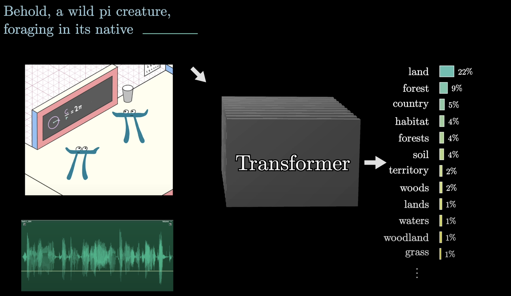

At first, predicting the next word might feel like a different goal from generating new text. But once you have a prediction model like this, one simple way to make this generate a longer piece is to give it an initial bit of text to work with, have it predict the next word, take a random sample from the distribution it just generated, then run it all again to make a new prediction based on all the text, including what it just added. <span style=color:red;>This process of repeated prediction and sampling is essentially what’s happening when you interact with ChatGPT and see it producing one word at a time.</span>

We'll first preview the transformer with a high-level perspective. We’ll spend much more time motivating, interpreting, and expanding on the details of each step, but in broad strokes, when one of these chatbots is generating text, here’s what’s going on under the hood.

> 예측과 샘플링의 반복.

### Tokens
An input is first broken into small chunks that are known as tokens. For example, in the sentence:
```
To date, the cleverest thinker of all time was ...
```
The tokenization of this input would be:
```
To| date|,| the| cle|ve|rest| thinker| of| all| time| was ...
```

Each of these tokens is then associated with a vector, meaning some list of numbers. <span style=color:red;>A common interpretation of these embeddings is that the coordinates of these vectors may somehow encode the meaning of each token. If you think of these vectors as giving coordinates in some high-dimensional space, words with similar meanings tend to land on vectors close to each other in that space.</span> These steps are pre-processing steps that occur before anything enters the transformer itself.

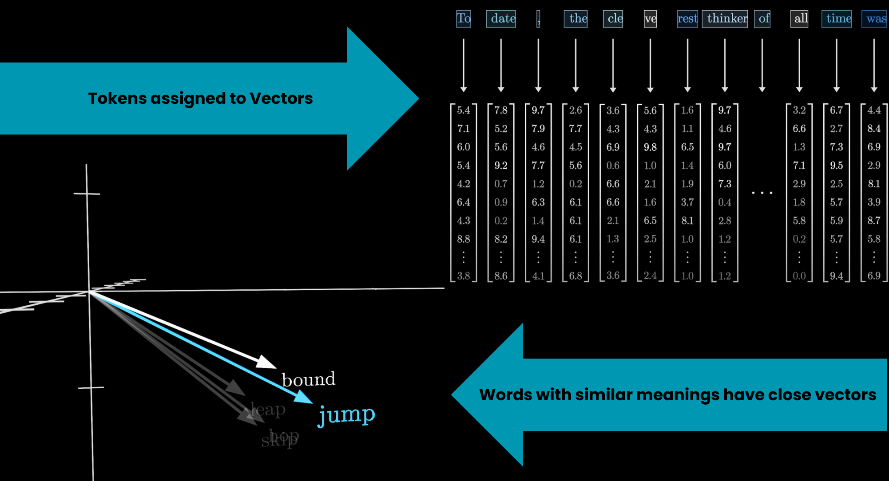

> 토큰은 숫자 목록을 의미하는 벡터와 연결되며, 벡터의 좌표는 각 토큰의 의미를 인코딩 가능함.

## Attention Block
<span style=color:red;>The encoded vectors then pass through an Attention Block where they communicate with each other to update their values based on context.</span> For example, the meaning of the word model in the phrase a machine learning model is different from its meaning in the phrase a fashion model. <span style=color:red;>The Attention Block is responsible for figuring out which words in the context are relevant to updating the meanings of other words and how exactly those meanings should be updated.</span>

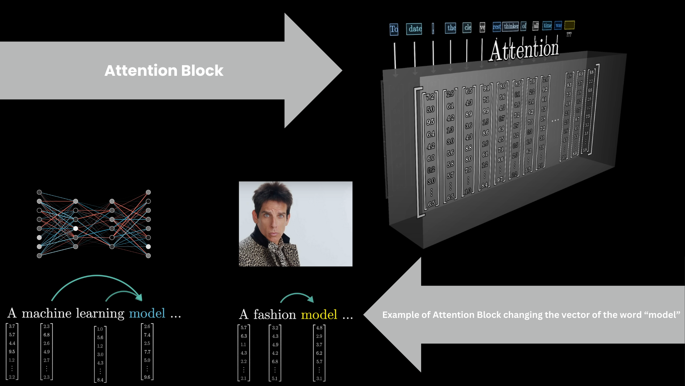

> 벡터는 컨텍스트에 따라 값을 업데이트함.

### Multilayer Perceptron(Feed-Forward Layer)
<span style=color:red;>Following the Attention Block, these vectors then pass through a Multilayer Perceptron, or Feed-Forward Layer.</span> Here, the vectors don’t talk to each other; they all go through the same operation in parallel. We’ll talk later about how this step is a bit like asking a long list of questions about each vector and updating them based on the answers.

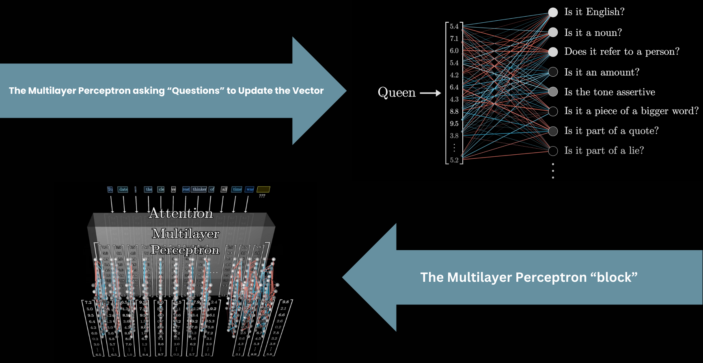

After that, the vectors pass through another attention block, then another multilayer perceptron block, then another attention block, and so on, getting altered by many variants of these two operations interlaced with one another. A large number of layers like this is what puts the "deep" in deep learning. Computationally, all the operations in both blocks will look like a giant pile of matrix multiplications, and our goal will be to understand how to read the underlying matrices.

<span style=color:red;>After many iterations, all the information necessary to predict the next word needs to be encoded into the last vector of the sequence, which will go through one final computation to produce a probability distribution over all the possible chunks of text that might come next.</span>

With that as a high-level preview, in this lesson we will expand on the details of what happens both at the beginning and the end of the network. But first, it may help to review some of the background knowledge that would have been second nature to any machine learning engineer by the time transformers came around.

## Premise of Deep Learning
<span style=color:red;>Machine learning, broadly speaking, describes a body of methods where one uses data to determine the behavior of a program</span>, as opposed to relying entirely on an explicitly encoded set of rules. For example, to write a function that takes in an image and produces a label, rather than explicitly defining a procedure for doing this in code, a machine learning model will consist of flexible parameters that determine its behavior, like a bunch of knobs and dials. <span style=color:red;>The job of the engineer is not to set those dials, but to determine a procedure to tune those parameters based on data.</span> For example, an image-labeling program may be trained using a large set of images with known labels.

> Machine Learning: 데이터를 program의 행동 결정에 이용하는 것.

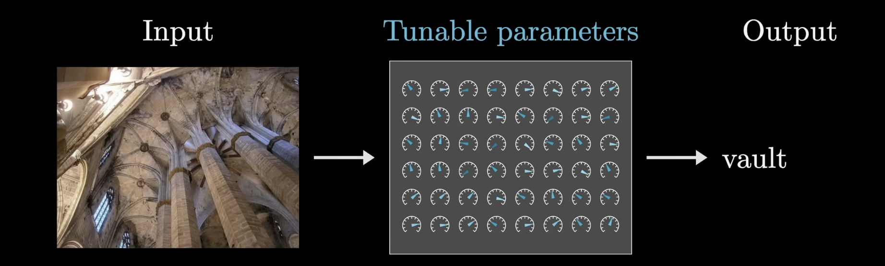

For example, the simplest form of machine learning might be linear regression, where inputs and outputs are single numbers, such as the square footage of a house and its price. A linear regression finds the line of best fit through the data to predict future house prices. This line is determined by two parameters: the slope and the y-intercept, which are tuned to most closely match the data. Then for future houses, with unknown prices, the predicted price would be determined based on the value of this line over the given square footage.

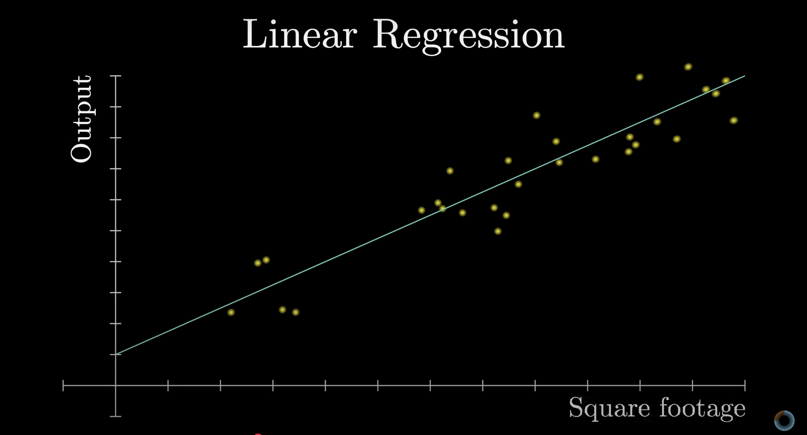

Deep learning is a subfield of Machine Learning, focused on a specific category of models known as Neural Networks. Needless to say, these can get dramatically more complicated than the simple linear regression example. GPT-3, for example, had an astounding 175 billion parameters. However, simply giving a model a huge number of parameters does not guarantee that it will perform better. Models at such scales risk being either completely intractable to train, prone to overfitting, or both.

Some deep learning models have shown a remarkable increase in capability as they size of the model and data it's trained on scale to enormous sizes. They are trained using an algorithm called backpropagation, but in order for this algorithm to work well at scale, these models have to adhere to a specific format. Understanding this format will help explain many of the choices in how transformers process language—choices that might otherwise seem arbitrary.

> back propagation을 이해하면 트랜스포머가 언어를 처리하는 방식을 이해하는 데 도움이 된다.

<span style=color:red;>First, the input to the model has to be formatted as an array of real numbers.</span> This could simply mean a list of numbers, a 2D array, or often higher-dimensional arrays, where the general term used here is tensor. The input data is progressively transformed into many different layers, always structured like some array of numbers, until it reaches the final layer as the output. For example, the final layer in our next-token-prediction model is the probability distribution over all possible next tokens.

In deep learning, the model parameters are almost always referred to as weights, because for the most part, the only way they interact with the data being processed is through weighted sums. Typically, you will find the weights packaged together in matrices, and instead of seeing weighted sums written out explicitly in the mathematics of such a model, you only see matrix-vector products. It represents the same idea, since each component in the output of a matrix-vector product looks like a weighted sum, it’s just often conceptually cleaner to think about matrices filled with tunable parameters transforming vectors drawn from the data being processed.

To prevent the entire model from being linear, there will typically also be some nonlinear functions sprinkled in between these matrix-vector products, such as the softmax operation we will see at the end of this article.

> matrix-vector product.  
> add nonlinear functions to prevent to be linear

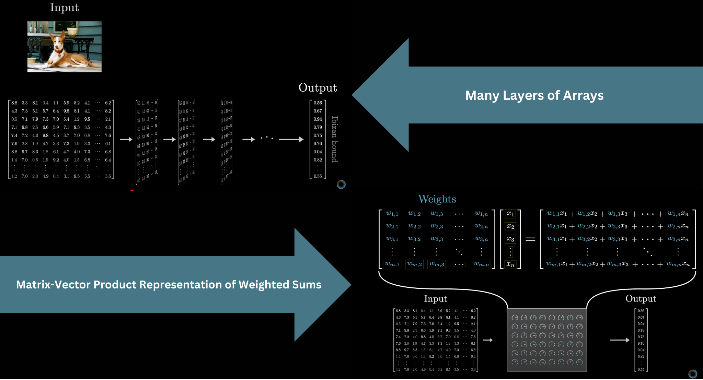

For example, the 175 billion weights in GPT-3 are organized into just under 28,000 different matrices. Those matrices fall into 8 different categories, and we will step through each type to understand what it does. As we go through, it will be fun for us to reference the numbers from GPT-3 to count up exactly where those 175 billion parameters all come from. There's a risk of getting lost in the vast amount of numbers, and in the hopes of adding clarity we'll draw a sharp distinction between the weights of the model, colored in blue or red, and the data being processed, colored in grey. The weights are the actual brains of the model, learned during training and determining how it behaves. The data being processed encodes whatever specific input was fed into the model in a given instance, like an example snippet of text.

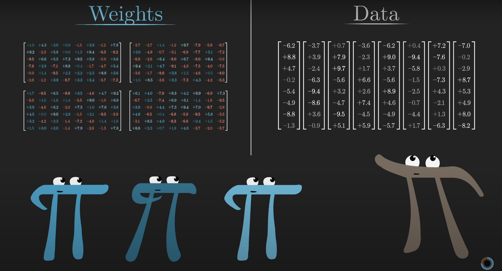

> 가중치: 모델이 학습하고 동작하는 방식을 결정하는 과정에서 학습된 실제 모델의 두뇌.  
> 처리 중인 데이터: 텍스트의 예시 스니펫과 같이 특정 입력이 주어진 인스턴스에서 모델에 입력되는 모든 것을 인코딩함.

## Embedding
With all that as a foundation, <span style=color:red;>let’s dig into the text-processing example, starting with this first step of breaking up the input into little chunks and turning those chunks into vectors. We mentioned earlier how these little chunks are called tokens, which might be pieces of words or punctuation.</span> For the sake of simplicity, we will pretend that the input is cleanly broken into words. Since we humans think in words, this will make it much easier to reference little examples to clarify each step.

> 텍스트 처리 예제

### Embedding Matrix
The model has a predefined vocabulary, some list of all possible words, say 50,000 of them. The first matrix of the transformer, known as the embedding matrix, will have one column for each of these words. <span style=color:red;>These columns determine what vector each word turns into in that first step. We label it as $W_E$, and like all the matrices we see, its values begin random, but they're going to be learned based on data.</span>

Turning words into vectors was common practice in machine learning long before transformers. This is often called embedding the word, which invites thinking of these vectors geometrically as points or directions in some space. Visualizing a list of three numbers as coordinates for a point in 3D space is no problem, <span style=color:red;>but word embeddings tend to be very high dimensional.</span> For GPT-3, they have 12,288 dimensions, and as you will see, it matters to work in a space with lots of distinct directions.

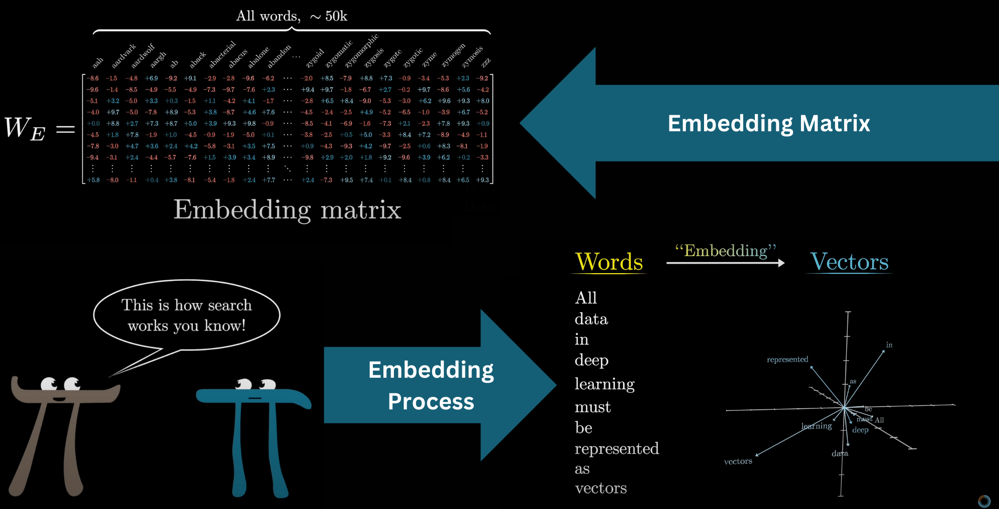

In the same way that you can take a 2D slice through 3D space and project points onto that slice, for the sake of visualizing word embeddings, we will do something analogous by choosing a 3D slice through the very high-dimensional space, projecting word vectors onto that, and displaying the result.

### Direction
<span style=color:red;>The big idea we need to understand here is that as a model tweaks and tunes its weights to decide how exactly words get embedded as vectors during training, it tends to settle on a set of embeddings where directions in this space have meaning.</span> Below, a simple word-to-vector model is running, and when I run a search for all words whose embeddings are closest to that of tower, they all generally have the same vibe.

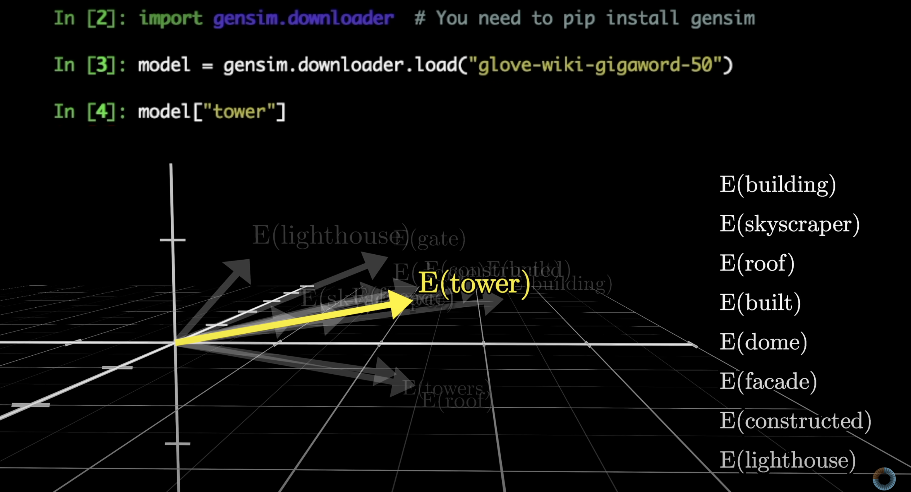

Another classic example of this is when the difference between the vectors for woman and man is taken, which can be visualized as a vector in this space connecting the tip of one to the tip of the other. This difference is quite similar to the difference between king and queen. So, if the word for a female monarch was unknown, it could be found by taking king, adding the direction of woman minus man, and searching for the closest word embedding.

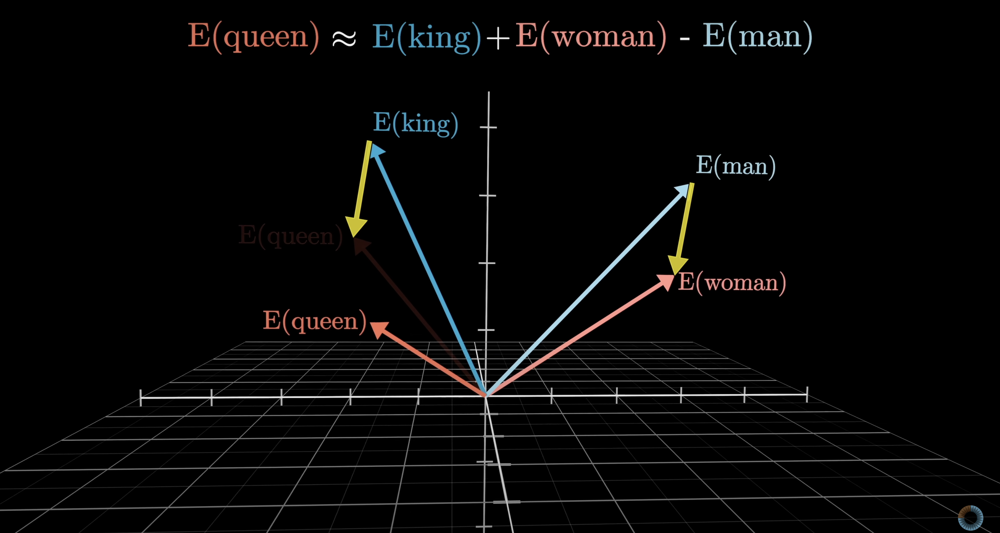

At least, kind of. Despite this being the classic example, for the model I was playing with when making this video, the true embedding of queen is a little farther off than the difference would suggest, presumably because the way queen is used in training data is not merely a feminine version of a king. Family relations illustrate the idea better:

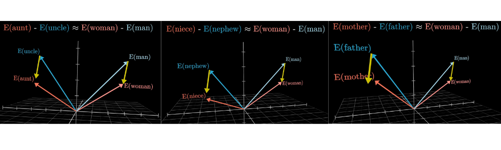

The idea here is that it seems as if, during training, the model found it advantageous to choose embeddings such that one direction in this space encodes gender information.

Another example of this would be taking the embedding of Italy, subtracting the embedding of Germany, and adding it to the embedding of Hitler. This results in something very close to the embedding of Mussolini. It’s as if the model learned to associate some directions with Italian-ness and others with WWII Axis leaders.

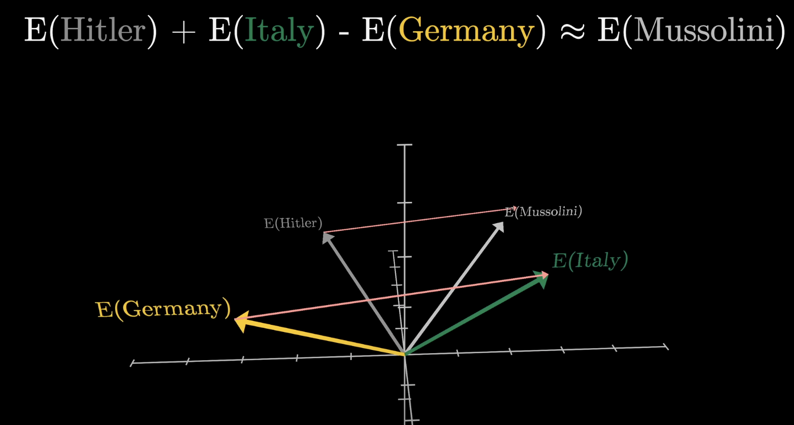

### Dot Product
<span style=color:red;>One bit of mathematical intuition helpful to have in mind as we continue is how the dot product of two vectors can be thought of as measuring how well they align.</span> Computationally, dot products involve multiplying all aligning components and adding the result. Geometrically, the dot product is positive when the vectors point in a similar direction, zero if they're perpendicular, and negative when they point in opposite directions.

> Dot Product: 두 벡터가 얼마나 비슷한 방향을 가리키는지 보는 값

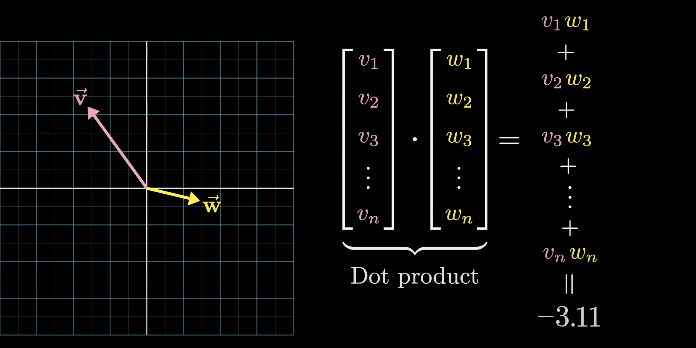

For example, suppose we wanted to test if the embedding of cats minus that of cat represents a kind of plurality direction in this space. To test this, you could take the dot product between this vector and various singular and plural nouns. When I did this for a simple word-to-vector model while making this video, it looked like the plural ones do indeed end up with consistently higher values than singular ones. Also, taking this dot product with the embeddings of the words one, two, three, and four, they give increasing values, as if it’s quantitatively measuring how plural the model finds a given word.

> cats - cat: plurality(복수성)이라는 성질의 방향일 수 있다.  
> 그리고 실험 결과도 복수성을 가진 단어들과 더 가깝다. (개수가 늘어나는 것도 더 많이 반영)

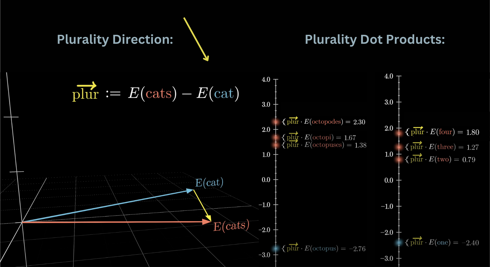

Again, how specifically each word gets embedded is learned using data. The embedding matrix, whose columns store the embedding of each word, is the first pile of weights in our model. Using the GPT-3 numbers, the vocabulary size is 50,257, and again, technically this consists not of words, per se, but different little chunks of text called tokens. The embedding dimension is 12,288, giving us 617,558,016 weights in total for this first step. Let’s go add that to a running tally, remembering that by the end we should count up to 175 billion weights.

### Beyond words
In the case of a transformer, <span style=color:red;>we also want to think of the vectors in this embedding space as not merely representing individual words. For one thing, these embeddings will also encode information about the position of the word, but more importantly, they need to have the capacity to soak in context.</span>

For example, a vector that started its life as the embedding of the word “king” may progressively get tugged and pulled by the various blocks in the network to end up pointing in a much more nuanced direction that somehow encodes a king who lived in Scotland, who had achieved his post after murdering the previous king, who is being described in Shakespearean language, and so on.

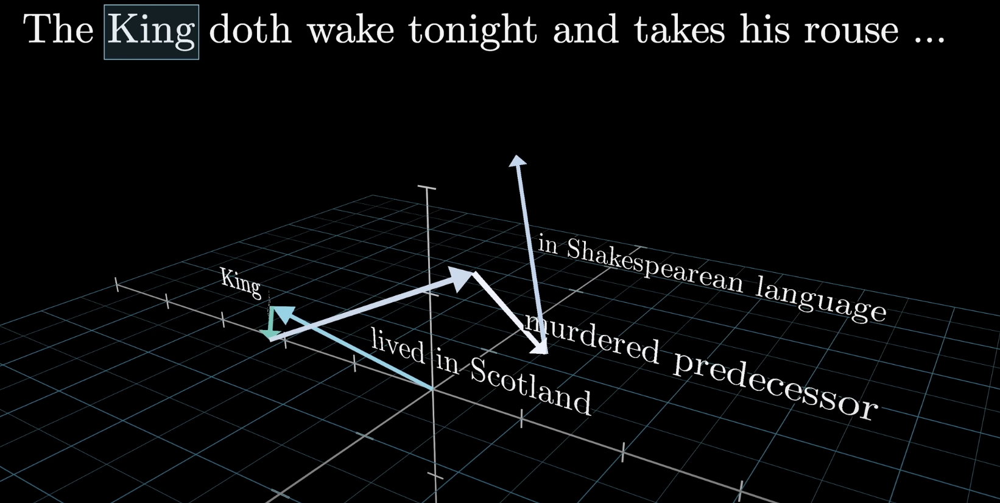

Think about our understanding of a word, like quill. Its meaning is clearly informed by its surroundings and context, whether it be a hedgehog quill or a type of pen. Sometimes, we may even include context from a long distance away. <span style=color:red;>When putting together a model that is able to predict the next word, the goal is to somehow empower it to do the same thing: take in context efficiently.</span>

In that very first step, when you create the array of vectors based on the input text, each one is simply plucked out of this embedding matrix, and each one only encodes the meaning of the single word it's associated with. It's effectively a lookup table with no input from the surroundings. <span style=color:red;>But as these vectors flow through the network, we should view the primary goal of this network as enabling each one of those vectors to soak up meaning that is more rich and specific than what mere individual words can represent.</span>

<span style=color:red;>The network can only look at a fixed number of vectors at a time, known as its context size.</span> GPT-3 was trained with a context size of 2048 tokens. So the data flowing through the network will look like this array of 2048 columns, each of which has around 12k dimensions. This context size limits how much text the transformer can incorporate to make its prediction of the next word, which is why long conversations with the early versions of ChatGPT often gave the feeling of the bot losing the thread of conversation.

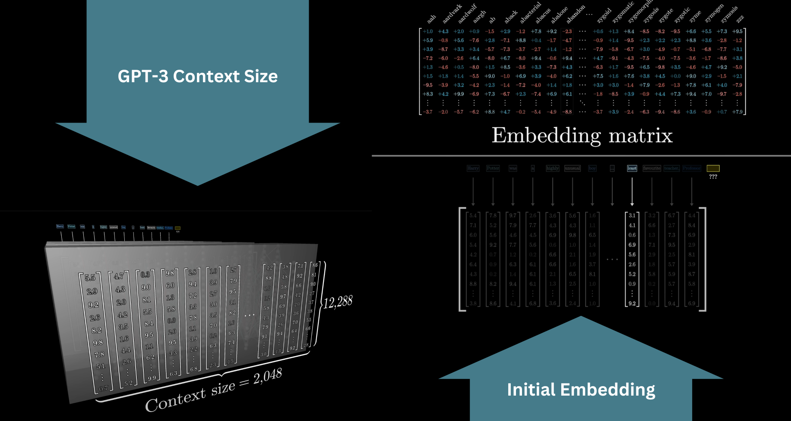

## Unembedding
We'll go into the details of the Attention Block in the next chapter, but first we'll skip ahead and talk about what happens at the very end of the Transformer. Remember, <span style=color:red;>the desired output is a probability distribution over all possible chunks of text that might come next.</span>

For example, if the last word is Professor, and the context includes words like Harry Potter, and the immediately preceding is least favorite, and if we pretend that all tokens look like full words, a well-trained network would presumably assign a high number to the word Snape.

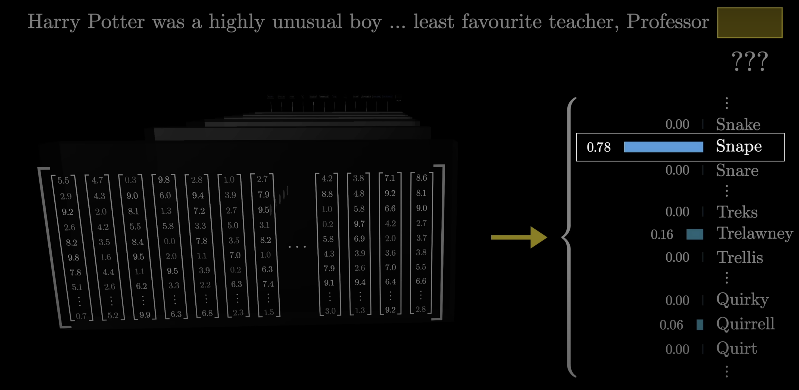

## Unembedding Matrix
This process involves two steps. The first is <span style=color:red;>to use another matrix</span> that maps the very last vector in the context to a list of ~50,000 values, one for each token in the vocabulary, then there’s a function that normalizes this into a probability distribution, called <span style=color:red;>softmax</span>, which we’ll talk more about in just a second.

It might seem weird to only use the last embedding to make a prediction when there are thousands of other vectors in that last layer just sitting here with their own context-rich meanings. This has to do with how the training process turns out to be much more efficient if we use each vector in this final layer to simultaneously make a prediction for what comes immediately after it. We'll talk a lot more about the training process later.

This is often called the unembedding matrix, and we'll give it the label $W_U$. Again, like all the weight matrices we’ll see, its entries begin random but are tuned during the training process.

> 모델은 마지막 문맥 벡터를 사용해 모든 토큰 후보의 점수를 만들고, softmax로 확률처럼 바꾼 뒤 다음 토큰을 고른다.  
> 
> 이 점수 변환에 쓰이는 행렬이 unembedding matrix다.
>
> 그리고 훈련할 때는 마지막 위치만이 아니라 각 위치의 벡터가 자기 다음 토큰을 동시에 예측하도록 학습해서 효율을 높인다.

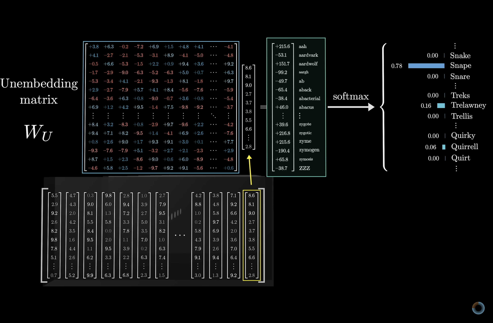

Keeping score on our total number of parameters, the unembedding matrix has one row for each word in the vocabulary, giving 50,257 words, and each row has the same number of elements as the dimension of the embedding, giving 12,288 columns. It’s very similar to the embedding matrix, just with the dimensions of the rows and columns swapped, so it adds another 617M parameters to the network, making our parameter count so far a little over a billion; a small but not insignificant fraction of the 175 billion that we'll end up with in total.

## Softmax
For the last lesson of this chapter, we will go over the softmax function, since it will appear again once we dive into the attention blocks.

The idea is that if we want a sequence of numbers to serve as a probability distribution, say a distribution over all possible next words, all the values should be between 0 and 1 and should all add up to be 1. However, in deep learning, where so much of what we do looks like a matrix-vector products, the outputs we get by default won’t abide by this at all. The values are often negative or sometimes greater than 1, and they almost certainly don’t all add up to 1.

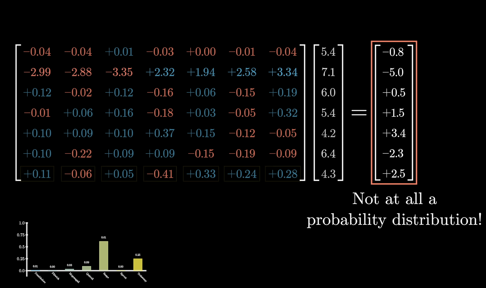

<span style=color:red;>Softmax turns an arbitrary list of numbers into a valid distribution, in such a way that the largest values end up closest to 1, and the smaller values end up closer to 0.</span>

The way it works is to first raise e to the power of each number, which gives a bunch of positive values. Then you take the sum of all these new terms and divide each term by that sum, which normalizes it into a list that adds up to 1.

The reason for calling it softmax is that instead of simply pulling out the biggest value, it produces a distribution that gives weight to all the relatively large values, commensurate with how large they are. If one entry in the input is much bigger than the rest, the corresponding output will be very close to 1, so sampling from the distribution is likely the same as just choosing the maximizing index from the input.

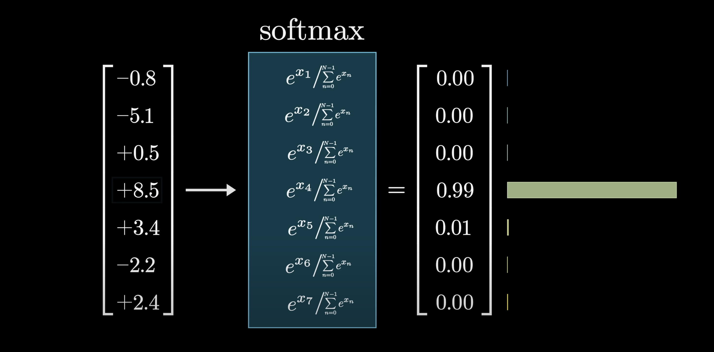

Here's another bit of jargon:  
In the same way that we might call the components of the output of this function probabilities, people often refer to the components of the input as <span style=color:red;>logits</span>. So when you feed in some text, have the word embeddings flow through the network, and do this final multiplication by the unembedding matrix, machine learning people would refer to the components of that raw unnormalized output as the logits for the next word prediction.

> logits: softmax의 출력값을 확률이라고 부르듯이, softmax에 넣기 전의 입력값은 logits라고 부른다.
> 
> 즉 텍스트를 넣고, embedding을 거쳐, network를 통과하고, 마지막에 unembedding matrix를 곱해서 얻는 정규화되지 않은 원시 점수들이 바로 다음 단어 예측의 logits이다.

## And That's The Overall Structure
Our goal for this chapter was to lay the foundations for understanding the attention mechanism. If we have a strong intuition for word embeddings, softmax, how dot products measure similarity, and the underlying premise that most calculations look like matrix multiplication with matrices full of tunable parameters, then understanding the attention mechanism, one of the keystone pieces of the whole modern boom in AI that we will explore in the next chapter, should be relatively smooth.