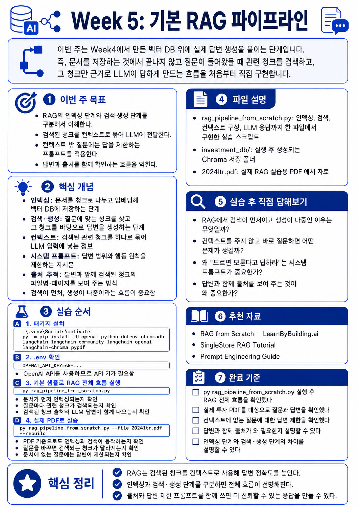

이번 주는 `Week4`에서 만든 벡터 DB 위에 실제 답변 생성을 붙이는 단계입니다. 

즉, 문서를 저장하는 것에서 끝나지 않고 질문이 들어왔을 때 관련 청크를 검색하고, 그 청크만 근거로 LLM이 답하게 만드는 흐름을 처음부터 직접 구현합니다.

## 이번 주 목표
- RAG의 인덱싱 단계와 검색·생성 단계를 구분해서 이해한다.
- 검색된 청크를 컨텍스트로 묶어 LLM에 전달한다.
- 컨텍스트 밖 질문에는 답을 제한하는 프롬프트를 적용한다.

## 핵심 개념
- **인덱싱**: 문서를 청크로 나누고 임베딩해 벡터 DB에 저장하는 단계
- **검색·생성**: 질문에 맞는 청크를 찾고, 그 청크를 바탕으로 답변을 생성하는 단계
- **시스템 프롬프트**: 모델에게 답변 범위와 행동 원칙을 강제하는 지시문
- **출처 추적**: 답변과 함께 검색된 청크 출처를 보여 주는 방식

## 이번 주 한눈에 보기



## 실습 순서

### 1. 패키지 설치
```bash
.\.venv\Scripts\activate
pip install openai python-dotenv chromadb langchain langchain-community langchain-openai langchain-chroma pypdf
```

### 2. `.env` 확인
```text
OPENAI_API_KEY=<YOUR_OPENAI_API_KEY>
```

### 3. 기본 샘플로 RAG 전체 흐름 실행
```bash
python rag_pipeline_from_scratch.py
```

<details>
<summary> <b> 상세 코드 - rag_pipeline_from_scratch.py </b> </summary> <br/>

```py
from __future__ import annotations
# Python 3.9+에서 타입 힌트를 조금 더 유연하게 쓰도록 도와주는 설정입니다.
# 지금 단계에서는 "타입 표기를 편하게 해주는 옵션" 정도로 이해하시면 충분합니다.

import argparse
# 터미널에서 실행할 때 --file, --k 같은 옵션을 받을 수 있게 해주는 모듈입니다.

import os
# 환경변수(예: OPENAI_API_KEY)를 읽을 때 사용합니다.

import shutil
# 폴더를 통째로 삭제할 때 사용합니다.
# 여기서는 --rebuild 옵션을 줄 때 기존 DB 폴더를 지우는 데 사용합니다.

from pathlib import Path
# 파일 경로를 더 안전하고 편하게 다루기 위한 도구입니다.
# 문자열로 경로를 직접 이어 붙이는 것보다 실수할 가능성이 적습니다.

from dotenv import load_dotenv
# .env 파일에 저장된 환경변수(예: API 키)를 프로그램 안으로 불러오는 역할입니다.

from langchain_text_splitters import RecursiveCharacterTextSplitter
# 긴 문서를 작은 청크(chunk)로 나누는 도구입니다.
# RAG에서는 문서를 한 번에 다 넣지 않고, 잘게 나눠서 저장하는 것이 중요합니다.

from langchain_chroma import Chroma
# 벡터 DB 역할을 하는 Chroma를 LangChain과 함께 사용하기 위한 클래스입니다.
# 청크를 저장하고, 질문과 비슷한 청크를 검색할 때 사용합니다.

from langchain_community.document_loaders import PyPDFLoader, TextLoader
# 문서를 읽어오는 로더(loader)입니다.
# PDF는 PyPDFLoader, 일반 텍스트 파일은 TextLoader를 사용합니다.

from langchain_openai import OpenAIEmbeddings
# 문장을 임베딩 벡터로 바꿔주는 도구입니다.
# RAG에서 "질문과 비슷한 청크 찾기"를 하려면 임베딩이 필요합니다.

from openai import OpenAI
# OpenAI의 채팅 모델을 호출하기 위한 클라이언트입니다.
# 검색이 끝난 뒤, 찾은 컨텍스트를 바탕으로 답변을 생성할 때 사용합니다.


# 현재 파이썬 파일이 있는 폴더(Week5 폴더)를 기준으로 경로를 잡습니다.
BASE_DIR = Path(__file__).resolve().parent

# 기본 실습용 텍스트 파일 경로입니다.
# 별도로 --file 옵션을 주지 않으면 이 파일을 사용합니다.
DEFAULT_FILE = BASE_DIR.parent / "Week3" / "sample_investment_note.txt"

# Chroma 벡터 DB를 저장할 기본 폴더입니다.
DEFAULT_DB_DIR = BASE_DIR / "investment_db"


def load_documents(file_path: Path):
    """
    전달받은 파일 경로를 보고,
    PDF면 PDF 로더로 읽고,
    그 외에는 텍스트 로더로 읽어서 문서 목록을 반환합니다.

    여기서 반환되는 값은 LangChain Document 객체들의 리스트입니다.
    """

    # 파일 확장자를 소문자로 가져옵니다.
    # 예: ".PDF"처럼 대문자로 되어 있어도 ".pdf"로 비교할 수 있게 합니다.
    suffix = file_path.suffix.lower()

    # PDF 파일이면 PDF 전용 로더 사용
    if suffix == ".pdf":
        loader = PyPDFLoader(str(file_path))
    else:
        # PDF가 아니면 일반 텍스트 파일로 간주하고 UTF-8로 읽습니다.
        loader = TextLoader(str(file_path), encoding="utf-8")

    # 실제 문서를 읽어서 반환합니다.
    return loader.load()


def get_model_names() -> tuple[str, str]:
    """
    .env 또는 시스템 환경변수에서
    채팅 모델 이름과 임베딩 모델 이름을 읽어옵니다.

    왜 함수로 따로 뺐을까요?
    -> load_dotenv()가 실행된 뒤에 읽어야 .env 값이 제대로 반영되기 때문입니다.
    """

    # 채팅 모델 이름을 읽습니다.
    # 환경변수가 없으면 기본값으로 gpt-4o-mini를 사용합니다.
    chat_model = os.getenv("OPENAI_CHAT_MODEL", "gpt-4o-mini")

    # 임베딩 모델 이름을 읽습니다.
    # 환경변수가 없으면 기본값으로 text-embedding-3-small을 사용합니다.
    embedding_model = os.getenv("OPENAI_EMBEDDING_MODEL", "text-embedding-3-small")

    return chat_model, embedding_model


def get_embeddings() -> OpenAIEmbeddings:
    """
    현재 설정된 임베딩 모델 이름을 읽어
    OpenAIEmbeddings 객체를 만들어 반환합니다.
    """

    # get_model_names()는 (채팅모델, 임베딩모델) 순서로 반환합니다.
    _, embedding_model = get_model_names()

    # 임베딩 객체 생성
    return OpenAIEmbeddings(model=embedding_model)


def prepare_vector_db(file_path: Path, db_dir: Path, rebuild: bool) -> Chroma:
    """
    벡터 DB를 준비하는 함수입니다.

    동작 방식:
    1. --rebuild 옵션이 있으면 기존 DB 폴더 삭제
    2. 이미 DB가 있으면 그 DB를 다시 열어서 재사용
    3. DB가 없으면 문서를 읽고 청크로 나눈 뒤 새로 인덱싱

    즉, 이 함수가 인덱싱 단계 전체를 담당한다고 보면 됩니다.
    """

    # 임베딩 객체 준비
    embeddings = get_embeddings()

    # 사용자가 --rebuild 옵션을 줬고, 기존 DB 폴더가 실제로 존재하면
    # 그 폴더를 통째로 삭제합니다.
    if rebuild and db_dir.exists():
        shutil.rmtree(db_dir)
        print(f"기존 DB 삭제: {db_dir}")

    # DB 폴더가 이미 존재하면 새로 인덱싱하지 않고 그대로 재사용합니다.
    # 이렇게 하면 매번 같은 문서를 중복 저장하는 일을 줄일 수 있습니다.
    if db_dir.exists():
        vectordb = Chroma(
            persist_directory=str(db_dir),
            embedding_function=embeddings,
        )
        print(f"기존 DB 재사용: {db_dir}")
        return vectordb

    # 여기까지 왔다는 것은 DB가 아직 없다는 뜻입니다.
    # 이제 새로 문서를 읽고 인덱싱을 해야 합니다.

    # 문서 로드
    documents = load_documents(file_path)

    # 문서를 작은 청크로 나누는 설정입니다.
    splitter = RecursiveCharacterTextSplitter(
        chunk_size=300,
        # 한 청크의 최대 길이입니다. 여기서는 300자 정도로 자릅니다.

        chunk_overlap=50,
        # 청크와 청크 사이에 50자를 겹치게 둡니다.
        # 겹침이 없으면 문장이 중간에서 잘려서 문맥이 끊길 수 있기 때문입니다.

        length_function=len,
        # 길이를 셀 때 Python의 len() 함수를 쓰겠다는 뜻입니다.
        # 즉, 여기서는 문자 수 기준으로 청크를 나눕니다.
    )

    # 실제로 문서를 청크로 분할합니다.
    chunks = splitter.split_documents(documents)

    # 각 청크에 메타데이터를 추가합니다.
    # 메타데이터는 "청크에 붙는 부가 정보"라고 보면 됩니다.
    for index, chunk in enumerate(chunks):
        # 원본 source 경로를 꺼내서 Path 객체로 바꿉니다.
        source_path = Path(chunk.metadata.get("source", ""))

        chunk.metadata.update(
            {
                "chunk_id": index,
                # 청크 번호를 붙입니다.
                # 나중에 디버깅하거나 추적할 때 도움이 됩니다.

                "source_name": source_path.name if source_path.name else "알 수 없음",
                # 전체 경로 대신 파일 이름만 따로 저장합니다.
                # 예: C:/.../2024ltr.pdf -> 2024ltr.pdf
            }
        )

    # 청크들을 임베딩해서 Chroma DB에 저장합니다.
    # Chroma DB에는 청크의 원문 텍스트와 그 청크의 임베딩 벡터, 그리고 메타데이터가 함께 저장
    vectordb = Chroma.from_documents(
        documents=chunks,
        embedding=embeddings,
        persist_directory=str(db_dir),
    )

    print(f"인덱싱 완료: {len(chunks)}개 청크 저장")
    return vectordb


def format_page(metadata: dict) -> str:
    """
    문서 메타데이터에서 페이지 번호를 사람이 보기 좋은 형태로 바꿔줍니다.

    PDF 로더는 페이지 번호를 0부터 저장하는 경우가 많아서,
    출력할 때는 +1 해서 1페이지부터 보이게 합니다.
    """

    page = metadata.get("page")

    # page가 정수라면 실제 출력용으로는 1을 더합니다.
    if isinstance(page, int):
        return str(page + 1)

    # 텍스트 파일처럼 페이지 개념이 없으면 ? 로 표시합니다.
    return "?"


def build_context(relevant_chunks) -> str:
    """
    검색된 청크들을 하나의 컨텍스트 문자열로 묶어
    LLM에게 전달할 준비를 하는 함수입니다.

    즉, 검색 결과를 "모델이 읽을 수 있는 참고자료 묶음"으로 만드는 단계입니다.
    """

    parts: list[str] = []

    for chunk in relevant_chunks:
        # 청크 메타데이터에서 파일 이름 가져오기
        source_name = chunk.metadata.get("source_name", "알 수 없음")

        # 사람이 읽기 좋은 페이지 번호 가져오기
        page = format_page(chunk.metadata)

        # 각 청크를 "출처 + 본문" 형태로 정리합니다.
        parts.append(f"[출처: {source_name}, 페이지: {page}]\n{chunk.page_content}")

    # 청크와 청크 사이를 구분선으로 나눠서 하나의 문자열로 합칩니다.
    return "\n\n---\n\n".join(parts)


def rag_query(vectordb: Chroma, client: OpenAI, question: str, k: int) -> str:
    """
    사용자의 질문 하나에 대해
    1. 관련 청크를 검색하고
    2. 컨텍스트를 만들고
    3. LLM에게 답변을 요청한 뒤
    4. 최종 답변 문자열을 반환하는 함수입니다.

    즉, 검색·생성 단계 전체를 담당합니다.
    """

    # 현재 사용할 채팅 모델 이름 가져오기
    chat_model, _ = get_model_names()

    # 벡터 DB에서 질문과 비슷한 청크 k개를 검색합니다.
    # 이 단계가 RAG의 "검색" 단계입니다.
    relevant_chunks = vectordb.similarity_search(question, k=k)

    # 검색된 청크들을 하나의 컨텍스트 문자열로 합칩니다.
    # 검색된 여러 청크를 LLM이 읽기 쉬운 한 덩어리의 입력으로 바꾸기 위해 필요
    # LLM은 청크들(Document 객체들)를 그대로 이해하지 않음. (text 형태의 context로 정리해서 줘야 함.)
    context = build_context(relevant_chunks)

    # 이제 OpenAI 채팅 모델에게 답변 생성을 요청합니다.
    # 이 단계가 RAG의 "생성" 단계입니다.
    response = client.chat.completions.create(
        model=chat_model,
        temperature=0,
        # temperature=0은 답변을 더 안정적이고 덜 랜덤하게 만들기 위한 설정입니다.
        # 실습에서는 보통 이렇게 두는 편이 좋습니다.

        messages=[
            {
                "role": "system",
                "content": (
                    "당신은 투자 자료 분석 도우미입니다. "
                    "반드시 제공된 컨텍스트만 사용해서 답하세요. "
                    "컨텍스트에 질문과 직접적으로 관련된 근거가 없으면 "
                    "'제공된 자료에서 찾을 수 없습니다'라고 답하세요. "
                    "추측하거나 일반 지식으로 보완하지 마세요."
                ),
            },
            # system 메시지는 모델의 행동 원칙을 정하는 역할을 합니다.
            # 여기서는 "컨텍스트 밖으로 나가지 말라"는 규칙을 강하게 넣었습니다.

            {
                "role": "user",
                "content": f"컨텍스트:\n{context}\n\n질문: {question}",
            },
            # user 메시지에는 실제 참고자료(context)와 질문(question)을 함께 넣습니다.
        ],
    )

    # 사람이 확인할 수 있도록 어떤 청크가 검색되었는지 콘솔에 출력합니다.
    print("[검색된 청크 출처]")

    if not relevant_chunks:
        print("검색 결과 없음")
    else:
        for index, chunk in enumerate(relevant_chunks, start=1):
            source_name = chunk.metadata.get("source_name", "알 수 없음")
            page = format_page(chunk.metadata)
            print(f"{index}. {source_name} p.{page}")

    # 모델의 답변 텍스트를 반환합니다.
    # 혹시 None일 가능성에 대비해 빈 문자열도 허용합니다.
    return response.choices[0].message.content or ""


def main() -> None:
    """
    프로그램 전체 실행의 시작점입니다.

    순서:
    1. .env 로드
    2. API 키 확인
    3. 명령행 인자 읽기
    4. 파일/DB 경로 준비
    5. 벡터 DB 준비(재사용 또는 새 인덱싱)
    6. 질문 여러 개 테스트
    """

    # .env 파일을 읽어서 환경변수를 불러옵니다.
    load_dotenv()

    # API 키 읽기
    api_key = os.getenv("OPENAI_API_KEY")

    # API 키가 없으면 프로그램을 종료합니다.
    if not api_key:
        raise SystemExit(
            "OPENAI_API_KEY가 없습니다. Week5 폴더 또는 상위 폴더의 .env 파일에 설정하세요."
        )

    # 현재 사용할 모델 이름들 읽기
    chat_model, embedding_model = get_model_names()

    # 명령행 인자 설정
    parser = argparse.ArgumentParser(description="Week5 기본 RAG 파이프라인")

    parser.add_argument(
        "--file",
        default=str(DEFAULT_FILE),
        help="인덱싱할 TXT 또는 PDF 파일 경로",
    )
    # 예:
    # python rag_pipeline_from_scratch.py --file ..\Week3\2024ltr.pdf

    parser.add_argument(
        "--db-dir",
        default=str(DEFAULT_DB_DIR),
        help="Chroma DB 저장 경로",
    )
    # 벡터 DB를 저장할 폴더 경로를 바꿀 수 있습니다.

    parser.add_argument(
        "--k",
        type=int,
        default=3,
        help="질문마다 검색할 청크 수",
    )
    # 질문마다 몇 개의 청크를 가져올지 정합니다.

    parser.add_argument(
        "--rebuild",
        action="store_true",
        help="기존 DB를 삭제하고 다시 인덱싱합니다.",
    )
    # 이 옵션을 넣으면 기존 investment_db를 지우고 다시 만듭니다.

    # 실제로 명령행 인자 읽기
    args = parser.parse_args()

    # 문자열 경로를 Path 객체로 변환
    file_path = Path(args.file)
    db_dir = Path(args.db_dir)

    # 대상 파일이 실제로 존재하는지 확인
    if not file_path.exists():
        raise SystemExit(f"파일을 찾을 수 없습니다: {file_path}")

    # 현재 설정 상태를 화면에 출력
    print(f"채팅 모델: {chat_model}")
    print(f"임베딩 모델: {embedding_model}")
    print(f"대상 파일: {file_path}")
    print(f"DB 경로: {db_dir}")
    print("=" * 60)

    # 벡터 DB 준비
    # 이미 있으면 재사용, 없으면 인덱싱
    vectordb = prepare_vector_db(file_path, db_dir, args.rebuild)

    # OpenAI 클라이언트 생성
    client = OpenAI(api_key=api_key)

    # 실습용 질문들
    questions = [
        "삼성전자의 최근 영업이익 추이는 어떤가요?",
        "HBM 반도체 시장 전망은 어떻게 되나요?",
        "오늘 저녁 뭐 먹을까요?",
    ]

    # 질문들 (pdf)
    questions = [
        "버크셔 해서웨이의 2024년 operating earnings는 얼마인가요?",
        "2024년에 버크셔 실적이 예상보다 좋았던 이유는 무엇인가요?",
        "버크셔가 투자한 일본 5대 상사는 어디인가요?",
    ]

    # 추가 질문들 (pdf)
    questions = [
        "2024년 버크셔의 insurance-investment income은 얼마인가요?",
        "GEICO의 실적 개선은 어떻게 설명되나요?",
        "버크셔가 2024년에 IRS에 납부한 법인세는 얼마인가요?",
        "버크셔는 왜 현금보다 equities를 선호한다고 말하나요?",
        "보험 float는 얼마에서 얼마로 증가했나요?",
        "2024년 버크셔 성과는 S&P 500과 비교해 어땠나요?",
    ]

    # 질문을 하나씩 던져보면서 RAG가 어떻게 동작하는지 확인합니다.
    for question in questions:
        print("=" * 60)
        print(f"질문: {question}")

        # 검색 + 생성 수행
        answer = rag_query(vectordb, client, question, args.k)

        # 최종 답변 출력
        print("[답변]")
        print(answer)

    print("=" * 60)
    print("관찰 포인트:")
    print("1. 검색 단계와 생성 단계가 분리되어 있다는 점을 확인합니다.")
    print("2. 컨텍스트에 없는 질문에는 답변을 제한하도록 프롬프트를 설계했습니다.")
    print("3. 출처를 함께 출력하면 나중에 답변 근거를 검증할 수 있습니다.")


# 이 파일을 직접 실행했을 때만 main()을 실행합니다.
# 다른 파일에서 import할 때는 자동 실행되지 않게 해주는 아주 흔한 Python 문법입니다.
if __name__ == "__main__":
    main()
```

</details> <br/>


<details>
<summary> <b> GPT 추가설명 (코드 실행 방법) </b> </summary> <br/>

```bash
# 기본 실행:
python rag_pipeline_from_scratch.py

# PDF로 실행:
python rag_pipeline_from_scratch.py --file ..\Week3\2024ltr.pdf

# 기존 DB 지우고 다시 인덱싱:
python rag_pipeline_from_scratch.py --file ..\Week3\2024ltr.pdf --rebuild
```
딱 한 가지 더 말씀드리면,  
지금 코드는 **DB가 있으면 그냥 재사용**하므로, 다른 파일로 바꿔 실행할 때는 `--rebuild`를 같이 주는 습관이 좋습니다.

예를 들어 sample txt로 만들었던 DB가 있는데 이번엔 PDF를 넣고 싶다면:
```bash
python rag_pipeline_from_scratch.py --file ..\Week3\2024ltr.pdf --rebuild
```

</details> <br/>

```bash
python week5_rag_pipeline_from_scratch.py
채팅 모델: gpt-4o-mini
임베딩 모델: text-embedding-3-small
대상 파일: ..\Week3\sample_investment_note.txt
DB 경로: .\investment_db
============================================================
기존 DB 재사용: .\investment_db
============================================================
질문: 삼성전자의 최근 영업이익 추이는 어떤가요?
[검색된 청크 출처]
1. sample_investment_note.txt p.?
2. 2024ltr.pdf p.8
3. 2024ltr.pdf p.8
[답변]
제공된 자료에서 찾을 수 없습니다.
============================================================
질문: HBM 반도체 시장 전망은 어떻게 되나요?
[검색된 청크 출처]
1. sample_investment_note.txt p.?
2. 2024ltr.pdf p.4
3. 2024ltr.pdf p.4
[답변]
제공된 자료에서 HBM 반도체 시장 전망에 대한 구체적인 내용은 언급되지 않았습니다. 다만, 삼성전자가 HBM과 고대역폭 메모리 관련 수요가 늘어나면서 메모리 부문의 기대감이 커졌다는 점이 있습니다.
============================================================
질문: 오늘 저녁 뭐 먹을까요?
[검색된 청크 출처]
1. 2024ltr.pdf p.15
2. 2024ltr.pdf p.15
3. 2024ltr.pdf p.15
[답변]
제공된 자료에서 찾을 수 없습니다.
============================================================
관찰 포인트:
1. 검색 단계와 생성 단계가 분리되어 있다는 점을 확인합니다.
2. 컨텍스트에 없는 질문에는 답변을 제한하도록 프롬프트를 설계했습니다.
3. 출처를 함께 출력하면 나중에 답변 근거를 검증할 수 있습니다.
```

확인할 것:
- 문서가 먼저 인덱싱되는지
- 질문마다 관련 청크가 검색되는지
- 검색된 청크 출처와 LLM 답변이 함께 나오는지

<details>
<summary> <b> GPT 추가설명 </b> </summary> <br/>

네, 실습 결과 잘 나왔어요.  
그리고 이 출력은 **Week 5에서 확인해야 할 포인트들을 꽤 잘 보여줍니다.** 다만, **딱 하나 중요한 관찰**이 있어요: 지금은 **기존 DB를 재사용하면서 sample txt와 PDF가 섞인 상태**로 보입니다.

아래처럼 항목별로 볼게요.

<h2> 이번 실행에서는 “새 인덱싱”보다 “기존 DB 재사용”이 확인되었습니다 </h2>

출력에 이렇게 나왔죠.

```text
기존 DB 재사용: .\investment_db
```

즉, 이번 실행에서는:

* 문서를 새로 읽어서
* 새로 청크를 만들고
* 새로 DB에 저장한 것이 아니라

이미 만들어져 있던 벡터 DB를 그대로 다시 연 것입니다.

<h3> 그래서 이 항목은 어떻게 해석하면 되나요? </h3>

* **벡터 DB를 사용하는 흐름은 정상**
* 하지만 **“이번 실행에서 문서가 먼저 인덱싱되었다”는 장면은 직접 확인하지 못함**

즉, 이번 결과로 확인된 것은:

> **인덱싱된 DB를 재사용해서 검색·생성이 잘 되는지**

입니다.

<h3> 이 항목까지 명확히 확인하려면 </h3>

아래처럼 다시 실행해보면 됩니다.

```bash
python week5_rag_pipeline_from_scratch.py --rebuild
```

또는 PDF 대상으로 명확하게 보려면:

```bash
python week5_rag_pipeline_from_scratch.py --file ..\Week3\2024ltr.pdf --rebuild
```

그때는 아마 이런 식으로 나와야 합니다.

* 기존 DB 삭제
* 문서 로드
* 인덱싱 완료: 몇 개 청크 저장

그러면 **“문서가 먼저 인덱싱되는지”** 를 눈으로 직접 확인한 것이 됩니다.

<h2> 질문마다 관련 청크가 검색되는지 </h2>

질문마다 검색 결과가 다르게 나왔기 때문입니다.

예를 보면:

<h3> 질문 1 </h3>

```text
질문: 삼성전자의 최근 영업이익 추이는 어떤가요?
1. sample_investment_note.txt p.?
2. 2024ltr.pdf p.8
3. 2024ltr.pdf p.8
```

<h3> 질문 2 </h3>

```text
질문: HBM 반도체 시장 전망은 어떻게 되나요?
1. sample_investment_note.txt p.?
2. 2024ltr.pdf p.4
3. 2024ltr.pdf p.4
```

<h3> 질문 3 </h3>

```text
질문: 오늘 저녁 뭐 먹을까요?
1. 2024ltr.pdf p.15
2. 2024ltr.pdf p.15
3. 2024ltr.pdf p.15
```

질문이 바뀔 때마다 검색된 페이지와 조합이 달라졌죠.
즉,

> **벡터 DB가 질문과 유사한 청크를 찾아오는 검색 단계는 정상적으로 작동하고 있습니다.**

<h2> 검색된 청크 출처와 LLM 답변이 함께 나오는지 </h2>

매 질문마다 다음 두 가지가 같이 나오고 있어요.

* `[검색된 청크 출처]`
* `[답변]`

예를 들어 첫 번째 질문에서는:

```text
[검색된 청크 출처]
1. sample_investment_note.txt p.?
2. 2024ltr.pdf p.8
3. 2024ltr.pdf p.8

[답변]
제공된 자료에서 찾을 수 없습니다.
```

이건 Week 5 목표와 아주 잘 맞습니다.

즉, 지금 코드가:

* 그냥 답만 하는 게 아니라
* **어떤 자료를 근거로 검색했는지 보여주고**
* **그걸 바탕으로 답변을 생성하고 있다**

는 점이 확인됐습니다.

<h2> 이번 결과에서 특히 눈에 띄는 중요한 관찰 </h2>

<h3> DB 안에 서로 다른 문서가 섞여 있습니다 </h3>

이게 가장 중요해요.

왜냐하면 현재 대상 파일은:

```text
대상 파일: ...\Week3\sample_investment_note.txt
```

인데, 검색 결과에는 계속:

* `sample_investment_note.txt`
* `2024ltr.pdf`

가 **같이** 나오고 있기 때문입니다.

즉, 현재 `investment_db`에는 이전에 넣었던 PDF 청크와 이번 txt 청크가 함께 들어 있는 상태로 보입니다.

<h3> 이게 왜 중요하냐면 </h3>

지금은 “sample txt만 대상으로 질문한다”기보다,
실제로는 **섞인 DB 전체를 대상으로 검색**하고 있는 셈이에요.

그래서 실습 관점에서는 이렇게 해석해야 합니다.

* 검색 자체는 잘 됨
* 답변 제한도 어느 정도 잘 됨
* 하지만 **실험 조건이 깔끔하게 분리되지는 않음**

즉, 이번 출력은 “RAG가 동작한다”는 건 잘 보여주지만,
“특정 문서만 대상으로 했는가?”는 조금 흐려져 있습니다.

<h2> 왜 같은 페이지가 중복으로 보일까요? </h2>

예를 들어:

```text
2. 2024ltr.pdf p.8
3. 2024ltr.pdf p.8
```

이런 식으로 같은 페이지가 반복되죠.

이건 이상한 오류라기보다, 보통 아래 둘 중 하나입니다.

<h3> 가능성 1. 같은 페이지 안에서 서로 다른 청크가 여러 개 검색됨 </h3>

예를 들어 PDF 8페이지가 길면,
그 안에서 여러 청크가 나뉘어 저장됩니다.

그러면 검색 결과가:

* 8페이지 청크 A
* 8페이지 청크 B

처럼 나올 수 있어요.

출력에서는 둘 다 `p.8`로만 보여서 중복처럼 보이는 겁니다.

<h3> 가능성 2. DB에 중복 데이터가 있을 수도 있음 </h3>

예전에 같은 PDF를 여러 번 인덱싱했다면,
유사한 청크가 중복 저장됐을 가능성도 있습니다.

현재는 `기존 DB 재사용` 상태라서 이 가능성도 조금 있어요.

<h2> 답변 품질은 어땠는가? </h2>

<h3> 첫 번째 질문 </h3>

```text
삼성전자의 최근 영업이익 추이는 어떤가요?
→ 제공된 자료에서 찾을 수 없습니다.
```

이건 오히려 괜찮은 반응일 수 있습니다.

왜냐하면 검색은 일부 관련 청크를 가져왔더라도,
그 청크 안에 **“최근 영업이익 추이”를 직접 설명하는 근거**가 부족하면
모델이 억지로 답하지 않고 제한한 것이기 때문입니다.

즉, **프롬프트가 어느 정도 잘 작동한 것**으로 볼 수 있습니다.

<h3> 두 번째 질문 </h3>

```text
HBM 반도체 시장 전망은 어떻게 되나요?
→ 구체적인 내용은 언급되지 않았습니다.
   다만, 삼성전자가 HBM과 고대역폭 메모리 관련 수요가 늘어나면서...
```

이건 꽤 흥미로운 결과예요.

완전히 “없다”로 끝내지 않고,
검색된 컨텍스트 안에서 **관련성이 있는 부분만 제한적으로 설명**했죠.

즉:

* 질문 전체에 대한 완벽한 답은 아니지만
* 컨텍스트에 있는 범위 안에서는 조심스럽게 답한 것

이라서 나쁘지 않습니다.

<h3> 세 번째 질문 </h3>

```text
오늘 저녁 뭐 먹을까요?
→ 제공된 자료에서 찾을 수 없습니다.
```

이건 아주 정상입니다.

문서와 무관한 질문에 대해
모델이 괜히 추천 메뉴를 말하지 않고 제한했으니,
Week 5 목표 중 하나인:

> **컨텍스트 밖 질문에 대한 답변 제한**

이 잘 확인된 것입니다.

<h2> 지금 상태에서 가장 추천하는 다음 실습 </h2>

이번엔 **문서 하나만 대상으로 깔끔하게 다시 실험**하는 게 좋아요.

<h3> sample txt만 확인 </h3>

```bash
python week5_rag_pipeline_from_scratch.py --file ..\Week3\sample_investment_note.txt --rebuild
```

<h3> PDF만 확인 </h3>

```bash
python week5_rag_pipeline_from_scratch.py --file ..\Week3\2024ltr.pdf --rebuild
```

</details> <br/>

```bash
python week5_rag_pipeline_from_scratch.py --rebuild
```

```bash
python week5_rag_pipeline_from_scratch.py --rebuild
채팅 모델: gpt-4o-mini
임베딩 모델: text-embedding-3-small
대상 파일: ..\Week3\sample_investment_note.txt
DB 경로: .\investment_db
============================================================
기존 DB 삭제: .\investment_db
인덱싱 완료: 2개 청크 저장
============================================================
질문: 삼성전자의 최근 영업이익 추이는 어떤가요?
[검색된 청크 출처]
1. sample_investment_note.txt p.?
2. sample_investment_note.txt p.?
[답변]
제공된 자료에서 찾을 수 없습니다.
============================================================
질문: HBM 반도체 시장 전망은 어떻게 되나요?
[검색된 청크 출처]
1. sample_investment_note.txt p.?
2. sample_investment_note.txt p.?
[답변]
제공된 자료에서 찾을 수 없습니다.
============================================================
질문: 오늘 저녁 뭐 먹을까요?
[검색된 청크 출처]
1. sample_investment_note.txt p.?
2. sample_investment_note.txt p.?
[답변]
제공된 자료에서 찾을 수 없습니다.
============================================================
관찰 포인트:
1. 검색 단계와 생성 단계가 분리되어 있다는 점을 확인합니다.
2. 컨텍스트에 없는 질문에는 답변을 제한하도록 프롬프트를 설계했습니다.
3. 출처를 함께 출력하면 나중에 답변 근거를 검증할 수 있습니다.
```

<details>
<summary> <b> GPT 추가설명 </b> </summary> <br/>

좋아요. 이번 결과는 **훨씬 깔끔하고, 오히려 Week 5 실습 목적에는 더 잘 맞는 결과**예요.

이제는 DB가 섞이지 않았고, **sample_investment_note.txt 하나만 대상으로 RAG가 동작한 것**이 분명하게 보입니다.

<h2> 문서가 먼저 인덱싱되는지 </h2>

이번에는 이 항목이 **명확하게 확인되었습니다.**

출력에 이렇게 나왔죠.

```text
기존 DB 삭제: .\investment_db
인덱싱 완료: 2개 청크 저장
```

이 뜻은:

* 기존 벡터 DB를 지움
* `sample_investment_note.txt`를 다시 읽음
* 청크로 나눔
* 임베딩해서 DB에 저장함

즉, **인덱싱 단계가 실제로 먼저 수행된 것**을 확인한 겁니다.

<h2> 질문마다 관련 청크가 검색되는지 </h2>

이것도 형식상 확인되었습니다.

모든 질문에서 `[검색된 청크 출처]`가 나왔고,
검색 결과로 `sample_investment_note.txt`의 2개 청크가 반환되었어요.

다만 여기서 중요한 해석이 하나 있습니다.

<h3> 왜 매번 같은 것처럼 보일까요? </h3>

이번에는 인덱싱 완료가 **2개 청크 저장**이었죠.
즉, DB 안에 들어 있는 후보 자체가 2개뿐입니다.

그래서 어떤 질문을 하든:

* 검색 가능한 대상이 매우 적고
* `k=3`으로 요청해도 실제론 2개뿐이라
* 결국 그 2개가 계속 나오는 것입니다

즉, 검색이 안 된 게 아니라:

> **검색 대상 문서가 너무 짧아서, 질문이 달라도 사실상 같은 두 청크 안에서만 찾는 상황**

이라고 보면 됩니다.

이건 이상한 게 아니라 아주 자연스러운 결과예요.

<h2> 검색된 청크 출처와 LLM 답변이 함께 나오는지 </h2>

네, 이것도 아주 잘 확인되었습니다.

매 질문마다:

* `[검색된 청크 출처]`
* `[답변]`

이 함께 출력되고 있습니다.

즉, 이 코드는 지금 분명히:

* 먼저 청크를 검색하고
* 그 검색 결과를 근거로
* 답변을 생성하고 있다

는 점이 드러납니다.

<h2> 컨텍스트에 없는 질문에 대한 답변 제한 </h2>

이번 결과는 이 부분을 아주 선명하게 보여줍니다.

세 질문 모두:

```text
제공된 자료에서 찾을 수 없습니다.
```

로 나왔죠.

이건 보통 두 가지를 의미합니다.

* 검색은 했지만
* 검색된 두 청크 안에 질문에 대한 직접적인 근거가 없음

그래서 모델이 억지로 답하지 않고 제한한 겁니다.

이건 Week 5 목표 중 하나인:

> **“컨텍스트 밖 질문에는 답변을 제한한다”**

를 아주 잘 보여주는 결과예요.

<h2> 왜 다 “찾을 수 없습니다”가 나왔을까? </h2>

이건 실패가 아니라, 오히려 해석이 중요합니다.

가능한 이유는 아주 단순해요.

<h3> 1. sample_investment_note.txt 안에 해당 내용이 없을 가능성 </h3>

질문은 이런 것들이었죠.

* 삼성전자의 최근 영업이익 추이
* HBM 반도체 시장 전망
* 오늘 저녁 뭐 먹을까요?

그런데 `sample_investment_note.txt`가 짧은 샘플 문서라면,
실제로 저 질문들에 대한 직접 답변이 없을 수 있습니다.

<h3> 2. 문서가 너무 짧아서 정보량이 적음 </h3>

이번에는 청크가 2개뿐이었어요.

즉, 문서 양이 아주 적다는 뜻입니다.
그럼 RAG 입장에서는 참고할 재료가 많지 않습니다.

<h3> 3. 프롬프트가 제대로 작동함 </h3>

이게 핵심입니다.

문서에 없는데도 모델이 막 답해버렸다면 그게 더 문제예요.
지금은 문서에 근거가 부족하니까 제한했죠.

즉, 이 결과는:

> **RAG가 문서 기반으로만 답하려고 시도했고, 근거가 부족하자 모른다고 답했다**

는 점에서 좋은 결과입니다.

<h2> 이번 결과의 의미를 한 문장으로 정리하면 </h2>

> **짧은 텍스트 문서를 대상으로 벡터 DB를 새로 구축한 뒤, 각 질문에 대해 관련 청크를 검색하고, 문서 내 직접적인 근거가 없을 경우 답변을 제한하는 기본 RAG 흐름을 확인하였다.**

<h2> 지금 결과가 좋은 이유 </h2>

이번 출력은 처음 결과보다 해석이 더 쉽습니다.

처음에는:

* txt와 pdf가 섞여 있었고
* 어떤 문서를 기준으로 답했는지 조금 헷갈렸어요.

이번에는:

* DB를 새로 만들었고
* `sample_investment_note.txt`만 들어 있고
* 총 2개 청크라는 것도 보이고
* 모든 답변이 그 문서 기준으로 제한되었죠.

즉, **실험 조건이 훨씬 깔끔해졌습니다.**

</details> <br/>

### 4. 실제 PDF로 실습
```bash
python rag_pipeline_from_scratch.py --file 2024ltr.pdf --rebuild
```
확인할 것:
- PDF 기준으로도 인덱싱과 검색이 동작하는지
- HBM, 실적, 반도체 같은 질문에 어떤 청크가 검색되는지
- 문서에 없는 질문에는 답변이 제한되는지

```bash
python week5_rag_pipeline_from_scratch.py --file 2024ltr.pdf --rebuild
채팅 모델: gpt-4o-mini
임베딩 모델: text-embedding-3-small
대상 파일: 2024ltr.pdf
DB 경로: .\investment_db
============================================================
기존 DB 삭제: .\investment_db
인덱싱 완료: 153개 청크 저장
============================================================
질문: 삼성전자의 최근 영업이익 추이는 어떤가요?
[검색된 청크 출처]
1. 2024ltr.pdf p.8
2. 2024ltr.pdf p.10
3. 2024ltr.pdf p.4
[답변]
제공된 자료에서 찾을 수 없습니다.
============================================================
질문: HBM 반도체 시장 전망은 어떻게 되나요?
[검색된 청크 출처]
1. 2024ltr.pdf p.4
2. 2024ltr.pdf p.11
3. 2024ltr.pdf p.10
[답변]
제공된 자료에서 찾을 수 없습니다.
============================================================
질문: 오늘 저녁 뭐 먹을까요?
[검색된 청크 출처]
1. 2024ltr.pdf p.15
2. 2024ltr.pdf p.15
3. 2024ltr.pdf p.12
[답변]
제공된 자료에서 찾을 수 없습니다.
============================================================
관찰 포인트:
1. 검색 단계와 생성 단계가 분리되어 있다는 점을 확인합니다.
2. 컨텍스트에 없는 질문에는 답변을 제한하도록 프롬프트를 설계했습니다.
3. 출처를 함께 출력하면 나중에 답변 근거를 검증할 수 있습니다.
```

<details>
<summary> <b> GPT 추가설명 </b> </summary> <br/>

네, 이 결과는 **오류라기보다 질문이 문서와 안 맞아서 생긴 자연스러운 결과**예요.

먼저 핵심부터 말씀드리면, `2024ltr.pdf`는 **버크셔 해서웨이 2024년 주주서한**이라서, 질문이 문서 주제와 맞아야 답이 잘 나옵니다. 실제 문서에는 2024년 실적, GEICO와 보험, Treasury Bill 투자, 일본 상사 투자, 현금/주식 배분, 세금, S&P 500 대비 성과 같은 내용이 중심이고, 삼성전자 영업이익 추이나 HBM 시장 전망은 주제가 아닙니다. 그래서 검색은 되었지만 답변은 “제공된 자료에서 찾을 수 없습니다”로 제한된 거예요. 

이번 결과를 항목별로 보면 이렇습니다.

문서 인덱싱은 잘 되었습니다. 기존 DB를 삭제한 뒤 `2024ltr.pdf`를 다시 읽어 총 153개 청크를 저장했으니, 인덱싱 단계 자체는 정상입니다. 

검색도 정상입니다. 질문마다 검색된 페이지가 달랐습니다. 예를 들어 첫 질문은 p.8, p.10, p.4가 나왔고, 두 번째는 p.4, p.11, p.10, 세 번째는 p.15, p.15, p.12가 나왔으니, 벡터 DB가 질문과 가장 비슷한 청크를 찾는 동작은 하고 있습니다. 다만 “질문과 문서 주제의 적합도”가 낮아서 생성 단계에서 답을 제한한 것입니다. 

왜 첫 두 질문이 안 맞았는지도 문서 내용을 보면 분명합니다. 이 편지는 버크셔의 2024년 성과를 설명하면서 189개 운영사업 중 53%가 이익 감소를 겪었지만, Treasury Bill 수익률 개선과 보유 확대 덕분에 투자이익이 크게 늘었고, GEICO 중심으로 보험사업 이익도 크게 증가했다고 말합니다. 또 2024년 operating earnings는 474억 달러였다고 명시합니다. 삼성전자, HBM 같은 개별 한국 반도체 기업·산업 질문과는 결이 다릅니다. 

세 번째 질문인 “오늘 저녁 뭐 먹을까요?”가 막힌 것도 아주 정상입니다. 문서 말미에는 연례 주주총회 행사와 판매 상품 이야기, 일정 안내 등이 나오지만, 저녁 메뉴 추천 같은 질문에 직접 답할 내용은 없습니다. 즉 이 질문에 대해 “제공된 자료에서 찾을 수 없습니다”가 나온 것은 오히려 프롬프트가 잘 작동했다는 뜻입니다. 

즉, 이번 실습의 해석은 이렇게 하시면 됩니다.

* **인덱싱 성공**
* **검색 성공**
* **출처 출력 성공**
* **문서와 맞지 않는 질문에 대한 답변 제한도 성공**

그러니까 “아무것도 안 됐다”가 아니라,
**RAG가 문서 범위를 벗어난 질문을 억지로 답하지 않도록 잘 막아준 결과**에 더 가깝습니다. 

---
---

<h2> 이 파일에 잘 맞는 질문 예시 </h2>

아래 질문들은 이 주주서한 내용과 직접 맞닿아 있어서, 지금 파일로 실습하기에 좋습니다.

<h3> 실적·요약형 </h3>

* 버크셔 해서웨이의 2024년 operating earnings는 얼마인가요?
* 2024년에 버크셔 실적이 예상보다 좋았던 이유는 무엇인가요?
* 2024년 버크셔 실적 개선에 가장 크게 기여한 부문은 무엇인가요?
* 189개 운영 사업 중 몇 퍼센트가 이익 감소를 기록했나요?
* 철도와 유틸리티 사업 실적은 어땠나요?

<h3> 보험·GEICO 관련 </h3>

* 2024년 보험 사업 실적은 어땠나요?
* GEICO 실적 개선의 배경을 문서에서는 어떻게 설명하나요?
* 버크셔가 P/C 보험을 핵심 사업이라고 보는 이유는 무엇인가요?
* P/C 보험 사업의 구조적 특징은 무엇인가요?
* 버크셔는 보험 인수에서 어떤 원칙을 강조하나요?
* 보험 float는 얼마에서 얼마로 증가했나요?

<h3> 현금·자산배분·투자철학 </h3>

* 버크셔의 현금 비중이 커 보이는데도 왜 버핏은 여전히 equities를 선호한다고 하나요?
* 버크셔의 marketable equities 가치는 2023년에서 2024년 사이 어떻게 변했나요?
* 버핏은 왜 현금성 자산보다 좋은 사업의 소유를 선호한다고 말하나요?
* 버크셔의 투자 방식에서 controlled businesses와 marketable equities의 차이는 무엇인가요?

<h3> 일본 투자 </h3>

* 버크셔가 투자한 일본 5대 상사는 어디인가요?
* 버크셔는 일본 상사들에 왜 투자했나요?
* 일본 투자에 대한 버크셔의 장기 보유 방침은 무엇인가요?
* 연말 기준 일본 투자 원가와 시가총액은 얼마였나요?
* 2025년 예상 일본 투자 배당수익과 엔화 부채 이자비용은 얼마인가요?

<h3> 세금·배당 </h3>

* 버크셔가 2024년에 IRS에 낸 법인세는 얼마인가요?
* 버핏은 왜 이 세금 납부를 중요한 기록이라고 설명하나요?
* 버크셔가 역사상 지급한 현금배당은 몇 번이었나요?
* 1967년 배당은 얼마였나요?

<h3> 성과 비교 </h3>

* 2024년 버크셔 주당 시장가치 상승률은 얼마였나요?
* 2024년 S&P 500 총수익률과 비교하면 어땠나요?
* 1965~2024년 연복리 수익률은 버크셔와 S&P 500이 각각 얼마였나요?
* 1964~2024년 overall gain은 각각 얼마였나요?

<h2> 특히 추천하는 “잘 나올 가능성이 높은” 질문 10개 </h2>

실습용으로는 아래 10개가 가장 좋습니다.

1. 버크셔 해서웨이의 2024년 operating earnings는 얼마인가요?
2. 2024년에 버크셔 실적이 예상보다 좋았던 이유는 무엇인가요?
3. GEICO의 2024년 실적 개선은 어떻게 설명되나요?
4. 버크셔는 왜 P/C 보험을 핵심 사업이라고 보나요?
5. 보험 float는 지난 20년 동안 어떻게 변했나요?
6. 2024년 버크셔가 IRS에 납부한 법인세는 얼마인가요?
7. 버크셔가 투자한 일본 5대 상사는 어디인가요?
8. 일본 투자 원가와 연말 시가총액은 얼마인가요?
9. 2024년 버크셔 성과는 S&P 500과 비교해 어땠나요?
10. 버핏은 왜 현금보다 equities를 계속 선호한다고 말하나요?

이 질문들은 문서 안에 직접 숫자나 설명이 있어서 답이 잘 붙을 가능성이 높습니다. 

<h2> 반대로 이 파일에 잘 안 맞는 질문 </h2>

이런 질문은 계속 제한 답변이 나올 가능성이 큽니다.

* 삼성전자의 최근 영업이익 추이는?
* HBM 시장 전망은?
* 엔비디아 전망은?
* 오늘 저녁 뭐 먹을까요?
* 한국 반도체 수출 전망은?

이 문서는 **버크셔 주주서한**이지, 반도체 산업 보고서나 일반 챗봇용 문서가 아니기 때문입니다. 

<h2> 바로 복붙해서 테스트하기 좋은 질문 세트 </h2>

```text
버크셔 해서웨이의 2024년 operating earnings는 얼마인가요?
2024년에 버크셔 실적이 예상보다 좋았던 이유는 무엇인가요?
GEICO의 2024년 실적 개선은 어떻게 설명되나요?
버크셔는 왜 P/C 보험을 핵심 사업이라고 보나요?
보험 float는 지난 20년 동안 어떻게 변했나요?
버크셔가 2024년에 IRS에 납부한 법인세는 얼마인가요?
버크셔가 투자한 일본 5대 상사는 어디인가요?
일본 투자 원가와 연말 시가총액은 얼마인가요?
2024년 버크셔 성과는 S&P 500과 비교해 어땠나요?
버핏은 왜 현금보다 equities를 계속 선호한다고 말하나요?
```

</details> <br/>

질문 바꿔서 다시 실행

```bash
python week5_rag_pipeline_from_scratch.py --file 2024ltr.pdf --rebuild
채팅 모델: gpt-4o-mini
임베딩 모델: text-embedding-3-small
대상 파일: 2024ltr.pdf
DB 경로: .\investment_db
============================================================
기존 DB 삭제: .\investment_db
인덱싱 완료: 153개 청크 저장
============================================================
질문: 버크셔 해서웨이의 2024년 operating earnings는 얼마인가요?
[검색된 청크 출처]
1. 2024ltr.pdf p.5
2. 2024ltr.pdf p.4
3. 2024ltr.pdf p.5
[답변]
버크셔 해서웨이의 2024년 operating earnings는 $47,437 million입니다.
============================================================
질문: 2024년에 버크셔 실적이 예상보다 좋았던 이유는 무엇인가요?
[검색된 청크 출처]
1. 2024ltr.pdf p.15
2. 2024ltr.pdf p.4
3. 2024ltr.pdf p.15
[답변]
2024년에 버크셔 실적이 예상보다 좋았던 이유는 189개의 운영 사업체 중 53%가 수익 감소를 보고했음에도 불구하고, 예측 가능한 대규모 투자 수익 증가가 있었기 때문입니다. 이는 국채 수익률이 개선되었고, 보유 자산을 대폭 늘렸기 때문입니다.
============================================================
질문: 버크셔가 투자한 일본 5대 상사는 어디인가요?
[검색된 청크 출처]
1. 2024ltr.pdf p.10
2. 2024ltr.pdf p.10
3. 2024ltr.pdf p.11
[답변]
버크셔가 투자한 일본 5대 상사는 ITOCHU, Marubeni, Mitsubishi, Mitsui, Sumitomo입니다.
============================================================
관찰 포인트:
1. 검색 단계와 생성 단계가 분리되어 있다는 점을 확인합니다.
2. 컨텍스트에 없는 질문에는 답변을 제한하도록 프롬프트를 설계했습니다.
3. 출처를 함께 출력하면 나중에 답변 근거를 검증할 수 있습니다.
```

<details>
<summary> <b> GPT 추가설명 </b> </summary> <br/>

좋아요. 이번 결과는 **훨씬 잘 나왔고, RAG가 의도대로 작동한 사례**예요.  
질문도 문서와 잘 맞았고, 답변도 전반적으로 맞습니다. 

먼저 한 줄로 요약하면:

> 이번에는 **문서 주제에 맞는 질문을 넣었기 때문에**, 검색된 청크를 바탕으로 실제 답변이 생성되었습니다. 즉, 앞선 “찾을 수 없습니다” 결과와 달리, 이번에는 **검색도 적절했고 생성도 성공**했습니다. 

<h2> 전체적으로 어떻게 봐야 하나요? </h2>

이번 출력에서 확인된 것은 네 가지입니다.

* `2024ltr.pdf`가 다시 인덱싱되었음
* 질문마다 관련 페이지가 검색되었음
* 검색된 내용 기반으로 답변이 생성되었음
* 문서와 질문의 적합도가 높을수록 답변 품질이 좋아진다는 점이 드러났음

즉, 지난번에는 “RAG가 안 된다”가 아니라 **질문이 문서와 안 맞아서 제한 답변이 나온 것**이었고, 이번에는 그 반대가 확인된 거예요. 

<h2> 질문별 분석 </h2>

<h3> 첫 번째 질문 </h3>

**질문:** 버크셔 해서웨이의 2024년 operating earnings는 얼마인가요?
**답변:** `$47,437 million`

이 답변은 **정확합니다.**
문서 본문에 “All told, we recorded operating earnings of $47.4 billion in 2024”라고 서술되어 있고, 바로 아래 표에는 `Operating earnings $47,437` million으로 제시되어 있습니다. 즉:

* 문장형 표현: 약 **$47.4 billion**
* 표 기준 표현: **$47,437 million**

둘은 같은 의미예요. 검색 결과가 p.4~5로 나온 것도 아주 적절합니다. 

<h3> 평가 </h3>

* 검색 적절성: 좋음
* 답변 정확성: 좋음
* 질문 품질: 아주 좋음

---

<h3> 두 번째 질문 </h3>

**질문:** 2024년에 버크셔 실적이 예상보다 좋았던 이유는 무엇인가요?
**답변:** 189개 사업 중 53%가 감소했지만, 예측 가능한 대규모 투자 수익 증가가 있었고, 국채 수익률 개선과 보유 확대 때문이라고 설명함

이 답변도 **대체로 맞습니다.**
문서에는 2024년 버크셔가 예상보다 잘한 이유로:

* 189개 운영 사업 중 53%가 이익 감소를 보고했지만
* Treasury Bill yields 개선으로 investment income이 크게 늘었고
* highly-liquid short-term securities 보유를 크게 늘렸다고 적혀 있습니다
* 또 보험 사업, 특히 GEICO의 성과도 크게 기여했다고 말합니다 

다만 지금 답변은 **조금 아쉬운 점**이 하나 있어요.
“보유 자산을 대폭 늘렸기 때문”이라고 했는데, 더 정확하게는 **미국 단기 국채(Treasury Bills) 같은 단기 유동성 자산 보유를 크게 늘렸기 때문**이라고 쓰는 게 문서에 더 충실합니다. 그리고 보험 사업, 특히 GEICO 개선도 함께 넣어주면 더 완성도 높아집니다. 

<h3> 더 좋은 답변 예시 </h3>

“2024년 버크셔 실적이 예상보다 좋았던 이유는 Treasury Bill 수익률 개선과 해당 단기 유동성 자산 보유 확대에 따라 투자이익이 크게 증가했기 때문이며, 보험 사업, 특히 GEICO의 실적 개선도 크게 기여했습니다.”

<h3> 평가 </h3>

* 검색 적절성: p.4는 매우 적절, p.15는 약간 잡음처럼 보임
* 답변 정확성: 대체로 맞음
* 질문 품질: 좋음

---

<h3> 세 번째 질문 </h3>

**질문:** 버크셔가 투자한 일본 5대 상사는 어디인가요?
**답변:** ITOCHU, Marubeni, Mitsubishi, Mitsui, Sumitomo

이 답변도 **정확합니다.**
문서에 Berkshire가 투자한 일본 5개 기업이 알파벳 순으로 정확히 이렇게 나열되어 있습니다. 검색 결과도 p.10~11로 잘 잡혔습니다. 

<h3> 평가 </h3>

* 검색 적절성: 매우 좋음
* 답변 정확성: 매우 좋음
* 질문 품질: 매우 좋음

<h2> 이번 결과에서 특히 중요한 관찰 </h2>

<h3> 질문이 문서와 맞으면 답변이 잘 나온다 </h3>

이게 이번 실습의 핵심이에요.

예전 질문:

* 삼성전자 영업이익
* HBM 시장 전망
* 오늘 저녁 메뉴

이런 질문은 문서와 안 맞아서 답변 제한이 나왔습니다.

이번 질문:

* operating earnings
* 2024년 실적이 좋았던 이유
* 일본 5대 상사

이 질문들은 문서 안 핵심 내용과 직접 연결되기 때문에 답변이 잘 나온 거예요.
즉, RAG에서는 **“질문 품질”이 매우 중요하다**는 점이 확실히 드러났습니다. 

<h2> 검색 결과 관점에서 보이는 점 </h2>

첫 번째와 세 번째 질문은 검색이 꽤 깔끔합니다.
특히 첫 번째는 p.5, p.4, p.5로 핵심 실적 부분을 잘 잡았고, 세 번째는 p.10, p.10, p.11로 일본 투자 섹션을 정확히 찾았습니다. 

두 번째 질문은 p.4가 핵심인데 p.15가 같이 섞였습니다.
이건 이상한 오류라기보다는, 벡터 검색이 의미적으로 비슷한 조각을 찾다가 약간 덜 관련된 청크를 끼워 넣은 경우로 볼 수 있습니다. 그래도 핵심 페이지인 p.4가 들어와 있어서 답변은 제대로 만들어졌습니다. 

즉, 이번 결과는:

* **검색은 완벽하지 않을 수 있어도**
* **핵심 청크만 하나라도 잘 잡히면 생성이 잘 될 수 있다**
  는 것도 보여줍니다.

<h2> 이번 실습 결과를 보고 말할 수 있는 것 </h2>

이제 이렇게 정리하시면 됩니다.

이번 실습에서는 `2024ltr.pdf`를 다시 인덱싱하여 총 153개의 청크를 저장한 뒤, 문서 내용과 직접 관련된 질문을 입력하여 RAG의 검색·생성 흐름을 확인하였다. 질문에 따라 관련 페이지가 다르게 검색되었고, operating earnings, 2024년 실적 개선 배경, 일본 5대 상사와 같이 문서에 명시된 내용에 대해서는 실제로 답변이 생성되었다. 이를 통해 질문이 문서 주제와 잘 맞을수록 검색 품질과 답변 정확도가 높아진다는 점을 확인할 수 있었다. 또한 일부 질문에서는 핵심 페이지 외에 덜 관련된 페이지가 함께 검색되기도 했지만, 주요 근거 청크가 포함되면 답변 생성은 충분히 가능하다는 점도 관찰할 수 있었다.

<h2> 지금 단계에서 아주 좋은 후속 질문 </h2>

이 문서로 계속 실습하시려면 이런 질문이 좋습니다.

* 2024년 버크셔의 insurance-investment income은 얼마인가요?
* GEICO의 실적 개선은 어떻게 설명되나요?
* 버크셔가 2024년에 IRS에 납부한 법인세는 얼마인가요?
* 버크셔는 왜 현금보다 equities를 선호한다고 말하나요?
* 보험 float는 얼마에서 얼마로 증가했나요?
* 2024년 버크셔 성과는 S&P 500과 비교해 어땠나요?

이런 질문은 지금처럼 답이 꽤 잘 나올 가능성이 높습니다. 

</details> <br/>

```bash
python week5_rag_pipeline_from_scratch.py --file 2024ltr.pdf --rebuild
채팅 모델: gpt-4o-mini
임베딩 모델: text-embedding-3-small
대상 파일: 2024ltr.pdf
DB 경로: .\investment_db
============================================================
기존 DB 삭제: .\investment_db
인덱싱 완료: 153개 청크 저장
============================================================
질문: 2024년 버크셔의 insurance-investment income은 얼마인가요?
[검색된 청크 출처]
1. 2024ltr.pdf p.5
2. 2024ltr.pdf p.5
3. 2024ltr.pdf p.10
[답변]
2024년 버크셔의 insurance-investment income은 13,670 백만 달러입니다.
============================================================
질문: GEICO의 실적 개선은 어떻게 설명되나요?
[검색된 청크 출처]
1. 2024ltr.pdf p.4
2. 2024ltr.pdf p.4
3. 2024ltr.pdf p.10
[답변]
GEICO의 실적 개선은 Todd Combs가 5년 동안 GEICO를 주요하게 재편성한 결과로 설명됩니다. 그는 효율성을 높이고 인수 관행을 현대화하는 데 힘썼으며, 2024년의 개선은 특히 눈에 띄었습니다.
============================================================
질문: 버크셔가 2024년에 IRS에 납부한 법인세는 얼마인가요?
[검색된 청크 출처]
1. 2024ltr.pdf p.5
2. 2024ltr.pdf p.5
3. 2024ltr.pdf p.5
[답변]
제공된 자료에서 찾을 수 없습니다.
============================================================
질문: 버크셔는 왜 현금보다 equities를 선호한다고 말하나요?
[검색된 청크 출처]
1. 2024ltr.pdf p.7
2. 2024ltr.pdf p.7
3. 2024ltr.pdf p.6
[답변]
제공된 자료에서 찾을 수 없습니다.
============================================================
질문: 보험 float는 얼마에서 얼마로 증가했나요?
[검색된 청크 출처]
1. 2024ltr.pdf p.10
2. 2024ltr.pdf p.10
3. 2024ltr.pdf p.9
[답변]
보험 float는 $46 billion에서 $171 billion로 증가했습니다.
============================================================
질문: 2024년 버크셔 성과는 S&P 500과 비교해 어땠나요?
[검색된 청크 출처]
1. 2024ltr.pdf p.15
2. 2024ltr.pdf p.14
3. 2024ltr.pdf p.4
[답변]
제공된 자료에서 찾을 수 없습니다.
============================================================
관찰 포인트:
1. 검색 단계와 생성 단계가 분리되어 있다는 점을 확인합니다.
2. 컨텍스트에 없는 질문에는 답변을 제한하도록 프롬프트를 설계했습니다.
3. 출처를 함께 출력하면 나중에 답변 근거를 검증할 수 있습니다.
```

<details>
<summary> <b> GPT 추가설명 </b> </summary> <br/>

네, 이번 결과도 전체적으로 보면 **검색은 잘 되고 있고**, 답변은 **일부는 정확**, **일부는 문서에 있는데도 놓친 경우**가 섞여 있어요.  
즉, 지금 단계에서는 **기본 RAG는 성공**했고, 동시에 **검색·프롬프트 한계도 같이 드러난 결과**입니다. 

아래처럼 보시면 됩니다.

<h2> 전체 총평 </h2>

이번 6개 질문 중에서:

* **잘 맞은 답변**: 4개

  * insurance-investment income
  * GEICO 실적 개선
  * 보험 float
  * 일부 숫자형 질문

* **문서에 답이 있는데도 “찾을 수 없습니다”가 나온 질문**: 2개

  * IRS에 납부한 법인세
  * 현금보다 equities를 선호하는 이유
  * 그리고 S&P 500 비교 질문도 사실상 문서에 답이 있는데 제한됨

정확히 말하면 **3개가 아쉬운 결과**예요.
이건 문서에 답이 없어서라기보다, **질문 표현과 검색된 청크 조합, 그리고 현재 프롬프트의 엄격함** 때문에 생긴 현상으로 보는 게 맞습니다. 

<h2> 1. 2024년 버크셔의 insurance-investment income은 얼마인가요? </h2>

**답변:** 13,670 백만 달러

이건 **정확합니다.**
문서의 earnings breakdown 표에 `Insurance-investment income 13,670`으로 명시되어 있습니다. 검색 결과가 p.5 중심으로 나온 것도 적절합니다. 

<h3> 평가 </h3>

* 검색: 좋음
* 답변: 정확
* 질문 품질: 매우 좋음

<h2> 2. GEICO의 실적 개선은 어떻게 설명되나요? </h2>

**답변:** Todd Combs가 5년 동안 GEICO를 재편성했고, 효율성 개선과 underwriting practices 현대화가 있었으며 2024년 개선이 두드러졌다고 설명

이것도 **정확합니다.**
문서에는 Todd Combs가 5년 동안 GEICO를 major way로 reshaped했고, efficiency를 높이고 underwriting practices를 up to date하게 만들었으며, 2024년 improvement가 spectacular했다고 나옵니다. 

다만 영어 표현 “underwriting practices”를 한국어로 옮길 때 지금 답변은 “인수 관행”이라고 썼는데, 문맥상 **보험 인수 심사/언더라이팅 관행** 정도로 이해하면 더 자연스럽습니다. 

<h3> 평가 </h3>

* 검색: 좋음
* 답변: 정확
* 질문 품질: 매우 좋음

<h2> 3. 버크셔가 2024년에 IRS에 납부한 법인세는 얼마인가요? </h2>

**답변:** 제공된 자료에서 찾을 수 없습니다.

이건 **아쉽지만 오답**입니다.
문서에 분명히 나와 있습니다. 버크셔는 2024년에 IRS에 총 **$26.8 billion**을 납부했다고 적고 있습니다. 문장도 매우 직접적입니다. “Berkshire last year made four payments to the IRS that totaled $26.8 billion.”이라고 되어 있어요. 

<h3> 왜 이런 일이 생겼을까요? </h3>

검색 결과가 p.5만 잡혔습니다. 그런데 IRS 세금 이야기는 p.5 하단에서 p.6 쪽으로 넘어갑니다. 현재 청크 분할이 작고, 검색이 p.5 중심으로만 잡히면서 **정작 세금 숫자가 적힌 청크를 못 가져온 가능성**이 큽니다. 

<h3> 더 잘 물어보는 방법 </h3>

* 버크셔가 2024년에 IRS에 납부한 세금 총액은 얼마인가요?
* Berkshire last year made four payments to the IRS that totaled how much?
* 2024년 버크셔의 corporate income tax payment는 얼마인가요?

즉, “법인세”라는 한국어 표현보다 문서 표현인 **IRS**, **payments**, **corporate income tax** 쪽으로 맞추면 검색이 더 잘 붙을 수 있습니다. 

<h3> 정답 </h3>

* **$26.8 billion** 

<h2> 4. 버크셔는 왜 현금보다 equities를 선호한다고 말하나요? </h2>

**답변:** 제공된 자료에서 찾을 수 없습니다.

이것도 **문서에 답이 있는데 놓친 경우**입니다.
문서에는 버크셔가 현금성 자산보다 좋은 사업의 소유를 선호한다고 매우 직접적으로 말합니다. 이유는 종이화폐는 fiscal folly가 있으면 가치가 증발할 수 있고, fixed-coupon bonds는 runaway currency에 대한 보호가 되지 않지만, 좋은 사업은 통화 불안정 속에서도 대응할 수 있기 때문이라고 설명합니다. 

<h3> 왜 제한 답변이 나왔을까요? </h3>

검색 결과는 p.7, p.7, p.6으로 나와서 사실 페이지 자체는 꽤 맞습니다. 그런데 질문이 **“왜 선호하나요?”**처럼 설명형이라, 검색된 청크에 이유가 흩어져 있었거나 문장 연결이 충분히 안 되었을 수 있습니다. 또 프롬프트가 엄격해서 직접적인 근거가 부족하다고 판단했을 수도 있습니다. 

<h3> 더 잘 물어보는 방법 </h3>

* 버핏은 왜 cash-equivalent assets보다 good businesses의 ownership을 선호한다고 말하나요?
* Berkshire will never prefer ownership of cash-equivalent assets over good businesses라고 한 이유는 무엇인가요?
* 종이화폐와 fixed-coupon bonds의 한계를 버핏은 어떻게 설명하나요?

<h3> 정답 요지 </h3>

* 현금성 자산보다 좋은 사업의 소유를 선호함
* 종이화폐는 가치가 증발할 수 있음
* 고정이자 채권은 통화가치 급락을 막아주지 못함
* 반면 좋은 사업은 통화 불안정 속에서도 대응할 수 있음 

<h2> 5. 보험 float는 얼마에서 얼마로 증가했나요? </h2>

**답변:** $46 billion에서 $171 billion

이건 **정확합니다.**
문서에 “our float has grown from $46 billion to $171 billion”이라고 명시되어 있습니다. 검색 결과가 p.10, p.10, p.9로 나온 것도 자연스럽습니다. 

<h3> 평가 </h3>

* 검색: 좋음
* 답변: 정확
* 질문 품질: 매우 좋음

<h2> 6. 2024년 버크셔 성과는 S&P 500과 비교해 어땠나요? </h2>

**답변:** 제공된 자료에서 찾을 수 없습니다.

이건 **문서에 답이 있는데 놓친 경우**입니다.
표에 따르면 2024년 버크셔의 annual percentage change는 **25.5%**, S&P 500은 **25.0%**입니다. 즉, 2024년에는 버크셔가 S&P 500보다 **약간 높았습니다.** 

검색 결과가 p.15, p.14, p.4로 나온 걸 보면 페이지는 잘 찾았어요. 그런데 현재 질문이 “성과는 비교해 어땠나요?”처럼 약간 넓고, 표를 해석해서 비교 문장으로 바꿔야 하다 보니 모델이 엄격하게 “직접적 근거 부족”으로 봤을 수 있습니다. 

<h3> 더 잘 물어보는 방법 </h3>

* 2024년 버크셔의 annual percentage change는 얼마이고 S&P 500은 얼마인가요?
* 2024년 버크셔와 S&P 500의 수익률은 각각 얼마인가요?
* 2024년 버크셔가 S&P 500을 outperform했나요?

<h3> 정답 </h3>

* 버크셔: **25.5%**
* S&P 500: **25.0%**
* 따라서 버크셔가 소폭 높음 

<h2> 이번 결과에서 배울 수 있는 점 </h2>

이번 결과는 아주 좋은 학습 재료예요. 이유는 세 가지입니다.

첫째, **숫자가 문장이나 표에 직접 있는 질문**은 잘 맞습니다.
insurance-investment income, float 같은 질문이 대표적입니다. 

둘째, **설명형 질문이나 비교형 질문**은 검색이 조금만 어긋나도 제한 답변이 나올 수 있습니다.
IRS 세금, equities 선호 이유, S&P 500 비교가 그렇습니다. 

셋째, 문서에 답이 있어도 **질문 표현을 문서 표현과 더 가깝게 맞추면 성능이 좋아집니다.**
예를 들어:

* “법인세”보다 “IRS payment”
* “성과 비교”보다 “annual percentage change”
* “왜 선호하나”보다 “cash-equivalent assets vs good businesses”

처럼요. 

<h2> 지금 결과를 실습 보고용으로 정리하면 </h2>

이번 실습에서는 `2024ltr.pdf`를 대상으로 문서와 직접 관련된 질문을 추가로 테스트하였다. 그 결과 insurance-investment income, GEICO 실적 개선, 보험 float와 같이 문서에 수치나 설명이 직접 제시된 질문에 대해서는 적절한 청크가 검색되었고, 답변도 정확하게 생성되었다. 반면 IRS 납부 세금, 현금보다 equities를 선호하는 이유, 2024년 S&P 500과의 성과 비교처럼 문서 내에 답이 존재함에도 불구하고 일부 질문은 “제공된 자료에서 찾을 수 없습니다”라고 답변되었다. 이는 RAG에서 검색 결과가 일부 부족하거나, 질문 표현이 문서 표현과 다를 경우 생성 단계에서 답변이 제한될 수 있음을 보여준다. 따라서 RAG의 성능은 문서 주제 적합성뿐 아니라 질문 표현 방식과 검색된 청크 품질에도 크게 영향을 받는다는 점을 확인할 수 있었다. 

<h2> 다음에 쓰기 좋은 “더 잘 맞는 질문”으로 바꾸면 </h2>

아래처럼 바꾸면 성공률이 더 높아질 가능성이 큽니다.

```text id="z14tnx"
버크셔가 2024년에 IRS에 납부한 총액은 얼마인가요?
버핏은 왜 cash-equivalent assets보다 good businesses의 ownership을 선호한다고 말하나요?
2024년 버크셔의 annual percentage change는 얼마이고 S&P 500은 얼마인가요?
버크셔가 2024년에 S&P 500을 outperform했나요?
```

</details> <br/>

### 지금 같은 질문 실험은 무슨 의미가 있나요?
아주 의미 있어요.

지금 해보신 질문 실험은:
* 이 문서에서 잘 되는 질문
* 잘 안 되는 질문
* 표현을 어떻게 바꾸면 좋아지는지

를 직접 확인한 거예요.

이 과정은 나중에 이런 데 도움이 됩니다.
* 프롬프트 개선
* 검색 품질 개선
* 청크 크기 조정
* FAQ 예시 만들기
* 데모 준비

즉, **질문을 외워서 미리 넣는 작업**이 아니라  
**시스템을 점검하고 다듬는 작업**이라고 보시면 됩니다.

## 파일 설명
- `rag_pipeline_from_scratch.py`: 인덱싱, 검색, 컨텍스트 구성, LLM 응답까지 한 파일에서 구현한 실습 스크립트
- `investment_db/`: 실행 후 생성되는 Chroma 저장 폴더

## 실습 후 직접 답해보기
- RAG에서 검색이 먼저이고 생성이 나중인 이유는 무엇일까?
- 컨텍스트를 주지 않고 바로 질문하면 어떤 문제가 생길까?
- 왜 "모르면 모른다고 답하라"는 시스템 프롬프트가 중요한가?

<details>
<summary> <b> GPT 추가설명 </b> </summary> <br/>

- RAG에서 검색이 먼저이고 생성이 나중인 이유는 무엇일까? 
  - 검색한 데이터를 사용해서 생성을 해야 기존 LLM이 학습한 내용에 없는 내용에 대해 답변이 가능함.
- 컨텍스트를 주지 않고 바로 질문하면 어떤 문제가 생길까?
  - 컨텍스트라 하면 구체적으로 무엇을 말하는지?.. 
  - 제대로 된 답변이 나오지 않을 것임! 
- 왜 "모르면 모른다고 답하라"는 시스템 프롬프트가 중요한가?
  - 엉뚱한 정보를 주는 것보다는 그게 낫기 때문에.

네, 방향은 맞는데 지금 상태는 **조금 너무 짧고**, 특히 두 번째 답은 더 정확하게 다듬는 게 좋아요.

제가 보면 이렇게 정리하면 훨씬 좋습니다.

<h2> 실습 후 직접 답해보기 </h2>

* **RAG에서 검색이 먼저이고 생성이 나중인 이유는 무엇일까?**
  * RAG는 먼저 질문과 관련된 문서 청크를 검색한 뒤, 그 검색 결과를 바탕으로 답변을 생성하는 구조이기 때문이다. 이렇게 해야 LLM이 원래 학습한 일반 지식에만 의존하지 않고, 현재 주어진 문서의 내용을 근거로 답변할 수 있다. 또한 긴 문서를 그대로 모두 넣지 않고 필요한 부분만 가져와 사용할 수 있어 효율적이다.

* **컨텍스트를 주지 않고 바로 질문하면 어떤 문제가 생길까?**
  * 여기서 컨텍스트란, 질문과 관련하여 벡터 DB에서 검색된 문서 청크를 말한다. 컨텍스트를 주지 않으면 모델은 문서의 실제 내용이 아니라 자신의 일반 지식이나 추측에 의존해 답변할 가능성이 크다. 그 결과 문서에 없는 내용을 말하거나, 사용자가 원하는 “해당 문서 기준의 답변”이 아니라 일반적인 답변을 내놓을 수 있다.

* **왜 “모르면 모른다고 답하라”는 시스템 프롬프트가 중요한가?**
  * LLM은 답을 모를 때도 그럴듯하게 문장을 만들어내려는 성향이 있다. 그래서 문서에 근거가 없을 경우에는 억지로 답하지 않고 “제공된 자료에서 찾을 수 없습니다”라고 답하게 해야 한다. 이렇게 해야 환각(hallucination)을 줄이고, 문서 기반 답변이라는 RAG의 목적을 지킬 수 있다.

조금만 더 짧게 쓰고 싶으면 이렇게도 가능합니다.

<h2> 더 짧은 버전 </h2>

* **RAG에서 검색이 먼저이고 생성이 나중인 이유는 무엇일까?**
  * 먼저 관련 문서를 검색해야 그 내용을 근거로 답변을 생성할 수 있기 때문이다. 이렇게 해야 문서 기반 답변이 가능하다.
* **컨텍스트를 주지 않고 바로 질문하면 어떤 문제가 생길까?**
  * 컨텍스트는 검색된 문서 청크를 의미한다. 이를 주지 않으면 모델이 문서가 아닌 일반 지식이나 추측에 의존하여 부정확한 답변을 할 수 있다.
* **왜 “모르면 모른다고 답하라”는 시스템 프롬프트가 중요한가?**
  * 문서에 없는 내용을 억지로 답하면 잘못된 정보가 나올 수 있기 때문이다. 따라서 근거가 없을 때는 모른다고 답하게 해야 한다.

---
지금 작성하신 답에서 특히 고치면 좋은 부분은 이것입니다.

* **“검색한 데이터를 사용해서 생성을 해야 기존 LLM이 학습한 내용에 없는 내용에 대해 답변이 가능함.”**
  → 맞는 말인데, 여기에 **문서 기반 답변**이라는 표현을 넣으면 더 좋아요.

* **“컨텍스트라 하면 구체적으로 무엇을 말하는지?”**
  → 이건 꼭 정리하고 넘어가는 게 좋아요.
  여기서 컨텍스트는 보통 **검색된 청크 묶음**입니다.

* **“엉뚱한 정보를 주는 것보다는 그게 낫기 때문에.”**
  → 틀리진 않지만, 보고서/과제용으로는
  **환각 방지**, **문서 근거 유지**
  이런 표현이 들어가면 더 좋아요.

</details> <br/>

## 추천 자료
- [RAG from Scratch — LearnByBuilding.ai](https://learnbybuilding.ai/tutorial/rag-from-scratch/)
- [SingleStore RAG Tutorial](https://www.singlestore.com/blog/a-guide-to-retrieval-augmented-generation-rag/)
- [Prompt Engineering Guide](https://www.promptingguide.ai/kr)

<details>
<summary> <b> GPT 추가설명 </b> </summary> <br/>

좋아요. 이런 추천 자료들은 **전부 처음부터 정독해야 하는 자료**라기보다, **목적별로 골라서 보는 참고자료**라고 생각하시면 훨씬 편해요.

지금 Week 5 기준에서는 이렇게 보면 좋습니다.

<h2> 1. RAG from Scratch — LearnByBuilding.ai </h2>

이 자료는 제목 그대로 **“처음부터 RAG를 직접 만드는 흐름”**을 보는 데 좋아요.

<h3> 어떻게 보면 좋냐면 </h3>

* 전체를 빠르게 훑어서

  * 문서 로드
  * 청킹
  * 임베딩
  * 벡터 DB 저장
  * 검색
  * 프롬프트 구성
  * 답변 생성

이 흐름이 어떻게 이어지는지 먼저 보세요.

<h3> 지금 단계에서 특히 볼 것 </h3>

* 검색과 생성이 어떻게 분리되는지
* 검색된 문서를 어떻게 context로 묶는지
* “컨텍스트만 사용하라”는 프롬프트를 어떻게 넣는지

<h3> 이런 느낌으로 보면 됩니다 </h3>

“아, 내가 지금 만든 코드가 전체 RAG 구조에서 어디쯤에 있구나”
를 확인하는 용도예요.

즉, **Week 5 복습용으로 가장 직접적인 자료**입니다.

<h2> 2. SingleStore RAG Tutorial </h2>

이건 보통 **조금 더 서비스/구조 관점**에서 보는 자료에 가까워요.

직접 구현 예시도 있겠지만, 읽다 보면

* 왜 벡터 DB가 필요한지
* RAG를 실제 시스템처럼 보면 어떤 흐름인지
* 검색 품질이 왜 중요한지

이런 쪽이 더 눈에 들어올 가능성이 큽니다.

<h3> 어떻게 보면 좋냐면 </h3>

이건 코드 한 줄 한 줄 따라가기보다,
**“RAG를 왜 이렇게 구성하는가”**를 이해하는 자료로 보면 좋아요.

<h3> 지금 단계에서 특히 볼 것 </h3>

* RAG의 전체 아키텍처 설명
* 검색 결과 품질이 답변에 미치는 영향
* 실무형 RAG에서 고려하는 요소

즉, 이건 **개념 확장용**으로 보면 됩니다.

<h2> 3. Prompt Engineering Guide </h2>

이건 RAG 전용 자료라기보다,
**프롬프트를 어떻게 써야 모델 행동을 제어할 수 있는가**를 보는 자료예요.

지금 Week 5에서는 특히 이 부분이 중요하죠.

* 컨텍스트만 사용해서 답하라
* 없으면 모른다고 답하라
* 추측하지 마라

이런 시스템 프롬프트가 왜 필요한지 이해하는 데 도움이 됩니다.

<h3> 어떻게 보면 좋냐면 </h3>

전체를 다 볼 필요는 없고,
**시스템 프롬프트 / 제약 조건 / 지시문 설계** 관련 부분만 먼저 보시면 됩니다.

<h3> 지금 단계에서 특히 볼 것 </h3>

* 시스템 메시지와 사용자 메시지 역할 차이
* 답변 범위를 제한하는 프롬프트 방식
* 환각을 줄이기 위한 지시문 방식

즉, 이건 **검색 이후 생성 단계를 더 잘 다루기 위한 자료**예요.

<h2> 지금 당신 기준으로 추천 순서 </h2>

제가 추천하는 순서는 이거예요.

<h3> 1순위 </h3>

**RAG from Scratch — LearnByBuilding.ai**
→ 지금 만든 코드와 가장 직접적으로 연결됨

<h3> 2순위 </h3>

**Prompt Engineering Guide**
→ 왜 지금 프롬프트를 저렇게 써야 하는지 이해하는 데 도움됨

<h3> 3순위 </h3>

**SingleStore RAG Tutorial**
→ 조금 더 넓은 관점에서 RAG 구조를 이해할 때 좋음

<h2> 읽을 때 너무 힘 빼지 않는 방법 </h2>

이런 자료는 보다가 쉽게 지치는 경우가 많아서,
처음부터 “다 이해해야지”로 들어가면 오히려 부담돼요.

이렇게 보는 게 좋아요.

<h3> 첫 번째로 볼 때 </h3>

* 세부 구현보다 큰 흐름만 본다
* 내가 만든 코드와 연결되는 부분만 체크한다

<h3> 두 번째로 볼 때 </h3>

* 지금 내가 헷갈린 부분만 다시 본다
* 예: 청킹, 검색, 프롬프트, 출처 표시

즉, **책처럼 정독**하기보다
**필요할 때 찾아보는 사전처럼** 쓰는 게 훨씬 좋습니다.

<h2> Week 5 기준으로 각 자료에서 얻어가면 좋은 한 가지씩 </h2>

* **RAG from Scratch**
  → RAG 파이프라인 전체 흐름

* **SingleStore RAG Tutorial**
  → 왜 검색 품질이 중요한지

* **Prompt Engineering Guide**
  → 왜 “모르면 모른다고 답하라”가 필요한지

</details> <br/>

## 완료 기준
- [x] `python rag_pipeline_from_scratch.py` 실행 후 RAG 전체 흐름을 확인했다
- [x] 실제 투자 PDF를 대상으로 한국어 질문과 답변을 확인했다
- [x] 컨텍스트에 없는 질문에 대한 답변 제한을 확인했다
- [x] 답변과 함께 출처가 왜 필요한지 설명할 수 있다

<details>
<summary> <b> GPT 추가설명 (출처가 왜 필요한가?) </b> </summary> <br/>

출처는 **“이 답이 어디서 나왔는지 확인하게 해주는 근거”** 라서 필요해요.

RAG에서는 모델이 그냥 말만 하는 것이 아니라, **검색된 문서 내용을 바탕으로 답해야** 하잖아요. 그런데 출처가 없으면 사용자는 이런 걸 확인할 수 없습니다.

* 이 답이 진짜 문서에 있는 내용인지
* 모델이 지어낸 건 아닌지
* 문서의 어느 부분을 근거로 말한 건지

즉, 출처가 있어야 **답변의 신뢰성**을 확인할 수 있어요.

조금 더 나누어 보면:

* **검증 가능성**
  사용자가 원문을 다시 찾아보면서 답이 맞는지 확인할 수 있습니다.

* **환각 확인**
  모델이 문서에 없는 내용을 말했는지 점검할 수 있습니다.

* **디버깅**
  답이 이상할 때 “검색이 잘못됐는지”, “생성이 잘못됐는지”를 구분하기 쉬워집니다.
  예를 들어 출처 자체가 엉뚱하면 검색 문제이고, 출처는 맞는데 답이 이상하면 생성 문제일 수 있어요.

* **투명성**
  모델이 그냥 결론만 말하는 것이 아니라, 어떤 근거를 보고 그렇게 말했는지 보여줄 수 있습니다.

---

과제나 정리용으로 쓰려면 이렇게 적으면 좋아요.

**답변과 함께 출처가 필요한 이유**
* 답변의 근거를 확인할 수 있기 때문이다.
* 사용자가 문서의 어느 부분에서 해당 내용이 나왔는지 검증할 수 있기 때문이다.
* 모델이 문서에 없는 내용을 생성했는지 확인하여 환각을 줄이는 데 도움이 되기 때문이다.
* 검색 단계와 생성 단계 중 어디에서 문제가 생겼는지 점검하기 쉽기 때문이다.

조금 더 짧게 쓰면:

**답변과 함께 출처가 필요한 이유는, 답변의 근거를 검증하고 문서 기반 답변인지 확인하기 위해서이다. 또한 모델의 환각 여부를 점검하고, 문제가 검색 단계인지 생성 단계인지 파악하는 데도 도움이 된다.**

</details> <br/>
