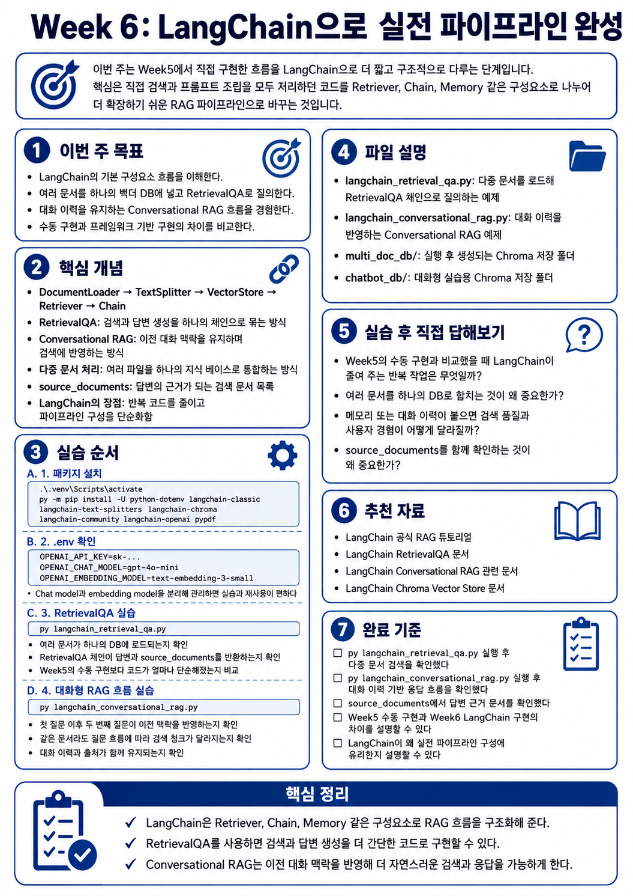

> “RAG의 기본 원리는 같지만, LangChain을 쓰면 검색, 체인, 메모리를 모듈처럼 조립할 수 있어서 대화형 시스템이나 다중 문서 검색으로 확장하기 쉬워진다.”

이번 주는 `Week5`에서 직접 구현한 흐름을 LangChain으로 더 짧고 구조적으로 다루는 단계입니다. 핵심은 직접 검색과 프롬프트 조립을 모두 처리하던 코드가 `Retriever`, `Chain`, `Memory` 같은 구성요소로 나뉘면서 확장하기 쉬워진다는 점입니다.

## 이번 주 목표
- LangChain의 기본 구성요소 흐름을 이해한다.
- 여러 문서를 하나의 벡터 DB에 넣고 `RetrievalQA`로 질의한다.
- 대화 이력을 유지하는 Conversational RAG 흐름을 경험한다.

> OpenAI API는 모델을 호출하는 도구이고, LangChain은 그 모델을 검색·도구·메모리와 연결해서 실제 LLM 앱이나 RAG 시스템을 만들기 쉽게 해 주는 프레임워크

## 핵심 개념
- <strong>DocumentLoader → TextSplitter → VectorStore → Retriever → Chain</strong>
- <strong>RetrievalQA</strong>: 검색과 답변 생성을 하나의 체인으로 묶는 방식
- <strong>Conversational RAG</strong>: 이전 대화를 기억하며 검색에 반영하는 방식
- <strong>다중 문서 처리</strong>: 여러 파일을 한 번에 로드해 하나의 지식 베이스로 통합하는 방식

## 이번 주 한눈에 보기



## 실습 순서

### 1. 패키지 설치
```bash
.\.venv\Scripts\activate
pip install langchain langchain-openai langchain-chroma langchain-community python-dotenv pypdf

pip install -U python-dotenv langchain-classic langchain-text-splitters langchain-chroma langchain-community langchain-openai pypdf
```
`-U`: upgrade

### 2. `.env` 확인
```text
OPENAI_API_KEY=<YOUR_OPENAI_API_KEY>
```

### 3. RetrievalQA 실습
```bash
python langchain_retrieval_qa.py
```

<details>
<summary> <b> 상세 코드 - langchain_retrieval_qa.py </b> </summary> <br/>

```py
from __future__ import annotations  # 타입 힌트를 더 유연하게 쓰기 위한 설정입니다.

import argparse  # 터미널에서 옵션(--query 같은 것)을 받을 때 사용하는 표준 라이브러리입니다.
import os  # 환경변수(OPENAI_API_KEY 등)를 읽을 때 사용하는 표준 라이브러리입니다.
from pathlib import Path  # 파일 경로를 운영체제에 맞게 안전하게 다루기 위한 도구입니다.

from dotenv import load_dotenv  # .env 파일에 저장한 환경변수를 읽어오는 라이브러리입니다.

from langchain_classic.chains import RetrievalQA  # 검색 + 답변 생성을 하나로 묶는 RetrievalQA 체인입니다.
from langchain_core.documents import Document  # LangChain 문서 객체 타입입니다.
from langchain_text_splitters import RecursiveCharacterTextSplitter  # 긴 문서를 작은 청크로 나누는 도구입니다.

from langchain_chroma import Chroma  # Chroma 벡터 DB를 LangChain에서 사용하기 위한 클래스입니다.
from langchain_community.document_loaders import PyPDFLoader, TextLoader  # PDF와 txt 파일을 읽는 로더입니다.
from langchain_openai import ChatOpenAI, OpenAIEmbeddings  # OpenAI 채팅 모델과 임베딩 모델을 사용하는 클래스입니다.


BASE_DIR = Path(__file__).resolve().parent

DEFAULT_DOCS = [
    BASE_DIR / "sample_investment_note.txt",
    BASE_DIR / "2024ltr.pdf",
]

DEFAULT_DB_DIR = BASE_DIR / "multi_doc_db"


def load_document(file_path: Path) -> list[Document]:
    """파일 하나를 읽어서 LangChain Document 리스트로 반환합니다."""

    if file_path.suffix.lower() == ".pdf":
        loader = PyPDFLoader(str(file_path))
    else:
        loader = TextLoader(str(file_path), encoding="utf-8", autodetect_encoding=True)

    return loader.load()


def collect_documents(paths: list[Path]) -> list[Document]:
    """여러 파일을 읽어서 하나의 문서 리스트로 합칩니다."""

    documents: list[Document] = []

    for path in paths:
        if not path.exists():
            print(f"건너뜀: 파일을 찾을 수 없습니다 -> {path}")
            continue

        try:
            loaded = load_document(path)
        except Exception as e:
            print(f"건너뜀: 파일을 읽는 중 오류 발생 -> {path} / {e}")
            continue

        for doc in loaded:
            doc.metadata["source_name"] = path.name

        documents.extend(loaded)

    return documents


def build_vector_db(documents: list[Document], db_dir: Path, embedding_model: str) -> Chroma:
    """문서를 청크로 나누고 임베딩하여 Chroma 벡터 DB를 생성합니다."""

    splitter = RecursiveCharacterTextSplitter(
        chunk_size=500,
        chunk_overlap=50,
        length_function=len,
    )

    chunks = splitter.split_documents(documents)

    if not chunks:
        raise ValueError("분할된 청크가 없습니다.")

    embeddings = OpenAIEmbeddings(model=embedding_model)

    vectordb = Chroma.from_documents(
        documents=chunks,
        embedding=embeddings,
        persist_directory=str(db_dir),
    )

    print(f"생성된 청크 수: {len(chunks)}")
    return vectordb


def format_source(doc: Document) -> str:
    """출처 문서를 보기 좋게 문자열로 바꿉니다."""

    source_name = doc.metadata.get("source_name", doc.metadata.get("source", "알 수 없음"))

    if "page" in doc.metadata:
        return f"- {source_name} p.{doc.metadata['page']}"

    return f"- {source_name}"


def main() -> None:
    """프로그램의 전체 실행 흐름을 담당하는 함수입니다."""

    load_dotenv()

    api_key = os.getenv("OPENAI_API_KEY")
    if not api_key:
        raise SystemExit(
            "OPENAI_API_KEY가 없습니다. 현재 폴더 또는 상위 폴더의 .env 파일에 설정하세요."
        )

    chat_model = os.getenv("OPENAI_CHAT_MODEL", "gpt-4o-mini")
    embedding_model = os.getenv("OPENAI_EMBEDDING_MODEL", "text-embedding-3-small")

    parser = argparse.ArgumentParser(description="Week6 LangChain RetrievalQA 실습")
    parser.add_argument("--db-dir", default=str(DEFAULT_DB_DIR), help="Chroma DB 저장 경로")
    parser.add_argument(
        "--query",
        default="반도체 업황 회복 시기는 언제로 예상되나요?",
        help="질문 내용",
    )
    args = parser.parse_args()

    documents = collect_documents(DEFAULT_DOCS)
    if not documents:
        raise SystemExit("로드할 문서가 없습니다.")

    print(f"로드된 문서 수: {len(documents)}")
    vectordb = build_vector_db(documents, Path(args.db_dir), embedding_model)

    llm = ChatOpenAI(model=chat_model, temperature=0)

    qa_chain = RetrievalQA.from_chain_type(
        llm=llm,
        chain_type="stuff",
        retriever=vectordb.as_retriever(search_kwargs={"k": 4}),
        return_source_documents=True,
    )

    result = qa_chain.invoke({"query": args.query})

    print("=" * 60)
    print(f"질문: {args.query}")
    print("[답변]")
    print(result["result"])
    print("=" * 60)
    print("[출처 문서]")

    for doc in result["source_documents"]:
        print(format_source(doc))


if __name__ == "__main__":
    main()
```

</details> <br/>

확인할 것:
- `Week3`의 샘플 텍스트와 PDF가 함께 로드되는지
- 여러 문서를 하나의 DB로 묶어 검색하는지
- 답변과 함께 `source_documents` 출처가 출력되는지

```bash
py .\week6_langchain_retrieval_qa.py
로드된 문서 수: 16
생성된 청크 수: 91
============================================================
질문: 반도체 업황 회복 시기는 언제로 예상되나요?
[답변]
저는 그에 대한 정확한 정보를 알지 못합니다.
============================================================
[출처 문서]
- sample_investment_note.txt
- 2024ltr.pdf p.14
- 2024ltr.pdf p.8
- 2024ltr.pdf p.8
```

<details>
<summary> <b> GPT 추가설명 </b> </summary> <br/>

<strong>반은 잘 나온 거고, 반은 아직 확인이 더 필요한 상태</strong>예요.

정확히 말하면:

<h2> 잘 나온 부분 </h2>

이 출력만 보면 <strong>파이프라인 자체는 정상 동작</strong>했어요.

* `로드된 문서 수: 16`
  → 문서 로딩이 됐다는 뜻이에요.
  특히 PDF는 보통 <strong>페이지 단위로 여러 Document</strong>로 읽혀서, txt 1개 + PDF 여러 페이지 = 16개처럼 나오는 게 자연스러워요.

* `생성된 청크 수: 91`
  → text splitter도 잘 작동했고, 청크 분할도 됐어요.

* `[출처 문서]`가 출력됨
  → retriever가 관련 청크를 찾아서 `source_documents`도 반환했다는 뜻이에요.

즉, <strong>코드가 죽지 않고 RAG 흐름은 연결됐다</strong>는 점에서는 성공입니다.

<h2> 아쉬운 부분 </h2>

답변이

> 저는 그에 대한 정확한 정보를 알지 못합니다.

이렇게 나온 건, <strong>질문에 맞는 근거를 문서에서 제대로 못 찾았을 가능성</strong>이 커요.

가장 가능성 높은 이유는 이거예요:

* 지금 문서가 `sample_investment_note.txt`, `2024ltr.pdf`
* 질문은 <strong>“반도체 업황 회복 시기”</strong>

즉, <strong>문서 주제와 질문 주제가 잘 안 맞을 수 있어요.</strong>
그러면 RetrievalQA는 검색은 했지만, 근거가 부족해서 보수적으로 “모르겠습니다” 식으로 답한 거예요.

이건 오히려 아주 이상한 동작은 아니에요.
없는 내용을 억지로 지어내지 않았다는 뜻이기도 하거든요.

<h2> 그래서 결론 </h2>

<strong>코드는 대체로 잘 됐고, 지금 문제는 “RAG 파이프라인 오류”라기보다 “질문-문서 매칭 문제”일 가능성이 큽니다.</strong>

<h2> 바로 확인해보면 좋은 것 </h2>

먼저 <strong>문서에 실제로 있는 질문</strong>으로 바꿔보세요.

예를 들면 이런 식이 좋아요.

```bash
py .\week6_langchain_retrieval_qa.py --query "버크셔 해서웨이의 2024년 수익률은 몇 퍼센트인가요?"
```

또는

```bash
py .\week6_langchain_retrieval_qa.py --query "S&P 500과 비교하면 어떠한가요?"
```

이렇게 <strong>문서 내용과 가까운 질문</strong>을 했을 때 답변이 잘 나오면,
그건 파이프라인이 제대로 된 거예요.

<h2> 하나 더 해보면 좋은 점검 </h2>

지금은 출처 파일명만 나오니까,
<strong>실제로 어떤 청크가 검색됐는지 내용도 같이 출력</strong>해보면 좋아요.

예를 들어 아래처럼 잠깐 추가해보세요.

```python
print("=" * 60)
print("[출처 문서 상세]")
for i, doc in enumerate(result["source_documents"], start=1):
    print(f"[{i}] {format_source(doc)}")
    print(doc.page_content[:300])
    print("-" * 60)
```

그러면

* 검색된 청크가 정말 질문과 관련 있는지
* 엉뚱한 부분이 검색됐는지
* 문서 자체에 답이 없는지

를 바로 확인할 수 있어요.

</details> <br/>

<div style="display: flex; gap: 10px;">

<div style="flex: 1; min-width: 0;">

```bash
py .\week6_langchain_retrieval_qa.py --query "버크셔 해서웨이의 2024년 수익률은 몇 퍼센트인가요?"
로드된 문서 수: 16
생성된 청크 수: 91
============================================================
질문: 버크셔 해서웨이의 2024년 수익률은 몇 퍼센트인가요?
[답변]
죄송하지만, 버크셔 해서웨이의 2024년 수익률에 대한 정보는 제공되지 않았습니다.
============================================================
[출처 문서]
- 2024ltr.pdf p.4
- 2024ltr.pdf p.4
- sample_investment_note.txt
- sample_investment_note.txt
============================================================
[출처 문서 상세]
[1] - 2024ltr.pdf p.4
Here’s a breakdown of the 2023-24 earnings as we see them. All calculations are after
depreciation, amortization and income tax. EBITDA, a flawed favorite of Wall Street, is not for
us.


 (in $ millions)
 2024
2023
Insurance-underwriting ..................... $  9,020 $ 5,428
Insurance-inv
------------------------------------------------------------
[2] - 2024ltr.pdf p.4
Here’s a breakdown of the 2023-24 earnings as we see them. All calculations are after
depreciation, amortization and income tax. EBITDA, a flawed favorite of Wall Street, is not for
us.


 (in $ millions)
 2024
2023
Insurance-underwriting ..................... $  9,020 $ 5,428
Insurance-inv
------------------------------------------------------------
[3] - sample_investment_note.txt
삼성전자는 2024년 들어 반도체 업황 회복의 영향을 받았다.
특히 HBM과 고대역폭 메모리 관련 수요가 늘어나면서 메모리 부문의 기대감이 커졌다.
일부 증권사는 서버용 메모리 판매 비중 확대를 긍정적으로 평가했다.

다만 스마트폰 출하량은 시장 경쟁 심화와 교체 수요 둔화의 영향을 받았다.
모바일 부문은 프리미엄 제품 중심 전략으로 수익성을 방어하려는 흐름을 보였다.
환율 변동과 마케팅 비용 증가는 단기 실적 변동성 요인으로 언급되었다.

투자 보고서를 RAG에 넣으려면 문서를 적절한 길이의 청크로 나눠야 한다.
청크가 너무 크면
------------------------------------------------------------
[4] - sample_investment_note.txt
삼성전자는 2024년 들어 반도체 업황 회복의 영향을 받았다.
특히 HBM과 고대역폭 메모리 관련 수요가 늘어나면서 메모리 부문의 기대감이 커졌다.
일부 증권사는 서버용 메모리 판매 비중 확대를 긍정적으로 평가했다.

다만 스마트폰 출하량은 시장 경쟁 심화와 교체 수요 둔화의 영향을 받았다.
모바일 부문은 프리미엄 제품 중심 전략으로 수익성을 방어하려는 흐름을 보였다.
환율 변동과 마케팅 비용 증가는 단기 실적 변동성 요인으로 언급되었다.

투자 보고서를 RAG에 넣으려면 문서를 적절한 길이의 청크로 나눠야 한다.
청크가 너무 크면
------------------------------------------------------------
```

</div>

<div style="flex: 1; min-width: 0;">

```bash
py .\week6_langchain_retrieval_qa.py --query "S&P 500과 비교하면 어떠한가요?"
로드된 문서 수: 16
생성된 청크 수: 91
============================================================
질문: S&P 500과 비교하면 어떠한가요?
[답변]
Berkshire의 성과는 S&P 500과 비교했을 때 여러 해에 걸쳐 다르게 나타났습니다. 예를 들어, 1995년에는 Berkshire의 주당 시장 가치가 57.4% 상승한 반면, S&P 500은 37.6% 상승했습니다. 그러나 1999년에는 Berkshire의 가치가 19.9% 하락한 반면, S&P 500은 21.0% 상승했습니다. 전반적으로 Berkshire은 몇몇 해에는 S&P 500보다 더 높은 성과를 보였지만, 다른 해에는 그렇지 않았습니다.
============================================================
[출처 문서]
- 2024ltr.pdf p.14
- 2024ltr.pdf p.14
- 2024ltr.pdf p.14
- 2024ltr.pdf p.13
============================================================
[출처 문서 상세]
[1] - 2024ltr.pdf p.14
Berkshire’s Performance vs. the S&P 500
 Annual Percentage Change
Year
in Per-Share
Market Value of
Berkshire
in S&P 500
with Dividends
Included
1995 ................................................. 57.4% 37.6%
1996 ................................................. 6.2 23.0
1997 .....
------------------------------------------------------------
[2] - 2024ltr.pdf p.14
Berkshire’s Performance vs. the S&P 500
 Annual Percentage Change
Year
in Per-Share
Market Value of
Berkshire
in S&P 500
with Dividends
Included
1995 ................................................. 57.4% 37.6%
1996 ................................................. 6.2 23.0
1997 .....
------------------------------------------------------------
[3] - 2024ltr.pdf p.14
Berkshire’s Performance vs. the S&P 500
 Annual Percentage Change
Year
in Per-Share
Market Value of
Berkshire
in S&P 500
with Dividends
Included
1995 ................................................. 57.4% 37.6%
1996 ................................................. 6.2 23.0
1997 .....
------------------------------------------------------------
[4] - 2024ltr.pdf p.13
Berkshire’s Performance vs. the S&P 500
 Annual Percentage Change
Year
in Per-Share
Market Value of
Berkshire
in S&P 500
with Dividends
Included
1965 ................................................. 49.5% 10.0%
1966 ................................................. (3.4) (11.7)
1967 .
------------------------------------------------------------
```

</div> </div>

<details>
<summary> <b> 결과 - GPT 추가설명 </b> </summary> <br/>

> 왼쪽은 이상한데, 오른쪽은 꽤나 잘 나온 듯?

네, 지금 로그를 보면 <strong>파이프라인은 정상</strong>이고, 사용자 입장에서 느낀 그 이상함도 <strong>정확히 짚으신 게 맞아요</strong>.

정리하면:

<h2> 1) “S&P 500과 비교하면 어떠한가요?” 결과 </h2>

이건 <strong>잘 나온 편</strong>이에요.

이유는:

* 출처가 전부 `2024ltr.pdf p.13~14`로 잡힘
* 상세 내용도 실제로 <strong>“Berkshire’s Performance vs. the S&P 500”</strong> 표를 가져옴
* 답변도 그 표를 바탕으로 요약하고 있음

즉, 이 경우는 <strong>질문 → 적절한 청크 검색 → 답변 생성</strong>이 잘 이어졌습니다.

다만 밑에 같은 페이지가 여러 번 나온 건 조금 아쉬워요.
이건 보통 <strong>같은 페이지에서 잘린 여러 청크가 비슷하게 검색됐기 때문</strong>이에요. 완전히 고장난 건 아니고, <strong>검색 결과가 중복된 상태</strong>에 가깝습니다.

<h2> 2) “버크셔 해서웨이의 2024년 수익률은 몇 퍼센트인가요?” 결과 </h2>

이건 <strong>파이프라인 실패라기보다, 검색이 질문을 약간 빗나간 경우</strong>로 보는 게 맞아요.

왜 그렇게 보이냐면:

* 사용자는 <strong>“2024년 수익률(annual return, percentage change)”</strong> 을 물었어요.
* 그런데 검색된 대표 청크는 `2024ltr.pdf p.4`의 <strong>2024 earnings</strong> 표예요.
* 즉, retriever가 <strong>“2024”</strong> 라는 숫자에는 잘 반응했는데,
  사용자가 원하는 <strong>“주가/시장가치 기준 수익률 표”</strong> 가 아니라
  <strong>실적(earnings)</strong> 쪽 청크를 끌고 온 거예요.

게다가 같이 잡힌 `sample_investment_note.txt`도 전혀 다른 문서라서, 이 질문에는 잡히면 안 되는 후보였어요.

즉, 이 결과는 이렇게 해석하면 됩니다.

> “코드는 작동했지만, 검색 단계에서 질문의 핵심인 ‘2024년 annual percentage change’를 정확히 못 집었다.”

<h2> 왜 이런 일이 생겼을까? </h2>

제일 큰 이유는 두 가지예요.

<h3> 첫 번째: 질문은 맞는데, 청크가 표 구조를 잘 못 담고 있음 </h3>

지금 `p.13~14`는 표 페이지인데, 상세 출력 보면 p.14 청크의 시작 부분이

* 1995
* 1996
* 1997 ...

이런 식으로만 보여요.

즉, <strong>2024 행은 아마 표의 아래쪽</strong>에 있는데,
현재 검색된 청크는 <strong>표 제목 + 위쪽 연도들</strong> 쪽만 담고 있는 가능성이 큽니다.

그래서 retriever는

* “Berkshire’s Performance vs. the S&P 500”라는 제목 때문에 p.14를 찾긴 했지만,
* 정작 <strong>2024 행이 들어 있는 청크</strong>를 못 잡았을 수 있어요.

이건 <strong>표가 있는 PDF에서 chunk_size가 너무 작을 때 자주 생기는 현상</strong>이에요.

<h3> 두 번째: 질문 표현과 문서 표현이 완전히 일치하지 않음 </h3>

사용자 질문은 한국어로:

* “2024년 수익률은 몇 퍼센트인가요?”

문서 쪽 표현은 영어로:

* “Performance vs. the S&P 500”
* “Annual Percentage Change”
* “Per-Share Market Value”

즉, 의미는 통하지만,
retriever 입장에서는 <strong>“2024”와 연결되는 다른 청크들(p.4의 earnings, txt의 2024 투자 메모)</strong> 도 꽤 강한 후보가 될 수 있어요.

<h2> 그래서 지금 상태를 한 줄로 평가하면 </h2>

<strong>S&P 500 비교 질문은 성공, 2024 수익률 질문은 검색 정밀도가 부족한 상태</strong>예요.

즉,

* <strong>RAG 자체는 잘 돌아감</strong>
* <strong>질문에 따라 검색 품질 차이가 나타남</strong>
* <strong>특히 표/숫자 질의에서 chunking 문제가 드러남</strong>

이렇게 보면 됩니다.

<h2> 지금 가장 좋은 개선 방향 </h2>

<h3> 1. 표가 있는 PDF는 chunk_size를 키워보기 </h3>

지금은:

```python
chunk_size=500
chunk_overlap=50
```

인데, 표 페이지에서는 좀 작을 수 있어요.

예를 들어:

```python
chunk_size=1200
chunk_overlap=100
```

이렇게 키워보면, p.14 아래쪽의 <strong>2024 행까지 같은 청크 안에 들어올 가능성</strong>이 커져요.

<h3> 2. 같은 페이지 중복 검색을 줄이기 </h3>

지금처럼 p.14가 여러 번 나오는 건 검색 다양성이 떨어진다는 뜻이라서,
retriever를 MMR로 바꾸면 꽤 좋아집니다.

예를 들면:

```python
retriever=vectordb.as_retriever(
    search_type="mmr",
    search_kwargs={"k": 4, "fetch_k": 10}
)
```

이렇게 하면 <strong>비슷한 청크만 4개 뽑는 것보다</strong>,
좀 더 <strong>다양한 후보</strong>를 섞어서 가져오려는 성향이 생깁니다.

<h3> 3. 질문을 문서 표현에 더 가깝게 하기 </h3>

이 질문은 이렇게 바꾸면 더 잘 될 가능성이 큽니다.

```bash
py .\week6_langchain_retrieval_qa.py --query "In Berkshire’s Performance vs. the S&P 500 table, what was Berkshire's annual percentage change in 2024?"
```

또는 한국어로 하더라도:

```bash
py .\week6_langchain_retrieval_qa.py --query "Berkshire’s Performance vs. the S&P 500 표에서 2024년 Berkshire의 annual percentage change는 몇 퍼센트인가요?"
```

이렇게 <strong>문서 안의 실제 제목/표현을 섞어 주면</strong> 검색이 훨씬 안정적이에요.

<h2> 제가 보기엔 지금 공부 포인트가 아주 잘 드러났어요 </h2>

이번 결과는 오히려 Week 6에서 배우기 좋은 사례예요.

왜냐하면 지금 딱 보인 게:

* <strong>RAG는 “문서가 있으면 무조건 정답”이 아니다</strong>
* <strong>검색 단계가 빗나가면 답변도 흔들린다</strong>
* <strong>특히 표/숫자 질문은 chunking 방식이 중요하다</strong>
* <strong>같은 페이지 중복 검색은 retriever 설정으로 개선할 수 있다</strong>

이거거든요.

<h2> 실습 보고용으로 짧게 정리하면 </h2>

이렇게 말할 수 있어요.

> “동일 코드로 질의한 결과, 일반 비교 질문에서는 관련 표가 포함된 청크를 검색하여 적절한 답변이 생성되었다. 그러나 특정 연도의 수익률을 묻는 질의에서는 2024 earnings 청크가 우선 검색되어 답변이 부정확했다. 이를 통해 표 기반 PDF 문서에서는 chunk 크기와 검색 전략이 답변 정확도에 큰 영향을 준다는 점을 확인할 수 있었다.”

원하시면 제가 바로 다음 답변에서 <strong>중복 검색 줄이기 + chunk_size 키우기</strong>까지 반영한 수정 코드만 딱 뽑아서 드릴게요.

</details> <br/>

<details>
<summary> <b> MMR - GPT 추가설명 </b> </summary> <br/>

네. MMR는 이름이 조금 어려워 보여도, 뜻은 꽤 단순해요.

<strong>MMR(Maximal Marginal Relevance)</strong> 는 검색 결과를 뽑을 때
<strong>“질문과 얼마나 관련 있는가”</strong> 와 <strong>“이미 뽑은 결과들과 너무 비슷하지는 않은가”</strong> 를 같이 보려는 방식이에요. LangChain 문서에서도 MMR를 <strong>질문과의 유사도와 결과들 사이의 다양성 사이를 균형 있게 맞추는 방법</strong>으로 설명합니다.

지금처럼 일반 similarity search만 쓰면, 벡터 DB는 보통 <strong>질문과 가장 비슷한 청크들</strong>을 순서대로 가져와요. 그래서 같은 페이지에서 잘린 청크 여러 개가 서로 거의 비슷하면, 상위 결과가 전부 그 페이지 근처 청크로 채워질 수 있어요. LangChain 쪽 설명도 similarity search와 별도로 MMR를 제공하면서, MMR가 <strong>중복되거나 너무 비슷한 결과를 줄이는 데 유용하다</strong>고 안내합니다.

쉽게 비유하면 이래요.

* similarity search:
  “가장 비슷한 것 4개만 줘.”
  → 똑같은 내용 4개가 나올 수도 있음
* MMR search:
  “비슷한 건 좋은데, 서로 너무 겹치지는 않게 4개 줘.”
  → 더 다양한 4개가 나올 가능성이 커짐

당신 로그에서 p.14가 3번 반복된 이유도 이걸로 이해하면 쉬워요.
p.14 안에 표 제목과 연도 표가 여러 청크로 잘렸고, 그 청크들이 서로 아주 비슷하니까, 일반 검색은 <strong>“이것도 관련 높음, 이것도 관련 높음, 이것도 관련 높음”</strong> 하면서 거의 같은 결과를 여러 개 뽑은 거예요. MMR는 이때 <strong>첫 번째로 좋은 청크를 뽑은 뒤</strong>, 그다음 후보를 고를 때는 <strong>질문과의 관련성은 유지하되 이미 고른 청크와 너무 비슷한 후보는 덜 선호</strong>하게 됩니다.

그래서 당신 코드의 이 부분:

```python
retriever = vectordb.as_retriever(
    search_type="mmr",
    search_kwargs={"k": 4, "fetch_k": 10},
)
```

은 이렇게 읽으면 됩니다.

* `search_type="mmr"`
  → 일반 유사도 검색 대신 MMR 방식으로 결과를 고르기
* `fetch_k=10`
  → 일단 후보를 10개 정도 넓게 가져온 뒤
* `k=4`
  → 그중에서 <strong>관련성 + 다양성</strong>을 같이 고려해서 최종 4개 선택하기

LangChain 문서도 MMR를 설명하면서 **먼저 더 많은 후보를 가져온 뒤(`fetch_k`) 그중에서 다양성을 반영해 최종 `k`개를 고른다**는 식으로 설명합니다.

그래서 MMR가 특히 도움이 되는 경우는 이런 때예요.

* 같은 페이지가 여러 청크로 쪼개져 있을 때
* 표, 반복 문장, 머리말/꼬리말 때문에 비슷한 청크가 많을 때
* 하나의 문서뿐 아니라 여러 문서에서 <strong>조금씩 다른 근거</strong>를 가져오고 싶을 때

다만 MMR가 만능은 아니에요.
중복은 줄여줄 수 있지만, <strong>아예 질문을 잘못 이해한 검색</strong>까지 자동으로 고쳐주지는 못해요. 예를 들어 “2024 수익률” 질문에서 p.4의 earnings 표가 강하게 잡히는 문제는, MMR만으로 해결된다기보다 <strong>청크 크기</strong>, <strong>질문 표현</strong>, <strong>표가 잘 보존되도록 문서를 자르는 방식</strong>도 함께 영향을 줍니다. 문서 청킹이 검색 품질에 중요하다는 점은 LangChain 문서에서도 반복해서 강조합니다.

딱 한 줄로 기억하면 이거예요.

> <strong>MMR는 “관련성만 높은 결과 여러 개” 대신, “관련성도 높고 서로 덜 겹치는 결과들”을 뽑게 해주는 검색 방식</strong>입니다.

원하시면 다음엔 제가 `k`, `fetch_k`, 그리고 가끔 보이는 `lambda_mult`가 각각 무슨 역할인지도 이어서 아주 쉽게 설명해드릴게요.

- [ZeusDB integrations - Docs by LangChain](https://docs.langchain.com/oss/python/integrations/providers/zeusdb)
- [Vector store integrations - Docs by LangChain](https://docs.langchain.com/oss/python/integrations/vectorstores)
- [OpenSearch integration - Docs by LangChain](https://docs.langchain.com/oss/python/integrations/vectorstores/opensearch)
- [MemoryVectorStore integration - Docs by LangChain](https://docs.langchain.com/oss/javascript/integrations/vectorstores/memory)
- [Docugami integration - Docs by LangChain](https://docs.langchain.com/oss/python/integrations/document_loaders/docugami)

</details> <br/>

<details>
<summary> <b> k, fetch_k, lambda_mult - GPT 추가설명 </b> </summary> <br/>

네. 이 3개만 잡으면 MMR가 훨씬 덜 어렵습니다.

`k`는 <strong>최종적으로 돌려줄 문서 개수</strong>예요. LangChain의 `as_retriever(..., search_type="mmr")` 기준으로 `k`의 기본값은 4입니다.

`fetch_k`는 <strong>MMR가 고르기 전에 먼저 넓게 가져오는 후보 개수</strong>예요. 즉, “일단 몇 개를 후보로 모아둘까?”에 해당합니다. 기본값은 20입니다. 후보를 넓게 모아야 그 안에서 중복이 덜한 결과를 다시 고르기 쉬워집니다.

`lambda_mult`는 <strong>관련성 vs 다양성의 균형값</strong>이에요. 0과 1 사이 값을 쓰고, LangChain 문서 기준으로 `1`에 가까울수록 <strong>다양성은 적고</strong> 질문과 더 비슷한 결과를 선호하며, `0`에 가까울수록 <strong>다양성은 크고</strong> 서로 덜 비슷한 결과를 더 강하게 섞습니다. 기본값은 0.5입니다.

아주 쉽게 비유하면 이렇게 보면 됩니다.

* `fetch_k=10`
  → 후보 10개를 먼저 모음
* `k=4`
  → 그 10개 중 최종 4개만 선택
* `lambda_mult=0.8`
  → 다양성보다 질문과의 직접 유사도를 더 중시
* `lambda_mult=0.2`
  → 유사도도 보지만, 서로 너무 비슷한 결과는 더 적극적으로 피함 ([LangChain 문서][7])

지금 같은 상황에서는 이렇게 이해하시면 좋아요.

```python
retriever = vectordb.as_retriever(
    search_type="mmr",
    search_kwargs={"k": 4, "fetch_k": 10}
)
```

이건
“후보 10개를 먼저 보고, 그중에서 서로 너무 겹치지 않으면서도 질문과 관련 있는 4개를 뽑아라”
라는 뜻에 가깝습니다. LangChain 문서도 MMR를 질문과의 유사도와 결과 간 다양성을 함께 고려하는 방식으로 설명합니다. ([LangChain 문서][7])

실전 감각으로는 보통 이렇게 시작하면 편해요.

* 중복이 너무 많다 → `fetch_k`를 조금 키워보기
* 결과가 너무 비슷한 것만 나온다 → `lambda_mult`를 조금 낮춰보기
* 결과가 너무 흩어진다 → `lambda_mult`를 조금 높여보기
* 최종 근거 문서 수를 늘리고 싶다 → `k`를 키우기

이건 공식 문서의 정의를 바탕으로 한 조정 요령이에요. `fetch_k`는 후보 폭, `k`는 최종 개수, `lambda_mult`는 관련성/다양성 균형을 담당합니다.

당신 코드에는 처음엔 이 정도가 무난해요.

```python
retriever = vectordb.as_retriever(
    search_type="mmr",
    search_kwargs={
        "k": 4,
        "fetch_k": 10,
        "lambda_mult": 0.5,
    },
)
```

그리고 표가 많은 PDF에서 같은 페이지가 반복되면:

```python
"lambda_mult": 0.3
```

처럼 조금 낮춰보는 걸 시험해볼 만합니다. 이건 더 다양한 결과를 뽑도록 유도하는 방향이에요.

- [as_retriever | langchain_core](https://reference.langchain.com/python/langchain-core/vectorstores/base/VectorStore/as_retriever)
- [ZeusDB integrations - Docs by LangChain](https://docs.langchain.com/oss/python/integrations/providers/zeusdb)

</details> <br/>

`week6_langchain_retrieval_qa_v2.py`: 중복 검색 완화(MMR) + 청크 크기 확대

<details>
<summary> <b> 상세 코드 - langchain_retrieval_qa_v2.py </b> </summary> <br/>

```py
# 중복 검색 완화(MMR) + 청크 크기 확대
"""
chunk_size=1200
chunk_overlap=100

retriever = vectordb.as_retriever(
    search_type="mmr",
    search_kwargs={"k": 4, "fetch_k": 10},
)
"""

from __future__ import annotations

import argparse
import os
from pathlib import Path

from dotenv import load_dotenv

from langchain_classic.chains import RetrievalQA
from langchain_core.documents import Document
from langchain_text_splitters import RecursiveCharacterTextSplitter

from langchain_chroma import Chroma
from langchain_community.document_loaders import PyPDFLoader, TextLoader
from langchain_openai import ChatOpenAI, OpenAIEmbeddings


BASE_DIR = Path(__file__).resolve().parent

DEFAULT_DOCS = [
    BASE_DIR / "sample_investment_note.txt",
    BASE_DIR / "2024ltr.pdf",
]

DEFAULT_DB_DIR = BASE_DIR / "multi_doc_db_v2"


def load_document(file_path: Path) -> list[Document]:
    if file_path.suffix.lower() == ".pdf":
        loader = PyPDFLoader(str(file_path))
    else:
        loader = TextLoader(str(file_path), encoding="utf-8", autodetect_encoding=True)
    return loader.load()


def collect_documents(paths: list[Path]) -> list[Document]:
    documents: list[Document] = []

    for path in paths:
        if not path.exists():
            print(f"건너뜀: 파일을 찾을 수 없습니다 -> {path}")
            continue

        try:
            loaded = load_document(path)
        except Exception as e:
            print(f"건너뜀: 파일을 읽는 중 오류 발생 -> {path} / {e}")
            continue

        for doc in loaded:
            doc.metadata["source_name"] = path.name

        documents.extend(loaded)

    return documents


def build_vector_db(documents: list[Document], db_dir: Path, embedding_model: str) -> Chroma:
    splitter = RecursiveCharacterTextSplitter(
        chunk_size=1200,
        chunk_overlap=100,
        length_function=len,
    )

    chunks = splitter.split_documents(documents)

    if not chunks:
        raise ValueError("분할된 청크가 없습니다.")

    embeddings = OpenAIEmbeddings(model=embedding_model)

    vectordb = Chroma.from_documents(
        documents=chunks,
        embedding=embeddings,
        persist_directory=str(db_dir),
    )

    print(f"생성된 청크 수: {len(chunks)}")
    return vectordb


def format_source(doc: Document) -> str:
    source_name = doc.metadata.get("source_name", doc.metadata.get("source", "알 수 없음"))

    if "page" in doc.metadata:
        return f"- {source_name} p.{doc.metadata['page']}"

    return f"- {source_name}"


def main() -> None:
    load_dotenv()

    api_key = os.getenv("OPENAI_API_KEY")
    if not api_key:
        raise SystemExit(
            "OPENAI_API_KEY가 없습니다. 현재 폴더 또는 상위 폴더의 .env 파일에 설정하세요."
        )

    chat_model = os.getenv("OPENAI_CHAT_MODEL", "gpt-4o-mini")
    embedding_model = os.getenv("OPENAI_EMBEDDING_MODEL", "text-embedding-3-small")

    parser = argparse.ArgumentParser(description="Week6 LangChain RetrievalQA 실습")
    parser.add_argument("--db-dir", default=str(DEFAULT_DB_DIR), help="Chroma DB 저장 경로")
    parser.add_argument(
        "--query",
        default="버크셔 해서웨이의 2024년 수익률은 몇 퍼센트인가요?",
        help="질문 내용",
    )
    args = parser.parse_args()

    documents = collect_documents(DEFAULT_DOCS)
    if not documents:
        raise SystemExit("로드할 문서가 없습니다.")

    print(f"로드된 문서 수: {len(documents)}")
    vectordb = build_vector_db(documents, Path(args.db_dir), embedding_model)

    llm = ChatOpenAI(model=chat_model, temperature=0)

    retriever = vectordb.as_retriever(
        search_type="mmr",
        search_kwargs={"k": 4, "fetch_k": 10},
    )

    qa_chain = RetrievalQA.from_chain_type(
        llm=llm,
        chain_type="stuff",
        retriever=retriever,
        return_source_documents=True,
    )

    result = qa_chain.invoke({"query": args.query})

    print("=" * 60)
    print(f"질문: {args.query}")
    print("[답변]")
    print(result["result"])
    print("=" * 60)
    print("[출처 문서]")
    for doc in result["source_documents"]:
        print(format_source(doc))

    print("=" * 60)
    print("[출처 문서 상세]")
    for i, doc in enumerate(result["source_documents"], start=1):
        print(f"[{i}] {format_source(doc)}")
        print(doc.page_content[:500])
        print("-" * 60)


if __name__ == "__main__":
    main()
```

</details> <br/>

```bash
py .\week6_langchain_retrieval_qa_v2.py --query "버크셔 해서웨이의 2024년 수익률은 몇 퍼센트인가요?"
로드된 문서 수: 16
생성된 청크 수: 42
============================================================
질문: 버크셔 해서웨이의 2024년 수익률은 몇 퍼센트인가요?
[답변]
제공된 정보에는 버크셔 해서웨이의 2024년 수익률에 대한 구체적인 퍼센트 수치가 포함되어 있지 않습니다. 따라서 정확한 답변을 드릴 수 없습니다.
============================================================
[출처 문서]
- 2024ltr.pdf p.4
- sample_investment_note.txt
- 2024ltr.pdf p.14
- 2024ltr.pdf p.14
============================================================
[출처 문서 상세]
[1] - 2024ltr.pdf p.4
Here’s a breakdown of the 2023-24 earnings as we see them. All calculations are after
depreciation, amortization and income tax. EBITDA, a flawed favorite of Wall Street, is not for
us.


 (in $ millions)
 2024
2023
Insurance-underwriting ..................... $  9,020 $ 5,428
Insurance-investment income ................ 13,670 9,567
BNSF ................................... 5,031 5,087
Berkshire Hathaway Energy ................. 3,730 2,331
Other controlled businesses ...............
------------------------------------------------------------
[2] - sample_investment_note.txt
삼성전자는 2024년 들어 반도체 업황 회복의 영향을 받았다.
특히 HBM과 고대역폭 메모리 관련 수요가 늘어나면서 메모리 부문의 기대감이 커졌다.
일부 증권사는 서버용 메모리 판매 비중 확대를 긍정적으로 평가했다.

다만 스마트폰 출하량은 시장 경쟁 심화와 교체 수요 둔화의 영향을 받았다.
모바일 부문은 프리미엄 제품 중심 전략으로 수익성을 방어하려는 흐름을 보였다.
환율 변동과 마케팅 비용 증가는 단기 실적 변동성 요인으로 언급되었다.

투자 보고서를 RAG에 넣으려면 문서를 적절한 길이의 청크로 나눠야 한다.
청크가 너무 크면 한 벡터에 여러 주제가 섞여 검색 정확도가 떨어질 수 있다.
청크가 너무 작으면 문맥이 끊겨 답변에 필요한 정보가 사라질 수 있다.

따라서 청크 크기와 오버랩을 바꿔 보면서 검색 품질이 어떻게 달라지는지 관찰하는 과정이 중요하다.
각 청크에는 파일명, 페이지 번호, 생성 날짜, 카테고리 같은 메타데이터를 함께 저장하는 것이 좋다.
이 메타데이터는 나중에
------------------------------------------------------------
[3] - 2024ltr.pdf p.14
2009 ................................................. 2.7 26.5
2010 ................................................. 21.4 15.1
2011 ................................................. (4.7) 2.1
2012 ................................................. 16.8 16.0
2013 ................................................. 32.7 32.4
2014 ................................................. 27.0 13.7
2015 ................................................. (12.5) 1.4
2016 .................................
------------------------------------------------------------
[4] - 2024ltr.pdf p.14
Berkshire’s Performance vs. the S&P 500
 Annual Percentage Change
Year
in Per-Share
Market Value of
Berkshire
in S&P 500
with Dividends
Included
1995 ................................................. 57.4% 37.6%
1996 ................................................. 6.2 23.0
1997 ................................................. 34.9 33.4
1998 ................................................. 52.2 28.6
1999 ................................................. (19.9) 21.0
2000 .....
------------------------------------------------------------
```

<details>
<summary> <b> 결과 - GPT 추가설명 </b> </summary> <br/>

네, 이 결과는 <strong>이전보다 좋아졌지만 아직 완전히 맞지는 않은 상태</strong>예요.

<h2> 먼저, 좋아진 점 </h2>

이번엔 분명히 개선됐어요.

* `생성된 청크 수: 42`

  * 이전 91개에서 줄었죠.
  * 즉 <strong>청크를 더 크게 잡은 효과</strong>가 실제로 반영됐어요.
* 출처에 `2024ltr.pdf p.14`가 들어옴

  * 이건 아주 중요해요.
  * 이제 적어도 <strong>버크셔 vs S&P 500 표가 있는 쪽</strong>을 검색하기 시작했다는 뜻입니다.

즉, <strong>retrieval 단계는 이전보다 나아졌어요.</strong>

<h2> 그런데 아직 이상한 점 </h2>

답변은 여전히:

> 2024년 수익률의 구체적인 퍼센트 수치가 포함되어 있지 않습니다.

라고 했죠.

이건 지금 상태를 보면 <strong>완전한 성공은 아니고, 검색은 가까워졌지만 답변 생성이 아직 헷갈린 상태</strong>로 보는 게 맞아요.

특히 출처를 보면:

1. `2024ltr.pdf p.4` → <strong>earnings 표</strong>
2. `sample_investment_note.txt` → <strong>완전히 다른 삼성전자 문서</strong>
3. `2024ltr.pdf p.14`
4. `2024ltr.pdf p.14`

이렇게 섞여 있어요.

즉, 모델 입장에서는

* 어떤 문서는 <strong>2024 earnings</strong>
* 어떤 문서는 <strong>삼성전자 반도체 업황</strong>
* 어떤 문서는 <strong>버크셔 vs S&P 500 표</strong>

이렇게 <strong>서로 다른 문맥이 한 번에 들어간 상태</strong>예요.

그래서 모델이 안전하게
“명확하지 않다”
라고 답했을 가능성이 큽니다.

<h2> 핵심 판단 </h2>

이 결과는 이렇게 평가하면 딱 맞아요.

<h3> 성공한 부분 </h3>

* 코드 정상 실행
* chunk_size 변경 적용됨
* 관련 표 페이지(p.14) 검색 시작

<h3> 아직 부족한 부분 </h3>

* <strong>가장 관련 있는 청크만 깔끔하게 모이지 않음</strong>
* <strong>불필요한 문서(p.4, sample_investment_note.txt)가 같이 들어옴</strong>
* 그래서 최종 답변이 흔들림

즉,

> <strong>검색 품질은 개선됐지만, 아직 컨텍스트 노이즈가 남아 있다</strong>

이렇게 보시면 됩니다.

<h2> 지금 로그에서 특히 중요한 포인트 </h2>

<h3> [3] p.14 청크 </h3>

```text
2009 ...
2010 ...
2011 ...
...
2016 ...
```

여기까지만 보이죠.

이건 <strong>출력 길이를 500자로 잘라서 보여줬기 때문</strong>일 가능성이 커요.
즉, 실제 청크 안에는 그 뒤에 <strong>2017\~2024</strong>가 계속 있을 수 있어요.

그래서 지금 꼭 해야 하는 확인은:

<strong>정말 p.14 청크 안에 2024 행이 들어 있는지 직접 보는 것</strong>입니다.

이걸 확인해야 해요.

* 들어 있다 → 검색은 성공, <strong>LLM 답변 단계 문제</strong>
* 안 들어 있다 → 아직도 <strong>청킹/검색 문제</strong>

<h2> 지금 바로 해보면 좋은 확인 방법 </h2>

지금 이 부분:

```python
print(doc.page_content[:500])
```

를 잠깐 이렇게 바꿔보세요.

```python
print(doc.page_content[:2000])
```

이렇게 하면 p.14 청크에서 <strong>2024 행이 실제로 보이는지</strong> 확인할 수 있어요.

<h2> 제가 보기엔 현재 가장 가능성 큰 시나리오 2개 </h2>

<h3> 시나리오 1 </h3>

p.14 청크 안에 2024가 실제로 있음
→ 그런데 다른 잡문서들이 같이 들어와서 모델이 애매하게 답함

<h3> 시나리오 2 </h3>

p.14 청크가 여전히 2024 행까지 못 담고 있음
→ 그러면 아직 <strong>청킹/표 처리 문제</strong>가 남아 있음

<h2> 그래서 다음 단계는 이렇게 가는 게 좋아요 </h2>

<h3> 1. 먼저 p.14 청크에 2024가 실제로 있는지 확인 </h3>

이게 첫 번째예요.

<h3> 2. 만약 2024가 있다면 </h3>

그다음은 <strong>retriever가 너무 많은 잡문서를 섞고 있는 문제</strong>예요.

이때는 예를 들면:

* `k`를 줄이거나
* 더 강한 검색 조건을 쓰거나
* 아예 `sample_investment_note.txt`를 빼고 테스트

이런 방식으로 실험해볼 수 있어요.

<h3> 3. 만약 2024가 없다면 </h3>

그건 답변 문제가 아니라 <strong>청크 문제</strong>예요.
그럼:

* 청크를 더 크게 하거나
* PDF 표는 페이지 단위로 다루는 쪽이 더 좋습니다.

<h2> 제 판단 </h2>

지금 결과는 <strong>“실패”는 아니고, 꽤 유의미하게 개선된 중간 단계</strong>예요.

특히 좋은 건:

* 이전에는 완전히 엉뚱한 문서 중심이었는데
* 지금은 <strong>정답이 있을 법한 p.14까지는 도달했다</strong>는 점입니다.

이건 꽤 큰 진전이에요.

<h2> 딱 한 줄로 정리 </h2>

<strong>v2는 retrieval은 개선됐지만, 아직 irrelevant context 때문에 answer가 흔들리는 상태</strong>입니다.

다음으로는 제가 추천한 대로
`doc.page_content[:2000]`로 바꿔서 <strong>p.14에 2024 행이 실제로 있는지</strong> 먼저 확인해보는 게 제일 좋습니다.

원하시면 그다음엔 제가
<strong>“2024 행만 바로 찾는 디버깅용 출력 코드”</strong> 를 딱 붙여드릴게요.

</details> <br/>

<details>
<summary> <b> 실제 조정은 어떻게? - GPT 추가설명 </b> </summary> <br/>

네, <strong>어느 정도는 맞아요.</strong>
실제로 RAG는 <strong>원하는 답이 잘 나오도록 값들을 조정하는 과정</strong>이 꼭 들어갑니다.

그런데 중요한 건,
<strong>“질문 1개가 잘 될 때까지 감으로 튜닝하는 것”</strong> 이 아니라
<strong>“대표 질문 묶음 전체에서 안정적으로 잘 되게 조정하는 것”</strong> 이라는 점이에요.

<h2> 실무/프로젝트에서는 보통 이렇게 봐요 </h2>

<h3> 1. 처음에는 일단 기본값으로 만들어요 </h3>

예를 들면

* chunk size
* overlap
* k
* search type(similarity / mmr)
* embedding model
* metadata 사용 여부

이런 걸 아주 특별하게 시작하지 않고,
무난한 값으로 먼저 파이프라인을 하나 만듭니다.

즉, 처음부터 정답 값을 아는 게 아니라
<strong>“일단 돌아가는 기준선(baseline)”</strong> 을 먼저 만드는 거예요.

<h3> 2. 그다음엔 질문 몇 개가 아니라 “평가용 질문 세트”를 만듭니다 </h3>

이게 진짜 중요해요.

예를 들어 프로젝트 문서가 사내 규정 문서라면:

* A 규정의 제출 기한은?
* 예외 승인 조건은?
* 첨부 서류는 무엇인가?
* 특정 조항은 어느 문서 몇 페이지에 있는가?

이런 식으로 <strong>대표 질문 20개, 50개, 100개</strong>를 만들어 둡니다.

그리고 각 질문마다 가능하면

* 기대 답변
* 최소한 나와야 하는 핵심 키워드
* 정답 근거 문서

를 같이 정리해요.

왜냐하면 질문 하나만 보고 튜닝하면
그 질문에는 잘 맞는데 다른 질문은 망가질 수 있거든요.

<h3> 3. 값을 바꿔가며 비교합니다 </h3>

그다음에 진짜 조정이 들어가요.

예를 들면:

* `chunk_size=500` vs `1000` vs `1500`
* `k=3` vs `5`
* similarity vs mmr
* metadata filter 있음/없음
* 문서 전체 DB vs 카테고리별 DB

이런 식으로 바꿔보고,
평가용 질문 세트에 대해 <strong>전체적으로 어떤 설정이 더 낫는지</strong> 봅니다.

즉,
<strong>“원하는 답이 나올 때까지 찍어보는 것”</strong> 이 아니라
<strong>“여러 설정 중 어떤 조합이 전체적으로 더 좋은지 비교 실험하는 것”</strong> 에 가까워요.

<h2> 그래서 프로젝트용 RAG는 보통 3단계로 생각하면 편해요 </h2>

<h3> 1단계: 돌아가게 만들기 </h3>

* 문서 로드
* 청킹
* 임베딩
* 벡터 DB
* 검색
* 답변 생성

<h3> 2단계: 검색 품질 튜닝 </h3>

* 적절한 chunk 크기
* overlap
* retriever 방식
* top-k
* metadata filtering
* 필요하면 reranker

<h3> 3단계: 평가 체계 만들기 </h3>

* 대표 질문 세트
* 기대 정답
* 출처 맞는지 확인
* hallucination 여부 확인
* 애매한 질문에서도 버티는지 확인

실무에서는 사실 <strong>3단계가 제일 중요</strong>해요.

<h2> 특히 프로젝트에서는 이런 식으로 보시면 돼요 </h2>

<h3> 질문 1개만 잘 나오면 안 됨 </h3>

예를 들어:

* 표 질문은 잘 됨
* 정의 질문은 망함
* 숫자 질문은 약함
* 요약 질문은 괜찮음

이럴 수 있어요.

그래서
“이 질문 잘 되네!”
만으로는 부족하고,

* 숫자형 질문
* 비교형 질문
* 정의형 질문
* 절차형 질문
* 출처 확인형 질문

이런 걸 골고루 넣어서 테스트해야 해요.

<h2> 값 조정만으로 끝나는 것도 아니에요 </h2>

RAG 성능은 단순히 `chunk_size`만 바꾼다고 해결되지 않는 경우도 많아요.

예를 들면:

<h3> 문서가 문제일 수 있음 </h3>

* PDF 표가 깨짐
* OCR 품질이 낮음
* 머리말/꼬리말이 계속 섞임
* 같은 내용이 여러 번 반복됨

<h3> 검색 방식이 문제일 수 있음 </h3>

* 임베딩이 질문 표현을 잘 못 잡음
* 비슷한 청크만 중복 검색됨
* metadata 필터가 없음

<h3> 생성 단계가 문제일 수 있음 </h3>

* 검색은 잘 됐는데 LLM이 정리를 이상하게 함
* 너무 많은 컨텍스트를 넣어서 헷갈림
* 프롬프트가 출처 기반 답변을 강하게 유도하지 못함

즉, 프로젝트에서는
<strong>“값만 조정”</strong> 이 아니라
<strong>문서 품질 + 검색 전략 + 프롬프트 + 평가 방식</strong>을 같이 봐야 해요.

<h2> 실제로는 어떻게 운영하냐면 </h2>

보통 이런 흐름이 많아요.

1. 기본 버전 만든다
2. 대표 질문 세트로 돌린다
3. 어디서 틀리는지 유형을 본다
4. 설정을 한 번에 하나씩 바꿔본다
5. 이전 결과와 비교한다
6. 제일 안정적인 조합을 채택한다

여기서 중요한 건
<strong>한 번에 여러 개를 확 바꾸지 않는 것</strong>이에요.

예를 들어

* chunk size도 바꾸고
* retriever도 바꾸고
* prompt도 바꾸고
* k도 바꾸면

뭐 때문에 좋아졌는지, 뭐 때문에 나빠졌는지 알기 어려워져요.

<h2> 지금 당신이 한 실험도 딱 프로젝트 감각에 가까워요 </h2>

당신이 이미 해본 것처럼:

* 기본 버전
* chunk 키운 버전
* MMR 적용 버전
* 결과 비교

이게 바로 작은 규모의 RAG 튜닝이에요.

아주 잘 하고 계신 거예요.

다만 프로젝트에서는 여기에 더해서

* 질문 세트를 늘리고
* 문서 유형별로 확인하고
* 정답 기준을 정하고
* 설정별 결과를 기록

이렇게 더 체계적으로 가는 거죠.

<h2> 한 줄 결론 </h2>

네, <strong>실제로 원하는 답이 잘 나오도록 조정은 합니다.</strong>
하지만 프로젝트에서는 <strong>질문 하나를 맞추는 방식이 아니라, 대표 질문 세트 전체에서 가장 안정적으로 잘 작동하는 설정을 찾는 방식</strong>으로 진행합니다.

</details> <br/>

### 4. 대화형 RAG 흐름 실습
```bash
py -m pip install -U langchain-classic langchain-text-splitters langchain-chroma langchain-community langchain-openai pypdf
py langchain_conversational_rag.py
```

<details>
<summary> <b> 상세 코드 - langchain_conversational_rag.py </b> </summary> <br/>

```py
from __future__ import annotations  # 타입 힌트를 더 유연하게 쓰기 위한 설정입니다.

import os  # 환경변수(예: OPENAI_API_KEY)를 읽을 때 사용합니다.
from pathlib import Path  # 파일/폴더 경로를 운영체제에 맞게 다루기 쉽게 해줍니다.

from dotenv import load_dotenv  # .env 파일에 저장된 환경변수를 불러오는 함수입니다.
from langchain_classic.chains import ConversationalRetrievalChain  # 대화형 RAG 체인을 만드는 클래스입니다.
from langchain_classic.memory import ConversationBufferMemory  # 이전 대화 내용을 기억해 주는 메모리 클래스입니다.
from langchain_text_splitters import RecursiveCharacterTextSplitter  # 긴 문서를 작은 청크로 나누는 도구입니다.
from langchain_chroma import Chroma  # Chroma 벡터 DB를 사용하는 클래스입니다.
from langchain_community.document_loaders import PyPDFLoader, TextLoader  # PDF와 txt 파일을 읽어오는 로더입니다.
from langchain_openai import ChatOpenAI, OpenAIEmbeddings  # OpenAI 채팅 모델과 임베딩 모델을 사용하는 클래스입니다.


BASE_DIR = Path(__file__).resolve().parent

DEFAULT_DOCS = [
    BASE_DIR.parent / "Week3" / "sample_investment_note.txt",
    BASE_DIR.parent / "Week3" / "2024ltr.pdf",
]

DEFAULT_DB_DIR = BASE_DIR / "chatbot_db"

DEFAULT_CHAT_MODEL = os.getenv("OPENAI_CHAT_MODEL", "gpt-4o-mini")
DEFAULT_EMBEDDING_MODEL = os.getenv("OPENAI_EMBEDDING_MODEL", "text-embedding-3-small")


def load_document(file_path: Path):
    if file_path.suffix.lower() == ".pdf":
        loader = PyPDFLoader(str(file_path))
    else:
        loader = TextLoader(str(file_path), encoding="utf-8")

    return loader.load()


def collect_documents(paths: list[Path]):
    documents = []

    for path in paths:
        if not path.exists():
            continue

        loaded = load_document(path)

        for doc in loaded:
            doc.metadata["source_name"] = path.name

        documents.extend(loaded)

    return documents


def build_vector_db() -> Chroma:
    documents = collect_documents(DEFAULT_DOCS)

    splitter = RecursiveCharacterTextSplitter(
        chunk_size=500,
        chunk_overlap=50,
        length_function=len,
    )

    chunks = splitter.split_documents(documents)

    embeddings = OpenAIEmbeddings(model=DEFAULT_EMBEDDING_MODEL)

    return Chroma.from_documents(
        documents=chunks,
        embedding=embeddings,
        persist_directory=str(DEFAULT_DB_DIR),
    )


def main() -> None:
    load_dotenv()

    api_key = os.getenv("OPENAI_API_KEY")
    if not api_key:
        raise SystemExit(
            "OPENAI_API_KEY가 없습니다. Week6 폴더 또는 상위 폴더의 .env 파일에 설정하세요."
        )

    vectordb = build_vector_db()

    llm = ChatOpenAI(model=DEFAULT_CHAT_MODEL, temperature=0)

    memory = ConversationBufferMemory(
        memory_key="chat_history",
        return_messages=True,
        output_key="answer",
    )

    chat_chain = ConversationalRetrievalChain.from_llm(
        llm=llm,
        retriever=vectordb.as_retriever(search_kwargs={"k": 4}),
        memory=memory,
        return_source_documents=True,
    )

    questions = [
        "삼성전자 실적 관련 핵심 내용을 요약해줘.",
        "그중에서 반도체 쪽만 다시 설명해줘.",
    ]

    for question in questions:
        result = chat_chain.invoke({"question": question})

        print("=" * 60)
        print(f"질문: {question}")
        print("[답변]")
        print(result["answer"])
        print("[출처 문서]")

        for doc in result["source_documents"]:
            print(
                f"- {doc.metadata.get('source_name', doc.metadata.get('source', '알 수 없음'))} "
                f"p.{doc.metadata.get('page', '?')}"
            )


if __name__ == "__main__":
    main()
```

</details> <br/>

확인할 것:
- 첫 질문 이후 두 번째 질문이 앞선 맥락을 참조하는지
- 같은 문서라도 질문 맥락에 따라 다른 청크가 검색되는지
- 출처 문서가 함께 유지되는지

```text
python week6_langchain_conversational_rag.py
.\week6_langchain_conversational_rag.py:74: LangChainDeprecationWarning: Please see the migration guide at: https://python.langchain.com/docs/versions/migrating_memory/
  memory = ConversationBufferMemory(
============================================================
질문: 삼성전자 실적 관련 핵심 내용을 요약해줘.
[답변]
삼성전자는 2024년 들어 반도체 업황 회복의 영향을 받으며, 특히 HBM과 고대역폭 메모리 수요가 증가하여 메모리 부문에 대한 기대감이 커졌습니다. 일부 증권사는 서버용 메모리 판매 비중 확대를 긍정적으로 평가했습니다. 그러나 스마트폰 출하량은 시장 경쟁 심화와 교체 수요 둔화로 영향을 받았고, 모바일 부문은 프리미엄 제품 중심 전략으로 수익성을 방어하려는 흐름을 보였습니다. 또한 환율 변동과 마케팅 비용 증가가 단기 실적 변동성 요인으로 언급되었습니다.
[출처 문서]
- sample_investment_note.txt p.?
- 2024ltr.pdf p.3
- 2024ltr.pdf p.1
- sample_investment_note.txt p.?
============================================================
질문: 그중에서 반도체 쪽만 다시 설명해줘.
[답변]
삼성전자는 2024년 들어 반도체 업황 회복의 영향을 받았으며, 특히 HBM(고대역폭 메모리)과 관련된 수요가 증가하면서 메모리 부문에 대한 기대감이 커졌습니다. 일부 증권사는 서버용 메모리 판매 비중 확대를 긍정적으로 평가하고 있습니다. 그러나 스마트폰 출하량은 시장 경쟁 심화와 교체 수요 둔화의 영향을 받고 있으며, 모바일 부문은 프리미엄 제품 중심 전략으로 수익성을 방어하려는 흐름을 보이고 있습니다. 또한 환율 변동과 마케팅 비용 증가가 단기 실적 변동성 요인으로 언급되고 있습니다.
[출처 문서]
- sample_investment_note.txt p.?
- sample_investment_note.txt p.?
- 2024ltr.pdf p.8
- 2024ltr.pdf p.12
```

> 지금 답변은 검색된 출처 문서 청크 내용을 바탕으로 LLM이 만들어 주는 답변입니다.  
> 다만 기본 설정만으로는 “출처에만 엄격히 제한”되는 것까지 완전 보장되지는 않습니다.

<details>
<summary> <b> GPT 추가설명 </b> </summary> <br/>

네, <strong>전반적으로는 잘 나온 편</strong>이에요.  
다만 <strong>완벽하게 깔끔한 상태는 아니고, “목표는 달성했지만 검색 노이즈가 조금 있다”</strong> 정도로 보면 딱 맞습니다.

<h2> 먼저 결론 </h2>

Week 6의 확인 포인트 기준으로 보면:

* <strong>첫 질문 이후 두 번째 질문이 앞선 맥락을 참조하는지</strong>
  → <strong>네, 참조했습니다.</strong>
* <strong>같은 문서라도 질문 맥락에 따라 다른 청크가 검색되는지</strong>
  → <strong>네, 어느 정도는 그렇습니다.</strong>
* <strong>출처 문서가 함께 유지되는지</strong>
  → <strong>네, 잘 유지되었습니다.</strong>

즉, <strong>실습 목표 자체는 달성한 결과</strong>라고 봐도 됩니다.

<h2> 항목별로 보면 </h2>

<h3> 1) 두 번째 질문이 앞선 맥락을 참조했는가? </h3>

네, 이건 <strong>맞아요</strong>.

두 번째 질문이:

> 그중에서 반도체 쪽만 다시 설명해줘.

이렇게 나왔는데,
모델이 “그중”을 <strong>첫 질문의 삼성전자 실적 요약</strong>으로 이해하고 답했어요.

이건 바로 <strong>Conversational RAG + memory가 작동했다</strong>는 뜻입니다.
만약 맥락을 못 잡았다면, “무엇 중에서?”처럼 엉뚱하게 반응했을 가능성이 커요.

<h3> 2) 질문 맥락에 따라 다른 청크가 검색되었는가? </h3>

이것도 <strong>네, 어느 정도 그렇습니다.</strong>

첫 질문 출처:

* `sample_investment_note.txt`
* `2024ltr.pdf p.3`
* `2024ltr.pdf p.1`
* `sample_investment_note.txt`

두 번째 질문 출처:

* `sample_investment_note.txt`
* `sample_investment_note.txt`
* `2024ltr.pdf p.8`
* `2024ltr.pdf p.12`

즉, <strong>출처 조합이 달라졌기 때문에</strong>, 질문에 따라 retriever가 다른 청크를 가져오긴 했어요.

다만 여기서 중요한 건:

* <strong>달라지긴 했지만</strong>
* 꼭 <strong>더 좋아진 방향으로만 달라진 건 아니다</strong>

라는 점이에요.

왜냐하면 삼성전자 질문인데 `2024ltr.pdf`가 계속 같이 끼어들고 있거든요.
이건 <strong>검색이 완전히 정밀하지는 않다</strong>는 뜻입니다.

<h3> 3) 출처 문서가 함께 유지되는가? </h3>

네, 이건 <strong>잘 됐습니다.</strong>

`[출처 문서]`가 같이 출력되고 있으니까
<strong>답변 근거를 확인할 수 있는 형태</strong>로 잘 나온 거예요.

`sample_investment_note.txt p.?`처럼 보이는 것도 이상한 건 아니에요.
txt 파일은 보통 페이지 정보가 없어서 `?`로 나오는 경우가 자연스럽습니다.

<h2> 그런데 아쉬운 점도 있어요 </h2>

<h3> 1) 두 번째 답변이 “반도체만”은 아님 </h3>

사용자 질문은:

> 그중에서 반도체 쪽만 다시 설명해줘.

인데 답변에는 여전히

* 스마트폰 출하량
* 모바일 부문
* 환율 변동
* 마케팅 비용

이런 내용이 남아 있죠.

즉, <strong>맥락은 이해했지만, 답변 압축이 완전히 정확하지는 않았어요.</strong>

이건 보통:

* memory에 첫 답변 전체 맥락이 남아 있고
* retriever도 완전히 반도체 문장만 가져오지 못하고
* LLM이 “요약을 다시” 하는 느낌으로 답했기 때문입니다.

그래서 이 부분은 <strong>부분 성공</strong>이라고 보면 돼요.

<h3> 2) 삼성전자 질문인데 버크셔 PDF가 계속 섞임 </h3>

이건 지금 가장 눈에 띄는 노이즈예요.

`sample_investment_note.txt`만으로도 사실 답이 충분한데,
`2024ltr.pdf`가 같이 검색되고 있어요.

즉, 지금 시스템은:

* <strong>대화형 맥락 이해는 됨</strong>
* 하지만 <strong>retrieval purity(검색 순도)</strong> 는 아직 조금 낮음

이 상태예요.

<h2> 결과 평 </h2>

<strong>“Conversational RAG의 핵심 동작은 확인되었고, 메모리도 작동했지만, 검색 결과에 불필요한 문서가 일부 섞여 답변이 완전히 정밀하지는 않다.”</strong>

이렇게 정리하면 좋습니다.

<h2> 참고로 위에 뜬 경고는? </h2>

이 경고:

```text
LangChainDeprecationWarning: ...
memory = ConversationBufferMemory(...)
```

이건 <strong>지금 코드가 당장 틀렸다는 뜻은 아니고</strong>,
<strong>최신 LangChain 기준으로는 예전 memory 방식이 deprecated(앞으로 권장되지 않음)</strong> 라는 뜻이에요.

즉:

* <strong>실행은 됨</strong>
* <strong>학습용 실습에는 문제 없음</strong>
* 다만 <strong>최신 방식으로는 나중에 바꾸는 게 좋음</strong>

정도로 이해하시면 됩니다.

<h2> 지금 결과를 점수처럼 표현하면 </h2>

제가 보면:

* <strong>대화 맥락 유지:</strong> 좋음
* <strong>출처 유지:</strong> 좋음
* <strong>검색 정밀도:</strong> 보통
* <strong>질문 의도에 맞춘 답변 압축:</strong> 보통\~약간 아쉬움

즉, <strong>Week 6 실습 통과 수준은 충분</strong>해요.

</details> <br/>


## 파일 설명
- `langchain_retrieval_qa.py`: 다중 문서를 로드해 `RetrievalQA` 체인으로 질의하는 예제
- `langchain_conversational_rag.py`: 메모리를 붙여 대화형 RAG 흐름을 실습하는 예제
- `multi_doc_db/`, `chatbot_db/`: 실행 후 생성되는 Chroma 저장 폴더

## 실습 후 직접 답해보기
- `Week5` 수동 구현과 비교했을 때 LangChain이 줄여 주는 반복 작업은 무엇일까?
- 여러 문서를 하나의 DB로 합치는 것이 왜 중요한가?
- 메모리가 붙으면 검색 품질과 사용자 경험이 어떻게 달라질까?

<details>
<summary> <b> GPT 추가설명 </b> </summary> <br/>

<h2> 내 답변 </h2>

- `Week5` 수동 구현과 비교했을 때 LangChain이 줄여 주는 반복 작업은 무엇일까?
  - ? 진짜 모르겠음.
- 여러 문서를 하나의 DB로 합치는 것이 왜 중요한가?
  - 그래야 여러 문서 중에서도 가장 유사도가 높은 청크를 가져와서 LLM에 넣어줄 수 있음.
- 메모리가 붙으면 검색 품질과 사용자 경험이 어떻게 달라질까?
  - 맥락이 유지되어 더 매끄럽다고 이해할 수 있음.

<h2> 답변 보완 </h2>

* `Week5` 수동 구현과 비교했을 때 LangChain이 줄여 주는 반복 작업은 무엇일까?
  * `Week5`에서는 문서 로드, 청크 분할, 벡터 DB 검색, 검색 결과를 프롬프트에 붙이는 작업, 답변 생성 흐름을 직접 연결해야 했다. <br/> 반면 LangChain은 `Retriever`, `Chain`, `Memory` 같은 구성요소를 제공하여 이러한 반복 작업을 더 짧고 구조적으로 구현할 수 있게 해준다.
* 여러 문서를 하나의 DB로 합치는 것이 왜 중요한가?
  * 여러 문서를 하나의 DB로 합치면 질문이 들어왔을 때 특정 문서 하나만 보는 것이 아니라, 전체 문서 중에서 가장 관련성이 높은 청크를 찾아 LLM에 전달할 수 있다. <br/> 따라서 더 넓은 범위의 지식을 하나의 지식베이스처럼 활용할 수 있다.
* 메모리가 붙으면 검색 품질과 사용자 경험이 어떻게 달라질까?
  * 메모리가 있으면 이전 질문과 답변의 맥락이 유지되므로, 사용자는 같은 내용을 반복해서 설명하지 않고도 자연스럽게 후속 질문을 할 수 있다. <br/> 또한 시스템도 이전 대화를 반영해 현재 질문을 이해하므로, 더 맥락에 맞는 검색과 응답이 가능해진다.


</details> <br/>

## 추천 자료
- [LangChain 공식 RAG 튜토리얼](https://python.langchain.com/docs/tutorials/rag/)
- [LangChain Cookbook](https://github.com/langchain-ai/langchain/tree/master/cookbook)
- [Building Efficient RAG with LangChain & LlamaIndex](https://www.youtube.com/watch?v=D7YwcDJ75lQ)

## 완료 기준
- [x] `python langchain_retrieval_qa.py` 실행 후 다중 문서 검색을 확인했다
- [x] `python langchain_conversational_rag.py` 실행 후 대화 이력 기반 응답 흐름을 확인했다
- [x] `source_documents`에서 답변 근거 문서를 확인했다
- [ ] `Week5` 수동 구현과 `Week6` LangChain 구현의 차이를 설명할 수 있다
