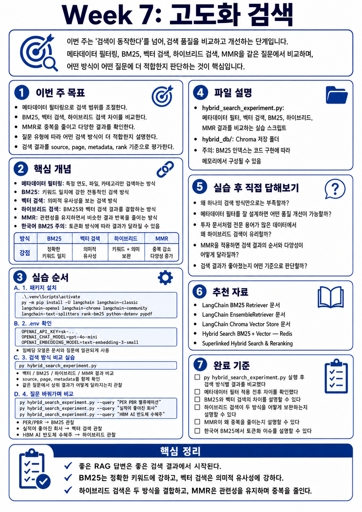

이번 주는 "검색이 되긴 한다"에서 끝나지 않고, 더 정확하고 더 통제 가능한 검색으로 가는 단계입니다. 같은 질문이라도 메타데이터 필터, BM25, 벡터 검색, 하이브리드 검색, MMR에 따라 결과가 달라지는 것을 직접 비교하는 것이 핵심입니다.

## 이번 주 목표
- 메타데이터 필터링으로 검색 범위를 조절한다.
- BM25, 벡터 검색, 하이브리드 검색 차이를 비교한다.
- MMR로 중복을 줄이고 다양한 결과를 보는 흐름을 이해한다.

## 핵심 개념
- **메타데이터 필터링**: 특정 연도, 특정 파일, 특정 카테고리만 검색하는 방식
- **BM25**: 키워드 일치에 강한 전통적인 검색 방식
- **벡터 검색**: 의미적 유사성을 보는 검색 방식
- **하이브리드 검색**: BM25와 벡터 검색을 결합한 방식
- **MMR**: 비슷한 결과만 반복되지 않도록 다양성을 고려하는 검색 방식

## 이번 주 한눈에 보기



## 실습 순서

### 1. 패키지 설치
```bash
.\.venv\Scripts\activate
pip install langchain langchain-openai langchain-chroma langchain-community rank-bm25 python-dotenv pypdf

py -m pip install -U langchain langchain-classic langchain-openai langchain-chroma langchain-community langchain-text-splitters rank-bm25 python-dotenv pypdf
```


### 2. `.env` 확인
```text
OPENAI_API_KEY=<YOUR_OPENAI_API_KEY>
```

### 3. 검색 방식 비교 실습
```bash
python hybrid_search_experiment.py
```
확인할 것:
- 벡터 검색 결과와 BM25 결과가 어떻게 다른지
- `year=2024` 필터를 적용했을 때 결과가 좁혀지는지
- MMR 결과가 중복을 줄이는지
- 하이브리드 검색이 두 방식의 장점을 어느 정도 섞는지

```powershell
python .\hybrid_search_experiment.py
질문: HBM AI 반도체 수혜주는 어떤 흐름인가요?
============================================================
벡터 검색 결과
1. sample_investment_note.txt | p.?
   삼성전자는 2024년 들어 반도체 업황 회복의 영향을 받았다. 특히 HBM과 고대역폭 메모리 관련 수요가 늘어나면서 메모리 부문의 기대감이 커졌다. 일부 증권사는 서버용 메모리 판매 비중 확대를 긍정적으로 평가했다.  다만 스마트폰 출하량은 시장 경쟁 심화와 교체 수요 둔화의 영향을 받
2. 2024ltr.pdf | p.14
   2007 ................................................. 28.7 5.5  2008 ................................................. (31.8) (37.0)  2009 ....................
3. 2024ltr.pdf | p.14
   2000 ................................................. 26.6 (9.1)  2001 ................................................. 6.5 (11.9)  2002 .....................
============================================================
메타데이터 필터 적용 결과 (year=2024)
1. 2024ltr.pdf | p.14
   2007 ................................................. 28.7 5.5  2008 ................................................. (31.8) (37.0)  2009 ....................
2. 2024ltr.pdf | p.14
   2000 ................................................. 26.6 (9.1)  2001 ................................................. 6.5 (11.9)  2002 .....................
3. 2024ltr.pdf | p.14
   2014 ................................................. 27.0 13.7  2015 ................................................. (12.5) 1.4  2016 ......................
============================================================
MMR 검색 결과
1. sample_investment_note.txt | p.?
   삼성전자는 2024년 들어 반도체 업황 회복의 영향을 받았다. 특히 HBM과 고대역폭 메모리 관련 수요가 늘어나면서 메모리 부문의 기대감이 커졌다. 일부 증권사는 서버용 메모리 판매 비중 확대를 긍정적으로 평가했다.  다만 스마트폰 출하량은 시장 경쟁 심화와 교체 수요 둔화의 영향을 받
2. 2024ltr.pdf | p.14
   2000 ................................................. 26.6 (9.1)  2001 ................................................. 6.5 (11.9)  2002 .....................
3. 2024ltr.pdf | p.10
   yen-denominated borrowings. All are at fixed rates, no “floaters.” Greg and I have no view on  future foreign exchange rates and therefore seek a position appro
============================================================
BM25 검색 결과
1. sample_investment_note.txt | p.?
   삼성전자는 2024년 들어 반도체 업황 회복의 영향을 받았다. 특히 HBM과 고대역폭 메모리 관련 수요가 늘어나면서 메모리 부문의 기대감이 커졌다. 일부 증권사는 서버용 메모리 판매 비중 확대를 긍정적으로 평가했다.  다만 스마트폰 출하량은 시장 경쟁 심화와 교체 수요 둔화의 영향을 받
2. 2024ltr.pdf | p.14
   2014 ................................................. 27.0 13.7  2015 ................................................. (12.5) 1.4  2016 ......................
3. 2024ltr.pdf | p.14
   2021 ................................................. 29.6 28.7  2022 ................................................. 4.0 (18.1)  2023 ......................
============================================================
하이브리드 검색 결과
1. sample_investment_note.txt | p.?
   삼성전자는 2024년 들어 반도체 업황 회복의 영향을 받았다. 특히 HBM과 고대역폭 메모리 관련 수요가 늘어나면서 메모리 부문의 기대감이 커졌다. 일부 증권사는 서버용 메모리 판매 비중 확대를 긍정적으로 평가했다.  다만 스마트폰 출하량은 시장 경쟁 심화와 교체 수요 둔화의 영향을 받
2. 2024ltr.pdf | p.14
   2007 ................................................. 28.7 5.5  2008 ................................................. (31.8) (37.0)  2009 ....................
3. 2024ltr.pdf | p.14
   2000 ................................................. 26.6 (9.1)  2001 ................................................. 6.5 (11.9)  2002 .....................
4. 2024ltr.pdf | p.14
   2014 ................................................. 27.0 13.7  2015 ................................................. (12.5) 1.4  2016 ......................
5. 2024ltr.pdf | p.14
   2021 ................................................. 29.6 28.7  2022 ................................................. 4.0 (18.1)  2023 ......................
============================================================
관찰 포인트:
1. 메타데이터 필터를 걸면 검색 범위를 더 좁힐 수 있습니다.
2. BM25는 키워드가 정확히 들어간 문서에 강하고, 벡터 검색은 의미적 유사성에 강합니다.
3. 하이브리드 검색은 두 방식을 섞어 검색 편향을 줄이는 데 도움이 됩니다.
```

<details>
<summary> <b> GPT 추가설명 </b> </summary> <br/>

네, 결과는 **전체적으로 정상적으로 실행된 것이 맞습니다.**
다만 Week 7 학습 관점에서 보면 아주 좋은 포인트가 하나 드러났어요.

핵심은 이겁니다.

> 검색 방식 자체는 잘 비교되고 있지만, 현재 문서 구성과 메타데이터 설정 때문에 `year=2024` 필터 결과가 오히려 엉뚱해졌습니다.

<h2> 1. 벡터 검색 결과는 정상입니다 </h2>

질문이:

```text
HBM AI 반도체 수혜주는 어떤 흐름인가요?
```

였고, 벡터 검색 1위가:

```text
sample_investment_note.txt
삼성전자는 2024년 들어 반도체 업황 회복의 영향을 받았다.
특히 HBM과 고대역폭 메모리 관련 수요가 늘어나면서 ...
```

이렇게 나왔죠.

이건 **아주 정상적인 결과**입니다.

질문에 있는 핵심어가:

```text
HBM
AI
반도체
수혜주
```

이고, 샘플 문서에 실제로:

```text
삼성전자
반도체 업황 회복
HBM
고대역폭 메모리
서버용 메모리
```

가 들어 있으니까 가장 관련 높은 청크로 나온 게 맞습니다.

<h2> 2. 메타데이터 필터 결과가 이상해 보이는 이유 </h2>

여기가 제일 중요합니다.

메타데이터 필터 결과는 이렇게 나왔습니다.

```text
메타데이터 필터 적용 결과 (year=2024)
1. 2024ltr.pdf | p.14
2. 2024ltr.pdf | p.14
3. 2024ltr.pdf | p.14
```

그런데 질문은 HBM/AI/반도체인데, `2024ltr.pdf`는 버크셔 해서웨이 주주서한이죠.
그러면 HBM이나 반도체 수혜주와 직접 관련이 거의 없습니다.

왜 이런 일이 생겼냐면, 코드에서 메타데이터를 이렇게 붙였기 때문입니다.

```python
year = "2024" if "2024" in path.name else "sample"
```

즉,

```text
2024ltr.pdf → year = "2024"
sample_investment_note.txt → year = "sample"
```

이렇게 됩니다.

그런데 실제로 HBM 내용은 `sample_investment_note.txt`에 있습니다.
하지만 그 문서의 `year`는 `"sample"`로 되어 있어서 `filter={"year": "2024"}`를 적용하면 검색 대상에서 빠집니다.

그래서 필터 검색은 어쩔 수 없이 `2024ltr.pdf` 안에서만 가장 가까워 보이는 청크를 찾게 됩니다.
그 결과 HBM과 별 관련 없는 버크셔 수익률 표가 나온 것입니다.

즉, 이 결과는 **필터가 잘못 작동한 게 아니라, 필터가 너무 강하게 적용된 것**입니다.

<h2> 3. 이 결과로 배울 수 있는 핵심 </h2>

이번 결과는 Week 7 학습에 오히려 아주 좋습니다.

메타데이터 필터링은 검색 범위를 줄여주는 강력한 기능이지만, **메타데이터를 잘못 설계하면 좋은 문서를 검색 대상에서 제외할 수 있습니다.**

지금 상황은 딱 이겁니다.

```text
질문: HBM AI 반도체 수혜주
실제 관련 문서: sample_investment_note.txt
하지만 sample 문서의 year: sample
필터 조건: year=2024
결과: sample 문서 제외
검색 대상: 2024ltr.pdf만 남음
최종 결과: 관련 없는 버크셔 표 검색
```

그래서 `year`보다는 `category`를 더 잘 쓰는 게 좋습니다.

예를 들어:

```python
if path.name == "sample_investment_note.txt":
    category = "반도체"
    year = "2024"
elif path.name == "2024ltr.pdf":
    category = "버크셔"
    year = "2024"
```

이런 식이 더 자연스럽습니다.

<h2> 4. MMR 결과도 정상입니다 </h2>

MMR 결과는:

```text
1. sample_investment_note.txt
2. 2024ltr.pdf p.14
3. 2024ltr.pdf p.10
```

이렇게 나왔습니다.

이것도 MMR의 특징을 잘 보여줍니다.

일반 벡터 검색은 비슷한 청크를 계속 가져올 수 있는데, MMR은 **관련성 + 다양성**을 같이 봅니다.

그래서 1위는 가장 관련 있는 HBM 샘플 문서를 가져오고,
2~3위는 서로 조금 다른 버크셔 청크를 가져온 것입니다.

다만 여기서 중요한 점은:

> MMR이 항상 더 좋은 검색 결과를 주는 것은 아닙니다.

MMR은 중복을 줄이고 다양한 결과를 주지만, 후보 문서 자체에 관련 자료가 부족하면 다양한 “관련 없는 결과”가 섞일 수도 있습니다.

이번 결과가 딱 그런 예입니다.

<h2> 5. BM25 결과도 정상입니다 </h2>

BM25 결과 1위도 `sample_investment_note.txt`입니다.

```text
삼성전자는 2024년 들어 반도체 업황 회복의 영향을 받았다.
특히 HBM과 고대역폭 메모리 관련 수요가 늘어나면서 ...
```

이것도 정상입니다.

질문에 `HBM`, `AI`, `반도체` 같은 키워드가 들어 있고, 샘플 문서에도 `HBM`, `반도체`가 직접 들어 있으니까 BM25가 잘 잡은 것입니다.

다만 2~3위에 `2024ltr.pdf p.14`가 나온 건, 전체 문서 중에서 그나마 키워드 점수나 토큰 기준으로 걸린 결과일 가능성이 있습니다.
특히 한국어 BM25는 토큰화 방식이 단순하면 생각보다 이상한 결과가 나올 수 있습니다.

<h2> 6. 하이브리드 검색 결과도 자연스럽습니다 </h2>

하이브리드 검색 결과는:

```text
1. sample_investment_note.txt
2. 2024ltr.pdf p.14
3. 2024ltr.pdf p.14
4. 2024ltr.pdf p.14
5. 2024ltr.pdf p.14
```

입니다.

1위가 샘플 문서인 것은 좋습니다.

다만 2위 이후가 대부분 `2024ltr.pdf p.14`인 점은 아쉽습니다.
이건 두 가지 가능성이 있습니다.

첫째, `2024ltr.pdf`의 p.14가 여러 청크로 나뉘어 있어서 비슷한 표 조각들이 반복 검색되는 경우입니다.

둘째, 같은 DB 폴더에 여러 번 실행하면서 같은 문서가 중복 저장되었을 가능성도 있습니다.

현재 코드가 매번:

```python
Chroma.from_documents(
    documents=chunks,
    embedding=embeddings,
    persist_directory=str(db_dir),
)
```

를 실행하죠.

이 경우 기존 `hybrid_db` 폴더를 지우지 않고 계속 실행하면, 설정에 따라 같은 청크가 반복 추가될 수 있습니다.

그래서 실습할 때는 한 번 `hybrid_db` 폴더를 삭제하고 다시 실행해보는 것을 추천합니다.

PowerShell에서:

```powershell
Remove-Item -Recurse -Force .\hybrid_db
```

그다음 다시:

```powershell
python .\hybrid_search_experiment.py
```

<h2> 7. 지금 결과의 최종 판단 </h2>

정리하면 이렇게 볼 수 있습니다.

| 검색 방식    | 결과 판단                                       |
| -------- | ------------------------------------------- |
| 벡터 검색    | 정상. HBM 의미와 가까운 샘플 문서를 1위로 찾음               |
| 메타데이터 필터 | 기능은 정상. 다만 `year=2024` 필터 때문에 실제 관련 문서가 제외됨 |
| MMR      | 정상. 중복을 줄이려 했지만 관련 후보가 부족해 버크셔 청크가 섞임       |
| BM25     | 정상. HBM 키워드가 있는 샘플 문서를 1위로 찾음               |
| 하이브리드    | 정상. 다만 DB 중복 또는 문서 구성 때문에 버크셔 p.14가 많이 나옴   |

즉, 코드가 망가진 건 아닙니다.
오히려 Week 7에서 배워야 할 내용이 잘 드러났습니다.

<h2> 수정하면 더 좋은 부분 </h2>

<h3> 1. 샘플 문서 메타데이터를 더 정확히 붙이기 </h3>

현재:

```python
year = "2024" if "2024" in path.name else "sample"
```

추천:

```python
if path.name == "sample_investment_note.txt":
    year = "2024"
    category = "반도체"
elif path.name == "2024ltr.pdf":
    year = "2024"
    category = "버크셔"
else:
    year = "unknown"
    category = "기타"
```

그리고 metadata update는 이렇게:

```python
doc.metadata.update(
    {
        "source_name": path.name,
        "year": year,
        "category": category,
    }
)
```

그러면 `year=2024` 필터를 걸어도 샘플 문서가 빠지지 않습니다.

<h3> 2. 질문에 맞는 필터를 쓰기 </h3>

HBM 질문이면 `year=2024`보다 `category=반도체`가 더 적절합니다.

예를 들어 코드에서 이런 필터 실습을 추가하면 좋습니다.

```python
category_filtered_results = vectordb.similarity_search(
    args.query,
    k=3,
    filter={"category": "반도체"},
)
```

출력도 추가:

```python
print_results("메타데이터 필터 적용 결과 (category=반도체)", category_filtered_results)
```

그러면 HBM 질문에서는 훨씬 더 자연스러운 결과가 나올 가능성이 높습니다.

<h3> 3. 버크셔 PDF에는 버크셔 관련 질문을 하기 </h3>

`2024ltr.pdf`를 테스트할 때는 이런 질문이 더 좋습니다.

```powershell
python .\hybrid_search_experiment.py --query "GEICO의 실적이 개선된 이유는 무엇인가요?"
```

또는:

```powershell
python .\hybrid_search_experiment.py --query "버크셔 해서웨이는 일본 5대 종합상사에 대해 어떻게 설명하나요?"
```

반대로 HBM 질문은 샘플 반도체 메모에 더 적합합니다.

<h2> 결론 </h2>

이번 결과는 **성공적으로 실행된 결과**입니다.
다만 동시에 이런 교훈을 보여줍니다.

> 검색 방식이 좋아도, 문서 구성과 메타데이터 설계가 맞지 않으면 검색 결과가 이상해질 수 있다.

특히 이번 실습에서 가장 중요한 관찰은 이거예요.

```text
year=2024 필터를 걸었더니 실제 관련 있는 sample 문서가 빠지고,
관련 없는 2024ltr.pdf만 검색 대상이 되었다.
```

그래서 Week 7에서 꼭 기억할 결론은 다음입니다.

> 메타데이터 필터링은 검색 품질을 높일 수 있지만, 메타데이터를 잘못 붙이면 오히려 관련 문서를 제외할 수 있다. 필터는 질문의 의도와 문서 메타데이터 설계가 잘 맞을 때 효과적이다.

</details> <br/>

### 4. 질문 바꿔가며 비교
```bash
python hybrid_search_experiment.py --query "PER PBR 밸류에이션"
python hybrid_search_experiment.py --query "실적이 좋아진 회사"
python hybrid_search_experiment.py --query "HBM AI 반도체 수혜주"
```
확인할 것:
- 키워드 중심 질문에서 BM25가 강한지
- 의미 중심 질문에서 벡터 검색이 더 자연스러운지
- 전문 용어가 섞인 질문에서 하이브리드가 더 균형 잡힌지

```powershell
python .\hybrid_search_experiment.py --query "PER PBR 밸류에이션"
질문: PER PBR 밸류에이션
============================================================
벡터 검색 결과
1. 2024ltr.pdf | p.7
   your part.  Property-Casualty Insurance  P/C insurance continues to be Berkshire’s core business. The industry follows a financial  model that is rare – very ra
2. 2024ltr.pdf | p.7
   your part.  Property-Casualty Insurance  P/C insurance continues to be Berkshire’s core business. The industry follows a financial  model that is rare – very ra
3. 2024ltr.pdf | p.11
   design.  Subsequently, Carrie left Berkshire to raise a family and now has three children. But each  summer, the Berkshire office force gets together to watch t
============================================================
메타데이터 필터 적용 결과 (year=2024)
1. 2024ltr.pdf | p.7
   your part.  Property-Casualty Insurance  P/C insurance continues to be Berkshire’s core business. The industry follows a financial  model that is rare – very ra
2. 2024ltr.pdf | p.7
   your part.  Property-Casualty Insurance  P/C insurance continues to be Berkshire’s core business. The industry follows a financial  model that is rare – very ra
3. 2024ltr.pdf | p.11
   design.  Subsequently, Carrie left Berkshire to raise a family and now has three children. But each  summer, the Berkshire office force gets together to watch t
============================================================
MMR 검색 결과
1. 2024ltr.pdf | p.7
   your part.  Property-Casualty Insurance  P/C insurance continues to be Berkshire’s core business. The industry follows a financial  model that is rare – very ra
2. 2024ltr.pdf | p.12
   * * * * * * * * * * * *  The Berkshire directors and I immensely enjoy having you come to Omaha, and I predict  that you will have a good time and likely make s
3. 2024ltr.pdf | p.1
   recommend for general use.)  Pete paused as his wife, daughter and I leaned forward. Then he surprised us: “Well, I  looked at Berkshire’s proxy statement and I
============================================================
BM25 검색 결과
1. 2024ltr.pdf | p.14
   2021 ................................................. 29.6 28.7  2022 ................................................. 4.0 (18.1)  2023 ......................
2. 2024ltr.pdf | p.14
   2014 ................................................. 27.0 13.7  2015 ................................................. (12.5) 1.4  2016 ......................
3. 2024ltr.pdf | p.14
   2007 ................................................. 28.7 5.5  2008 ................................................. (31.8) (37.0)  2009 ....................
============================================================
하이브리드 검색 결과
1. 2024ltr.pdf | p.7
   your part.  Property-Casualty Insurance  P/C insurance continues to be Berkshire’s core business. The industry follows a financial  model that is rare – very ra
2. 2024ltr.pdf | p.11
   design.  Subsequently, Carrie left Berkshire to raise a family and now has three children. But each  summer, the Berkshire office force gets together to watch t
3. 2024ltr.pdf | p.14
   2021 ................................................. 29.6 28.7  2022 ................................................. 4.0 (18.1)  2023 ......................
4. 2024ltr.pdf | p.14
   2014 ................................................. 27.0 13.7  2015 ................................................. (12.5) 1.4  2016 ......................
5. 2024ltr.pdf | p.14
   2007 ................................................. 28.7 5.5  2008 ................................................. (31.8) (37.0)  2009 ....................
============================================================
관찰 포인트:
1. 메타데이터 필터를 걸면 검색 범위를 더 좁힐 수 있습니다.
2. BM25는 키워드가 정확히 들어간 문서에 강하고, 벡터 검색은 의미적 유사성에 강합니다.
3. 하이브리드 검색은 두 방식을 섞어 검색 편향을 줄이는 데 도움이 됩니다.
```
```powershell
python .\hybrid_search_experiment.py --query "실적이 좋아진 회사"
질문: 실적이 좋아진 회사
============================================================
벡터 검색 결과
1. 2024ltr.pdf | p.2
   dealing.  But I’ve also had many pleasant surprises in both the potential of the business as well as  the ability and fidelity of the manager. And our experienc
2. 2024ltr.pdf | p.2
   dealing.  But I’ve also had many pleasant surprises in both the potential of the business as well as  the ability and fidelity of the manager. And our experienc
3. 2024ltr.pdf | p.2
   dealing.  But I’ve also had many pleasant surprises in both the potential of the business as well as  the ability and fidelity of the manager. And our experienc
============================================================
메타데이터 필터 적용 결과 (year=2024)
1. 2024ltr.pdf | p.2
   dealing.  But I’ve also had many pleasant surprises in both the potential of the business as well as  the ability and fidelity of the manager. And our experienc
2. 2024ltr.pdf | p.2
   dealing.  But I’ve also had many pleasant surprises in both the potential of the business as well as  the ability and fidelity of the manager. And our experienc
3. 2024ltr.pdf | p.2
   dealing.  But I’ve also had many pleasant surprises in both the potential of the business as well as  the ability and fidelity of the manager. And our experienc
============================================================
MMR 검색 결과
1. 2024ltr.pdf | p.2
   dealing.  But I’ve also had many pleasant surprises in both the potential of the business as well as  the ability and fidelity of the manager. And our experienc
2. 2024ltr.pdf | p.3
   Last Year’s Performance  In 2024, Berkshire did better than I expected though 53% of our 189 operating  businesses reported a decline in earnings. We were aided
3. 2024ltr.pdf | p.10
   Each of the five companies increase dividends when appropriate, they repurchase their  shares when it is sensible to do so, and their top managers are far less
============================================================
BM25 검색 결과
1. 2024ltr.pdf | p.14
   2021 ................................................. 29.6 28.7  2022 ................................................. 4.0 (18.1)  2023 ......................
2. 2024ltr.pdf | p.14
   2014 ................................................. 27.0 13.7  2015 ................................................. (12.5) 1.4  2016 ......................
3. 2024ltr.pdf | p.14
   2007 ................................................. 28.7 5.5  2008 ................................................. (31.8) (37.0)  2009 ....................
============================================================
하이브리드 검색 결과
1. 2024ltr.pdf | p.2
   dealing.  But I’ve also had many pleasant surprises in both the potential of the business as well as  the ability and fidelity of the manager. And our experienc
2. 2024ltr.pdf | p.14
   2021 ................................................. 29.6 28.7  2022 ................................................. 4.0 (18.1)  2023 ......................
3. 2024ltr.pdf | p.14
   2014 ................................................. 27.0 13.7  2015 ................................................. (12.5) 1.4  2016 ......................
4. 2024ltr.pdf | p.14
   2007 ................................................. 28.7 5.5  2008 ................................................. (31.8) (37.0)  2009 ....................
============================================================
관찰 포인트:
1. 메타데이터 필터를 걸면 검색 범위를 더 좁힐 수 있습니다.
2. BM25는 키워드가 정확히 들어간 문서에 강하고, 벡터 검색은 의미적 유사성에 강합니다.
3. 하이브리드 검색은 두 방식을 섞어 검색 편향을 줄이는 데 도움이 됩니다.
```
```powershell
python .\hybrid_search_experiment.py --query "HBM AI 반도체 수혜주"
질문: HBM AI 반도체 수혜주
============================================================
벡터 검색 결과
1. sample_investment_note.txt | p.?
   삼성전자는 2024년 들어 반도체 업황 회복의 영향을 받았다. 특히 HBM과 고대역폭 메모리 관련 수요가 늘어나면서 메모리 부문의 기대감이 커졌다. 일부 증권사는 서버용 메모리 판매 비중 확대를 긍정적으로 평가했다.  다만 스마트폰 출하량은 시장 경쟁 심화와 교체 수요 둔화의 영향을 받
2. sample_investment_note.txt | p.?
   삼성전자는 2024년 들어 반도체 업황 회복의 영향을 받았다. 특히 HBM과 고대역폭 메모리 관련 수요가 늘어나면서 메모리 부문의 기대감이 커졌다. 일부 증권사는 서버용 메모리 판매 비중 확대를 긍정적으로 평가했다.  다만 스마트폰 출하량은 시장 경쟁 심화와 교체 수요 둔화의 영향을 받
3. sample_investment_note.txt | p.?
   삼성전자는 2024년 들어 반도체 업황 회복의 영향을 받았다. 특히 HBM과 고대역폭 메모리 관련 수요가 늘어나면서 메모리 부문의 기대감이 커졌다. 일부 증권사는 서버용 메모리 판매 비중 확대를 긍정적으로 평가했다.  다만 스마트폰 출하량은 시장 경쟁 심화와 교체 수요 둔화의 영향을 받
============================================================
메타데이터 필터 적용 결과 (year=2024)
1. 2024ltr.pdf | p.9
   * * * * * * * * * * * *  No private insurer has the willingness to take on the amount of risk that Berkshire can  provide. At times, this advantage can be impor
2. 2024ltr.pdf | p.9
   * * * * * * * * * * * *  No private insurer has the willingness to take on the amount of risk that Berkshire can  provide. At times, this advantage can be impor
3. 2024ltr.pdf | p.9
   * * * * * * * * * * * *  No private insurer has the willingness to take on the amount of risk that Berkshire can  provide. At times, this advantage can be impor
============================================================
MMR 검색 결과
1. sample_investment_note.txt | p.?
   삼성전자는 2024년 들어 반도체 업황 회복의 영향을 받았다. 특히 HBM과 고대역폭 메모리 관련 수요가 늘어나면서 메모리 부문의 기대감이 커졌다. 일부 증권사는 서버용 메모리 판매 비중 확대를 긍정적으로 평가했다.  다만 스마트폰 출하량은 시장 경쟁 심화와 교체 수요 둔화의 영향을 받
2. 2024ltr.pdf | p.9
   * * * * * * * * * * * *  No private insurer has the willingness to take on the amount of risk that Berkshire can  provide. At times, this advantage can be impor
3. 2024ltr.pdf | p.14
   2007 ................................................. 28.7 5.5  2008 ................................................. (31.8) (37.0)  2009 ....................
============================================================
BM25 검색 결과
1. sample_investment_note.txt | p.?
   삼성전자는 2024년 들어 반도체 업황 회복의 영향을 받았다. 특히 HBM과 고대역폭 메모리 관련 수요가 늘어나면서 메모리 부문의 기대감이 커졌다. 일부 증권사는 서버용 메모리 판매 비중 확대를 긍정적으로 평가했다.  다만 스마트폰 출하량은 시장 경쟁 심화와 교체 수요 둔화의 영향을 받
2. 2024ltr.pdf | p.14
   2014 ................................................. 27.0 13.7  2015 ................................................. (12.5) 1.4  2016 ......................
3. 2024ltr.pdf | p.14
   2021 ................................................. 29.6 28.7  2022 ................................................. 4.0 (18.1)  2023 ......................
============================================================
하이브리드 검색 결과
1. sample_investment_note.txt | p.?
   삼성전자는 2024년 들어 반도체 업황 회복의 영향을 받았다. 특히 HBM과 고대역폭 메모리 관련 수요가 늘어나면서 메모리 부문의 기대감이 커졌다. 일부 증권사는 서버용 메모리 판매 비중 확대를 긍정적으로 평가했다.  다만 스마트폰 출하량은 시장 경쟁 심화와 교체 수요 둔화의 영향을 받
2. 2024ltr.pdf | p.14
   2014 ................................................. 27.0 13.7  2015 ................................................. (12.5) 1.4  2016 ......................
3. 2024ltr.pdf | p.14
   2021 ................................................. 29.6 28.7  2022 ................................................. 4.0 (18.1)  2023 ......................
============================================================
관찰 포인트:
1. 메타데이터 필터를 걸면 검색 범위를 더 좁힐 수 있습니다.
2. BM25는 키워드가 정확히 들어간 문서에 강하고, 벡터 검색은 의미적 유사성에 강합니다.
3. 하이브리드 검색은 두 방식을 섞어 검색 편향을 줄이는 데 도움이 됩니다.
```

<details>
<summary> <b> GPT 추가설명 </b> </summary> <br/>

네, 이 결과들은 **“정답을 얻었다”기보다, 검색 방식별 성격과 문제점을 진단하는 결과**로 보면 됩니다.  
결론부터 말하면, 실행은 잘 됐고 Week 7 학습 목적에도 맞습니다. 다만 지금 결과에서는 **중복 저장**, **메타데이터 설계 문제**, **질문-문서 불일치**가 같이 드러났어요. 

<h2> 전체적으로 어떻게 봐야 하나요? </h2>

이번 결과는 이렇게 보면 됩니다.

| 관찰 항목                      | 해석                                            |
| -------------------------- | --------------------------------------------- |
| 같은 청크가 반복됨                 | DB에 같은 문서가 중복 저장됐거나, 청크가 너무 비슷하게 잘렸을 가능성      |
| `year=2024` 필터 결과가 이상함     | 필터 자체는 동작하지만, 메타데이터 설계가 질문 의도와 맞지 않음          |
| BM25가 이상한 청크를 가져옴          | 한국어 질문과 영어 문서의 키워드 매칭이 잘 안 맞거나, 쿼리 단어가 문서에 없음 |
| HBM 질문에서는 sample 문서가 잘 검색됨 | 질문과 문서 내용이 잘 맞으면 벡터/BM25/하이브리드 모두 정상적으로 작동    |
| MMR이 다른 페이지를 섞어 가져옴        | 중복은 줄였지만, 관련 없는 다양성도 섞일 수 있음                  |

즉, 지금 결과는 실패가 아니라 **검색 시스템을 개선할 포인트가 잘 보인 결과**입니다.

<h2> 1. <code>PER PBR 밸류에이션</code> 결과 해석 </h2>

이 질문 결과를 보면 벡터 검색은 `2024ltr.pdf`의 보험 사업 관련 페이지를 가져왔고, BM25는 p.14의 수익률 표를 가져왔습니다. 

이건 이렇게 봐야 합니다.

<h3> 핵심 해석 </h3>

`PER`, `PBR`, `밸류에이션`이라는 단어가 현재 문서 안에 거의 없거나, 적어도 직접적으로 잘 매칭되는 청크가 없는 상태로 보입니다.

그래서 검색기가 억지로 “그나마 가까운 것”을 가져온 겁니다.

특히 `2024ltr.pdf`는 버크셔 주주서한이지, PER/PBR 밸류에이션 리포트가 아닙니다.
그러니까 이 질문은 현재 DB에 들어 있는 문서와 잘 맞지 않습니다.

<h3> 이 결과에서 배울 점 </h3>

```text
질문은 투자 지표 중심
문서는 버크셔 주주서한 + 샘플 메모
문서 안에 PER/PBR 직접 설명이 부족함
→ 검색 결과가 애매해짐
```

즉, 이 결과는 **BM25가 약하다 / 벡터 검색이 약하다**라기보다,

> 질문에 답할 만한 문서가 DB에 충분히 없으면 어떤 검색 방식도 좋은 결과를 주기 어렵다

를 보여주는 결과입니다.

<h2> 2. <code>실적이 좋아진 회사</code> 결과 해석 </h2>

이 결과에서 벡터 검색은 `2024ltr.pdf` p.2를 반복해서 가져왔고, MMR은 p.2, p.3, p.10처럼 조금 더 다양한 페이지를 가져왔습니다. 특히 MMR 2위의 p.3에는 `Last Year’s Performance`, `In 2024, Berkshire did better than I expected...` 같은 성과 관련 내용이 들어가 있어서 질문과 꽤 관련 있어 보입니다. 

<h3> 핵심 해석 </h3>

이 질문은 **의미 기반 질문**입니다.

```text
실적이 좋아진 회사
```

이 표현은 문서에 그대로 없어도, 아래와 비슷한 의미를 찾을 수 있어야 합니다.

```text
performance improved
earnings increased
did better than expected
operating businesses
```

그래서 벡터 검색이나 MMR이 더 잘 맞는 유형입니다.

<h3> 그런데 문제는? </h3>

벡터 검색 결과가 p.2만 3번 반복됐습니다.

이건 좋지 않은 신호입니다.

가능성은 두 가지입니다.

<h4> 가능성 1. Chroma DB에 같은 청크가 중복 저장됨 </h4>

여러 번 실행하면서 `hybrid_db`를 삭제하지 않았다면 같은 문서가 반복 저장됐을 수 있습니다.

<h4> 가능성 2. 청크 오버랩 때문에 거의 같은 청크가 여러 개 생김 </h4>

`chunk_overlap=50`이라서 비슷한 청크가 여러 개 생길 수 있습니다.
다만 같은 페이지와 같은 내용이 계속 반복된다면, 중복 저장 가능성이 더 커 보입니다.

<h2> 이 결과에서 배울 점 </h2>

MMR은 여기서 역할을 꽤 잘 보여줬습니다.

일반 벡터 검색:

```text
p.2
p.2
p.2
```

MMR 검색:

```text
p.2
p.3
p.10
```

즉, MMR은 **비슷한 결과 반복을 줄이고 다양한 청크를 보여주는 효과**가 있습니다.
다만 p.10까지 정말 질문과 관련 있는지는 사람이 봐야 합니다.

<h2> 3. <code>HBM AI 반도체 수혜주</code> 결과 해석 </h2>

이 결과는 가장 좋습니다.

벡터 검색, BM25, 하이브리드 검색 모두 1위로 `sample_investment_note.txt`를 가져왔습니다. 그 청크에는 삼성전자, 반도체 업황 회복, HBM, 고대역폭 메모리, 서버용 메모리 수요가 들어 있습니다. 

<h3> 핵심 해석 </h3>

이건 검색이 잘 된 결과입니다.

질문:

```text
HBM AI 반도체 수혜주
```

문서 내용:

```text
삼성전자
반도체 업황 회복
HBM
고대역폭 메모리
서버용 메모리
```

질문과 문서가 잘 맞습니다.

그래서 벡터 검색도 잘 찾고, BM25도 잘 찾고, 하이브리드 검색도 잘 찾았습니다.

<h3> 그런데 문제도 있습니다 </h3>

벡터 검색 결과에서 같은 sample 문서가 1, 2, 3위에 반복됩니다.

```text
1. sample_investment_note.txt
2. sample_investment_note.txt
3. sample_investment_note.txt
```

이건 또 중복 문제가 보입니다.

그리고 `year=2024` 필터를 적용했더니 오히려 `2024ltr.pdf` p.9만 나왔습니다. 이건 HBM과 관련 없는 버크셔 보험 관련 내용입니다. 

이유는 이전에도 말한 것처럼 코드에서 sample 문서의 `year`가 `"sample"`로 들어갔기 때문일 가능성이 큽니다.

현재 코드 구조가 이런 식이었죠.

```python
year = "2024" if "2024" in path.name else "sample"
```

그러면:

```text
2024ltr.pdf → year=2024
sample_investment_note.txt → year=sample
```

이 됩니다.

그런데 HBM 내용은 sample 문서에 있으니, `year=2024` 필터를 걸면 실제 관련 문서가 빠집니다.

그래서 결과가 이렇게 되는 겁니다.

```text
HBM 질문
→ 실제 관련 문서: sample_investment_note.txt
→ year=2024 필터 적용
→ sample 문서 제외
→ 2024ltr.pdf만 검색
→ 관련 없는 버크셔 청크 반환
```

<h2> 지금 결과에서 가장 중요한 3가지 결론 </h2>

<h3> 결론 1. 검색 방식은 정상 작동하고 있습니다 </h3>

벡터 검색, BM25, MMR, 하이브리드 검색이 모두 실행되고 있고, 질문에 따라 결과가 다르게 나옵니다.

즉, Week 7 실습 자체는 성공입니다.

<h3> 결론 2. 하지만 DB 중복 문제가 있어 보입니다 </h3>

같은 문서, 같은 페이지, 같은 청크가 반복해서 나오는 경우가 많습니다.

특히 이런 부분입니다.

```text
벡터 검색 결과
1. 2024ltr.pdf | p.2
2. 2024ltr.pdf | p.2
3. 2024ltr.pdf | p.2
```

또는:

```text
벡터 검색 결과
1. sample_investment_note.txt
2. sample_investment_note.txt
3. sample_investment_note.txt
```

이건 실습 전에 `hybrid_db`를 삭제하고 다시 실행해보는 게 좋습니다.

PowerShell에서:

```powershell
Remove-Item -Recurse -Force .\hybrid_db
```

그다음 다시 실행하세요.

```powershell
python .\hybrid_search_experiment.py --query "HBM AI 반도체 수혜주"
```

<h3> 결론 3. 메타데이터 필터는 “잘 쓰면 좋지만, 잘못 쓰면 망합니다” </h3>

지금 `year=2024` 필터가 딱 그 예시입니다.

필터는 검색 범위를 줄여주는 장점이 있지만, 관련 문서의 메타데이터가 필터 조건과 맞지 않으면 오히려 좋은 문서를 제외합니다.

그래서 sample 문서에도 실제로 2024년 반도체 내용이 들어 있다면 이렇게 붙이는 게 더 좋습니다.

```python
if path.name == "sample_investment_note.txt":
    year = "2024"
    category = "반도체"
elif path.name == "2024ltr.pdf":
    year = "2024"
    category = "버크셔"
else:
    year = "unknown"
    category = "기타"
```

그리고 HBM 질문에는 `year=2024`보다 이 필터가 더 적절합니다.

```python
filter={"category": "반도체"}
```

<h2> 검색 방식별로 결과를 어떻게 읽어야 하나요? </h2>

<h3> 벡터 검색 </h3>

벡터 검색은 **질문과 의미가 비슷한 청크**를 찾습니다.

이번 결과에서 HBM 질문은 아주 잘 찾았습니다.

반면 PER/PBR 질문은 애매했습니다.
왜냐하면 현재 문서에 PER/PBR 관련 내용이 충분하지 않기 때문입니다.

따라서 벡터 검색 결과는 이렇게 봅니다.

```text
질문과 의미적으로 비슷한 문장인가?
직접 키워드가 없어도 의미가 통하는가?
같은 청크가 반복되지 않는가?
```

<h3> BM25 검색 </h3>

BM25는 **정확한 키워드가 있는 청크**를 잘 찾습니다.

HBM 질문에서는 sample 문서에 `HBM`이 직접 들어 있으니 잘 찾았습니다.

하지만 `실적이 좋아진 회사` 같은 한국어 의미 질문에서는 BM25가 p.14의 숫자 표를 가져왔습니다.
이건 한국어 질문과 영어 문서의 키워드 매칭이 잘 안 된 결과로 볼 수 있습니다.

BM25 결과는 이렇게 봅니다.

```text
질문에 있는 단어가 문서에 직접 들어 있는가?
약어, 지표, 종목명 검색에서 강한가?
한국어 토큰화 때문에 이상한 결과가 나오지는 않는가?
```

<h3> MMR 검색 </h3>

MMR은 **비슷한 결과 반복을 줄이고 다양성을 확보**하는 검색입니다.

`실적이 좋아진 회사`에서 p.2만 반복되던 벡터 검색과 달리, MMR은 p.2, p.3, p.10으로 결과를 넓혔습니다.

이건 좋은 관찰입니다.

하지만 HBM 질문에서 MMR이 sample 문서 다음에 버크셔 p.9, p.14를 가져온 것은 아쉽습니다.

이건 MMR의 한계입니다.

> MMR은 다양성을 늘리지만, 후보 문서 풀이 약하면 관련 없는 다양한 결과도 섞일 수 있습니다.

<h3> 하이브리드 검색 </h3>

하이브리드는 BM25와 벡터 검색을 합친 결과입니다.

HBM 질문에서는 1위가 sample 문서라서 잘 작동했습니다.

다만 2~3위는 여전히 버크셔 p.14라서 완벽하지는 않습니다.

이건 하이브리드 검색 자체 문제라기보다:

```text
문서 수가 적음
관련 문서가 sample 하나뿐임
DB 중복 가능성 있음
BM25 결과가 p.14로 치우침
```

때문입니다.

하이브리드 검색은 문서가 더 많고, 관련 후보가 여러 개 있을 때 차이가 더 잘 보입니다.

<h2> 지금 상태에서 가장 먼저 고칠 것 </h2>

<h3> 1. <code>hybrid_db</code> 삭제 후 재실행 </h3>

중복 여부를 먼저 확인하세요.

```powershell
Remove-Item -Recurse -Force .\hybrid_db
```

그다음:

```powershell
python .\hybrid_search_experiment.py --query "HBM AI 반도체 수혜주"
```

반복 결과가 줄어들면 DB 중복이 원인이 맞습니다.

<h3> 2. 메타데이터 수정 </h3>

현재 `year`를 파일명 기준으로만 주면 안 좋습니다.

이렇게 바꾸는 게 좋습니다.

```python
if path.name == "sample_investment_note.txt":
    year = "2024"
    category = "반도체"
elif path.name == "2024ltr.pdf":
    year = "2024"
    category = "버크셔"
else:
    year = "unknown"
    category = "기타"
```

<h3> 3. category 필터 결과도 추가 </h3>

현재는 `year=2024`만 보고 있습니다.

HBM 질문에는 이게 더 좋습니다.

```python
category_filtered_results = vectordb.similarity_search(
    args.query,
    k=3,
    filter={"category": "반도체"},
)

print_results("메타데이터 필터 적용 결과 (category=반도체)", category_filtered_results)
```

<h3> 4. 질문과 문서 주제를 맞춰서 보기 </h3>

현재 질문 3개 중에서:

| 질문             | 현재 문서와의 적합도                |
| -------------- | -------------------------- |
| PER PBR 밸류에이션  | 낮음. 현재 문서에 직접 관련 내용 부족     |
| 실적이 좋아진 회사     | 중간. 버크셔 성과 관련 내용과 어느 정도 연결 |
| HBM AI 반도체 수혜주 | 높음. sample 문서와 잘 맞음        |

그래서 실습 결과를 볼 때도 이렇게 구분해야 합니다.

> 질문에 답할 문서가 DB에 있는가?

이걸 먼저 봐야 합니다.

<h2> 최종적으로 이렇게 이해하면 됩니다 </h2>

이번 결과는 아주 좋은 학습 결과입니다.

왜냐하면 Week 7에서 꼭 배워야 할 것들이 다 보였거든요.

```text
1. 질문과 문서가 잘 맞으면 검색이 잘 된다.
   → HBM 질문에서 sample 문서 검색 성공

2. 질문에 맞는 문서가 없으면 검색 방식이 좋아도 결과가 애매하다.
   → PER/PBR 질문

3. 메타데이터 필터는 강력하지만, 잘못 설계하면 관련 문서를 제외한다.
   → year=2024 필터가 sample 문서를 제외

4. MMR은 중복을 줄이지만, 관련 없는 다양성도 섞일 수 있다.
   → HBM 질문에서 버크셔 청크가 섞임

5. 같은 결과가 반복되면 DB 중복 또는 청크 중복을 의심해야 한다.
   → p.2, p.14, sample 문서 반복
```

정말 중요한 결론은 이거예요.

> 검색 결과는 “검색 방식이 맞다/틀리다”로만 보면 안 되고, 질문-문서 적합성, 메타데이터 설계, DB 중복 여부, 청크 품질을 함께 봐야 합니다.

지금 Week 7 결과는 그걸 아주 잘 보여주고 있습니다.

</details> <br/>

hybrid_db 지우고 다시 진행
```powershell
python .\hybrid_search_experiment.py --query "HBM AI 반도체 수혜주"
질문: HBM AI 반도체 수혜주
============================================================
벡터 검색 결과
1. sample_investment_note.txt | p.?
   삼성전자는 2024년 들어 반도체 업황 회복의 영향을 받았다. 특히 HBM과 고대역폭 메모리 관련 수요가 늘어나면서 메모리 부문의 기대감이 커졌다. 일부 증권사는 서버용 메모리 판매 비중 확대를 긍정적으로 평가했다.  다만 스마트폰 출하량은 시장 경쟁 심화와 교체 수요 둔화의 영향을 받
2. 2024ltr.pdf | p.9
   * * * * * * * * * * * *  No private insurer has the willingness to take on the amount of risk that Berkshire can  provide. At times, this advantage can be impor
3. 2024ltr.pdf | p.14
   2007 ................................................. 28.7 5.5  2008 ................................................. (31.8) (37.0)  2009 ....................
============================================================
메타데이터 필터 적용 결과 (year=2024)
1. 2024ltr.pdf | p.9
   * * * * * * * * * * * *  No private insurer has the willingness to take on the amount of risk that Berkshire can  provide. At times, this advantage can be impor
2. 2024ltr.pdf | p.14
   2007 ................................................. 28.7 5.5  2008 ................................................. (31.8) (37.0)  2009 ....................
3. 2024ltr.pdf | p.14
   2000 ................................................. 26.6 (9.1)  2001 ................................................. 6.5 (11.9)  2002 .....................
============================================================
MMR 검색 결과
1. sample_investment_note.txt | p.?
   삼성전자는 2024년 들어 반도체 업황 회복의 영향을 받았다. 특히 HBM과 고대역폭 메모리 관련 수요가 늘어나면서 메모리 부문의 기대감이 커졌다. 일부 증권사는 서버용 메모리 판매 비중 확대를 긍정적으로 평가했다.  다만 스마트폰 출하량은 시장 경쟁 심화와 교체 수요 둔화의 영향을 받
2. 2024ltr.pdf | p.9
   * * * * * * * * * * * *  No private insurer has the willingness to take on the amount of risk that Berkshire can  provide. At times, this advantage can be impor
3. 2024ltr.pdf | p.14
   2000 ................................................. 26.6 (9.1)  2001 ................................................. 6.5 (11.9)  2002 .....................
============================================================
BM25 검색 결과
1. sample_investment_note.txt | p.?
   삼성전자는 2024년 들어 반도체 업황 회복의 영향을 받았다. 특히 HBM과 고대역폭 메모리 관련 수요가 늘어나면서 메모리 부문의 기대감이 커졌다. 일부 증권사는 서버용 메모리 판매 비중 확대를 긍정적으로 평가했다.  다만 스마트폰 출하량은 시장 경쟁 심화와 교체 수요 둔화의 영향을 받
2. 2024ltr.pdf | p.14
   2014 ................................................. 27.0 13.7  2015 ................................................. (12.5) 1.4  2016 ......................
3. 2024ltr.pdf | p.14
   2021 ................................................. 29.6 28.7  2022 ................................................. 4.0 (18.1)  2023 ......................
============================================================
하이브리드 검색 결과
1. sample_investment_note.txt | p.?
   삼성전자는 2024년 들어 반도체 업황 회복의 영향을 받았다. 특히 HBM과 고대역폭 메모리 관련 수요가 늘어나면서 메모리 부문의 기대감이 커졌다. 일부 증권사는 서버용 메모리 판매 비중 확대를 긍정적으로 평가했다.  다만 스마트폰 출하량은 시장 경쟁 심화와 교체 수요 둔화의 영향을 받
2. 2024ltr.pdf | p.9
   * * * * * * * * * * * *  No private insurer has the willingness to take on the amount of risk that Berkshire can  provide. At times, this advantage can be impor
3. 2024ltr.pdf | p.14
   2007 ................................................. 28.7 5.5  2008 ................................................. (31.8) (37.0)  2009 ....................
4. 2024ltr.pdf | p.14
   2014 ................................................. 27.0 13.7  2015 ................................................. (12.5) 1.4  2016 ......................
5. 2024ltr.pdf | p.14
   2021 ................................................. 29.6 28.7  2022 ................................................. 4.0 (18.1)  2023 ......................
============================================================
관찰 포인트:
1. 메타데이터 필터를 걸면 검색 범위를 더 좁힐 수 있습니다.
2. BM25는 키워드가 정확히 들어간 문서에 강하고, 벡터 검색은 의미적 유사성에 강합니다.
3. 하이브리드 검색은 두 방식을 섞어 검색 편향을 줄이는 데 도움이 됩니다.
```

<details>
<summary> <b> GPT 추가설명 </b> </summary> <br/>

좋아요. `hybrid_db`를 지우고 다시 실행한 결과라서 이제 훨씬 더 명확하게 볼 수 있습니다.

결론부터 말하면:

> **중복 저장 문제는 어느 정도 해결됐고, 지금 남아 있는 문제는 “문서 풀 자체에 관련 문서가 너무 적다” + “메타데이터 필터 설계가 질문과 안 맞는다”입니다.**

즉, 지금 결과는 정상입니다. 오히려 Week 7에서 봐야 할 포인트가 아주 잘 드러났어요.

<h2> 1. 중복 저장 문제는 많이 줄었습니다 </h2>

이전에는 같은 결과가 1, 2, 3위에 거의 그대로 반복됐죠.

예전 HBM 결과는 이런 느낌이었습니다.

```text
1. sample_investment_note.txt
2. sample_investment_note.txt
3. sample_investment_note.txt
```

이번에는 벡터 검색이 이렇게 바뀌었습니다.

```text
1. sample_investment_note.txt
2. 2024ltr.pdf p.9
3. 2024ltr.pdf p.14
```

즉, `hybrid_db`에 같은 문서가 여러 번 누적 저장된 문제는 실제로 있었던 것으로 보입니다.
DB를 지우고 다시 만들었더니 같은 sample 청크 반복이 사라졌으니까요.

이건 아주 좋은 확인입니다.

<h2> 2. 벡터 검색 1위는 정확합니다 </h2>

질문은:

```text
HBM AI 반도체 수혜주
```

벡터 검색 1위는:

```text
sample_investment_note.txt
삼성전자는 2024년 들어 반도체 업황 회복의 영향을 받았다.
특히 HBM과 고대역폭 메모리 관련 수요가 늘어나면서 ...
```

이건 매우 잘 검색된 결과입니다.

질문에 있는 핵심 요소가:

```text
HBM
AI
반도체
수혜주
```

이고, 문서에는:

```text
삼성전자
반도체 업황 회복
HBM
고대역폭 메모리
서버용 메모리
수요
```

가 들어 있으니까 1위로 나온 게 맞습니다.

그래서 벡터 검색은 정상적으로 의미가 가까운 문서를 찾고 있습니다.

<h2> 3. 그런데 2~3위가 버크셔 문서인 이유 </h2>

벡터 검색 2~3위는 `2024ltr.pdf`에서 나왔습니다.

```text
2. 2024ltr.pdf | p.9
3. 2024ltr.pdf | p.14
```

이건 이상하다기보다, 현재 DB에 들어 있는 문서가 너무 적어서 그렇습니다.

현재 검색 대상은 사실상 두 개입니다.

```text
sample_investment_note.txt
2024ltr.pdf
```

그중 HBM/반도체와 직접 관련 있는 문서는 sample 하나뿐입니다.
그러면 검색기는 1위로 sample을 잘 찾은 뒤, 나머지 2~3개를 채우기 위해 DB 안에서 “그나마 가까운 것”을 가져옵니다.

즉:

```text
관련 문서가 1개뿐임
→ k=3으로 3개를 요구함
→ 1개는 관련 문서
→ 나머지 2개는 억지로 가까운 청크 반환
```

이 상황입니다.

그래서 지금 결과는 검색기가 틀렸다기보다, **문서 풀에 관련 청크가 부족한 상태에서 k=3을 요구했기 때문에 생긴 결과**입니다.

<h2> 4. `year=2024` 필터 결과는 여전히 의도와 안 맞습니다 </h2>

메타데이터 필터 결과는:

```text
메타데이터 필터 적용 결과 (year=2024)
1. 2024ltr.pdf p.9
2. 2024ltr.pdf p.14
3. 2024ltr.pdf p.14
```

이건 여전히 HBM 질문과 맞지 않습니다.

이유는 코드의 메타데이터 때문입니다.

현재 코드가 이런 식이라면:

```python
year = "2024" if "2024" in path.name else "sample"
```

그러면:

```text
sample_investment_note.txt → year=sample
2024ltr.pdf → year=2024
```

이 됩니다.

그런데 HBM 내용은 sample 문서에 있죠.

그래서 `filter={"year": "2024"}`를 걸면:

```text
sample_investment_note.txt 제외
2024ltr.pdf만 검색
```

이 되어버립니다.

즉, 필터가 잘못 작동한 게 아니라 **필터 조건 때문에 실제 정답 문서를 제외한 것**입니다.

이건 Week 7에서 아주 중요한 교훈입니다.

> 메타데이터 필터는 강력하지만, 메타데이터 설계가 질문 의도와 맞지 않으면 검색 품질을 오히려 떨어뜨립니다.

<h2> 5. MMR 결과도 정상입니다 </h2>

MMR 결과는:

```text
1. sample_investment_note.txt
2. 2024ltr.pdf p.9
3. 2024ltr.pdf p.14
```

벡터 검색과 비슷하죠.

이유는 간단합니다.

현재 관련 문서가 sample 하나뿐이라서, MMR도 1위는 sample을 고릅니다.
그다음에는 다양성을 고려해 다른 청크를 가져오는데, 후보 문서가 버크셔 PDF밖에 없어서 p.9, p.14가 섞입니다.

즉, MMR은 이렇게 해석하면 됩니다.

```text
좋은 점:
- sample 청크 반복은 줄어듦

한계:
- 관련 후보가 부족하면 관련 없는 다양한 청크도 섞일 수 있음
```

MMR은 중복을 줄여주지만, **없는 관련 문서를 만들어주지는 못합니다.**

<h2> 6. BM25 결과도 정상입니다 </h2>

BM25 결과는:

```text
1. sample_investment_note.txt
2. 2024ltr.pdf p.14
3. 2024ltr.pdf p.14
```

1위는 아주 좋습니다.

BM25는 키워드 기반이기 때문에 `HBM`, `반도체`가 들어 있는 sample 문서를 잘 찾았습니다.

그런데 2~3위가 버크셔 p.14인 것은 여전히 아쉽습니다.
하지만 이것도 현재 문서 풀이 적기 때문에 생기는 현상입니다.

BM25도 `k=3`을 채워야 하니까, 직접 관련 청크가 1개뿐이면 나머지는 덜 관련된 청크가 들어옵니다.

또한 p.14는 숫자와 연도 표가 많아서, 질문의 `AI`, `HBM`과 직접 관련은 없더라도 토큰 점수나 내부 순위에서 걸렸을 수 있습니다.

<h2> 7. 하이브리드 검색 결과 해석 </h2>

하이브리드 결과:

```text
1. sample_investment_note.txt
2. 2024ltr.pdf p.9
3. 2024ltr.pdf p.14
4. 2024ltr.pdf p.14
5. 2024ltr.pdf p.14
```

1위는 아주 좋습니다.
BM25와 벡터 검색 모두 sample 문서를 1위로 봤기 때문에 하이브리드에서도 1위가 됩니다.

그런데 결과가 5개 나왔죠.
이건 `EnsembleRetriever`가 BM25 결과와 벡터 결과를 합치면서 중복 제거/순위 결합을 한 결과라서, `k=3`처럼 딱 3개만 나오지 않을 수 있습니다.

이 부분은 이상한 건 아닙니다.
다만 실습에서 비교하기 쉽게 하려면 출력할 때 상위 3개만 자르는 것도 좋습니다.

```python
hybrid_results = hybrid_retriever.invoke(args.query)[:3]
```

그러면 다른 검색 방식과 동일하게 비교할 수 있습니다.

<h2> 지금 결과에서 가장 중요한 판단 </h2>

이번 결과는 이렇게 정리하면 됩니다.

| 검색 방식        | 결과 평가                                  |
| ------------ | -------------------------------------- |
| 벡터 검색        | 1위는 정확. 2~3위는 관련 문서 부족 때문에 버크셔 청크가 섞임  |
| year=2024 필터 | 의도와 안 맞음. sample 문서를 제외해버림             |
| MMR          | 중복은 줄였지만 관련 후보 부족으로 버크셔 청크가 섞임         |
| BM25         | 1위는 정확. 키워드 기반 검색 성공                   |
| 하이브리드        | 1위는 정확. BM25+벡터가 sample 문서를 공통으로 높게 평가 |

즉, 가장 중요한 관찰은 이겁니다.

```text
HBM 질문에서 모든 검색 방식이 sample 문서를 1위로 잡았다.
→ 검색 자체는 정상적으로 작동한다.

하지만 나머지 결과는 버크셔 문서가 섞였다.
→ 관련 문서가 부족한 상태에서 k=3을 요구했기 때문이다.

year=2024 필터는 sample 문서를 제외했다.
→ 메타데이터 설계가 잘못되어 필터가 오히려 검색을 망쳤다.
```

<h2> 지금 단계에서 고치면 좋은 코드 </h2>

<h3> 1. 메타데이터를 파일명 기준으로 더 정확히 붙이기 </h3>

현재처럼 `2024`가 파일명에 있느냐만 보지 말고, 문서별로 직접 지정하는 게 좋습니다.

```python
if path.name == "sample_investment_note.txt":
    year = "2024"
    category = "반도체"
elif path.name == "2024ltr.pdf":
    year = "2024"
    category = "버크셔"
else:
    year = "unknown"
    category = "기타"
```

그리고:

```python
doc.metadata.update(
    {
        "source_name": path.name,
        "year": year,
        "category": category,
    }
)
```

이렇게 바꾸면 sample 문서도 `year=2024`가 됩니다.

그러면 `year=2024` 필터를 걸었을 때 sample 문서가 제외되지 않습니다.

<h3> 2. category 필터도 추가하기 </h3>

HBM 질문에서는 `year=2024`보다 `category=반도체`가 더 자연스럽습니다.

```python
category_filtered_results = vectordb.similarity_search(
    args.query,
    k=3,
    filter={"category": "반도체"},
)
```

출력도 추가합니다.

```python
print_results("메타데이터 필터 적용 결과 (category=반도체)", category_filtered_results)
```

그러면 HBM 질문에서 메타데이터 필터가 어떻게 검색 범위를 정확히 줄이는지 훨씬 잘 볼 수 있습니다.

<h3> 3. 하이브리드 검색 결과를 3개로 제한하기 </h3>

비교를 쉽게 하려면 이렇게 바꾸면 됩니다.

```python
hybrid_results = hybrid_retriever.invoke(args.query)[:3]
```

그러면 모든 검색 방식이 상위 3개 기준으로 비교됩니다.

<h3> 4. 관련 문서를 더 넣으면 검색 방식 차이가 더 잘 보입니다 </h3>

지금은 HBM 관련 문서가 sample 하나뿐이라서, 검색 방식 차이가 제한적으로 보입니다.

Week 7 실습을 더 잘 하려면 반도체 관련 TXT 문서를 2~3개 추가하면 좋습니다.

예를 들어:

```text
semiconductor_note.txt
memory_market_note.txt
valuation_note.txt
```

각각 이런 내용이 있으면 좋습니다.

```text
semiconductor_note.txt
- HBM, AI 서버, 삼성전자, SK하이닉스

memory_market_note.txt
- DRAM 가격, NAND 업황, 서버 수요

valuation_note.txt
- PER, PBR, ROE, 밸류에이션, 저평가
```

그러면 질문별 차이가 훨씬 잘 보입니다.

```text
PER PBR 밸류에이션
→ valuation_note.txt가 검색되어야 함

HBM AI 반도체 수혜주
→ semiconductor_note.txt / memory_market_note.txt가 검색되어야 함

실적이 좋아진 회사
→ earnings 관련 청크가 검색되어야 함
```

<h2> 이번 결과를 학습노트에 이렇게 적으면 좋습니다 </h2>

```markdown
## Week 7 검색 결과 관찰

`hybrid_db`를 삭제한 뒤 다시 실행하니 같은 sample 청크가 반복되던 문제가 줄어들었다.  
따라서 이전 결과의 반복 검색은 Chroma DB에 같은 문서가 중복 저장된 영향이 있었던 것으로 보인다.

`HBM AI 반도체 수혜주` 질문에서는 벡터 검색, BM25, 하이브리드 검색 모두 `sample_investment_note.txt`를 1위로 검색했다.  
이는 질문의 핵심 키워드인 HBM, 반도체와 샘플 문서의 내용이 잘 맞았기 때문이다.

다만 상위 2~3위에는 `2024ltr.pdf`의 버크셔 관련 청크가 섞였다.  
이는 현재 DB에 HBM 관련 문서가 sample 하나뿐이어서, k=3을 채우는 과정에서 상대적으로 관련성이 낮은 청크가 포함된 것으로 볼 수 있다.

`year=2024` 메타데이터 필터를 적용하면 오히려 sample 문서가 제외되고 `2024ltr.pdf`만 검색되었다.  
이는 sample 문서의 year 메타데이터가 `sample`로 설정되어 있었기 때문이다.  
따라서 메타데이터 필터링은 강력하지만, 메타데이터 설계가 질문 의도와 맞지 않으면 관련 문서를 제외할 수 있다.

이번 실습을 통해 검색 방식뿐 아니라 문서 구성, k 값, 메타데이터 설계, DB 중복 관리가 검색 품질에 큰 영향을 준다는 점을 확인했다.
```

<h2> 최종 결론 </h2>

이번 결과는 **정상이고, 오히려 이전보다 훨씬 깨끗해졌습니다.**

가장 중요한 결론은 이거예요.

> DB 중복 문제는 `hybrid_db` 삭제로 줄어들었다. 이제 남은 핵심 문제는 메타데이터 설계와 관련 문서 부족이다.

그리고 Week 7에서 꼭 가져갈 교훈은 이것입니다.

> 검색 방식 자체보다도, 어떤 문서를 넣었는지, 메타데이터를 어떻게 붙였는지, k를 몇 개로 설정했는지, DB가 중복 저장되지 않았는지가 검색 결과에 큰 영향을 준다.

</details> <br/>

<details>
<summary> <b> GPT 추가설명 - hybrid_db 중복 </b> </summary> <br/>

네, 여기서 말한 **`hybrid_db` 중복**은 이런 뜻입니다.

`hybrid_db`는 Chroma 벡터 DB가 저장되는 폴더입니다.

```text
hybrid_db/
→ 청크 본문
→ 임베딩 벡터
→ 메타데이터
```

Week7 코드에서 매번 실행할 때마다 아래 코드가 실행되죠.

```python
vectordb = Chroma.from_documents(
    documents=chunks,
    embedding=embeddings,
    persist_directory=str(db_dir),
)
```

이 코드는 **chunks를 Chroma DB에 저장**합니다.

그런데 이미 `hybrid_db` 폴더가 있는 상태에서 다시 실행하면, 상황에 따라 같은 문서 청크가 DB에 또 들어갈 수 있습니다.

예를 들면 처음 실행했을 때:

```text
sample 청크 A
sample 청크 B
2024ltr 청크 C
2024ltr 청크 D
```

가 저장됩니다.

그런데 `hybrid_db`를 지우지 않고 다시 실행하면:

```text
sample 청크 A
sample 청크 B
2024ltr 청크 C
2024ltr 청크 D
sample 청크 A   ← 또 들어감
sample 청크 B   ← 또 들어감
2024ltr 청크 C  ← 또 들어감
2024ltr 청크 D  ← 또 들어감
```

이렇게 될 수 있습니다.

그래서 검색 결과가 이렇게 나올 수 있어요.

```text
1. sample_investment_note.txt
2. sample_investment_note.txt
3. sample_investment_note.txt
```

또는:

```text
1. 2024ltr.pdf | p.14
2. 2024ltr.pdf | p.14
3. 2024ltr.pdf | p.14
```

이게 제가 말한 **DB 중복 저장 문제**입니다.

<h2> 그럼 Week7 코드는 매번 삭제해야 하나요? </h2>

학습 실습 기준으로는 **네, 지금 Week7 코드 구조에서는 매번 삭제하고 실행하는 편이 가장 깔끔합니다.**

왜냐하면 Week7은 “검색 방식 비교 실험”이 목적이지, “기존 DB에 새 문서를 누적 추가하는 운영형 지식 베이스”가 목적이 아니기 때문입니다.

즉 Week7에서는 이렇게 보는 게 좋아요.

```text
실험용 코드
→ 매번 같은 문서로 DB를 새로 만들고
→ 검색 방식별 결과를 비교
```

그래서 실습 전에는:

```powershell
Remove-Item -Recurse -Force .\hybrid_db
```

한 뒤 실행하면 결과가 깔끔합니다.

<h2> 더 좋은 방법: 코드에 자동 삭제 옵션 넣기 </h2>

매번 수동으로 지우기 귀찮으니까 `--rebuild` 옵션을 넣는 게 좋습니다.

상단 import에 추가:

```python
import shutil
```

argparse에 옵션 추가:

```python
parser.add_argument(
    "--rebuild",
    action="store_true",
    help="기존 Chroma DB 폴더를 삭제하고 새로 생성합니다.",
)
```

DB 만들기 전에 추가:

```python
db_dir = Path(args.db_dir)

if args.rebuild and db_dir.exists():
    shutil.rmtree(db_dir)

vectordb = build_vector_db(chunks, db_dir)
```

그러면 실행할 때 이렇게 할 수 있습니다.

```powershell
python .\hybrid_search_experiment.py --rebuild --query "HBM AI 반도체 수혜주"
```

이렇게 하면 `hybrid_db`를 자동으로 지우고 새로 만듭니다.

<h2> 그런데 실전에서는 매번 지우면 안 됩니다 </h2>

여기서 중요한 차이가 있습니다.

<h3> Week7 실습 코드 </h3>

```text
검색 방식 비교 실험
→ 매번 DB 새로 만들어도 됨
→ --rebuild 권장
```

<h3> Week8 최종 프로젝트 / 실제 개인 지식 베이스 </h3>

```text
자료를 계속 쌓아가는 운영형 DB
→ 매번 지우면 안 됨
→ 새 문서만 추가해야 함
→ 중복 방지 필요
```

실전에서는 `hybrid_db` 같은 DB를 매번 삭제하면 기존에 넣어둔 문서가 다 사라집니다.

그래서 Week8에서는 `kb_metadata.json`이나 해시를 이용해서:

```text
이미 추가한 문서인가?
→ 맞으면 건너뜀

새 문서인가?
→ 새 청크만 추가
```

이렇게 해야 합니다.

<h2> 지금 Week7에서는 이렇게 정리하면 됩니다 </h2>

```text
Week7 hybrid_db는 실험용 Chroma DB 폴더다.

현재 코드는 실행할 때마다 같은 문서를 Chroma에 다시 넣을 수 있다.

그래서 hybrid_db를 지우지 않고 여러 번 실행하면 같은 청크가 중복 저장되어 검색 결과에 같은 문서가 반복될 수 있다.

Week7 실습에서는 결과 비교를 깔끔하게 하기 위해 실행 전에 hybrid_db를 삭제하거나, --rebuild 옵션을 만들어 매번 새로 생성하는 것이 좋다.

하지만 실제 운영형 지식 베이스에서는 매번 삭제하면 안 되고, 해시 기반 중복 방지와 증분 업데이트를 사용해야 한다.
```

가장 추천하는 방식은 **Week7 코드에는 `--rebuild` 옵션을 추가**하는 겁니다. 그러면 매번 수동 삭제할 필요 없이 깔끔하게 실험할 수 있어요.

</details> <br/>

```bash
Remove-Item -Recurse -Force .\hybrid_db

python .\hybrid_search_experiment.py --query "GEICO의 실적이 개선된 이유는 무엇인가요?"
python .\hybrid_search_experiment.py --query "버크셔 해서웨이는 일본 5대 종합상사에 대해 어떻게 설명하나요?"
```

```
python .\hybrid_search_experiment.py --query "GEICO의 실적이 개선된 이유는 무엇인가요?"
질문: GEICO의 실적이 개선된 이유는 무엇인가요?
============================================================
벡터 검색 결과
1. 2024ltr.pdf | p.3
   increasing efficiency and bringing underwriting practices up to date. GEICO was a long-held  gem that needed major repolishing, and Todd has worked tirelessly i
2. 2024ltr.pdf | p.3
   Last Year’s Performance  In 2024, Berkshire did better than I expected though 53% of our 189 operating  businesses reported a decline in earnings. We were aided
3. 2024ltr.pdf | p.9
   (no optimists) and are particularly well-situated to utilize the substantial sums P/C insurance  delivers for investment.  Over the past two decades, our insura
============================================================
메타데이터 필터 적용 결과 (year=2024)
1. 2024ltr.pdf | p.3
   increasing efficiency and bringing underwriting practices up to date. GEICO was a long-held  gem that needed major repolishing, and Todd has worked tirelessly i
2. 2024ltr.pdf | p.3
   Last Year’s Performance  In 2024, Berkshire did better than I expected though 53% of our 189 operating  businesses reported a decline in earnings. We were aided
3. 2024ltr.pdf | p.9
   (no optimists) and are particularly well-situated to utilize the substantial sums P/C insurance  delivers for investment.  Over the past two decades, our insura
============================================================
MMR 검색 결과
1. 2024ltr.pdf | p.3
   increasing efficiency and bringing underwriting practices up to date. GEICO was a long-held  gem that needed major repolishing, and Todd has worked tirelessly i
2. 2024ltr.pdf | p.8
   underwriting profit. We make estimates for “surprises” and, so far, these estimates have been  sufficient.  We are not deterred by the dramatic and growing loss
3. 2024ltr.pdf | p.9
   It would be foolish – make that madness – to write ten-year policies for these coverages,  but we believe one-year assumption of such risks is generally managea
============================================================
BM25 검색 결과
1. 2024ltr.pdf | p.14
   2021 ................................................. 29.6 28.7  2022 ................................................. 4.0 (18.1)  2023 ......................
2. 2024ltr.pdf | p.14
   2014 ................................................. 27.0 13.7  2015 ................................................. (12.5) 1.4  2016 ......................
3. 2024ltr.pdf | p.14
   2007 ................................................. 28.7 5.5  2008 ................................................. (31.8) (37.0)  2009 ....................
============================================================
하이브리드 검색 결과
1. 2024ltr.pdf | p.3
   increasing efficiency and bringing underwriting practices up to date. GEICO was a long-held  gem that needed major repolishing, and Todd has worked tirelessly i
2. 2024ltr.pdf | p.3
   Last Year’s Performance  In 2024, Berkshire did better than I expected though 53% of our 189 operating  businesses reported a decline in earnings. We were aided
3. 2024ltr.pdf | p.9
   (no optimists) and are particularly well-situated to utilize the substantial sums P/C insurance  delivers for investment.  Over the past two decades, our insura
4. 2024ltr.pdf | p.14
   2021 ................................................. 29.6 28.7  2022 ................................................. 4.0 (18.1)  2023 ......................
5. 2024ltr.pdf | p.14
   2014 ................................................. 27.0 13.7  2015 ................................................. (12.5) 1.4  2016 ......................
6. 2024ltr.pdf | p.14
   2007 ................................................. 28.7 5.5  2008 ................................................. (31.8) (37.0)  2009 ....................
============================================================
관찰 포인트:
1. 메타데이터 필터를 걸면 검색 범위를 더 좁힐 수 있습니다.
2. BM25는 키워드가 정확히 들어간 문서에 강하고, 벡터 검색은 의미적 유사성에 강합니다.
3. 하이브리드 검색은 두 방식을 섞어 검색 편향을 줄이는 데 도움이 됩니다.
```
```
python .\hybrid_search_experiment.py --query "버크셔 해서웨이는 일본 5대 종합상사에 대해 어떻게 설명하나요?"
질문: 버크셔 해서웨이는 일본 5대 종합상사에 대해 어떻게 설명하나요?
============================================================
벡터 검색 결과
1. 2024ltr.pdf | p.9
   five are (alphabetically) ITOCHU, Marubeni, Mitsubishi, Mitsui and Sumitomo. Each of these  large enterprises, in turn, owns interests in a vast array of busine
2. 2024ltr.pdf | p.10
   I expect that Greg and his eventual successors will be holding this Japanese position for  many decades and that Berkshire will find other ways to work producti
3. 2024ltr.pdf | p.9
   with intelligent underwriting (and some luck), has a reasonable prospect of being costless.  Berkshire Increases its Japanese Investments  A small but important
============================================================
메타데이터 필터 적용 결과 (year=2024)
1. 2024ltr.pdf | p.9
   five are (alphabetically) ITOCHU, Marubeni, Mitsubishi, Mitsui and Sumitomo. Each of these  large enterprises, in turn, owns interests in a vast array of busine
2. 2024ltr.pdf | p.10
   I expect that Greg and his eventual successors will be holding this Japanese position for  many decades and that Berkshire will find other ways to work producti
3. 2024ltr.pdf | p.9
   with intelligent underwriting (and some luck), has a reasonable prospect of being costless.  Berkshire Increases its Japanese Investments  A small but important
============================================================
MMR 검색 결과
1. 2024ltr.pdf | p.9
   five are (alphabetically) ITOCHU, Marubeni, Mitsubishi, Mitsui and Sumitomo. Each of these  large enterprises, in turn, owns interests in a vast array of busine
2. sample_investment_note.txt | p.?
   따라서 청크 크기와 오버랩을 바꿔 보면서 검색 품질이 어떻게 달라지는지 관찰하는 과정이 중요하다. 각 청크에는 파일명, 페이지 번호, 생성 날짜, 카테고리 같은 메타데이터를 함께 저장하는 것이 좋다. 이 메타데이터는 나중에 출처를 표시하거나 특정 보고서만 필터링할 때 사용된다.
3. 2024ltr.pdf | p.4
   Here’s a breakdown of the 2023-24 earnings as we see them. All calculations are after  depreciation, amortization and income tax. EBITDA, a flawed favorite of W
============================================================
BM25 검색 결과
1. sample_investment_note.txt | p.?
   따라서 청크 크기와 오버랩을 바꿔 보면서 검색 품질이 어떻게 달라지는지 관찰하는 과정이 중요하다. 각 청크에는 파일명, 페이지 번호, 생성 날짜, 카테고리 같은 메타데이터를 함께 저장하는 것이 좋다. 이 메타데이터는 나중에 출처를 표시하거나 특정 보고서만 필터링할 때 사용된다.
2. 2024ltr.pdf | p.14
   2014 ................................................. 27.0 13.7  2015 ................................................. (12.5) 1.4  2016 ......................
3. 2024ltr.pdf | p.14
   2021 ................................................. 29.6 28.7  2022 ................................................. 4.0 (18.1)  2023 ......................
============================================================
하이브리드 검색 결과
1. 2024ltr.pdf | p.9
   five are (alphabetically) ITOCHU, Marubeni, Mitsubishi, Mitsui and Sumitomo. Each of these  large enterprises, in turn, owns interests in a vast array of busine
2. 2024ltr.pdf | p.10
   I expect that Greg and his eventual successors will be holding this Japanese position for  many decades and that Berkshire will find other ways to work producti
3. 2024ltr.pdf | p.9
   with intelligent underwriting (and some luck), has a reasonable prospect of being costless.  Berkshire Increases its Japanese Investments  A small but important
4. sample_investment_note.txt | p.?
   따라서 청크 크기와 오버랩을 바꿔 보면서 검색 품질이 어떻게 달라지는지 관찰하는 과정이 중요하다. 각 청크에는 파일명, 페이지 번호, 생성 날짜, 카테고리 같은 메타데이터를 함께 저장하는 것이 좋다. 이 메타데이터는 나중에 출처를 표시하거나 특정 보고서만 필터링할 때 사용된다.
5. 2024ltr.pdf | p.14
   2014 ................................................. 27.0 13.7  2015 ................................................. (12.5) 1.4  2016 ......................
6. 2024ltr.pdf | p.14
   2021 ................................................. 29.6 28.7  2022 ................................................. 4.0 (18.1)  2023 ......................
============================================================
관찰 포인트:
1. 메타데이터 필터를 걸면 검색 범위를 더 좁힐 수 있습니다.
2. BM25는 키워드가 정확히 들어간 문서에 강하고, 벡터 검색은 의미적 유사성에 강합니다.
3. 하이브리드 검색은 두 방식을 섞어 검색 편향을 줄이는 데 도움이 됩니다.
```

## 파일 설명
- `hybrid_search_experiment.py`: 메타데이터 필터, 벡터 검색, BM25, 하이브리드, MMR 결과를 한 번에 비교하는 실습 스크립트
- `hybrid_db/`: 실행 후 생성되는 Chroma 저장 폴더

## 실습 후 직접 답해보기
- 왜 하나의 검색 방식만으로는 부족할 수 있을까?
- 메타데이터 필터를 잘 설계하면 어떤 검색 품질 개선이 가능할까?
- 투자 문서처럼 전문 용어가 많은 데이터에서는 왜 하이브리드 검색이 유리할까?

<details>
<summary> <b> GPT 추가설명 </b> </summary> <br/>

- 왜 하나의 검색 방식만으로는 부족할 수 있을까?
  - 하나의 검색 방식으로는 제대로 관련이 된 답변이 안 나올 수 있다.
- 메타데이터 필터를 잘 설계하면 어떤 검색 품질 개선이 가능할까?
  - 관련성이 높은 결과를 잘 찾을 수 있다.
- 투자 문서처럼 전문 용어가 많은 데이터에서는 왜 하이브리드 검색이 유리할까?
  - 여러 관점에서 접근이 필요해서?

---
네, 방향은 맞는데 **답안으로 쓰기에는 조금 짧고 추상적**이에요. Week 7의 핵심을 보여주려면 “BM25 / 벡터 검색 / 필터 / 하이브리드”가 각각 왜 필요한지 한두 문장씩 들어가면 더 좋습니다.

아래 정도로 정리하면 딱 좋아요.

- 왜 하나의 검색 방식만으로는 부족할 수 있을까?
  - 검색 방식마다 잘 찾는 정보가 다르기 때문이다. BM25는 `HBM`, `PER`, `PBR`처럼 정확한 키워드가 들어간 질문에 강하지만, 표현이 달라지면 관련 문서를 놓칠 수 있다. 반대로 벡터 검색은 의미적으로 비슷한 내용을 찾는 데 강하지만, 정확한 숫자·약어·전문 용어 검색에서는 부족할 수 있다. 따라서 하나의 검색 방식만 사용하면 질문 유형에 따라 관련성이 낮은 청크가 검색될 수 있다.

- 메타데이터 필터를 잘 설계하면 어떤 검색 품질 개선이 가능할까?
  - 검색 범위를 필요한 문서로 좁혀서 관련 없는 청크가 검색되는 것을 줄일 수 있다. 예를 들어 `year=2024`, `category=반도체`, `source_name=2024ltr.pdf`처럼 필터를 적용하면 특정 연도, 특정 주제, 특정 파일 안에서만 검색할 수 있다. 다만 메타데이터가 잘못 붙어 있으면 오히려 관련 문서가 검색 대상에서 제외될 수 있으므로, 문서 내용에 맞게 정확히 설계해야 한다.

- 투자 문서처럼 전문 용어가 많은 데이터에서는 왜 하이브리드 검색이 유리할까?
  - 투자 문서에는 `PER`, `PBR`, `ROE`, `HBM`, `S&P 500`처럼 정확한 키워드가 중요한 표현과, `실적이 좋아진 회사`, `수익성이 개선된 기업`처럼 의미적으로 찾아야 하는 표현이 함께 나온다. BM25는 전문 용어와 약어를 직접 찾는 데 강하고, 벡터 검색은 표현이 달라도 의미가 비슷한 문장을 찾는 데 강하다. 하이브리드 검색은 두 방식을 함께 사용하므로 투자 문서처럼 키워드와 의미 검색이 모두 필요한 자료에서 더 균형 잡힌 결과를 얻을 수 있다.

특히 마지막 답은 “여러 관점에서 접근이 필요해서?”도 맞긴 한데, 시험/정리용으로는 이렇게 바꾸는 게 좋아요.
> 전문 용어는 BM25가 잘 잡고, 표현이 다른 의미적 관련성은 벡터 검색이 잘 잡기 때문에 두 방식을 결합한 하이브리드 검색이 유리하다.

</details> <br/>

## 추천 자료
- [Hybrid Search BM25 + Vector — Redis](https://redis.io/blog/full-text-search-for-rag-the-precision-layer/)
- [Superlinked Hybrid Search & Reranking](https://superlinked.com/vectorhub/articles/optimizing-rag-with-hybrid-search-reranking)
- [LangChain EnsembleRetriever 문서](https://python.langchain.com/docs/how_to/ensemble_retriever/)

## 완료 기준
- [x] `python hybrid_search_experiment.py` 실행 후 검색 방식별 결과를 비교했다
- [x] 메타데이터 필터가 검색 범위를 줄이는 것을 확인했다
- [ ] BM25, 벡터, 하이브리드 결과 차이를 설명할 수 있다
- [ ] MMR이 왜 중복을 줄이는지 설명할 수 있다
