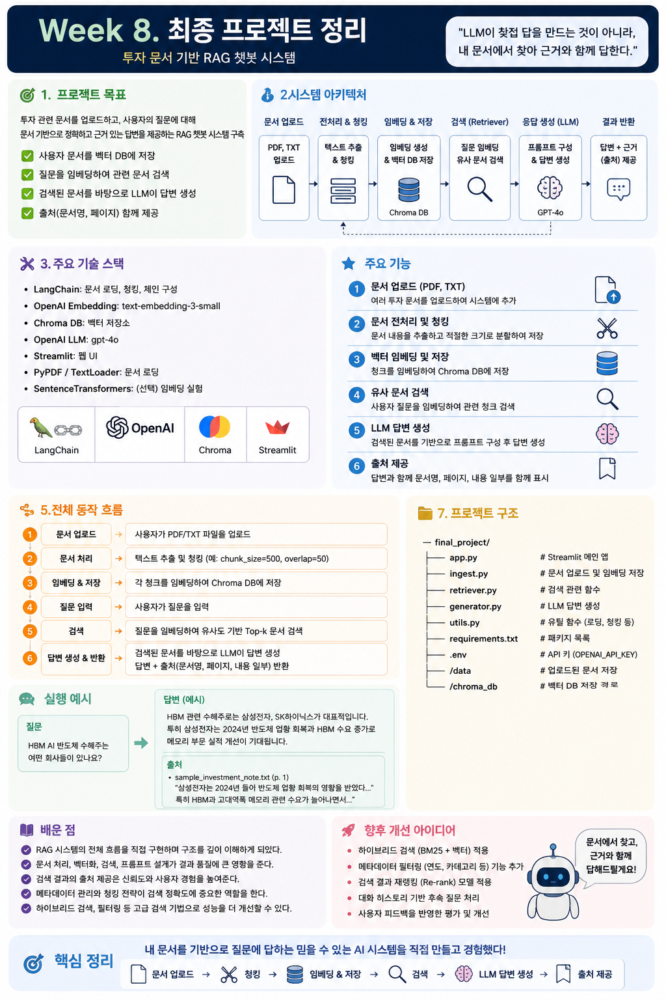

이번 주는 앞에서 만든 기능을 하나의 CLI 도구로 묶는 단계입니다. 목표는 학습용 예제를 넘어서, PDF와 메모와 웹 글을 추가하고 바로 질문할 수 있는 개인 투자 지식 베이스를 만드는 것입니다.

## 이번 주 목표
- 문서 추가, 목록 확인, 질문 기능을 하나의 CLI로 묶는다.
- PDF, TXT, URL 세 가지 소스를 하나의 벡터 DB에 적재한다.
- 중복 방지와 출처 추적까지 포함한 최소 운영 형태를 만든다.

## 핵심 개념
- **멀티 소스 인덱싱**: 여러 종류의 자료를 하나의 지식 베이스로 통합하는 방식
- **증분 업데이트**: 새 자료만 추가하고 기존 벡터 DB는 재사용하는 방식
- **중복 방지**: 같은 파일이나 URL을 다시 넣지 않도록 해시를 저장하는 방식
- **CLI 인터페이스**: `add`, `ask`, `list`처럼 터미널 명령으로 다루는 방식

## 이번 주 한눈에 보기



## 실습 순서

### 1. 패키지 설치
```bash
.\.venv\Scripts\activate
python -m pip install -U openai python-dotenv chromadb langchain langchain-classic langchain-text-splitters langchain-community langchain-openai langchain-chroma pypdf beautifulsoup4
```

### 2. 환경 변수 설정
`.env.example`를 참고해 `.env`를 만듭니다.
```text
OPENAI_API_KEY=<YOUR_OPENAI_API_KEY>
```

### 3. 문서 추가
```bash
python investment_kb.py add --file .\sample_investment_note.txt --category "샘플"
python investment_kb.py add --file ..\Week3\2024ltr.pdf --category "반도체"
```
확인할 것:
- 문서가 청크로 분리되어 DB에 추가되는지
- 같은 파일을 다시 넣으면 중복 추가를 막는지

```
python .\week8_investment_kb.py add --file .\sample_investment_note.txt --category "샘플"
USER_AGENT environment variable not set, consider setting it to identify your requests.
추가 완료: sample_investment_note.txt (2개 청크)

python .\week8_investment_kb.py add --file .\2024ltr.pdf --category "반도체"
USER_AGENT environment variable not set, consider setting it to identify your requests.
추가 완료: 2024ltr.pdf (89개 청크)
```

<details>
<summary> <b> GPT 추가설명 - 확인 방법 </b> </summary> <br/>

네, 맞아요. 확인 방법은 크게 **3가지**예요.

1. `add` 실행 결과 메시지 확인
2. `list` 명령어로 문서/청크 수 확인
3. 같은 파일을 한 번 더 `add` 해서 중복 방지 메시지 확인

폴더를 직접 열어볼 수도 있지만, **Chroma DB 폴더는 사람이 읽기 좋은 형태가 아니라서 직접 여는 것보다 명령어로 확인하는 게 훨씬 좋습니다.**

<h2> 1. 문서가 청크로 분리되어 DB에 추가되는지 확인 </h2>

예를 들어 TXT 파일을 추가한다고 하면:

```bash
python investment_kb.py add --file ..\Week3\sample_investment_note.txt --category "샘플"
```

정상적으로 추가되면 코드상으로 이런 식의 출력이 나와야 합니다.
업로드해주신 코드의 `add_document()` 함수는 문서를 청크로 나눈 뒤 `vectordb.add_documents(chunks)`로 DB에 넣고, 마지막에 추가된 청크 수를 출력하도록 되어 있습니다. 

```text
추가 완료: sample_investment_note.txt (3개 청크)
```

여기서 중요한 건 괄호 안입니다.

```text
(3개 청크)
```

이게 보이면:

> 아, 문서가 그냥 통째로 들어간 게 아니라 청크로 쪼개져서 들어갔구나

라고 확인하면 됩니다.

<h2> 2. `list`로 다시 확인 </h2>

그다음 바로 이 명령어를 실행해보세요.

```bash
python investment_kb.py list
```

예상 출력은 이런 느낌입니다.

```text
총 문서: 1개 | 총 청크: 3개

- [샘플] sample_investment_note.txt (txt, 3청크, 2026-05-05)
```

여기서 확인할 것은 두 가지예요.

```text
총 문서: 1개
총 청크: 3개
```

그리고 아래 문서 목록에:

```text
[샘플] sample_investment_note.txt (txt, 3청크, 날짜)
```

이렇게 나오면 정상입니다.

즉, **문서가 추가되었고, 청크 수까지 메타데이터에 저장되었다**고 보면 됩니다.

<h2> 3. 같은 파일을 다시 넣어서 중복 방지 확인 </h2>

아까 실행했던 명령어를 **그대로 한 번 더 실행**해보세요.

```bash
python investment_kb.py add --file ..\Week3\sample_investment_note.txt --category "샘플"
```

그러면 정상이라면 이런 메시지가 나와야 합니다.

```text
이미 추가된 문서입니다: sample_investment_note.txt
```

이 메시지가 나오면 중복 방지가 동작한 겁니다.

그다음 다시:

```bash
python investment_kb.py list
```

를 실행했을 때 문서 수와 청크 수가 증가하지 않아야 합니다.

예를 들어 처음에:

```text
총 문서: 1개 | 총 청크: 3개
```

였으면, 중복 추가 후에도 그대로:

```text
총 문서: 1개 | 총 청크: 3개
```

여야 합니다.

<h2> 직접 폴더를 열어서 확인해야 하나요? </h2>

꼭 그럴 필요는 없습니다.

`my_investment_kb/` 폴더는 Chroma 벡터 DB 저장 폴더라서 열어보면 파일들이 생기긴 하지만, 내용이 사람이 읽기 쉬운 형태는 아닙니다.

대신 이 파일은 열어봐도 괜찮습니다.

```text
kb_metadata.json
```

여기에는 문서 목록이 비교적 읽기 좋게 저장됩니다. 예를 들면:

```json
{
  "documents": [
    {
      "source_name": "sample_investment_note.txt",
      "category": "샘플",
      "doc_type": "txt",
      "chunks": 3,
      "added_date": "2026-05-05"
    }
  ],
  "total_chunks": 3
}
```

하지만 초보자 기준으로는 굳이 JSON 파일을 직접 열기보다는:

```bash
python investment_kb.py list
```

이걸로 확인하는 게 제일 깔끔합니다.

<h2> 정리하면 이렇게 확인하면 됩니다 </h2>

```bash
python investment_kb.py add --file ..\Week3\sample_investment_note.txt --category "샘플"
```

출력 확인:

```text
추가 완료: sample_investment_note.txt (N개 청크)
```

그다음:

```bash
python investment_kb.py list
```

출력 확인:

```text
총 문서: 1개 | 총 청크: N개
```

그다음 같은 add 명령어 다시 실행:

```bash
python investment_kb.py add --file ..\Week3\sample_investment_note.txt --category "샘플"
```

출력 확인:

```text
이미 추가된 문서입니다: sample_investment_note.txt
```

마지막으로 다시:

```bash
python investment_kb.py list
```

문서 수와 청크 수가 늘어나지 않았으면 성공입니다.

즉, **폴더를 직접 열기보다는 add 출력 → list 출력 → 같은 add 재실행 → list 재확인 순서로 보는 게 가장 좋습니다.**

</details> <br/>

바로 밑에 확인하는 게 있네?..

### 4. 목록 확인
```bash
python investment_kb.py list
```
확인할 것:
- 총 문서 수와 총 청크 수가 보이는지
- 카테고리와 추가 날짜가 함께 출력되는지

```
python .\week8_investment_kb.py list
USER_AGENT environment variable not set, consider setting it to identify your requests.

총 문서: 2개 | 총 청크: 91개

- [샘플] sample_investment_note.txt (txt, 2청크, 2026-05-05)
- [반도체] 2024ltr.pdf (pdf, 89청크, 2026-05-05)
```

<details>
<summary> <b> GPT 추가설명 (USER_AGENT) </b> </summary> <br/>

네, `USER_AGENT`는 이번에 새로 “필수 API 키”처럼 생긴 값은 아니고, **웹 페이지를 가져올 때 요청하는 프로그램이 자기 자신을 밝히는 이름표** 같은 값입니다.

지금 메시지는 오류가 아니라 경고입니다.

```text id="tds2fg"
USER_AGENT environment variable not set, consider setting it to identify your requests.
```

뜻은 대략 이거예요.

```text id="f1uak0"
웹 페이지를 가져오는 기능을 쓸 수도 있는데,
요청할 때 User-Agent 이름이 설정되어 있지 않습니다.
가능하면 설정해주세요.
```

LangChain의 `WebBaseLoader`는 HTML 웹페이지를 읽어서 LangChain 문서 형태로 가져오는 로더이고, 공식 문서에서도 `WebBaseLoader`가 웹 HTML을 로드하는 기능이라고 설명합니다.

<h2> 왜 <code>list</code>인데도 이 경고가 뜨나요? </h2>

지금 `list` 명령은 URL을 읽는 기능을 쓰지 않았죠.

그런데 코드 상단에 이런 import가 있습니다.

```python id="4xd9sf"
from langchain_community.document_loaders import PyPDFLoader, TextLoader, WebBaseLoader
```

여기서 `WebBaseLoader`를 import하는 순간, LangChain 쪽에서 `USER_AGENT` 설정이 없다고 경고를 띄우는 겁니다.

그래서 실제로 URL 추가를 안 했어도, `list`만 실행했는데 경고가 보일 수 있어요.

다만 아래 출력은 정상입니다.

```text id="vhthds"
총 문서: 2개 | 총 청크: 91개

- [샘플] sample_investment_note.txt (txt, 2청크, 2026-05-05)
- [반도체] 2024ltr.pdf (pdf, 89청크, 2026-05-05)
```

즉, **DB와 메타데이터는 잘 동작하고 있습니다.**

<h2> USER_AGENT에는 뭘 넣으면 되나요? </h2>

개인 실습용이면 이런 값이면 충분합니다.

```text id="m6hhqx"
USER_AGENT=investment-kb/0.1
```

조금 더 구체적으로 쓰고 싶으면:

```text id="y5l3y7"
USER_AGENT=ChocoBreezeInvestmentKB/0.1
```

보통 User-Agent는 이런 의미입니다.

```text id="21yj1t"
프로그램이름/버전
```

예를 들면:

```text id="681a29"
investment-kb/0.1
```

는 “investment-kb라는 프로그램의 0.1 버전입니다” 정도의 뜻이에요.

<h2> 그런데 <code>.env</code>에만 넣으면 바로 해결될까요? </h2>

현재 코드 구조에서는 **안 될 수도 있습니다.**

왜냐하면 코드가 대략 이런 순서이기 때문입니다.

```python id="57jbf6"
from dotenv import load_dotenv
from langchain_community.document_loaders import PyPDFLoader, TextLoader, WebBaseLoader

...

def main():
    load_dotenv()
```

즉, `WebBaseLoader`를 먼저 import한 다음에, 나중에 `load_dotenv()`를 실행합니다.

그래서 `.env`에 `USER_AGENT`를 적어도, 경고가 import 시점에 먼저 뜰 수 있습니다.

<h2> 가장 추천하는 수정 방법 </h2>

코드 상단을 이렇게 바꾸는 게 좋습니다.

기존:

```python id="yrghwp"
from dotenv import load_dotenv
from langchain_classic.chains import RetrievalQA
from langchain_text_splitters import RecursiveCharacterTextSplitter
from langchain_chroma import Chroma
from langchain_community.document_loaders import PyPDFLoader, TextLoader, WebBaseLoader
from langchain_openai import ChatOpenAI, OpenAIEmbeddings
```

수정:

```python id="6fe4w8"
from dotenv import load_dotenv

load_dotenv()

os.environ.setdefault("USER_AGENT", "investment-kb/0.1")

from langchain_classic.chains import RetrievalQA
from langchain_text_splitters import RecursiveCharacterTextSplitter
from langchain_chroma import Chroma
from langchain_community.document_loaders import PyPDFLoader, TextLoader, WebBaseLoader
from langchain_openai import ChatOpenAI, OpenAIEmbeddings
```

단, 이 코드를 쓰려면 `os`가 먼저 import되어 있어야 하니까 전체 상단은 이런 순서가 됩니다.

```python id="6q13at"
from __future__ import annotations

import argparse
import hashlib
import json
import os
from datetime import datetime
from pathlib import Path

from dotenv import load_dotenv

load_dotenv()
os.environ.setdefault("USER_AGENT", "investment-kb/0.1")

from langchain_classic.chains import RetrievalQA
from langchain_text_splitters import RecursiveCharacterTextSplitter
from langchain_chroma import Chroma
from langchain_community.document_loaders import PyPDFLoader, TextLoader, WebBaseLoader
from langchain_openai import ChatOpenAI, OpenAIEmbeddings
```

이렇게 하면 `WebBaseLoader`를 import하기 전에 `USER_AGENT`가 먼저 설정됩니다.

<h2> `.env`에도 추가하면 좋습니다 </h2>

`.env` 파일에는 이렇게 넣어두면 됩니다.

```text id="mtu6u4"
OPENAI_API_KEY=<YOUR_OPENAI_API_KEY>
USER_AGENT=investment-kb/0.1
```

그리고 위 코드의 이 줄은:

```python id="1mpo9b"
os.environ.setdefault("USER_AGENT", "investment-kb/0.1")
```

`.env`에 `USER_AGENT`가 있으면 그 값을 사용하고, 없으면 기본값으로 `investment-kb/0.1`을 넣어주는 역할입니다.

<h2> 정리 </h2>

지금 상황은 이렇게 보면 됩니다.

```text id="b75fww"
문서 추가됨? → 네, 정상
청크 생성됨? → 네, 총 91개
중복 방지 확인 가능? → 네, 같은 add 명령 다시 실행하면 됨
USER_AGENT 경고? → URL 로더 때문에 뜨는 경고, 치명적 오류 아님
```

따라서 지금은 **실습이 잘 진행되고 있는 상태**이고, 경고가 거슬리면 위처럼 `USER_AGENT`만 설정해주면 됩니다.

</details> <br/>


### 5. 질문하기
```bash
python investment_kb.py ask "반도체 업황 전망은?"
python investment_kb.py ask "삼성전자 실적" --category "반도체"

python investment_kb.py ask "버크셔 해서웨이의 2024년 주주서한에서 GEICO의 실적 개선에 대해 어떻게 설명하고 있나요?"
python investment_kb.py ask "버크셔 해서웨이의 2024년 주주서한에서 GEICO의 실적 개선에 대해 어떻게 설명하고 있나요?" --category "반도체"
```
확인할 것:
- 답변과 함께 참고 자료가 출력되는지
- 카테고리 필터가 검색 범위를 줄이는지

```
python .\week8_investment_kb.py ask "반도체 업황 전망은?"
USER_AGENT environment variable not set, consider setting it to identify your requests.

답변: 반도체 업황은 2024년 들어 회복세를 보이고 있으며, 특히 HBM과 고대역폭 메모리 관련 수요가 증가하고 있습니다. 이로 인해 메모리 부문에 대한 기대감이 커지고 있습니다. 그러나 스마트폰 출하량은 시장 경쟁 심화와 교체 수요 둔화의 영향을 받고 있어 모바일 부문은 프리미엄 제품 중심 전략으로 수익성을 방어하려는 흐름을 보이고 있습니다.

참고 자료:
- [샘플] sample_investment_note.txt p.?
- [반도체] 2024ltr.pdf p.8
- [반도체] 2024ltr.pdf p.8
- [반도체] 2024ltr.pdf p.9
```

```
python .\week8_investment_kb.py ask "버크셔 해서웨이의 2024년 주주서한에서 GEICO의 실적 개선에 대해 어떻게 설명하고 있나요?"
USER_AGENT environment variable not set, consider setting it to identify your requests.

답변: 버크셔 해서웨이의 2024년 주주서한에서는 GEICO의 실적 개선이 Todd Combs의 노력 덕분이라고 설명하고 있습니다. 그는 GEICO의 언더라이팅 관행을 현대화하고 효율성을 높이기 위해 열심히 일해왔으며, 그 결과 2024년에는 GEICO의 성과가 크게 향상되었다고 언급하고 있습니다. GEICO는 5년 동안 큰 변화를 겪었고, 이러한 개선이 보험 사업의 주요 수익 증가에 기여했다고 합니다.

참고 자료:
- [반도체] 2024ltr.pdf p.3
- [반도체] 2024ltr.pdf p.3
- [반도체] 2024ltr.pdf p.3
- [반도체] 2024ltr.pdf p.4
```
```
python .\week8_investment_kb.py ask "버크셔 해서웨이의 2024년 주주서한에서 GEICO의 실적 개선에 대해 어떻게 설명하고 있나요?" --category "반도체"

답변: 버크셔 해서웨이의 2024년 주주서한에서는 GEICO의 실적 개선이 Todd Combs의 노력 덕분이라고 설명하고 있습니다. 그는 GEICO의 언더라이팅 관행을 현대화하고 효율성을 높이기 위해 열심히 일해왔으며, 그 결과 2024년의 개선이 매우 인상적이었다고 언급하고 있습니다. GEICO는 주요 손실 사건이 발생하지 않은 2024년에 큰 수익 증가를 기록했으며, 이는 보험 사업의 성과를 이끌어낸 중요한 요소로 보입니다.

참고 자료:
- [반도체] 2024ltr.pdf p.3
- [반도체] 2024ltr.pdf p.3
- [반도체] 2024ltr.pdf p.3
- [반도체] 2024ltr.pdf p.4
```

<details>
<summary> <b> GPT 추가설명 </b> </summary> <br/>

네, 결과는 **정상적으로 나온 것**으로 보면 됩니다.

<h2> 1. PDF 검색은 잘 되고 있어요 </h2>

두 결과 모두 참고 자료가 이렇게 나왔죠.

```text
- [반도체] 2024ltr.pdf p.3
- [반도체] 2024ltr.pdf p.3
- [반도체] 2024ltr.pdf p.3
- [반도체] 2024ltr.pdf p.4
```

이 말은 질문과 관련 있는 청크를 **2024ltr.pdf의 3~4페이지에서 찾아왔다**는 뜻입니다.
따라서 `ask` 명령이 PDF 안의 내용을 검색하고, 그 내용을 바탕으로 답변까지 생성하는 흐름은 잘 작동하고 있습니다.

즉, 이 확인 항목은 성공입니다.

```text
답변과 함께 참고 자료가 출력되는지 → 성공
```

<h2> 2. 카테고리 필터도 일단 정상으로 보입니다 </h2>

첫 번째 질문은 카테고리 필터 없이 실행했습니다.

```bash
python investment_kb.py ask "버크셔 해서웨이의 2024년 주주서한에서 GEICO의 실적 개선에 대해 어떻게 설명하고 있나요?"
```

두 번째 질문은 `--category "반도체"`를 붙였습니다.

```bash
python investment_kb.py ask "버크셔 해서웨이의 2024년 주주서한에서 GEICO의 실적 개선에 대해 어떻게 설명하고 있나요?" --category "반도체"
```

두 결과가 거의 같은 이유는, 현재 버크셔 PDF가 `[반도체]` 카테고리로 저장되어 있기 때문입니다.

현재 저장 목록이 이랬죠.

```text
- [샘플] sample_investment_note.txt
- [반도체] 2024ltr.pdf
```

GEICO 질문과 관련 있는 내용은 당연히 `2024ltr.pdf`에 있고, 그 PDF의 카테고리가 `[반도체]`이기 때문에 필터를 걸어도 같은 PDF가 검색됩니다.

그래서 결과가 비슷하게 나오는 게 자연스럽습니다.

<h2> 3. 참고 자료가 p.3만 여러 번 나오는 것도 이상한 건 아니에요 </h2>

```text
- [반도체] 2024ltr.pdf p.3
- [반도체] 2024ltr.pdf p.3
- [반도체] 2024ltr.pdf p.3
- [반도체] 2024ltr.pdf p.4
```

이건 같은 페이지 안에 여러 청크가 있기 때문입니다.

코드에서 청크를 이렇게 나누고 있죠. 

```python
chunk_size=500
chunk_overlap=50
```

즉, PDF 한 페이지가 여러 개의 500자짜리 청크로 나뉠 수 있습니다.
그래서 검색 결과 4개를 가져오면, 그중 3개가 같은 3페이지에서 나온 청크일 수 있어요.

이건 오류가 아니라 **청킹 방식 때문에 생기는 정상적인 현상**입니다.

<h2> 4. 카테고리 필터가 진짜 작동하는지 더 확실히 보려면 </h2>

일부러 다른 카테고리로 검색해보면 됩니다.

예를 들어 `2024ltr.pdf`는 `[반도체]`로 저장되어 있고, `sample_investment_note.txt`는 `[샘플]`로 저장되어 있으니까 이렇게 해보세요.

```bash
python investment_kb.py ask "버크셔 해서웨이의 2024년 주주서한에서 GEICO의 실적 개선에 대해 어떻게 설명하고 있나요?" --category "샘플"
```

정상이라면 PDF가 검색 범위에서 빠지기 때문에 답변 품질이 확 떨어지거나, 자료에서 찾기 어렵다는 식으로 나올 가능성이 큽니다.

반대로 이건 잘 나와야 합니다.

```bash
python investment_kb.py ask "버크셔 해서웨이의 2024년 주주서한에서 GEICO의 실적 개선에 대해 어떻게 설명하고 있나요?" --category "반도체"
```

그래서 카테고리 필터 확인은 이렇게 정리하면 좋습니다.

```text
--category "반도체" → 2024ltr.pdf 검색됨
--category "샘플" → 2024ltr.pdf 검색되지 않아야 함
```

<h2> 결과 판정 </h2>

현재 결과는 이렇게 보면 됩니다.

```text
PDF가 DB에 들어갔는가? → 예
PDF가 청크로 검색되는가? → 예
ask 명령으로 답변이 생성되는가? → 예
참고 자료가 출력되는가? → 예
카테고리 필터가 적용되는가? → 반도체 필터에서는 정상적으로 검색됨
```

다만 카테고리 이름은 나중에 바꾸는 게 좋아요.
`2024ltr.pdf`는 버크셔 해서웨이 주주서한이니까 `[반도체]`보다는 `[미국주식]`, `[버크셔]`, `[투자서한]` 같은 카테고리가 더 자연스럽습니다.

</details> <br/>

```
python .\week8_investment_kb.py ask "버크셔 해서웨이의 2024년 주주서한에서 GEICO의 실적 개선에 대해 어떻게 설명하고 있나요?" --category "샘플"

답변: 죄송하지만, 버크셔 해서웨이의 2024년 주주서한 내용에 대해서는 알지 못합니다.

참고 자료:
- [샘플] sample_investment_note.txt p.?
- [샘플] sample_investment_note.txt p.?
```

<details>
<summary> <b> GPT 추가설명 - Chroma DB 수정? </b> </summary> <br/>

네, **가능합니다.**
다만 지금 코드 상태에서는 “수정하기 편하게 저장”되어 있지는 않아서, 나중에 기능을 추가하려면 구조를 조금 바꾸는 게 좋아요.

핵심은 이겁니다.

> Chroma DB는 저장된 데이터의 `metadata`, `document`, `embedding`을 수정할 수 있습니다.
> 그런데 수정하려면 보통 **수정할 청크의 ID**를 알아야 합니다.

Chroma 공식 문서에서도 collection의 record는 `.update()`로 `ids`, `embeddings`, `metadatas`, `documents`를 업데이트할 수 있다고 설명합니다. 또 `.upsert()`를 쓰면 기존 ID가 있으면 수정하고, 없으면 새로 추가할 수 있습니다.  
LangChain의 `langchain_chroma.Chroma`에도 `update_documents` 메서드가 있고, 문서 ID 목록과 수정된 `Document` 객체 목록을 받아 업데이트하는 구조입니다.

<h2> 그런데 지금 코드에서는 왜 바로 어렵냐면 </h2>

현재 코드는 청크를 만든 다음 이렇게 저장하고 있습니다.

```python
vectordb.add_documents(chunks)
```

이 방식은 청크들을 Chroma에 추가하긴 하지만, **각 청크의 고유 ID를 코드에서 직접 지정하거나 따로 저장하지 않습니다.** 그래서 나중에 “2024ltr.pdf의 청크들만 찾아서 category를 버크셔로 바꿔줘”를 하려면 조금 번거로워집니다. 지금 코드에서는 청크에 `chunk_id` 메타데이터는 붙이고 있지만, 이것은 Chroma record의 실제 ID가 아니라 메타데이터에 들어간 번호일 뿐입니다. 

즉, 현재 구조는 이렇게 되어 있어요.

```text
청크 내용 → Chroma DB에 저장됨
청크 metadata → category, added_date, doc_type, source_name, chunk_id 저장됨
하지만 Chroma 내부 ID → 따로 관리하지 않음
```

그래서 **처음부터 안정적인 ID를 만들어서 저장하는 구조**로 바꾸는 게 좋습니다.

<h2> 나중에 수정 기능까지 생각하면 이렇게 저장하는 게 좋아요 </h2>

예를 들어 문서를 추가할 때 청크마다 이런 ID를 직접 만들 수 있습니다.

```python
chunk_ids = [
    f"{source_hash}_{index}"
    for index in range(len(chunks))
]
```

그러면 `2024ltr.pdf`가 해시값 `abc123`이고 청크가 89개라면 ID가 이런 식으로 생깁니다.

```text
abc123_0
abc123_1
abc123_2
...
abc123_88
```

그리고 저장할 때 이렇게 합니다.

```python
vectordb.add_documents(chunks, ids=chunk_ids)
```

이렇게 하면 나중에 특정 문서의 청크 ID들을 다시 만들 수 있어요.

```python
ids = [
    f"{source_hash}_{index}"
    for index in range(chunk_count)
]
```

그러면 해당 문서의 청크들만 수정하거나 삭제하기가 쉬워집니다.

<h2> 카테고리 수정 기능은 보통 이렇게 만듭니다 </h2>

가장 안전한 방식은 두 가지입니다.

<h3> 방법 1. 기존 청크 삭제 후, 새 카테고리로 다시 추가 </h3>

이게 초보자에게 제일 이해하기 쉽고 안전합니다.

흐름은 이렇습니다.

```text
1. kb_metadata.json에서 해당 문서 찾기
2. 해당 문서의 hash와 chunk 수 확인
3. chunk ID 목록 만들기
4. Chroma DB에서 해당 ID 청크들 삭제
5. 같은 파일을 새 카테고리로 다시 로드
6. 다시 청킹
7. 새 카테고리 metadata를 붙여서 Chroma DB에 추가
8. kb_metadata.json도 새 카테고리로 수정
```

Chroma는 `.delete()`로 ID 기반 삭제를 지원하며, 삭제하면 해당 ID의 embedding, document, metadata가 같이 삭제된다고 공식 문서에 설명되어 있습니다. ([docs.trychroma.com][3])

이 방식은 “수정”이라기보다 “삭제 후 재등록”이지만, RAG 실습에서는 가장 단순하고 실수도 적습니다.

<h3> 방법 2. Chroma metadata만 직접 업데이트 </h3>

이론적으로는 카테고리만 바꿀 수도 있습니다.

예를 들어 Chroma의 lower-level collection을 사용하면 이런 식의 개념입니다.

```python
vectordb._collection.update(
    ids=chunk_ids,
    metadatas=new_metadatas,
)
```

Chroma 공식 문서 기준으로 `.update()`는 record의 metadata, document, embedding 등을 ID 기준으로 업데이트할 수 있습니다. ([docs.trychroma.com][1])

다만 이 방식은 주의가 필요합니다.
기존 metadata 전체를 유지하면서 `category`만 바꾸려면, 기존 metadata를 먼저 가져오고 그 안에서 category만 바꾼 뒤 다시 넣어야 합니다. 잘못하면 `source_name`, `page`, `doc_type` 같은 기존 메타데이터가 사라질 수 있어요.

그래서 초보자용 프로젝트에서는 **방법 1: 삭제 후 재등록**이 더 낫습니다.

<h2> 지금 코드에 추가한다면 어떤 명령어가 생기면 좋을까요? </h2>

나중에 이런 명령을 만들 수 있습니다.

```bash
python week8_investment_kb.py update-category --source-name 2024ltr.pdf --category "버크셔"
```

또는 더 단순하게:

```bash
python week8_investment_kb.py recategorize --source-name 2024ltr.pdf --category "버크셔"
```

그러면 내부에서는:

```text
2024ltr.pdf 찾기
→ 기존 청크 삭제
→ 새 카테고리로 다시 추가
→ metadata 업데이트
```

이렇게 처리하게 만들면 됩니다.

<h2> 결론 </h2>

가능합니다. 다만 지금 코드에서는 “추가”와 “질문” 위주로만 되어 있어서 바로 수정 기능은 없고, 나중에 수정 기능을 넣으려면 **청크 ID를 직접 관리하는 구조**로 바꾸는 게 좋습니다.

정리하면:

```text
Chroma DB 내용 수정 가능? → 가능
metadata/category 수정 가능? → 가능
지금 코드에서 바로 쉽게 가능? → 조금 어려움
왜? → 청크 ID를 직접 저장하지 않았기 때문
추천 방식 → 청크 ID를 직접 만들고, 삭제 후 재등록 방식으로 update-category 구현
```

지금 단계에서는 그냥 DB 삭제 후 재추가가 편하고, 실제 운영형으로 확장할 때는 `delete`, `update-category`, `rebuild` 명령을 추가하면 훨씬 깔끔해집니다.

</details> <br/>

### 6. URL 추가도 시도
```bash
python investment_kb.py add --url https://example.com/article --category "경제뉴스"
python investment_kb.py add --url https://www.hankyung.com/article/2026050328911 --category "경제뉴스"
```
실제 기사 링크: https://www.hankyung.com/article/2026050328911

```
python .\week8_investment_kb.py add --url https://www.hankyung.com/article/2026050328911 --category "경제뉴스"
추가 완료: https://www.hankyung.com/article/2026050328911 (20개 청크)
```

```
python .\week8_investment_kb.py ask "양자컴퓨터 관련기사가 있나요?" --category "경제뉴스"

답변: 네, 양자컴퓨터 관련 기사들이 있습니다. 최근 엔비디아의 CEO인 젠슨 황이 양자컴퓨팅 전용 인공지능(AI) 모델을 발표했으며, 양자컴퓨팅 사업을 본격화하고 있습니다. 또한, 골드만삭스는 양자컴퓨팅 기술 개발 조직을 해체한 소식도 전해졌습니다. 현재 양자컴퓨팅 기술로는 투자 수익률을 의미 있게 높이기 어려운 상황이라는 연구 결과도 있습니다. 경상북도에서는 양자컴퓨팅과 AI를 결합한 차세대 데이터 인프라를 구축할 계획도 있습니다.

참고 자료:
- [경제뉴스] https://www.hankyung.com/article/2026050328911 p.?
- [경제뉴스] https://www.hankyung.com/article/2026050328911 p.?
- [경제뉴스] https://www.hankyung.com/article/2026050328911 p.?
- [경제뉴스] https://www.hankyung.com/article/2026050328911 p.?
```

<details>
<summary> <b> GPT 추가설명 - 어떻게 가져오는가? </b> </summary> <br/>

네, 이건 꽤 중요한 부분이에요.
URL을 추가할 때는 **기사 API를 따로 쓰는 게 아니라**, 코드 안의 `WebBaseLoader`가 해당 URL에 접속해서 **HTML 페이지를 받아오고, 그 안의 텍스트를 LangChain Document로 바꾸는 방식**입니다.

지금 실행한 명령은:

```bash id="wv8y5u"
python .\week8_investment_kb.py add --url https://www.hankyung.com/article/2026050328911 --category "경제뉴스"
```

코드 흐름으로 보면 이렇게 갑니다.

```text id="chcfj6"
--url 입력
↓
add_document(url, "경제뉴스", "url") 실행
↓
WebBaseLoader(url).load() 실행
↓
웹페이지 HTML 가져오기
↓
HTML 안의 텍스트를 Document로 변환
↓
청크로 나누기
↓
임베딩 생성
↓
Chroma DB에 저장
```

업로드해주신 코드에서도 URL인 경우 `doc_type`을 `"url"`로 넘기고, `load_documents()` 안에서 `WebBaseLoader(source).load()`를 실행하도록 되어 있습니다. 

<h2> 핵심은 이 줄입니다 </h2>

```python id="uyda87"
return WebBaseLoader(source).load()
```

이 줄이 하는 일은 쉽게 말하면:

> “이 URL에 접속해서 웹페이지 내용을 가져오고, 그 내용을 LangChain이 다룰 수 있는 Document 형태로 바꿔줘.”

입니다.

LangChain 공식 문서에서도 `WebBaseLoader`는 HTML 웹페이지의 텍스트를 가져와 downstream 작업에 쓸 수 있는 문서 형식으로 로드한다고 설명합니다. ([LangChain Docs][1])

<h2> 브라우저처럼 화면을 보는 건 아니에요 </h2>

여기서 주의할 점은, `WebBaseLoader`가 사람이 크롬으로 기사를 보는 것처럼 완전한 브라우저를 띄우는 건 아닙니다.

대략 이런 방식에 가깝습니다.

```text id="go5jlo"
Python이 URL로 요청을 보냄
↓
서버가 HTML 응답을 줌
↓
HTML에서 텍스트를 뽑음
↓
LangChain Document로 만듦
```

LangChain 문서에서도 `WebBaseLoader`는 JS support가 없는 것으로 표시되어 있고, 웹사이트 크롤링, JS 차단 우회, 데이터 정제까지 신경 쓰고 싶지 않다면 다른 로더를 고려하라고 설명합니다. ([LangChain Docs][1])

그래서 이 방식은 **정적인 HTML 안에 기사 본문이 들어 있는 사이트**에서는 잘 됩니다.
하지만 아래 같은 경우에는 제대로 못 가져올 수도 있어요.

```text id="ryx5nu"
- 로그인이 필요한 기사
- 유료 기사
- JavaScript 실행 후 본문이 나타나는 사이트
- 봇 요청을 차단하는 사이트
- HTML 안에 광고, 메뉴, 댓글 등이 많이 섞인 사이트
```

<h2> 그럼 이번 한경 기사는 왜 20개 청크가 생겼나요? </h2>

이 출력이 나왔죠.

```text id="fv06nu"
추가 완료: https://www.hankyung.com/article/2026050328911 (20개 청크)
```

이 말은 `WebBaseLoader`가 해당 URL에서 텍스트를 가져오는 데 성공했고, 그 텍스트를 `RecursiveCharacterTextSplitter`가 20개 조각으로 나눴다는 뜻입니다.

현재 코드의 청크 설정은 이렇습니다.

```python id="cmv4sf"
chunk_size=500
chunk_overlap=50
```

즉, 대략 **500자 단위로 자르되, 앞뒤 청크가 50자씩 겹치게** 나눕니다. 그래서 기사 본문뿐 아니라 사이트의 제목, 메뉴, 관련 문구 등이 같이 들어왔다면 청크 수가 꽤 늘어날 수 있어요.

<h2> 실제로 어떤 텍스트를 가져왔는지 확인하고 싶으면 </h2>

가장 쉬운 방법은 `add_document()` 함수 안에서 이 줄 바로 아래에:

```python id="gz25mw"
docs = load_documents(source_value, doc_type)
```

이 코드를 잠깐 추가해보는 겁니다.

```python id="27a2gg"
print("\n=== 로드된 문서 확인 ===")
for i, doc in enumerate(docs):
    print(f"\n[Document {i}]")
    print("metadata:", doc.metadata)
    print("content preview:")
    print(doc.page_content[:1000])
```

그러면 URL 추가할 때 실제로 가져온 텍스트 앞부분이 출력됩니다.

예를 들어 위치는 이런 느낌입니다.

```python id="fp1jlt"
docs = load_documents(source_value, doc_type)

print("\n=== 로드된 문서 확인 ===")
for i, doc in enumerate(docs):
    print(f"\n[Document {i}]")
    print("metadata:", doc.metadata)
    print("content preview:")
    print(doc.page_content[:1000])

added_date = datetime.now().strftime("%Y-%m-%d")
```

확인 끝나면 이 디버그 코드는 지워도 됩니다.

<h2> 정리하면 </h2>

지금 URL 추가는 이렇게 된 겁니다.

```text id="lwkewk"
한경 기사 URL 입력
↓
WebBaseLoader가 URL에 접속
↓
HTML 텍스트를 가져옴
↓
LangChain Document로 변환
↓
category, added_date, doc_type, source_name 메타데이터 추가
↓
500자 단위 청크 20개 생성
↓
OpenAI 임베딩 모델로 벡터화
↓
Chroma DB에 저장
↓
kb_metadata.json에 문서 정보 저장
```

그래서 지금 결과는 정상이에요.
다만 `WebBaseLoader`는 “기사 본문만 깔끔하게 추출하는 전용 뉴스 크롤러”라기보다는 **웹페이지 전체 텍스트를 가져오는 기본 로더**에 가깝습니다. 나중에 더 정확하게 만들고 싶으면 `BeautifulSoup`으로 `article` 태그나 특정 CSS 선택자만 뽑는 방식으로 개선하면 됩니다.

</details> <br/>

## 파일 설명
- `investment_kb.py`: 문서 추가, 질문, 목록 확인을 담당하는 최종 CLI
- `.env.example`: 필요한 환경 변수 예시
- `my_investment_kb/`: 실행 후 생성되는 Chroma 저장 폴더
- `kb_metadata.json`: 중복 방지와 문서 목록 관리를 위한 메타데이터 파일

## 실습 후 직접 답해보기
- 왜 최종 단계에서는 예제 스크립트보다 CLI 형태가 더 실용적일까?
  - 여기서 말하는 예제 스크립트는 지금까지 Week 1~7에서 만들었던 것처럼, 특정 기능 하나를 연습하기 위해 만든 단일 Python 파일을 말해요. (주차별 실습 파일)
- 중복 방지와 메타데이터 관리가 없으면 어떤 운영 문제가 생길까?
- 카테고리 필터는 실제 투자 자료 검색에서 어떤 식으로 도움이 될까?

<details>
<summary> <b> GPT 추가설명 </b> </summary> <br/>

- 왜 최종 단계에서는 예제 스크립트보다 CLI 형태가 더 실용적일까?
  - 여기서 말하는 예제 스크립트는 지금까지 Week 1~7에서 만들었던 것처럼, 특정 기능 하나를 연습하기 위해 만든 단일 Python 파일을 말해요. (주차별 실습 파일)
  - 해당 스크립트 파일들은 세부 기능만을 확인 가능하지 데이터 추가, 수정 그리고 답변을 하는 기능이 없다.
- 중복 방지와 메타데이터 관리가 없으면 어떤 운영 문제가 생길까?
  - 중복 방지가 되어 있지 않으면 우선순위가 높은 순서로 검색했을 때 같은 참고 데이터만 가져와서 답변 생성에 한계가 생긴다.
  - 메타데이터를 잘못 관리하면 찾을 수 있는 데이터를 못 찾을 수 있다.
- 카테고리 필터는 실제 투자 자료 검색에서 어떤 식으로 도움이 될까?
  - 기존에 나눠서 정리하는 만큼 검색 시에도 나눠서 검색을 함으로써 빠른 검색이 가능해진다.

---

좋아요. 전체 방향은 **잘 잡으셨어요.**
다만 몇 군데는 표현을 조금만 바꾸면 더 정확해집니다.

특히 첫 번째 답변에서 **“데이터 추가, 수정 그리고 답변”** 이라고 쓰셨는데, 현재 Week 8 코드에는 **수정 기능은 아직 없습니다.**
그래서 “추가, 목록 확인, 질문”이라고 쓰는 게 더 정확해요.

아래처럼 다듬으면 좋습니다.

- 왜 최종 단계에서는 예제 스크립트보다 CLI 형태가 더 실용적일까?
  - 여기서 말하는 예제 스크립트는 지금까지 Week 1~7에서 만들었던 것처럼, 특정 기능 하나를 연습하기 위해 만든 단일 Python 파일을 의미한다.
  - 예제 스크립트는 청킹, 벡터 DB 저장, 검색, 답변 생성 등 각각의 세부 기능을 확인하는 데 적합하지만, 실제로 여러 자료를 반복적으로 추가하고 질문하기에는 불편하다.
  - 반면 CLI 형태는 `add`, `list`, `ask` 명령어를 통해 문서 추가, 목록 확인, 질문 기능을 터미널에서 바로 실행할 수 있으므로, 매번 코드를 수정하지 않아도 되어 더 실용적이다.

- 중복 방지와 메타데이터 관리가 없으면 어떤 운영 문제가 생길까?
  - 중복 방지가 되어 있지 않으면 같은 문서가 여러 번 저장되어 검색 결과에 동일하거나 비슷한 청크가 반복해서 나타날 수 있다.
  - 이 경우 다양한 참고 자료를 활용하지 못하고, 같은 자료에 치우친 답변이 생성될 수 있으며, 저장 공간과 임베딩 비용도 불필요하게 증가한다.
  - 또한 메타데이터 관리가 제대로 되지 않으면 문서의 출처, 카테고리, 추가 날짜, 청크 수 등을 확인하기 어렵고, 카테고리 필터 검색도 정확하게 작동하지 않을 수 있다.

- 카테고리 필터는 실제 투자 자료 검색에서 어떤 식으로 도움이 될까?
  - 투자 자료는 반도체, 경제뉴스, 기업분석, 주주서한 등 다양한 주제로 나뉘기 때문에 전체 자료를 한 번에 검색하면 질문과 관련 없는 자료가 함께 검색될 수 있다.
  - 카테고리 필터를 사용하면 특정 주제의 자료만 검색 대상으로 제한할 수 있어, 검색 범위를 줄이고 질문과 더 관련성 높은 참고 자료를 가져올 수 있다.
  - 예를 들어 버크셔 해서웨이 주주서한에 대해 질문할 때 해당 자료의 카테고리만 검색하면, 다른 경제뉴스나 샘플 문서가 섞이는 것을 줄일 수 있다.

<h2> 사용자님 원래 답변에서 좋은 부분 </h2>

“예제 스크립트 = Week 1~7의 주차별 실습 파일”이라고 이해하신 건 맞습니다.

그리고 중복 방지 부분에서:

```text id="f49qex"
같은 참고 데이터만 가져와서 답변 생성에 한계가 생긴다.
```

이 표현도 좋아요. 실제 RAG에서 중복 청크가 많으면 검색 결과가 다양하지 못해지는 문제가 생깁니다.

다만 마지막 답변의:

```text id="8lkw0l"
빠른 검색이 가능해진다.
```

도 틀린 말은 아니지만, 이 실습에서는 “속도”보다 **검색 범위를 줄이고 관련성을 높인다**는 쪽이 더 핵심입니다. 그래서 “빠른 검색”보다는 “더 정확한 검색” 또는 “관련성 높은 검색”이라고 쓰는 게 더 좋습니다.

</details> <br/>

## 추천 자료
- [argparse 공식 문서](https://docs.python.org/ko/3/library/argparse.html)
- [python-dotenv](https://pypi.org/project/python-dotenv/)
- [Machine Learning Mastery - Simple RAG App](https://www.machinelearningmastery.com/building-a-simple-rag-application-using-llamaindex/)

## 완료 기준
- [x] `python investment_kb.py add --file ...` 로 문서를 추가했다
- [ ] 같은 파일을 다시 추가했을 때 중복 방지가 동작하는 것을 확인했다
- [x] `python investment_kb.py list` 로 저장된 문서를 확인했다
- [x] `python investment_kb.py ask ...` 로 질문하고 출처를 확인했다
- [x] 카테고리 필터가 동작하는 것을 확인했다
