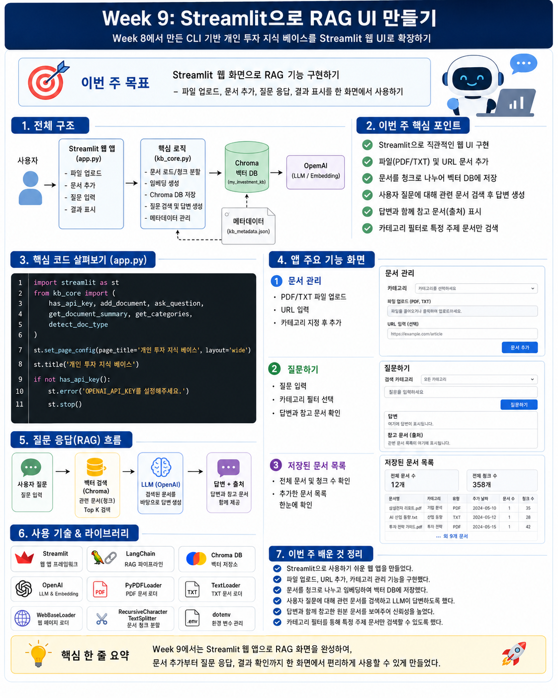
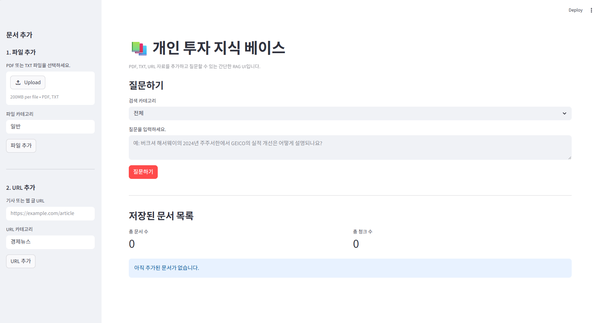

이번 주는 Week 8에서 만든 CLI 기반 개인 투자 지식 베이스를 Streamlit을 사용해 간단한 웹 UI로 확장하는 단계입니다.  
목표는 터미널 명령어로 사용하던 `add`, `list`, `ask` 기능을 웹 화면에서 사용할 수 있도록 만드는 것입니다.

## 이번 주 목표

- Streamlit의 기본 사용법을 익힌다.
- Week 8에서 만든 RAG 기능을 UI와 연결한다.
- PDF, TXT, URL 자료를 화면에서 추가할 수 있게 만든다.
- 저장된 문서 목록을 화면에서 확인한다.
- 질문을 입력하면 답변과 참고 자료가 화면에 출력되도록 만든다.

## 핵심 개념

- <strong>Streamlit</strong>: Python 코드만으로 간단한 웹 앱을 만들 수 있는 라이브러리
- <strong>파일 업로드 UI</strong>: 사용자가 PDF 또는 TXT 파일을 화면에서 업로드하는 기능
- <strong>URL 입력 UI</strong>: 웹 기사 URL을 입력해 지식 베이스에 추가하는 기능
- <strong>질문 입력 UI</strong>: 사용자의 질문을 입력받고 RAG 답변을 출력하는 기능
- <strong>카테고리 선택</strong>: 특정 카테고리 자료만 검색하도록 범위를 제한하는 기능
- <strong>참고 자료 출력</strong>: 답변 생성에 사용된 원본 문서 정보를 함께 보여주는 기능

## 이번 주 한눈에 보기



## 추천 파일 구조

```text
Week9/
├─ app.py
├─ kb_core.py
├─ .env
├─ uploaded_files/
├─ my_investment_kb/
└─ kb_metadata.json
```

### 파일 설명

* `app.py`: Streamlit 화면을 구성하는 파일
* `kb_core.py`: 문서 추가, 질문, 목록 확인 등 RAG 핵심 기능을 모아둔 파일
* `.env`: OpenAI API Key와 환경 변수를 저장하는 파일
* `uploaded_files/`: 사용자가 업로드한 파일을 임시로 저장하는 폴더
* `my_investment_kb/`: Chroma 벡터 DB 저장 폴더
* `kb_metadata.json`: 문서 목록, 카테고리, 청크 수, 중복 방지 정보를 저장하는 파일

## 실습 순서
### 1. 패키지 설치

```bash
pip install streamlit
```
기존 Week 8 패키지까지 함께 설치해야 한다면 다음과 같이 설치합니다.

```bash
pip install openai python-dotenv chromadb langchain langchain-classic langchain-text-splitters langchain-community langchain-openai langchain-chroma pypdf beautifulsoup4 streamlit
```

너무 많으면 나눠서 설치 + `-v` 옵션 
```bash
python -m pip install -U streamlit python-dotenv -v
python -m pip install -U openai langchain-openai -v
python -m pip install -U chromadb langchain-chroma -v
python -m pip install -U langchain langchain-classic langchain-text-splitters langchain-community pypdf beautifulsoup4 -v
```

### 2. Streamlit 기본 화면 만들기
먼저 RAG 기능을 연결하기 전에 기본 화면만 만들어봅니다.

확인할 내용:

* 앱 제목이 표시되는지
* 텍스트 입력창이 나타나는지
* 버튼을 클릭했을 때 반응이 있는지
* 사이드바가 정상적으로 보이는지

사용할 주요 기능:

```python
st.title()
st.write()
st.text_input()
st.button()
st.sidebar()
```

실행 명령어:

```bash
streamlit run app.py
```



> 엄청 예쁘게 되어 있음.

### 3. Week 8 코드 기능 분리하기
Week 8에서는 하나의 CLI 파일 안에 문서 추가, 질문, 목록 확인 기능이 모두 들어 있었습니다.

Week 9에서는 UI에서 이 기능들을 호출해야 하므로 핵심 기능을 `kb_core.py`로 분리합니다.

분리할 주요 함수:

* `add_document()`
* `ask_question()`
* `list_documents()`
* `load_metadata()`
* `save_metadata()`
* `get_vectordb()`

주의할 점:

Week 8 코드에서는 결과를 `print()`로 출력했습니다.
하지만 Streamlit에서는 화면에 출력해야 하므로, 함수가 결과를 `return`하도록 바꾸는 것이 좋습니다.

예시:

```python
# Week 8 방식
print(f"추가 완료: {source_name} ({len(chunks)}개 청크)")

# Week 9 방식
return {
    "source_name": source_name,
    "chunk_count": len(chunks),
    "message": f"추가 완료: {source_name} ({len(chunks)}개 청크)",
}
```

### 4. 파일 업로드 기능 만들기
화면에서 PDF 또는 TXT 파일을 업로드하고, 카테고리를 입력한 뒤 벡터 DB에 추가합니다.

화면 구성:

* 파일 업로드 버튼
* 카테고리 입력창
* 문서 추가 버튼
* 추가 성공 또는 중복 안내 메시지

사용할 주요 기능:

```python
st.file_uploader()
st.text_input()
st.button()
st.success()
st.warning()
st.error()
```

내부 흐름:

```text
파일 업로드
↓
uploaded_files/ 폴더에 저장
↓
파일 확장자 확인
↓
PDF 또는 TXT로 구분
↓
add_document() 호출
↓
Chroma DB에 저장
↓
성공 메시지 출력
```

확인할 것:

* PDF 파일이 업로드되는지
* TXT 파일이 업로드되는지
* 업로드한 파일이 벡터 DB에 추가되는지
* 같은 파일을 다시 추가했을 때 중복 방지가 되는지

### 5. URL 추가 기능 만들기

웹 기사 URL을 입력하고 카테고리를 지정해 지식 베이스에 추가합니다.

화면 구성:

* URL 입력창
* 카테고리 입력창
* URL 추가 버튼
* 추가 결과 메시지

내부 흐름:

```text
URL 입력
↓
add_document(url, category, "url") 호출
↓
WebBaseLoader가 웹페이지 HTML 텍스트 로드
↓
텍스트를 청크로 분리
↓
임베딩 생성
↓
Chroma DB에 저장
```

주의할 점:

`WebBaseLoader`는 웹페이지의 HTML 텍스트를 가져오는 기본 로더입니다.
따라서 로그인 기사, 유료 기사, JavaScript로 본문을 불러오는 페이지는 제대로 가져오지 못할 수 있습니다.

### 6. 질문 기능 만들기

사용자가 질문을 입력하면 벡터 DB에서 관련 청크를 검색하고, LLM이 답변을 생성하도록 만듭니다.

화면 구성:

* 질문 입력창
* 카테고리 선택 또는 전체 검색 옵션
* 질문하기 버튼
* 답변 출력 영역
* 참고 자료 출력 영역

내부 흐름:

```text
질문 입력
↓
카테고리 필터 확인
↓
Chroma DB에서 관련 청크 검색
↓
검색된 청크를 바탕으로 답변 생성
↓
답변 출력
↓
참고 자료 출력
```

Week 8의 `ask_question()` 함수는 `print()` 중심이므로, Week 9에서는 다음과 같이 결과를 반환하는 구조가 좋습니다.

```python
return {
    "answer": result["result"],
    "sources": result["source_documents"],
}
```

### 7. 저장된 문서 목록 표시하기

CLI의 `list` 명령으로 확인하던 문서 목록을 화면에 표로 보여줍니다.

화면 구성:

* 총 문서 수
* 총 청크 수
* 문서 목록 표

예상 출력:

```text
총 문서: 3개
총 청크: 111개
```

문서 목록 표 예시:

| category | source_name                | doc_type | chunks | added_date |
| -------- | -------------------------- | -------- | ------ | ---------- |
| 샘플       | sample_investment_note.txt | txt      | 2      | 2026-05-05 |
| 버크셔      | 2024ltr.pdf                | pdf      | 89     | 2026-05-05 |
| 경제뉴스     | https://...                | url      | 20     | 2026-05-05 |

사용할 수 있는 기능:

```python
st.dataframe()
st.table()
st.metric()
```

### 8. 사용성 개선하기

기본 기능이 완성되면 사용성을 조금 개선합니다.

추가하면 좋은 기능:

* 문서 추가 중 `st.spinner()` 표시
* 답변 생성 중 `st.spinner()` 표시
* 성공 시 `st.success()` 표시
* 중복 문서일 때 `st.warning()` 표시
* 오류 발생 시 `st.error()` 표시
* 카테고리 목록을 자동으로 가져와 `selectbox`에 표시
* 이전 질문과 답변을 `st.session_state`로 유지

사용할 수 있는 기능:

```python
st.spinner()
st.success()
st.warning()
st.error()
st.selectbox()
st.session_state
```

## 실습 후 직접 답해보기
* CLI와 Streamlit UI는 사용성 측면에서 어떤 차이가 있을까?
* Streamlit에서 파일 업로드 후 바로 벡터 DB에 넣으려면 왜 임시 저장 과정이 필요할까?
* RAG 앱에서 답변만 보여주는 것보다 참고 자료를 함께 보여주는 것이 왜 중요할까?
* 카테고리 선택 UI는 사용자가 검색 범위를 조절하는 데 어떤 도움을 줄까?
* Streamlit 앱에서 `session_state`가 필요한 상황은 언제일까?

## 완료 기준

* [ ] `streamlit run app.py`로 웹 화면을 실행했다.
* [ ] PDF 또는 TXT 파일을 업로드해서 벡터 DB에 추가했다.
* [ ] URL을 입력해서 웹 글을 추가했다.
* [ ] 저장된 문서 목록을 화면에서 확인했다.
* [ ] 질문을 입력하고 답변을 화면에서 확인했다.
* [ ] 답변 아래에 참고 자료가 출력되는 것을 확인했다.
* [ ] 카테고리 필터를 선택했을 때 검색 범위가 달라지는 것을 확인했다.
