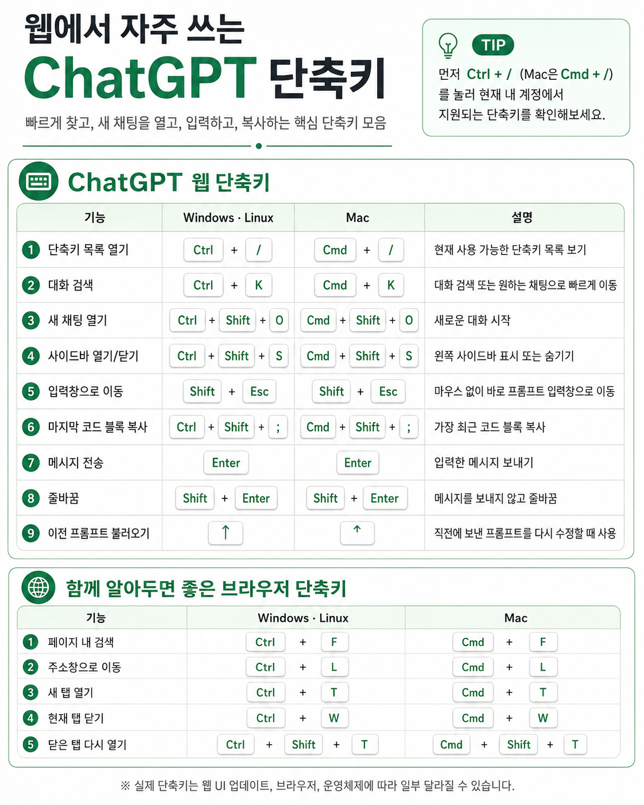

ChatGPT를 자주 쓰다 보면 마우스로 버튼을 찾는 시간도 꽤 누적됩니다.

그래서 자주 쓰는 단축키를 한 장짜리 이미지로 정리했습니다.  
새 대화 시작, 사이드바 열기, 검색, 음성 입력처럼 반복해서 쓰는 기능은 단축키로 익혀두면 작업 흐름이 훨씬 덜 끊깁니다.

## 단축키 이미지

아래 이미지는 ChatGPT에서 자주 사용하는 단축키를 한 장으로 정리한 것입니다.

## 자주 쓰기 좋은 단축키

처음부터 모든 단축키를 외울 필요는 없습니다.  
개인적으로는 아래 정도만 먼저 익혀도 충분히 체감됩니다.

| 용도 | 사용 상황 |
| --- | --- |
| 새 대화 시작 | 기존 맥락과 분리해서 새 질문을 시작할 때 |
| 대화 검색 | 예전에 물어본 내용이나 답변을 다시 찾을 때 |
| 사이드바 열기/닫기 | 화면을 넓게 쓰거나 이전 대화를 빠르게 찾을 때 |
| 입력창으로 이동 | 마우스 없이 바로 질문을 이어서 작성할 때 |
| 음성 입력 | 긴 질문을 빠르게 말로 입력하고 싶을 때 |

## 사용 팁

단축키는 많이 아는 것보다, 반복 작업 하나를 줄이는 데 쓰는 편이 더 좋습니다.

예를 들어 코드를 보다가 바로 질문하고 싶을 때 입력창 이동 단축키를 쓰거나, 주제를 바꿀 때 새 대화 단축키를 쓰는 식입니다.  
이렇게 몇 개만 습관이 되어도 ChatGPT를 도구처럼 쓰는 느낌이 더 강해집니다.

## 정리

ChatGPT는 답변 품질도 중요하지만, 실제로 자주 쓰는 입장에서는 <strong>얼마나 빠르게 질문하고, 이전 대화를 찾고, 맥락을 정리할 수 있는지</strong>도 중요합니다.

단축키는 작은 기능이지만, 반복 사용이 많은 도구일수록 생산성 차이를 만들어줍니다.
