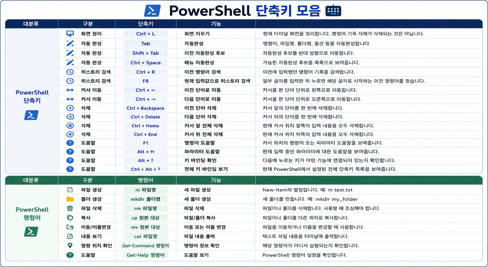

PowerShell을 자주 쓰다 보면 명령어 자체만큼이나 편집 단축키가 중요합니다.

명령어를 다시 찾고, 줄을 수정하고, 이전 실행 기록을 탐색하는 작업은 하루에도 여러 번 반복됩니다.  
이런 반복 조작은 단축키를 익혀두면 마우스 없이 훨씬 빠르게 처리할 수 있습니다.

## 단축키 이미지

아래 이미지는 PowerShell에서 자주 사용하는 단축키를 한 장으로 정리한 것입니다.



## 먼저 익히기 좋은 단축키

처음부터 모든 단축키를 외울 필요는 없습니다.  
아래 정도만 먼저 익혀도 명령어 입력과 수정이 훨씬 편해집니다.

| 용도 | 사용 상황 |
| --- | --- |
| 이전/다음 명령어 탐색 | 방금 실행한 명령을 다시 실행하거나 살짝 수정할 때 |
| 명령어 검색 | 예전에 입력했던 긴 명령어를 다시 찾을 때 |
| 줄 맨 앞/뒤로 이동 | 긴 명령어를 빠르게 수정할 때 |
| 단어 단위 이동 | 경로, 옵션, 인자를 빠르게 건너뛸 때 |
| 현재 줄 지우기 | 입력 중인 명령어를 한 번에 정리할 때 |
| 자동완성 | 경로, 명령어, 파일명을 빠르게 입력할 때 |

## 자주 쓰는 패턴

PowerShell에서는 같은 명령어를 조금씩 바꿔가며 실행하는 일이 많습니다.

예를 들어 `npm run check`, `npm run build`, `git status`, `git commit` 같은 명령어는 이전 기록에서 다시 꺼내 쓰는 경우가 많습니다.  
이때 방향키나 기록 검색 단축키를 쓰면 같은 명령어를 다시 타이핑하지 않아도 됩니다.

```text
1. 이전 명령어 찾기
2. 필요한 인자만 수정
3. 다시 실행
```

이 흐름만 익혀도 터미널 작업 속도가 꽤 빨라집니다.

## 자동완성은 적극적으로 쓰기

PowerShell에서는 경로나 파일명을 직접 끝까지 입력하지 않는 편이 좋습니다.

일부만 입력한 뒤 자동완성을 사용하면 오타를 줄일 수 있고, 긴 폴더명도 빠르게 입력할 수 있습니다.  
특히 공백이 들어간 경로나 긴 파일명을 다룰 때 유용합니다.

## 정리

PowerShell 단축키는 복잡한 기능을 외우기 위한 것이 아니라, **명령어 입력과 수정에 드는 반복 시간을 줄이는 도구**입니다.

이전 명령어 탐색, 기록 검색, 줄 이동, 자동완성 정도만 먼저 익혀도 터미널 사용감이 크게 좋아집니다.
