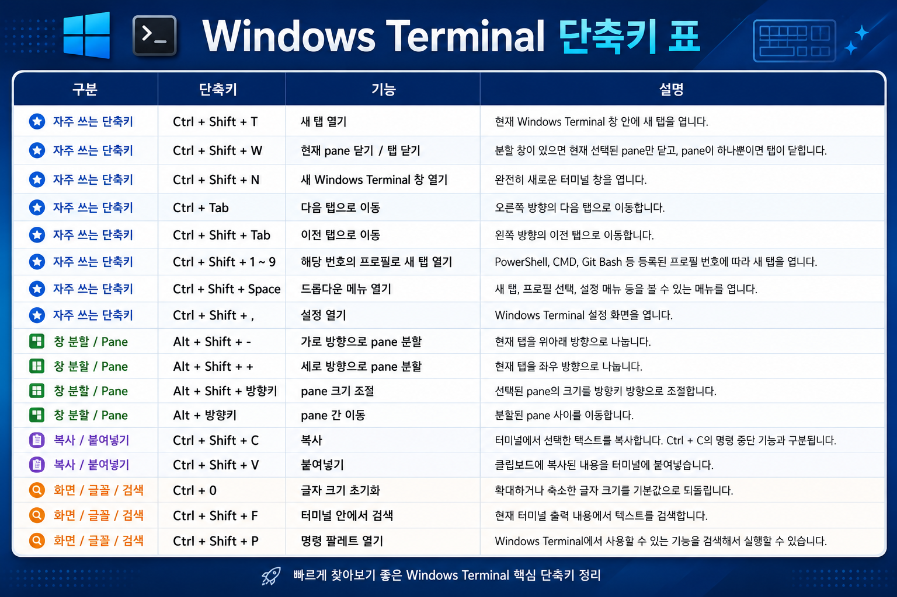

Windows Terminal은 PowerShell, Command Prompt, WSL 같은 여러 쉘을 한 곳에서 다룰 수 있어서 개발 환경에서 자주 쓰게 됩니다.

탭을 새로 열고, 창을 나누고, 터미널 간 이동을 반복하다 보면 단축키를 아는 것만으로도 작업 흐름이 꽤 부드러워집니다.  
그래서 자주 쓰는 Windows Terminal 단축키를 한 장짜리 이미지로 정리했습니다.

## 단축키 이미지

아래 이미지는 Windows Terminal에서 자주 사용하는 단축키를 한 장으로 정리한 것입니다.



## 먼저 익히기 좋은 단축키

처음부터 모든 단축키를 외울 필요는 없습니다.  
아래 기능만 먼저 익혀도 터미널 사용 속도가 많이 좋아집니다.

| 용도 | 사용 상황 |
| --- | --- |
| 새 탭 열기 | PowerShell, WSL, Git Bash 등을 새 탭으로 열 때 |
| 탭 닫기 | 작업이 끝난 터미널을 빠르게 정리할 때 |
| 탭 이동 | 여러 프로젝트나 쉘을 오가며 작업할 때 |
| 창 분할 | 서버 실행, 테스트, Git 상태 확인을 한 화면에 띄울 때 |
| 분할 창 이동 | 마우스 없이 패널 사이를 이동할 때 |
| 명령 팔레트 열기 | 단축키가 기억나지 않을 때 기능을 검색해서 실행할 때 |

## 추천 사용 패턴

개발할 때는 터미널을 하나만 쓰기보다 역할을 나눠두는 편이 편합니다.

예를 들어 한 탭에서는 개발 서버를 실행하고, 다른 탭에서는 Git 명령어를 실행합니다.  
필요하면 한 탭 안에서 화면을 위아래 또는 좌우로 나누어 `npm run dev`, `npm run check`, `git status`를 동시에 확인할 수도 있습니다.

```text
Tab 1: npm run dev
Tab 2: git status / git commit
Split Pane: npm run check 또는 테스트 실행
```

이런 식으로 역할을 나누면 터미널 창을 여러 개 띄우지 않아도 되고, 작업 맥락을 유지하기 쉽습니다.

## 설정은 어디서 바꾸나?

Windows Terminal 단축키는 설정 화면에서 확인하고 변경할 수 있습니다.

1. Windows Terminal 실행
2. 설정 열기
3. 작업 또는 Actions 메뉴 확인
4. 원하는 명령의 단축키 수정

JSON 설정을 직접 편집하는 방식도 가능하지만, 일반적인 사용에서는 설정 UI에서 바꾸는 편이 안전합니다.

## 정리

Windows Terminal 단축키는 복잡한 기능을 외우기 위한 것이 아니라, **반복되는 터미널 조작을 줄이기 위한 도구**입니다.

새 탭, 탭 이동, 창 분할, 명령 팔레트 정도만 익혀도 개발 중 터미널을 오가는 시간이 줄어듭니다.
