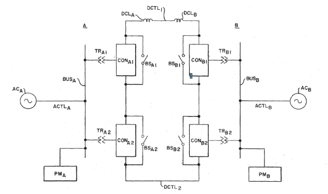
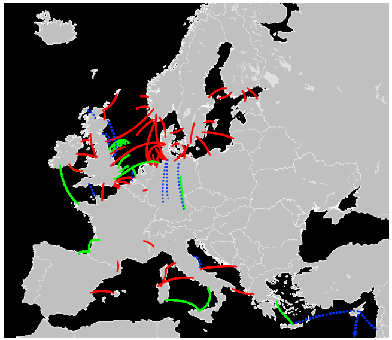

## HVDC 필요성
* 장거리·대용량 송전에 유리. HVDC는 먼 거리에서 AC 대비 송전손실을 30–50% 줄여 비용을 절감하며, 주파수 동기화가 다른 계통(비동기 계통)간 연결이 가능해 계통 유연성을 높인다.
* 해저 케이블이나 국가 간 연계, 해상풍력 연결에서도 HVDC는 필수적이다. 또한 HVDC는 무효전력을 운반하지 않아 송전망의 전력품질 제어 및 복원에 도움을 준다.

### HVDC 장단점
* 장점으로는 긴 거리 전송 시 낮은 손실, 전력흐름·전압 정밀 제어(송전량 우선순위 지정 가능), 약한 그리드에서도 송전 가능, 검은시작·고조파 필터 최소화 등 유연성이 크다.
* 반면 단점은 변환소 설비 비용이 매우 높고, 직류회로의 고장 시 전류가 빠르게 0이 되지 않아 보호 차단이 까다롭다.
* 일반적으로 해저선로는 약 60km, 육상선로는 약 200km 이상부터 경제성이 AC보다 유리하다.

> 그림: HVDC 송전 기본 구성도. 양 끝의 컨버터(반도체) 단, 직류 케이블 및 평활리액터 등을 통해 송전한다(출처: Konishi 특허, 1979) 
> 

## 주요 기술 요소: LCC vs VSC 
### LCC-HVDC 
* 기존의 위상제어형(LCC)에서는 티어리스터 소자를 사용해 대규모 전력 변환에 적합하다.
* 동기형 컨버터이므로 강한 AC 계통이 필요하며, 발전기기(또는 동기조상기)나 커패시터로 컨버터 무효전력을 공급해야 한다.
* LCC는 상대적으로 손실이 낮아 (터미널당 약 0.7% 수준) 초대용량(±800kV급까지)·장거리 송전(수천 km) 프로젝트에 쓰인다.
* 단점은 무효발생량(정격의 40–60%)이 크고, 고조파 필터·대용량 변압기 등 부속 설비가 필요하다.

### VSC-HVDC 
* 신형 방식인 전압원형(VSC) 컨버터는 IGBT 기반 PWM 제어를 사용한다.
* LCC와 달리 독립적인 무효전력 제어가 가능해 약한 계통에서도 운전하며 정전복구(Black-start), 단전압 동기화가 가능하다.
* 소형화된 필터를 사용하고, 직류단 커패시터로 전압을 평활할 수 있어 설비가 비교적 간단하다.
* 다만 소모성 소자(LCC 대비 손실↑)가 많아 효율은 다소 떨어지고, 직류 단락 사고 시 보호 복구가 취약하다.
* VSC는 도심·산업단지·데이터센터 등 비교적 짧은 거리의 HVDC 링크나 다중단자(메쉬) HVDC 등 유연한 시스템에 활용된다.

| 구분 | LCC-HVDC | VSC-HVDC |
| --- | --- | --- |
| **소자** | 강압 티어리스터(SCR) | IGBT 전력소자 (반도체) |
| **전력 흐름** | 교류 계통 지원 필요 | 약한 계통에서도 단독 운전 가능 |
| **무효전력 제어** | 외부 무효원 필요(콘덴서 등) | 컨버터가 직접 제어 (추가 무효장치 불필요) |
| **전압용량/전력** | 최대 ±800 kV, 수천 MW(초대용량) | 현재 최대 ±500 kV, ~1000 MW급 (기술개발 중) |
| **장점** | 낮은 손실(0.7%), 고신뢰성 | 완전역전(전력방향전환), 검은시작, 고조파 저감 |
| **단점** | 큰 설비(필터/콘덴서) 필요, 약한그리드 비적합 | 손실 높음, DC 고장 취약, 공사비 다소 높음 |

## 경쟁·보완 기술 비교 
* **EHV AC 송전 vs HVDC:** 초고압(±500kV 이상) AC 송전은 역사적 노드이며, 380–800kV AC 선로로 수백 km까지 송전 가능하다. 그러나 AC는 리액턴스에 따른 손실과 안정도 한계(송전량 제어 불가)가 있으므로, 긴 거리·초대용량에는 HVDC가 경제적이다. 예를 들어 위상-공환형 LCC 기술은 대형 동기발전기와 연계돼야 하지만, HVDC는 비동기 그리드 연결·송전 경로 유연성을 제공한다. 손실관점에서 AC는 선로 길이에 따른 고정손실, DC는 정류·복류 손실이 있으나 길어지면 DC 유리.
* **분산전원·ESS vs HVDC:** 분산형 태양광·풍력이나 에너지저장(ESS)은 지역형 생산/부하를 대응하지만, HVDC는 먼 거리 전력수송 및 대규모 계통연계 역할. ESS는 주파수·피크 수요 대응, HVDC는 대규모 송전 병목 해소에 주로 기여한다. AC/DC 하이브리드 그리드는 연구중이며, 향후 ‘슈퍼그리드’ 구상으로 발전할 수 있다.
* **데이터센터·AI 수요:** AI와 데이터센터는 급증하는 전력수요를 갖는다. HVDC는 데이터센터에 대용량 재생에너지 전력을 직접 공급하고, AC 그리드 부하를 줄이며 고품질 전력공급을 돕는다. (예: Hitachi는 “AI용 데이터센터 전력 수요가 2026년까지 2배가 될 수 있다”는 IEA 전망을 인용.) .

> 그림: 유럽 내 HVDC 송전망(빨간=운용중, 녹색=건설중, 파란=검토중).
> 

## 산업·시장 구조 
### 밸류체인 개요 
* **상류(프로젝트개발):** 전력망 계획 및 타당성 조사, 송전망 규제·계획 단계. 대체로 공공부문 주도, 낮은 마진.
* **중류(설비제조/구축):** 변환소/컨버터 설계·제조(ABB, Siemens, Hitachi 등), 케이블 제조 (Prysmian, Nexans, NKT, LS Cable, Sumitomo 등), 부품·절연재·전력전자. 이 분야가 고부가가치 구간이며, 첨단 기술·대규모 설비 투입 필요. EPC/시스템 통합 업체(ABB, Siemens, GE/Hitachi, Mitsubishi, 중국 회사 등)가 HVDC 턴키 솔루션을 제공한다. 제조병목에 따른 고가(예: 컨버터 공급 부족) 위험도 존재.
* **하류(송전·수요처):** 발전사업자(신재생·수력·원자력), 송배전 운영자(ISO/TSO), 대형 수요처(데이터센터, 제철소 등). 이들은 HVDC망 건설의 수혜자나 자금조달 주체다. 전력망 운영은 규제수익 구조로, 직접 고수익을 내진 않지만, 네트워크 보완 역할이 크다.

### 시장 세그먼트 
* **해저 HVDC:** 국가 간 해저 링크(전력시장 연계) 및 해상풍력 연계용. 대형 프로젝트(수 GW, 수천 km) 중심. 예컨대 EU는 2030년 해상풍력 111GW 목표에 맞춰 23→64GW급 HVDC 연계 계획 중. 미주에서도 Champlain Hudson(1.25GW), NECEC(1.2GW), SunZia(3GW) 등 대규모 해저/직류 프로젝트가 추진 중. 2024년 글로벌 HVDC 케이블 시장은 약 195억 달러, 2033년 336억 달러로 연평균 6.2% 성장할 전망이다.
* **육상 장거리 HVDC:** 국가 내 광역 송전(예: 수력발전-도시, 석탄발전-해안)용. 특히 중국/인도 등 국가 주도로 건설. 중국은 ‘09~’23년 간 19개 초고압AC, 20개 초고압DC 선로를 구축하여 총 4만 km·30조kWh 전송능력을 달성했다. 기타 국가들도 설계·건설에 적극 투자한다. 관련 프로젝트는 수천억~수조원 규모이며, 승인부터 상업운전까지 수년 소요된다.
* **도시·산업단지용 VSC-HVDC:** 소규모(~수백MW) 구간에서 전압·품질 보강용. 예를 들어 도심 DC 마이크로그리드나 대형 데이터센터 클러스터 내부 연계에 활용 검토. 아직 사례는 제한적이나, VSC 기술의 유연성을 이용해 전력망 안정화·블랙스타트 지원에 쓰인다.
* 세계 HVDC 시장은 2025년 약 1,562억 달러에서 2030년 2,207억 달러(연평균 7.2% 성장)까지 성장할 전망이다. VSC 기술 확산과 재생 에너지 확대가 성장을 견인한다.

### 지역별 동향 
* **유럽:** 재생에너지 전력망 통합이 최우선. 2030년 목표 해상풍력 111GW(현재 21GW 운용)과 맞물려 HVDC 인프라가 급증 중이다. 유럽연합은 2025년까지 23GW, 2030년 64GW의 국가 간 HVDC망을 계획했으며, 예를 들어 독일-영국 NeuConnect(1.4GW) 같은 중대형 프로젝트를 추진 중이다. Net Zero Industry Act 등 정책·보조금도 유럽산 공급망을 지원한다.
* **중국/아시아:** 중국은 수력·풍력 자원을 내륙에서 동부로 송전하는 UHVDC 전략을 선도한다. 2023년 기준 20개 UHV DC 선로를 운용했고, 향후 추가 라인 계획도 다수다. 인도·동남아도 대규모 재생과 계통 연계를 위해 HVDC 투자를 확대 중이다. 정부 차원의 탄소중립(2060)·그리드 현대화 정책이 수요를 견인한다.
* **북미:** 미주는 재생 발전 확대와 송전 확충 필요로 HVDC 프로젝트가 늘어난다. 대표적 예로 미국 서부의 3GW SunZia 프로젝트, 캐나다-뉴욕 1.25GW CHPE, 퀘벡-뉴잉글랜드 1.2GW NECEC 등이 있다. IRA(미국 인플레이션 감축법) 등으로 재정 지원을 받아 투자 심리가 높다. 주요 TSO(예: PJM, CAISO)도 HVDC 컨셉을 검토한다.
* **중동·기타:** 사우디·아랍에미리트 등 걸프 국가는 대규모 태양광/풍력 계획과 연동해 HVDC 도입을 검토 중이다. 예컨대 아부다비는 3.2GW 해저 HVDC(ADNOC 연계) 프로젝트를 진행하며, 아랍에미리트-인도 2–2.5GW 해저 연계도 제안되고 있다. 풍부한 재생자원과 해상 지형 특성상 장거리 HVDC가 타당하며, 정책적으로도 수소 등 차세대 에너지 인프라와 연계 추진 가능성이 크다.

## 주요 기업 및 경쟁력 
| 기업 (티커) | 국가 | 밸류체인 포지션 | HVDC 매출 비중 | 경쟁력 요약 | 주요 리스크 |
| --- | --- | --- | --- | --- | --- |
| **ABB (ABBN.SW)** | 스위스 | 전력기기·EPC | 중~고 | 전 세계 HVDC 턴키 솔루션 제공, 중앙아시아 대형 수주 경력. GEIS 인수로 EPC 강화. | 프로젝트 지연·원가 상승, 신흥 경쟁사 |
| **Siemens Energy (ENR)** | 독일 | 전력기기·EPC | 중 | VSC(HVDC PLUS) 기술 선도. NeuConnect(1.4GW) 수주. 43개 LCC, 42개 VSC 프로젝트 경험 보유. | 부채 부담, 그리드 사업의 계절적 변동 |
| **Hitachi Energy (6501.T/IN)** | 스위스(日기업) | 전력기기·EPC | 중~고 | HVDC Light (VSC) 선구자. SunZia(3GW)·Marinus·Amprion(4기 변압기, 2GW) 등 대형 레퍼런스. 수주잔고 \$30B超. | 고부채, 경쟁 심화 |
| **Prysmian (BIT:PRY)** | 이탈리아 | 케이블 (해저·지중) | 중 | 세계 최대 케이블 제조사. Tyrrhenian Link(1,000km) 등 유럽 해저 케이블 주도. XLPE, MI 공법 모두 보유. 지속적 R&D(유럽 HQ) | 원자재가 인상, 경쟁(넥산스 등) |
| **Nexans (EPA:NEX)** | 프랑스 | 케이블 (해저·지중) | 중 | 유럽 해저 케이블 전문. 아시아, 미주 프로젝트에도 진출. 세계 첫 525kV XLPE 주문 확보. | 시장 성숙국, 고부가 커버리지 위험 |
| **NKT (CPSE:NKT)** | 덴마크 | 케이블 (해저) | 고 | 고전압·해저 케이블 기술 선두. 최초 525kV XLPE 해저 케이블(주문액 €1.9B) 등 혁신 실적. | 주문 집중 위험, 고성장에 따른 마진 압박 |
| **LS Cable & System (KRX:001700)** | 한국 | 케이블 (해저·지중) | 중~고 | 아시아 최대 HVDC 케이블 공장 보유. 한국·미국 등 대형 국책사업 참여. 독자 XLPE 기술 발전. | 환율 변동, 중국 저가 경쟁자 |
| **Sumitomo Elect. (TSE:5802)** | 일본 | 케이블 (해저) | 중 | 고전압 MI/XLPE 케이블 보유(±500kV). 유럽·아시아 프로젝트 경험. 대형 전력회사(BV 프랑스 등)와 협력. | 저성장 시장(일본), 거래처 다변화 과제 |

*(※테이블: HVDC 매출 비중은 정성적 추정. 경쟁력 예시는 공개자료 기반.)* 

## 재무·밸류에이션 및 투자 관점 
* **성장성:** 글로벌 재생에너지 확대 및 그리드 고도화로 HVDC CAPEX 급증 중. Hitachi Energy는 2020년 대비 수주잔고가 3배 넘게 늘어난 \$30B 이상을 기록했다. 데이터센터·AI 수요 증가와 전기화 추세는 장기 송전망 수요를 자극한다.
* **수익성:** HVDC 프로젝트는 설계·설치 복잡성으로 마진이 상대적으로 낮다. 연료·원자재 가격과 금리에 따라 수익성 변동성이 크다. 다만 송전투자는 장기 인프라로 경기방향과 무관하게 추진되는 경향이 있어, 안정적인 수익성을 확보할 수 있다.
* **밸류에이션:** 대표 케이블·전력기업은 대체로 PER 10–20배대, PBR 1.5–3배 수준이다. 예를 들어 넥산스의 2025년 예상 PER는 약 11배, PBR 2.7배이다. 성장률 대비 일부 종목은 이미 높은 밸류를 형성했으나, 안정적 현금흐름 기업(ABB, Siemens 등)은 밸류 부담이 상대적으로 낮다. 고성장 케이블업체(NKT, Prysmian 등)는 밸류가 높으나 수익 변동성도 크다.
* **리스크 요인:** 정책·규제 변경(예: 보조금 축소, 환경 인허가 지연)이 프로젝트 가시성에 영향을 준다. 대형 프로젝트의 착공 지연·취소, 금리 상승으로 인한 투자비용 증가도 리스크다. 공급망 병목(전력반도체, 케이블 생산능력)과 경쟁 심화(중국 저가 진입 등)도 주의 요인이다.
* **투자 아이디어:** 
  * **“Core” 후보:** ABB, Siemens Energy, Hitachi Energy 등 대형 인프라·전력기기 기업. HVDC 비중이 일정하며 매출 구조가 안정적이고 밸류가 극단적으로 높지 않다. 예: Hitachi Energy(과거 ABB PG), Siemens HVDC 레퍼런스 다수.
  * **“성장 베팅” 후보:** Prysmian, NKT, Nexans, LS Cable 등 전문 케이블 업체. HVDC·해저케이블 비중이 높아 성장 잠재력은 크지만, 시장 변동성·규제리스크에 민감하다. 예: NKT는 세계 첫 525kV XLPE 수주로 성장성이 부각, Prysmian도 북해·미국 프로젝트 확대. 다만 고성장 구간에서 실적 변동에 주의해야 한다.

## 3–7년 전망 및 체크포인트 
* **핵심 드라이버:** 탄소중립 목표(ESG 정책), 해상풍력·태양광 보급, 전력망·배전 현대화 수요가 계속 성장 원동력이 된다. AI·데이터센터 증가로 전력 수요 집중이 예상되며, HVDC는 깨끗한 전력 공급 경로로 부상할 것이다. 전 세계 주요 국가의 대형 HVDC 계획(예: 북해 그리드, 중국 초장거리 송전망, 미국 Interregional Transmission)을 모니터링해야 한다.
* **기술·산업 변화:** VSC-HVDC 채택 비중은 더욱 커질 전망이다. 전력반도체(SiC, GaN) 기술 발전으로 컨버터 효율·전압 한계가 상향될 것이다. 반면 해저 케이블 생산능력과 설치 인프라가 병목될 위험이 있다(예: LS 케이블 신공장, 유럽 생산능력 확충 필요). AC/DC 하이브리드 그리드나 다중단자 HVDC(메쉬 그리드) 개념도 연구 단계이며 실현 가능성에 주목할 필요가 있다.
* **투자 모니터링 포인트:** 매년 발표되는 대형 HVDC 프로젝트 수주 규모 및 진행 현황, 주요 기업들의 수주잔고와 마진 가이던스(회계발표 등), 각국의 그리드 정책·투자계획(예: IRA, EU 그린딜, 중국 5개년 계획), 경쟁사의 기술개발·신제품(고전압 케이블, 차세대 변환기) 소식 등을 살펴야 한다.
* **요약:** HVDC는 장거리·대용량 재생에너지 수송에 필수적인 기술로서 성장이 기대된다. 당장은 규모가 큰 인프라 기업을 안정적 코어(Core) 포지션으로, 케이블·전력기기 전문 중소형사를 성장 베팅(하이베타)으로 분류해 투자 비중을 조절하는 접근이 유효할 것이다. 예를 들어 ABB·Siemens와 같은 종합 인프라주는 중위험·중수익 코어로, Prysmian·NKT·LS Cable 등은 고위험·고수익 기대 종목으로 고려할 수 있다. 단, 프로젝트 리스크와 공급망 상황에 유의하며 중장기 관점에서 분산 투자하는 전략이 바람직하다.

> **출처:** 에너지기술 보고서, IEA, 기업실적, 시장조사 보고서 등 공개 자료 종합.

## 참고자료
* Connecting the Country with HVDC | Department of Energy [https://www.energy.gov/oe/articles/connecting-country-hvdc](https://www.energy.gov/oe/articles/connecting-country-hvdc) 
* Microsoft Word - 20191203_HVDC links in system operations.docx [https://www.entsoe.eu/Documents/SOC%20documents/20191203_HVDC%20links%20in%20system%20operations.pdf](https://www.entsoe.eu/Documents/SOC%20documents/20191203_HVDC%20links%20in%20system%20operations.pdf) 
* Microsoft Word - Applications of HVDC Technologies - Summary FINAL [https://energy.gov/sites/prod/files/2015/11/f27/Applications%20of%20HVDC%20Technologies%20-%20Summary%20FINAL.pdf](https://energy.gov/sites/prod/files/2015/11/f27/Applications%20of%20HVDC%20Technologies%20-%20Summary%20FINAL.pdf) 
* PSMA Consulting - Power System Studies - LCC-HVDC vs VSC-HVDC Transmission Systems [https://www.psmaconsulting.com/power-system-studies/hvdc/lcc-hvdc-vs-vsc-hvdc-transmission-systems](https://www.psmaconsulting.com/power-system-studies/hvdc/lcc-hvdc-vs-vsc-hvdc-transmission-systems) 
* Harnessing HVDC transmission as a transformative force in modern grid design | Utility Dive [https://www.utilitydive.com/news/hvdc-transmission-clean-energy-policy-resilience-cost/747435/](https://www.utilitydive.com/news/hvdc-transmission-clean-energy-policy-resilience-cost/747435/) 
* File:4263517 High voltage direct current system.png - Wikimedia Commons [https://commons.wikimedia.org/wiki/File:4263517_High_voltage_direct_current_system.png](https://commons.wikimedia.org/wiki/File:4263517_High_voltage_direct_current_system.png) 
* windenergyireland.com [https://windenergyireland.com/images/files/building-the-european-supergrid-final-updated-design.pdf](https://windenergyireland.com/images/files/building-the-european-supergrid-final-updated-design.pdf) 
* Hitachi Energy to invest additional \$4.5 billion by 2027 to accelerate the clean energy transition [https://www.hitachienergy.com/us/en/news-and-events/press-releases/2024/06/hitachi-energy-to-invest-additional-4-5-billion-by-2027-to-accelerate-the-clean-energy-transition](https://www.hitachienergy.com/us/en/news-and-events/press-releases/2024/06/hitachi-energy-to-invest-additional-4-5-billion-by-2027-to-accelerate-the-clean-energy-transition) 
* File:HVDC Europe.svg - Wikimedia Commons [https://commons.wikimedia.org/wiki/File:HVDC_Europe.svg](https://commons.wikimedia.org/wiki/File:HVDC_Europe.svg) 
* hvdccentre.com [https://www.hvdccentre.com/wp-content/uploads/2021/07/Offshore_Co-Ordination_Supply_Report_v2.0.pdf](https://www.hvdccentre.com/wp-content/uploads/2021/07/Offshore_Co-Ordination_Supply_Report_v2.0.pdf) 
* Offshore Wind Growth and HVDC Developments in the North Sea: Key Trends and Future Outlook [https://www.powermag.com/offshore-wind-growth-and-hvdc-developments-in-the-north-sea-key-trends-and-future-outlook/](https://www.powermag.com/offshore-wind-growth-and-hvdc-developments-in-the-north-sea-key-trends-and-future-outlook/) 
* Marine renewable energy - The EU Blue economy report 2025 - Maritime Affairs and Fisheries (DG-MARE) [https://op.europa.eu/webpub/mare/eu-blue-economy-report-2025/blue-economic-sectors/marine-renewable-energy.html](https://op.europa.eu/webpub/mare/eu-blue-economy-report-2025/blue-economic-sectors/marine-renewable-energy.html) 
* High-Voltage Submarine Power Cables: Driving the Global Energy Transition - Subsea Cables [https://www.subseacables.net/reports-and-coverage/high-voltage-submarine-power-cables-driving-the-global-energy-transition/](https://www.subseacables.net/reports-and-coverage/high-voltage-submarine-power-cables-driving-the-global-energy-transition/) 
* News Releases : May 4, 2023 : Hitachi Global [https://www.hitachi.com/New/cnews/month/2023/05/230511.html](https://www.hitachi.com/New/cnews/month/2023/05/230511.html) 
* China's UHV project: The world-leading "Electricity Highway" | Mega Project | Technology | Our China Story [https://www.ourchinastory.com/en/14967/China's-UHV-project:-The-world-leading-](https://www.ourchinastory.com/en/14967/China's-UHV-project:-The-world-leading-) 
* HVDC Transmission Market worth $22.07 billion by 2030 - Exclusive Report by MarketsandMarkets™ [https://www.prnewswire.com/news-releases/hvdc-transmission-market-worth-22-07-billion-by-2030---exclusive-report-by-marketsandmarkets-302538700.html](https://www.prnewswire.com/news-releases/hvdc-transmission-market-worth-22-07-billion-by-2030---exclusive-report-by-marketsandmarkets-302538700.html) 
* Less waste, more security of supply: Siemens Energy receives major order for first power connection to Great Britain [https://www.siemens-energy.com/us/en/home/press-releases/less-waste-more-security-supply-siemens-energy-receives-major-order-first-power.html](https://www.siemens-energy.com/us/en/home/press-releases/less-waste-more-security-supply-siemens-energy-receives-major-order-first-power.html) 
* ABB 3Q Revenue Up, Misses Expectations by \$50M – tEDmag [https://tedmag.com/abb-3q-revenue-up-misses-expectations-by-50m/](https://tedmag.com/abb-3q-revenue-up-misses-expectations-by-50m/) 
* High-voltage direct current (HVDC PLUS®) [https://www.siemens-energy.com/us/en/home/products-services/product-offerings/high-voltage-direct-current-transmission-solutions.html](https://www.siemens-energy.com/us/en/home/products-services/product-offerings/high-voltage-direct-current-transmission-solutions.html) 
* Hitachi Energy wins over 2 billion euro order from Amprion [https://www.hitachienergy.com/news-and-events/press-releases/2024/12/hitachi-energy-wins-over-2-billion-euro-order-from-amprion](https://www.hitachienergy.com/news-and-events/press-releases/2024/12/hitachi-energy-wins-over-2-billion-euro-order-from-amprion) 
* NKT awarded record orders for world’s first 525 kV XLPE HVDC submarine cable projects for offshore wind | NKT [https://www.nkt.com/news-press-releases/nkt-awarded-record-orders-for-worlds-first-525-kv-xlpe-hvdc-submarine-cable-projects-for-offshore-wind](https://www.nkt.com/news-press-releases/nkt-awarded-record-orders-for-worlds-first-525-kv-xlpe-hvdc-submarine-cable-projects-for-offshore-wind) 
* HVDC Cable | Sumitomo Electric [https://sumitomoelectric.com/products/high-voltage-cable/hvdc-cable](https://sumitomoelectric.com/products/high-voltage-cable/hvdc-cable) 
* Nexans: Financial Data Forecasts Estimates and Expectations | NEX | FR0000044448 | MarketScreener [https://www.marketscreener.com/quote/stock/NEXANS-4676/finances/](https://www.marketscreener.com/quote/stock/NEXANS-4676/finances/) 

